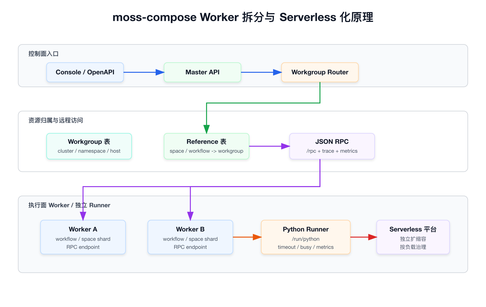
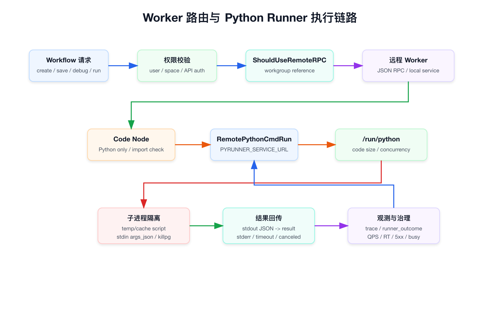
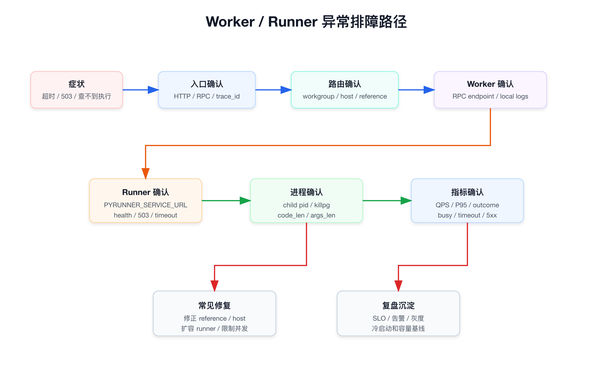

# 面试定位卡

- **技术点**：moss-compose Worker 拆分与 serverless 化改造
- **所属领域**：
  - Agent / Workflow 执行面拆分
  - Master / Worker 架构
  - 资源分片与远程 RPC
  - Code Runner 隔离执行
  - Serverless / 弹性伸缩 / 可观测
- **面试价值**：
  - 百炼这类 Agent 平台一定会关心执行面稳定性：Workflow 怎么跑、重任务怎么隔离、怎么扩容、怎么排障。
  - Worker 拆分能把控制面和执行面解耦，serverless 化能把不同负载独立扩缩容。
  - 这是比“我会用 Agent 平台”更平台工程的表达。
- **常见考法**：
  - 为什么要把 Worker 从主服务拆出去。
  - Master 怎么判断请求应该本地执行还是转发到 Worker。
  - Worker 拆分后数据一致性、路由、权限和排障怎么处理。
  - Python Code Runner 为什么要独立成服务。
  - Serverless 化带来的冷启动、并发控制、超时、观测问题。
- **适合挂钩项目**：
  - moss-compose：Agent / Workflow 平台执行面拆分和私有化部署。
  - SAE：serverless 应用部署、弹性、灰度、观测、配置治理。
  - SAI / 平台工程：任务执行、资源隔离、异步状态和排障路径。
- **不适合夸大的地方**：
  - Worker 拆分和 serverless 改造是其他同学写的，不说成自己主导开发。
  - 可以说“我了解这套拆分思路，能从私有化部署、执行稳定性、资源隔离和排障角度讲清楚”。
  - 代码里可验证的是 Workgroup/RPC 拆分和 Python Runner 独立服务；具体 serverless 平台实现细节不要超出事实。

# 三十秒回答

moss-compose 的 Worker 拆分，本质是把控制面入口和执行面负载解耦。Master 负责接收 Console / OpenAPI 请求、做权限校验和资源路由；真正归属某个 workgroup 的 workflow 或 space，可以由对应 Worker 通过 RPC 执行或访问。

serverless 化的价值在于让执行面按负载独立扩缩容，尤其是 Workflow、Code Runner、批量节点、长耗时任务这类不适合和主 API 混跑的负载。这样主服务不会被执行任务拖垮，Worker 或 Runner 可以单独限流、超时、观测和扩容。

我面试里会明确边界：这块不是我主导开发，但我参与 moss-compose 前期私有化，理解为什么 Agent 平台需要把 Runtime/Worker 从控制面拆出来，也能讲清楚路由、RPC、Python Runner 隔离、并发控制和排障思路。

# 为什么需要它

- **没有 Worker 拆分之前的问题**：
  - 控制面 API、Workflow 执行、Code Runner、工具调用都在同一类进程里，负载互相影响。
  - 长耗时 Workflow 或批量任务会拉高主服务 RT。
  - Code 节点执行 Python 代码有安全、超时、进程生命周期和资源隔离问题。
  - 多团队、多业务接入后，很难按团队、空间或工作组做资源隔离。
- **Worker 拆分解决方式**：
  - 用 workgroup 表达执行资源分组。
  - 用 reference 记录 space / workflow 和 workgroup 的归属关系。
  - Master 判断资源是否归属远程 workgroup，如果是就通过 JSON RPC 调 Worker。
  - Worker 自己处理本地资源、执行 Runtime 和连接自己的数据源。
- **Python Runner 拆分解决方式**：
  - 把 Python 代码执行从 Go 主进程内的 `exec.Command` 模式拆成独立 FastAPI 服务。
  - Go 侧通过 `PYRUNNER_SERVICE_URL` 调 `/run/python`。
  - Runner 侧做代码大小限制、并发限制、超时、取消、子进程清理和指标暴露。
- **serverless 化解决方式**：
  - Worker / Runner 变成可独立部署、独立扩缩容、独立观测的执行单元。
  - 高峰时扩执行面，不必扩整个控制面。
  - 空闲时缩容执行面，降低资源占用。
- **它引入的新问题**：
  - 请求路由不再是本地函数调用，需要稳定的 workgroup reference 和 host 配置。
  - RPC、HTTP、Runner、子进程多跳后，排障链路更长。
  - serverless 冷启动、并发上限、超时边界会影响用户体验。
  - 需要更强的 trace、metrics 和日志关联。

# 核心概念表

- **Master**：
  - 对外承接 Console / OpenAPI 请求。
  - 做身份、空间、权限和资源路由。
  - 不是所有执行都一定在 Master 本地完成。
- **Worker**：
  - 承载某个 workgroup 归属下的 workflow / space 资源。
  - 环境变量 `WORK_GROUP` 非空时，代码会把当前进程视为 Worker 节点，优先使用本地服务。
- **Workgroup**：
  - 表达一组 Worker 执行资源。
  - 包含 cluster、namespace、worker name、host、domain host 等部署和访问元信息。
- **Workgroup Reference**：
  - 记录资源和 workgroup 的绑定关系。
  - 资源类型可以是 Space 或 Workflow。
  - Master 根据 reference 判断是否远程调用。
- **Remote RPC**：
  - Master 和 Worker 之间的 JSON RPC 通道。
  - RPC 服务挂在 `/rpc`，并接入 trace、metrics、access log 等中间件。
- **Python Runner**：
  - 独立 FastAPI 服务，暴露 `/run/python`。
  - 用于执行 Workflow Code 节点里的 Python 代码。
  - 支持超时、取消、并发上限、代码大小上限和 Prometheus 指标。
- **Serverless 化**：
  - 这里更准确地说，是把执行负载拆成可独立部署和弹性伸缩的单元。
  - 具体可以落在 SAE、K8s HPA、Knative 或内部 serverless 平台上。
  - 面试里不要把部署平台细节说死，除非能拿出实际配置。

# 原理模型

- **控制面入口**：
  - 用户从 Console 或 OpenAPI 发起请求。
  - Master API 做统一鉴权、参数校验、空间校验和业务路由。
- **资源归属层**：
  - Workgroup 表记录 Worker 的部署和访问信息。
  - Reference 表记录 space / workflow 属于哪个 workgroup。
  - Master 通过 reference 判断当前请求应该本地处理还是转发到远程 Worker。
- **执行面 Worker**：
  - Worker A / Worker B 可以承载不同团队、空间或工作流资源。
  - Worker 自己暴露 RPC endpoint。
  - 执行负载和控制面负载隔离。
- **独立 Runner**：
  - Python Runner 单独部署。
  - Worker 或主服务通过 HTTP 调用它执行 Python Code 节点。
  - Runner 本身可以作为独立扩缩容单元。
- **serverless 化收益**：
  - Worker 和 Runner 能按负载扩容。
  - 控制面不需要因为执行任务高峰而整体扩容。
  - 不同业务组的执行资源可以隔离。

# 关键机制

## Workgroup 路由机制

- Master 调用 `ShouldUseRemoteRPC` 判断是否走远程 RPC。
- 判断顺序可以按面试口径这样讲：
  - 如果 `DISABLE_REMOTE_RPC=true`，强制本地执行，主要用于本地调试。
  - 如果当前进程设置了 `WORK_GROUP`，说明自己就是 Worker，使用本地服务。
  - 如果当前是 Master，就查询 resourceID + resourceType 对应的 workgroup reference。
  - 如果没有 reference，使用本地服务。
  - 如果找到 reference，就拿 workgroup 的 host 创建 RPC client。
- 这个设计的关键点：
  - 控制面不用硬编码某个 workflow 在哪个 Worker。
  - 资源归属可以通过 reference 表动态管理。
  - Worker 拆分后仍然能保持原有 Service 接口风格。

## RemoteWorkflowService 包装机制

- `RemoteWorkflowService` 包了一层本地 workflow service。
- 对于带 workflow ID 的操作：
  - 先判断 workflow 是否属于远程 workgroup。
  - 如果属于远程 Worker，就通过 `WorkflowClient` 走 RPC。
  - 如果不属于远程 Worker，就调用本地 service。
- 对于创建 workflow：
  - 先根据 spaceID 判断 space 是否属于某个 workgroup。
  - 如果属于远程 Worker，就在远程 Worker 创建 workflow。
  - 创建成功后再写入 workflowID 到 workgroup 的 reference。
- 这个设计的面试重点：
  - 它不是把所有逻辑都改成远程调用。
  - 而是在 Service 边界做透明路由，尽量减少上层 API 逻辑感知。

## RPC 服务机制

- 主进程启动时会调用 `startRPC`。
- `RPC_ENDPOINT` 默认是 `:9500`。
- 如果 `RPC_ENDPOINT` 为空，RPC 服务不启动。
- RPC 服务路径是 `/rpc`。
- RPC 中间件包括：
  - context cache。
  - session header。
  - RPC metrics。
  - access log。
  - OpenTelemetry HTTP trace。
- 面试可以说：
  - Worker 拆分不是裸 HTTP 调用，而是要补齐 trace、metrics、日志和上下文传递。

## Python Runner 拆分机制

- Workflow Code 节点只支持 Python。
- Code 节点执行前会做 import 校验：
  - 内置模块黑名单。
  - 三方模块白名单。
  - 不允许的模块在执行前直接报错。
- Go 侧通过 coderunner 抽象调用 Runner。
- Runner 可以选择 direct、sandbox 或 remote。
- remote 模式下：
  - 读取 `PYRUNNER_SERVICE_URL`。
  - 调用 `${PYRUNNER_SERVICE_URL}/run/python`。
  - 把 code、args_json、timeout_ms 作为请求体传给 Python Runner。
  - 注入 trace header。
  - 记录 code bytes、args bytes、HTTP status、response bytes、elapsed 等 span 属性。
- Python Runner 侧：
  - 校验 code 大小。
  - 用并发 limiter 控制最大并发。
  - 超过并发直接返回 503 `runner busy`，而不是无限排队。
  - 检测客户端断连并取消子进程。
  - 用 `Popen` 启动子进程，并用进程组清理，避免孤儿进程。
  - stdout 预期解析为 JSON dict，stderr 和 error 用结构化响应返回。

## serverless 化设计重点

- **拆部署单元**：
  - Master、Worker、Python Runner 分成不同服务。
  - 每类服务按自己的资源画像配置 CPU、内存、并发和超时。
- **拆扩缩容策略**：
  - Master 看入口 QPS 和 API RT。
  - Worker 看 workflow 执行并发、队列长度、RPC RT、错误率。
  - Python Runner 看 `/run/python` QPS、P95、503、timeout、active requests。
- **拆故障域**：
  - Python Code 节点异常不应该拖垮主服务。
  - 某个 workgroup Worker 异常不应该影响所有空间。
  - 某个团队批量任务高峰不应该抢占全平台执行资源。
- **拆观测口径**：
  - Master 关注入口请求。
  - Worker 关注 workflow / node execution。
  - Runner 关注 code execution outcome。

# 横向对比

- **单体执行模式**：
  - 优点是调用链短、开发简单、状态都在本地。
  - 问题是长任务、代码执行、批量 Workflow 会影响主服务。
  - 适合 demo 或低并发内部试用。
- **Master / Worker 拆分**：
  - 优点是控制面和执行面隔离，可以按 workgroup 做资源分片。
  - 问题是需要维护 resource -> workgroup 的路由关系。
  - 适合多团队、多空间、多业务接入的 Agent 平台。
- **独立 Runner 服务**：
  - 优点是把高风险、高耗时的代码执行隔离出去。
  - 问题是多一次 HTTP 调用，需要处理超时、取消、错误转换和指标。
  - 适合 Workflow Code 节点、脚本执行、插件沙箱这类场景。
- **serverless 化执行面**：
  - 优点是按负载扩缩容，低峰省资源，高峰扩执行面。
  - 问题是冷启动、并发上限、实例预热和观测要设计好。
  - 适合有明显波峰波谷的 Agent / Workflow 任务负载。
- **队列异步 Worker**：
  - 优点是削峰能力强，适合后台长任务。
  - 问题是交互式 Debug、流式输出和实时状态展示更复杂。
  - 适合批处理、定时任务、离线评测，不一定适合所有前台调试链路。

# 典型业务场景

- **Workflow 节点调试**：
  - 前台需要快速返回 execute_id。
  - 后台异步执行节点。
  - 前端轮询或订阅执行进度。
- **批量 Workflow 执行**：
  - 一个 batch 节点可能展开多个子执行。
  - 如果都压在主 API 进程里，容易造成入口 RT 抖动。
  - Worker 拆分后可以按 workgroup 单独扩容。
- **Python Code 节点执行**：
  - 用户自定义代码不可完全信任。
  - 需要限制导入、代码大小、执行时长、并发和进程生命周期。
  - 独立 Runner 更容易做隔离和观测。
- **企业私有化多团队接入**：
  - 不同团队可能有不同数据源、工具、模型和执行负载。
  - Workgroup 可以作为隔离和资源分配单元。
- **serverless 弹性峰值**：
  - 某个团队临时跑大量 Agent 评测或 Workflow 任务。
  - 可以扩 Worker / Runner，而不是扩整套平台。

# 排障路径

## Workflow 查不到执行记录

- 先确认请求入口：
  - 是 Console 调试、OpenAPI 调用，还是 Worker 内部 RPC。
  - 拿到 workflow_id、execute_id、space_id、trace_id。
- 再确认路由：
  - 这个 workflow 是否有 workgroup reference。
  - resource type 是 Workflow 还是 Space。
  - reference 指向的 workgroup 是否存在。
  - workgroup host 是否为空或错误。
- 再确认当前进程角色：
  - Master 进程通常 `WORK_GROUP` 为空。
  - Worker 进程 `WORK_GROUP` 非空。
  - 如果本地调试，检查 `DISABLE_REMOTE_RPC` 和 `RPC_DEBUG_HOST`。
- 最后确认数据落点：
  - 执行记录是否写在 Worker 对应数据库。
  - Master 是否错误地查了本地库。

## 远程 RPC 失败

- 先看 Master 日志：
  - `ShouldUseRemoteRPC` 的决策是 `USE REMOTE` 还是 `USE LOCAL`。
  - 远程 host 是否被 `RPC_DEBUG_HOST` 覆盖。
- 再看 Worker：
  - `RPC_ENDPOINT` 是否启动。
  - `/rpc` 是否可访问。
  - Worker 是否注册了 workflow RPC handler。
- 再看链路：
  - 网络、域名、服务发现、TLS 配置。
  - trace 是否能从 Master 延续到 Worker。
  - RPC metrics 中 RT 和错误率是否异常。

## Python Runner 返回 503

- 503 需要区分：
  - Runner 自己返回 `runner busy`。
  - 网关、Ingress 或上游限流返回 503。
- 如果是 `runner busy`：
  - 检查 `PYRUNNER_MAX_CONCURRENCY`。
  - 检查 active requests。
  - 检查是否有慢请求占满并发。
  - 评估扩容 Runner 或限制上游并发。
- 如果是网关层 503：
  - 检查服务发现、Pod ready、Ingress 配置和后端实例数。

## Python Runner 超时

- 先看 Go 侧：
  - `ctx.deadline` 是否太短。
  - Go 侧是否传了 `timeout_ms`。
  - 是否出现 `context_deadline_exceeded`。
- 再看 Runner 侧：
  - `PYRUNNER_TIMEOUT`。
  - 代码执行耗时。
  - 子进程是否被 terminate / kill。
  - stderr 是否为 `timeout`。
- 再看代码本身：
  - 是否进入死循环。
  - 是否请求外部网络。
  - 是否处理大 payload。
  - 是否 stdout 过大或 JSON 解析失败。

## 指标缺失

- Python Runner 侧：
  - 是否启用 OTel。
  - `/metrics` 是否暴露在 9146。
  - 多 uvicorn worker 时 `PROMETHEUS_MULTIPROC_DIR` 是否可写。
  - multiprocess 指标目录是否在 master fork worker 前清理。
- Master / Worker 侧：
  - Prometheus endpoint 是否启动。
  - RPC metrics middleware 是否生效。
  - trace header 是否注入到下游 Runner。

# 风险、边界和误区

- **不要把 Worker 拆分说成简单多副本部署**：
  - 多副本只是横向扩容。
  - Worker 拆分还涉及资源归属、路由、远程调用和数据落点。
- **不要把 serverless 化说成没有状态**：
  - Worker 可以是无状态进程，但 workflow execution、node execution、reference、配置和日志仍然是有状态系统。
  - serverless 化只是让计算单元更弹性，不代表状态消失。
- **不要忽略冷启动**：
  - Python Runner 或 Worker 如果缩到 0，首次请求会有冷启动。
  - 前台调试类请求对冷启动更敏感。
- **不要让 Runner 无限排队**：
  - 无限排队会让 P99 和上游 deadline 被拖爆。
  - 当前 Runner 的思路是并发满时直接 503，让上游快速失败或重试。
- **不要只看 HTTP 状态码**：
  - 503 可能是 runner busy，也可能是网关限流或服务不可用。
  - timeout 可能是上游 ctx 超时，也可能是 Python 子进程超时。
- **不要夸大个人职责**：
  - 面试里要说“这是我了解的架构演进，代码和部署是其他同学落地的”。
  - 你可以讲技术原理、接入边界、排障路径和为什么适合 Agent 平台生产化。

# 和项目的安全连接

- **我可以这样说**：
  - moss-compose 前期私有化里，我关注的是平台能不能在企业内部稳定跑起来，包括身份权限、模型接入、工具治理和执行链路。
  - Worker 拆分和 serverless 改造是后续其他同学落地的，但它解决的问题我很认同：控制面和执行面解耦，重执行任务独立扩缩容，Code Runner 独立隔离。
  - 如果面试官问这块，我会从平台工程角度讲清楚为什么要拆、怎么路由、怎么隔离、怎么观测、怎么排障。
- **不要这样说**：
  - 不说“我设计了 Worker serverless 架构”。
  - 不说“我实现了 Workgroup RPC 和 Python Runner”。
  - 不说“我主导了 serverless 改造上线”。
- **可自然延展到百炼**：
  - 百炼同样会有 Agent / Workflow 执行面。
  - 企业客户会关心租户隔离、执行稳定性、成本和可观测。
  - Worker 拆分是把 Agent 平台从 demo 变成生产平台的重要一步。

# 面试追问树

- **如果问：为什么要拆 Worker？**
  - 控制面和执行面资源画像不同。
  - 控制面更关注低延迟和稳定入口。
  - 执行面可能是长耗时、高并发、批量、外部依赖多。
  - 拆开后可以独立扩容、限流、观测和隔离故障。
- **如果问：Master 怎么知道该调用哪个 Worker？**
  - 通过 workgroup reference。
  - resourceID + resourceType 查到 workgroupID。
  - 再取 workgroup host 创建 RPC client。
  - 没有 reference 就本地处理。
- **如果问：Worker 拆分后权限怎么保证？**
  - 权限不能只在前端做。
  - Master 入口要做用户和空间校验。
  - Worker 执行时也要保留执行上下文。
  - RPC 传递 session/header/trace，Worker 侧仍要遵守资源边界。
- **如果问：Python Runner 为什么要独立？**
  - 用户代码执行风险高。
  - 本地进程调用难调试、难观测、难扩容。
  - 独立服务后可以单独限制并发、超时、代码大小和资源。
  - 也更适合 serverless 弹性伸缩。
- **如果问：serverless 化最大风险是什么？**
  - 冷启动和并发限制会影响前台体验。
  - 缩容后实例消失，必须保证状态外置。
  - 指标和日志必须能跨实例聚合。
  - 调用链变长，需要 trace 串起来。
- **如果问：怎么判断该扩 Worker 还是 Runner？**
  - Worker RPC RT 高、workflow 执行排队多，优先看 Worker。
  - `/run/python` 503、timeout、active requests 高，优先看 Runner。
  - 如果入口 API RT 高但 Worker/Runner 正常，看 Master。
  - 如果模型调用慢，看 AI 网关和模型服务。

# 高频 Q&A

## Q：Worker 拆分和普通水平扩容有什么区别？

A：普通水平扩容是同一类实例复制多份，请求通常任意实例都能处理。Worker 拆分是把资源归属和执行负载分片，某些 workflow 或 space 归属到特定 workgroup，Master 需要根据 reference 路由到对应 Worker。它解决的不只是吞吐，还包括执行面隔离和资源治理。

## Q：为什么要有 Workgroup Reference？

A：因为 workflow 和 space 需要有稳定归属。没有 reference，Master 不知道某个资源应该在本地处理还是转发到某个 Worker。reference 相当于资源路由表，能把控制面入口和执行面部署解耦。

## Q：为什么 Worker 上 `WORK_GROUP` 非空时使用本地服务？

A：因为 Worker 自己就是该 workgroup 的执行节点。如果 Worker 再根据 reference 去远程调用，容易形成递归或错误转发。代码里 `WORK_GROUP` 非空会直接判定使用本地服务，这也是区分 Master 和 Worker 角色的关键。

## Q：Python Runner 为什么不能继续放在 Go 主进程里？

A：Python 代码执行有进程生命周期、超时、stdout/stderr、依赖、资源和安全问题。放在 Go 主进程里，调试和观测都困难，也会影响主服务稳定性。拆成独立 FastAPI 服务后，可以用 HTTP 接口调试、独立部署、独立扩容，并通过指标观察 QPS、RT、状态码和 runner outcome。

## Q：Runner 并发满了为什么直接 503，而不是排队？

A：排队会隐藏真实容量问题，并把上游请求拖到 deadline exceeded。直接 503 可以让上游快速失败、重试或降级，也能让容量告警更明确。对于 serverless 执行面，拒绝比无限排队更容易保护系统。

## Q：serverless 化会不会导致状态丢失？

A：计算实例可以弹性，但状态必须外置。workflow execution、node execution、workgroup reference、配置、日志和指标都不能依赖本地进程内存。serverless 化不是无状态业务，而是把计算单元做成可替换，状态放到数据库、对象存储、消息系统或指标系统。

## Q：这块如果被问到是不是你做的，怎么答？

A：可以直接说这块后续是其他同学落地的，我不是主开发。但我理解它解决的问题：控制面和执行面隔离，Worker 按 workgroup 路由，Python Runner 独立执行并发和超时可控，整体更适合 Agent 平台生产化和弹性部署。

# 三档背诵版

## 十秒版

Worker 拆分是把 moss-compose 的控制面和执行面解耦，Master 负责入口和路由，Worker 负责归属资源的执行，Python Runner 负责隔离执行 Code 节点。serverless 化的核心是让执行面可以独立扩缩容。

## 一分钟版

moss-compose 的 Worker 拆分可以理解成两层。第一层是 workflow / space 按 workgroup 做资源归属，Master 通过 reference 判断请求本地处理还是通过 JSON RPC 转发到 Worker。第二层是把 Python Code Runner 从主进程拆成独立服务，Go 侧通过 `PYRUNNER_SERVICE_URL` 调 `/run/python`，Runner 侧负责代码大小、并发、超时、取消、子进程清理和指标。这样控制面不会被长耗时执行任务拖垮，执行面可以按负载单独扩容。我的边界是这块不是我主导开发，但我理解它的设计价值和排障路径。

## 三分钟版

如果面试官问 Worker 拆分和 serverless 改造，我会先讲为什么需要。Agent / Workflow 平台和普通 Web API 不一样，执行面会有长耗时任务、批量节点、模型调用、工具调用和用户代码执行。如果这些都和控制面混跑，主服务 RT 和稳定性会被执行任务影响。

这套拆分里，Master 承接 Console / OpenAPI 请求，并做权限和空间校验。对于 workflow 或 space 资源，系统用 workgroup reference 记录归属。Master 查询 reference，如果资源属于某个 workgroup，就拿 workgroup host 创建 RPC client 访问远程 Worker；如果没有 reference 或当前进程本身就是 Worker，就走本地 service。这样上层 API 不需要到处写远程调用逻辑，而是在 Service 边界做透明路由。

另一个重要点是 Python Runner。Code 节点执行 Python 代码风险比较高，所以拆成独立 FastAPI 服务。Go 侧通过 `PYRUNNER_SERVICE_URL` 调 `/run/python`，传 code、args_json 和 timeout_ms。Runner 侧限制 code 大小和并发，并发满直接 503，执行时用子进程和进程组清理，支持取消和超时，并暴露 QPS、RT、状态码、runner_outcome 等指标。serverless 化的重点是让 Worker 和 Runner 这些执行单元独立扩缩容，而不是让控制面跟着执行高峰一起扩。

我会补一句边界：这块后续是其他同学实现的，我不会说成自己主导；但我能从平台工程角度讲清楚为什么拆、怎么路由、怎么隔离、怎么观测，以及出现超时、503、执行记录查不到时怎么排障。

# 面试前检查清单

- 能说清楚 Master / Worker / Workgroup / Reference 的关系。
- 能说清楚 `WORK_GROUP` 如何区分 Master 和 Worker 角色。
- 能说清楚 `DISABLE_REMOTE_RPC` 和 `RPC_DEBUG_HOST` 的调试作用。
- 能说清楚创建 workflow 时为什么要根据 spaceID 判断 workgroup。
- 能说清楚 Python Runner 为什么独立成服务。
- 能说清楚 Runner 的并发、超时、取消和子进程清理。
- 能说清楚 serverless 化带来的冷启动、并发上限、状态外置和观测问题。
- 能说清楚这块不是自己主导开发，避免履历夸大。

# 图示清单

- `06_moss_worker_serverless_principle.png`：Worker 拆分与 serverless 化总览。
- `07_moss_worker_execution_flow.png`：Worker 路由与 Python Runner 执行链路。
- `08_moss_worker_serverless_troubleshooting.png`：Worker / Runner 异常排障路径。

# 代码证据索引

- [LOCAL_DEBUG_WORKER.md](/opt/coding/code.soulapp-inc.cn/arch/soul-moss-compose/backend/LOCAL_DEBUG_WORKER.md:1)：本地调试 Worker RPC 的说明，明确 workflow 和 space 资源可分配到不同 worker 节点。
- [adapter.go](/opt/coding/code.soulapp-inc.cn/arch/soul-moss-compose/backend/rpc/remote/adapter.go:43)：`ShouldUseRemoteRPC` 判断是否使用远程 RPC。
- [adapter.go](/opt/coding/code.soulapp-inc.cn/arch/soul-moss-compose/backend/rpc/remote/adapter.go:49)：`DISABLE_REMOTE_RPC` 强制本地调试路径。
- [adapter.go](/opt/coding/code.soulapp-inc.cn/arch/soul-moss-compose/backend/rpc/remote/adapter.go:55)：`WORK_GROUP` 非空时当前进程按 Worker 本地服务处理。
- [adapter.go](/opt/coding/code.soulapp-inc.cn/arch/soul-moss-compose/backend/rpc/remote/adapter.go:67)：Master 查询 workgroup reference。
- [adapter.go](/opt/coding/code.soulapp-inc.cn/arch/soul-moss-compose/backend/rpc/remote/adapter.go:99)：找到 workgroup 后使用远程 RPC。
- [adapter.go](/opt/coding/code.soulapp-inc.cn/arch/soul-moss-compose/backend/rpc/remote/adapter.go:125)：插入资源和 workgroup 的 reference。
- [remote.go](/opt/coding/code.soulapp-inc.cn/arch/soul-moss-compose/backend/domain/workflow/service/remote.go:60)：`RPC_DEBUG_HOST` 调试覆盖逻辑，生产环境禁用。
- [remote.go](/opt/coding/code.soulapp-inc.cn/arch/soul-moss-compose/backend/domain/workflow/service/remote.go:92)：根据 workflow ID 获取远程 workflow client。
- [remote.go](/opt/coding/code.soulapp-inc.cn/arch/soul-moss-compose/backend/domain/workflow/service/remote.go:128)：创建 workflow 时根据 spaceID 判断是否远程创建。
- [remote.go](/opt/coding/code.soulapp-inc.cn/arch/soul-moss-compose/backend/domain/workflow/service/remote.go:170)：保存 workflow 时在远程和本地 service 之间路由。
- [main.go](/opt/coding/code.soulapp-inc.cn/arch/soul-moss-compose/backend/main.go:434)：启动 RPC 服务，默认 `RPC_ENDPOINT=:9500`。
- [main.go](/opt/coding/code.soulapp-inc.cn/arch/soul-moss-compose/backend/main.go:451)：RPC 路径 `/rpc` 和 RPC metrics/access log/session 中间件。
- [app_infra.go](/opt/coding/code.soulapp-inc.cn/arch/soul-moss-compose/backend/application/base/appinfra/app_infra.go:209)：coderunner remote 模式选择 `remote.NewRunner()`。
- [code.go](/opt/coding/code.soulapp-inc.cn/arch/soul-moss-compose/backend/domain/workflow/internal/nodes/code/code.go:169)：Code 节点只支持 Python，并进行 import 校验。
- [code.go](/opt/coding/code.soulapp-inc.cn/arch/soul-moss-compose/backend/domain/workflow/internal/nodes/code/code.go:228)：Code 节点执行时注入 execution meta 并调用 coderunner。
- [runner.go](/opt/coding/code.soulapp-inc.cn/arch/soul-moss-compose/backend/infra/impl/coderunner/remote/runner.go:108)：Go 侧远程 Python Runner 调用入口。
- [runner.go](/opt/coding/code.soulapp-inc.cn/arch/soul-moss-compose/backend/infra/impl/coderunner/remote/runner.go:110)：从 `PYRUNNER_SERVICE_URL` 读取 Runner 地址。
- [runner.go](/opt/coding/code.soulapp-inc.cn/arch/soul-moss-compose/backend/infra/impl/coderunner/remote/runner.go:172)：根据上游 deadline 传递 `timeout_ms`。
- [runner.go](/opt/coding/code.soulapp-inc.cn/arch/soul-moss-compose/backend/infra/impl/coderunner/remote/runner.go:202)：向下游 Runner 注入 trace headers。
- [runner.go](/opt/coding/code.soulapp-inc.cn/arch/soul-moss-compose/backend/infra/impl/coderunner/remote/runner.go:254)：非 200 响应转为错误。
- [main.py](/opt/coding/code.soulapp-inc.cn/arch/soul-moss-compose/python-runner-service/main.py:29)：Python Runner 代码大小、并发、worker 和 multiprocess 配置。
- [main.py](/opt/coding/code.soulapp-inc.cn/arch/soul-moss-compose/python-runner-service/main.py:65)：`/run/python` 执行入口。
- [main.py](/opt/coding/code.soulapp-inc.cn/arch/soul-moss-compose/python-runner-service/main.py:100)：并发 limiter 满时返回 503 `runner busy`。
- [main.py](/opt/coding/code.soulapp-inc.cn/arch/soul-moss-compose/python-runner-service/main.py:119)：监听客户端断连并取消执行。
- [main.py](/opt/coding/code.soulapp-inc.cn/arch/soul-moss-compose/python-runner-service/main.py:217)：Runner 侧接入 OTel 和 Prometheus 指标。
- [runner.py](/opt/coding/code.soulapp-inc.cn/arch/soul-moss-compose/python-runner-service/app/runner.py:51)：Python Runner 子进程执行实现。
- [runner.py](/opt/coding/code.soulapp-inc.cn/arch/soul-moss-compose/python-runner-service/app/runner.py:109)：脚本缓存和临时文件策略。
- [runner.py](/opt/coding/code.soulapp-inc.cn/arch/soul-moss-compose/python-runner-service/app/runner.py:224)：使用 `Popen` 执行子进程并通过 stdin 传入参数。
- [runner.py](/opt/coding/code.soulapp-inc.cn/arch/soul-moss-compose/python-runner-service/app/runner.py:256)：取消和超时时主动终止子进程。
