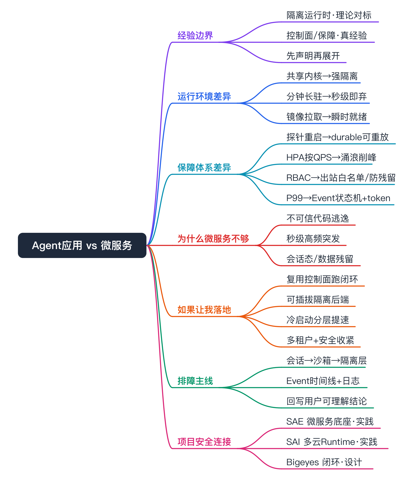
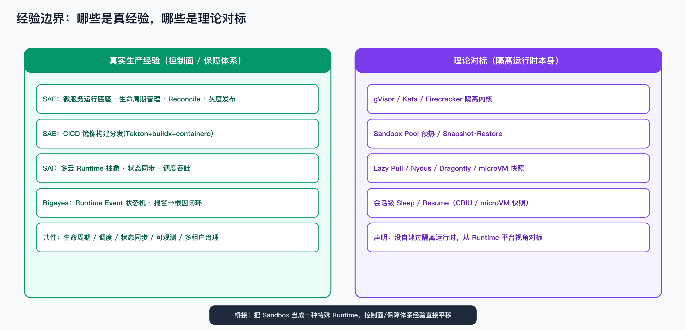
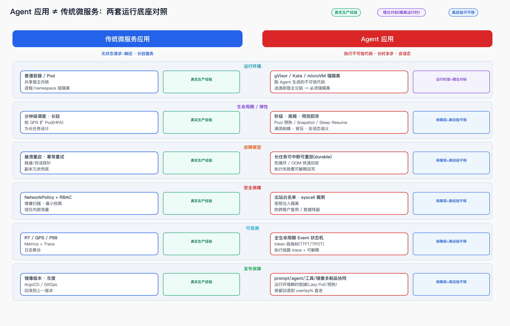
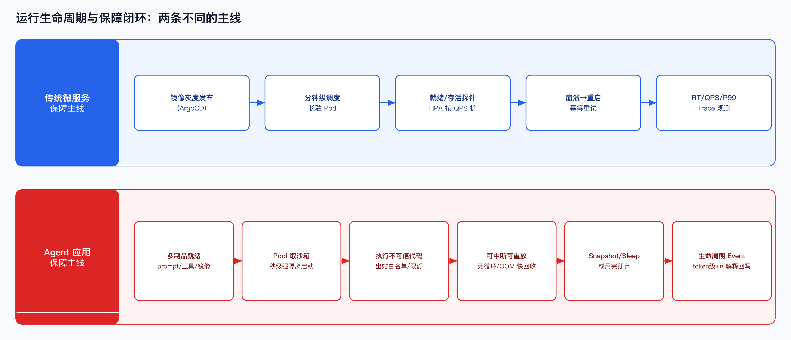

Agent 应用 ≠ 传统微服务：运行环境 + 保障体系双栏对比

> 说明：本文是 [[sandbox]] / [[soul-sandbox-0-to-1]] 的**对比型**面试文档，专门回答面试里那个切入点——「AI 时代应用形态变了，Agent 应用不再是传统无状态微服务」。它把两套运行底座放在一起对照：**运行环境**（隔离/生命周期/冷启动）这半复用 sandbox 系列的对标理解，**保障体系**（故障/安全/可观测/发布/多租户）这半是我在 SAE / SAI / Bigeyes 真做过的平台工程经验平移。
>
> 这是 theory + tech-point 混合：隔离运行时本身（gVisor / Kata / Firecracker）我没有生产落地，是理论对标；但控制面、生命周期、状态同步、可观测、灰度发布这些保障体系，是我真实做过的，只是把治理对象从「业务 Pod / 训练任务 / 告警事件」换成「Agent 沙箱」。面试时先讲清这条边界，再展开对比，不伪装实操。

# 经验边界

- **有直接生产经验（保障体系侧 = 本文重点）**：
  - SAE：微服务运行底座、应用生命周期管理、Reconcile、灰度发布、CICD 镜像构建分发（Tekton + buildx + containerd + nerdctl）。
  - SAI：多云 Runtime 抽象、状态同步、调度吞吐、任务可观测。
  - Bigeyes：Runtime Event 状态机、报警 → 根因分析闭环的执行编排。
  - 这些保障能力是**和负载形态无关的平台工程问题**，可以直接平移到 Agent 沙箱上。
- **没有直接生产经验（运行环境侧的隔离内核）**：
  - 没自建过 gVisor / Kata / Firecracker 隔离运行时，没为 Agent 做过 Sandbox Pool、Snapshot、秒级启动这类专用优化。
  - 这部分是对标学习，归类 theory_only / theory_with_lab，详见 [[sandbox]]。
- **面试声明方式**：开口先说「Agent 应用 vs 微服务，我能从两层讲——运行环境层的强隔离运行时我是对标理解的；但保障体系层（生命周期、状态同步、可观测、灰度、多租户治理）是我在 SAE/SAI/Bigeyes 真做过的，只是治理对象变了」。把自己定位成「理解形态差异、能做保障体系设计和接入、能排障的人」，而不是「隔离内核专家」。

experience_level：

- 保障体系（控制面/生命周期/状态同步/可观测/发布/多租户）→ `adjacent_production_experience`（同类问题真做过，对象换成沙箱）。
- 隔离运行时（gVisor/Kata/Firecracker/Snapshot）→ `theory_with_lab`（对标理解，无生产落地）。

# 为什么要准备这个对比

- **面试高频且是好切入点**：Agent infra / PaaS 岗位几乎一定会聊「AI 时代应用形态变了」。从「对比传统微服务」切入，比直接背 sandbox 概念更能体现平台工程视角。
- **正好命中我的经验结构**：我做过传统微服务底座（SAE），又对标过 Agent 运行时（sandbox 系列），这个对比能把两段经验串成一条线。
- **区分度高**：很多候选人只会「调 Agent / LLM API」，讲不清 Agent 作为一种**新负载形态**在运行环境和保障体系上到底和微服务差在哪。讲清这个差异 = 平台工程候选人，而不是应用开发候选人。
- **能自然引出落地方案**：讲完差异，顺势接「如果让我建这套底座我会怎么分层」（见 [[soul-sandbox-0-to-1]]），把对比转成设计能力。

# 一句话立论

传统微服务是**无状态、长驻、可信代码、请求-响应**的负载，保障体系是围绕「副本冗余 + 探针重启 + HPA + 镜像灰度」建的；Agent 应用是**有状态会话、秒级高频、执行不可信代码、长时多步**的负载，它把运行环境推到「强隔离 + 用完即弃」、把保障体系推到「可中断可重放 + 防数据残留 + 生命周期可解释」。**底座不是换一种容器，而是换一套运行时模型和一套保障模型。**

# 运行环境差异（复用 sandbox 对标）

运行环境这半的隔离细节在 [[sandbox]] 讲透了，这里只做对比定位。

- **隔离强度：共享内核 → 强隔离**
  - 微服务：普通容器/Pod，共享宿主内核，进程 + namespace + cgroup 级隔离，信任自己的代码。
  - Agent：要跑 Agent 生成的**不可信代码**（任意 Python/shell），共享内核一旦逃逸即宿主沦陷，所以需要 gVisor（用户态内核拦 syscall）/ Kata / Firecracker（microVM 独立内核）级别的强隔离。
  - 这是质变，不是「加几条 seccomp」能补的，详见 [[sandbox]] 的隔离强度谱系。
- **生命周期：分钟级长驻 → 秒级用完即弃**
  - 微服务：Pod 调度分钟级、为长任务设计，一次部署稳定跑很久。
  - Agent：执行是秒级、极高频、突发涌浪，需要 Pool 预热 / Snapshot / 轻量调度把启动从用户路径上摘掉；还要会话级 Sleep/Resume 保留上一轮文件和进程。
- **冷启动：镜像拉取 → 瞬时就绪**
  - 微服务：`pull → unpack → run` 串行，首字节分钟级可接受。
  - Agent：要把「能启动」和「拉完整镜像」解耦——Lazy Pull 按需拉、预热把热镜像提前铺到节点、P2P 收敛回源；microVM 路线靠 Snapshot/Restore 跳过引导。详见 [[image-distribution-fast-start]]。
- **弹性单位：副本数 → 并发会话/沙箱**
  - 微服务：按 QPS / CPU 水平扩副本（HPA）。
  - Agent：按并发会话 / 沙箱数扩执行面，且要扛瞬时涌浪——控制面要幂等、限流、背压、削峰排队，不能被创建风暴打挂。

# 保障体系差异（新写，真经验平移）

这一半是本文新增、也是我经验最实的部分。微服务那套保障体系不是「不能用」，而是**假设变了**：它假设代码可信、负载长驻、故障靠重启兜底；Agent 这些假设全不成立，每条保障都要重做。

- **故障模型：崩溃重启/幂等 → 可中断可重放（durable）**
  - 微服务：进程崩了探针拉起来、副本冗余兜底、请求幂等重试，故障是「秒级恢复一个无状态实例」。
  - Agent：一次执行是长时多步、带中间状态（文件、进程、上下文），不能简单「重启从头来」。需要 durable execution——任务可中断、可从断点重放；死循环 / OOM 要快速识别并回收，不能拖垮控制面；执行失败要把**原因**回写成可解释结论，而不是只报「Pod 退出」。
  - **真经验映射**：Bigeyes 的 Runtime Event 状态机、SAE 的生命周期 Reconcile，本质就是「把一个有状态执行体的失败做成可解释、可恢复」，对象换成沙箱即可。
- **安全保障：NetworkPolicy+RBAC → 出站白名单/syscall 裁剪/防残留**
  - 微服务：信任内部流量，NetworkPolicy + RBAC + 镜像扫描 + 最小权限基本够。
  - Agent：执行不可信代码，威胁模型完全不同——出站网络白名单（防数据外带）、syscall 裁剪（seccomp 收紧）、禁特权、密钥注入隔离、**跨租户复用沙箱要防数据残留**（用完即弃 + 对账确认销毁干净）。
  - **真经验映射**：多租户隔离、Quota、Noisy Neighbor 抑制我在 SAE/SAI 平台侧处理过，安全默认收紧是把同类治理推到不可信负载上。
- **弹性/调度保障：HPA 按 QPS → 涌浪削峰 + 公平调度**
  - 微服务：指标驱动扩缩容，节奏平缓。
  - Agent：瞬时高并发创建（一个工作流并行拉起几十个沙箱），控制面要做接口幂等、限流、背压、削峰排队；多租户要 Fair Share，防一个租户的批量任务饿死别人。
  - **真经验映射**：SAI 调度吞吐、潮汐资源治理是同一类问题。
- **可观测：RT/QPS/P99 → 生命周期 Event 状态机 + token 级 + 可解释**
  - 微服务：RT、QPS、P99、错误率 + Metrics/Trace/Log 三件套。
  - Agent：在请求维度之外要加——沙箱**全生命周期 Event 状态机**（创建/启动/执行/挂起/销毁/异常）、token 级指标（TTFT/TPOT/截断率/显存）、跨 LLM-工具-Runner 的执行链路 trace，最后把失败原因**回写成用户能看懂的结论**，而不是丢一堆 span。
  - **真经验映射**：Bigeyes 报警→根因回写、SAI 任务可观测，正是「把底层信号翻译成上层可理解结论」。
- **发布保障：镜像灰度 → 多制品协同 + 运行环境瞬时就绪**
  - 微服务：镜像版本 + ArgoCD/GitOps + 灰度 + 回滚，一个制品。
  - Agent：要协同 **prompt / agent 定义 / 工具 / 运行镜像**多种制品的版本，运行环境还要瞬时就绪；灰度时要保留回退到 overlayfs 直连仓库这类兜底。
  - **真经验映射**：SAE 的 CICD 镜像构建分发 + 灰度发布是直接底座，Agent 场景是把它推到「多制品 + 极致冷启动」。

一句话收口：**运行环境差异决定了「能不能安全地跑起来」，保障体系差异决定了「敢不敢上生产、出问题能不能收场」。前者我对标理解，后者我真做过。**

# 运行生命周期对照（核心主流程）

- **微服务主线**：镜像灰度发布 → 分钟级调度长驻 Pod → 就绪/存活探针 + HPA → 崩溃重启/幂等 → RT/QPS/P99 观测。整条线围绕「长驻 + 无状态 + 重启兜底」。
- **Agent 主线**：多制品就绪 → Pool 取沙箱秒级强隔离启动 → 执行不可信代码（出站白名单/限额）→ 可中断可重放（死循环/OOM 快回收）→ Snapshot/Sleep 或用完即弃销毁 → 生命周期 Event + token 级 + 可解释回写。整条线围绕「秒级 + 有状态会话 + 防残留 + 可解释」。
- **关键差异点**：微服务的「重启」在 Agent 这里变成「可重放 + 防残留销毁」；微服务的「探针」变成「生命周期 Event 状态机」；微服务的「一个镜像」变成「多制品协同 + 瞬时就绪」。

# 核心概念（对比相关）

- **不可信代码执行（untrusted code execution）**
  - 一句话：Agent 会运行模型生成的、平台不可控的代码，这是和微服务最本质的安全分界。
  - 和我经验的映射：我没做过隔离内核，但「平台跑用户提交的任务」在 SAI 训练任务里有相邻形态，只是信任级别不同。
  - 可能被追问：为什么普通容器不算安全沙箱（共享内核逃逸面）。
- **会话态执行（stateful session）**
  - 一句话：Agent 多轮交互要保留上一轮的文件/进程，又要能一次性销毁防残留——普通容器没有这套抽象。
  - 追问点：Sleep/Resume 在容器（CRIU）和 microVM（Snapshot）上语义不同，是 leaky abstraction（见 [[soul-sandbox-0-to-1]]）。
- **durable execution（可中断可重放）**
  - 一句话：长时多步任务要能从断点恢复，而不是崩了从头跑。
  - 和我经验的映射：状态机 + Reconcile + 事件补偿，是我在 SAE/Bigeyes 做过的同类工程。
- **生命周期 Event 状态机**
  - 一句话：把沙箱从创建到销毁的每个阶段做成可观测、可回写原因的状态机。
  - 和我经验的映射：Bigeyes Runtime Event 状态机直接对应，这是我能讲最实的一块。
- **涌浪削峰（创建风暴治理）**
  - 一句话：瞬时高并发创建沙箱时，控制面靠幂等 + 限流 + 背压 + 排队不雪崩。
  - 和我经验的映射：SAI 调度吞吐、SAE 控制面高可用。

# 如果让我落地，我会怎么设计

定位：把 Agent 运行底座当成「一种特殊 Runtime 平台」来建，复用我熟悉的控制面套路，隔离后端按需选型。完整路线见 [[soul-sandbox-0-to-1]]，这里给对比视角下的分层判断。

- **技术选型**：不一上来全套 Firecracker。先复用现有容器底座把控制面和编排闭环跑通（受信负载用容器，不可信负载再上 gVisor/microVM），隔离做成可插拔 RuntimeClass。调研过 OpenKruise Agents 几乎是这套控制面的开源实现，倾向 adopt + 适配而非从 0 自研（这是选型判断，我没生产跑过它）。
- **运行环境层（对标理解）**：可插拔隔离后端 + 冷启动分层（镜像预热 + Lazy Pull → Pool → Snapshot），按瓶颈组合而不是全堆。
- **保障体系层（真经验平移，重点）**：
  - 生命周期：统一抽象 `Create/Exec/Snapshot/Sleep/Resume/Destroy`，背后做 Reconcile + Event 状态机。
  - 故障：durable 执行 + 死循环/OOM 快速回收 + 失败原因回写。
  - 安全：默认收紧（出站白名单、禁特权、syscall 裁剪、密钥隔离、防跨租户残留 + 对账）。
  - 多租户：Quota / Fair Share / 计费。
  - 可观测：全生命周期 Event + token 级指标 + 执行链路 trace。
- **风险控制**：灰度上线、保留回退到 overlayfs 直连仓库 / 普通容器的能力，默认调度器兼容。

# 如果线上出问题，我怎么排查

按「应用层 → 沙箱 → 隔离运行时」一层层拆，最后翻译成用户可理解结论：

- **会话/任务对象**：先看这次 Agent 执行的会话 ID / 任务对象状态，是创建失败、执行超时、还是销毁残留。
- **沙箱生命周期 Event 时间线**：拉创建/启动/执行/挂起/销毁/异常的 Event，定位卡在哪一步（这是我最熟的排查入口，对应 Bigeyes 状态机）。
- **冷启动分层**：若卡在启动，按拉取 → unpack → 挂载 → runtime 启动 → 进程初始化拆耗时，对症（镜像层贵上 Lazy Pull/预热，runtime 层贵上 Pool/Snapshot）。
- **隔离运行时日志**：强隔离下进程行为受限，看 gVisor/Kata 侧日志和 syscall 拦截、出站白名单是否拦了正常请求。
- **资源/配额**：请求 vs 租户 Quota，是否被 Fair Share 限流、是否 OOM 被回收。
- **回到平台层**：把上面定位翻译成用户能看懂的失败原因回写，而不是丢底层栈。

# 和我现有经验的映射（后置）

- **保障体系（生命周期/状态同步/可观测/灰度/多租户）**：真实经验映射 = SAE 微服务底座 + SAI 多云 Runtime + Bigeyes Event 状态机；能怎么说 = 真做过，只是治理对象换成沙箱。
- **传统微服务运行底座**：真实经验映射 = SAE；能怎么说 = 这就是我做的，对比里的「左栏」是我的本职。
- **隔离运行时（gVisor/Kata/Firecracker/Snapshot）**：无直接生产映射；能怎么说 = 理论对标知识，从 Runtime 平台视角理解，不包装成项目经验。
- **冷启动/镜像分发**：CICD 链路（Tekton+buildx+containerd）真做过；面向 Agent 的极致冷启动（Nydus/microVM 快照）是对标。

# 面试话术

## 三十秒版

AI 时代应用形态确实变了。传统微服务是无状态、长驻、可信代码、请求-响应，保障体系围绕副本冗余、探针重启、HPA、镜像灰度建。Agent 应用是有状态会话、秒级高频、执行不可信代码、长时多步——运行环境上它要从共享内核的普通容器升级到 gVisor/microVM 强隔离、从分钟级长驻变成秒级用完即弃；保障体系上崩溃重启要变成可中断可重放、RBAC 要变成出站白名单加防数据残留、P99 要变成全生命周期 Event 状态机加 token 级观测。我能讲清这两层，因为运行环境的隔离运行时我是对标理解的，而保障体系这套——生命周期、状态同步、可观测、灰度——我在 SAE/SAI/Bigeyes 真做过，只是把对象从业务 Pod 换成沙箱。

## 三分钟版

在三十秒版基础上展开：先讲清楚为什么微服务那套不够——它的三个隐含假设（代码可信、负载长驻、故障靠重启兜底）在 Agent 上全不成立。然后按运行环境、保障体系两层对比：运行环境我引用 sandbox 的隔离强度谱系和冷启动分层，明确这块是对标；保障体系我逐条讲故障模型（durable）、安全（不可信代码的威胁模型）、可观测（Event 状态机 + 可解释回写）、发布（多制品协同），每条都挂回我真做过的同类经验。最后给落地判断：我会把它当成一种特殊 Runtime 平台来建，复用控制面、隔离后端可插拔、不一上来全套 Firecracker，并主动说边界——隔离内核我是对标的，平台保障体系是我能直接平移的。

## 五分钟版

再补三块深度：一是 leaky abstraction——Sleep/Resume 在容器（CRIU）和 microVM（Snapshot）上语义、GPU/网络支持都不同，统一 API 下要把后端能力差异显式暴露成 capability；二是选型判断——OpenKruise Agents 几乎是这套控制面的开源实现，Soul 本就在用 Kruise，所以倾向 adopt + 适配，把精力放在隔离后端、对账防泄漏、多租户安全上；三是我认为最难的几个点——强隔离 × GPU、秒级启动 vs 安全销毁、海量短生命周期的对账不泄漏、控制面扛涌浪。把「知道难在哪」也讲出来。

# 面试追问树

- 你说 Agent 不是微服务，那它到底新在哪？
  - 答：四个属性变了（有状态/秒级高频/不可信代码/长时多步），逐个推出运行环境和保障体系的变化。
    - 追问：那是不是把容器换成 microVM 就行了？
      - 答：不是。隔离只是运行环境一层；保障体系（故障/安全/可观测/发布/多租户）每条假设都变了，这才是大头。
    - 追问：微服务的探针/HPA 为什么不能直接用？
      - 答：探针假设无状态可重启，Agent 是有状态长任务要 durable 重放；HPA 按 QPS，Agent 是涌浪创建要削峰背压。
- 不可信代码执行具体威胁是什么，你怎么防？
  - 答：逃逸 → 宿主沦陷、数据外带、跨租户残留。强隔离 + 出站白名单 + syscall 裁剪 + 密钥隔离 + 用完即弃对账。
    - 追问：用完即弃怎么保证真销毁干净？
      - 答：这是我说的最难点之一，要做销毁对账，不能只发 delete；可观测上要有销毁完成 Event。
- 这套你做过吗？
  - 答：明确分两层——隔离运行时没做过、是对标；控制面/保障体系真做过（SAE/SAI/Bigeyes），对象换成沙箱。
    - 追问：那你凭什么说你能做保障体系？
      - 答：举 Bigeyes Event 状态机、SAE 生命周期 Reconcile、SAI 调度吞吐，都是同类问题的真实落地。
- 如果让你从 0 建这套底座，先做什么？
  - 答：P0 复用容器跑通控制面闭环（安全不裸奔）→ P1 补强隔离 → P2 冷启动提速 → P3 多租户+安全+可观测，详见 [[soul-sandbox-0-to-1]]。

# 高频 QA

- **AI 时代应用形态到底变了什么？**
  从无状态请求-响应的可信长驻服务，变成有状态会话、秒级高频、执行不可信代码的长时多步负载。底座要从「普通容器 + 探针 + HPA + 镜像灰度」换成「强隔离 + 秒级用完即弃 + durable 可重放 + 生命周期可解释」。
- **为什么微服务的保障体系不能直接套？**
  因为它有三个隐含假设——代码可信、负载长驻、故障靠重启兜底——在 Agent 上全不成立。每条保障（故障/安全/弹性/观测/发布）都要按新假设重做。
- **Agent 运行环境和微服务最本质的差别？**
  执行不可信代码。这一条直接逼出强隔离（gVisor/microVM），是和共享内核普通容器的质变分界。
- **这套你生产做过吗？怎么界定边界？**
  隔离运行时（gVisor/Kata/Firecracker/Snapshot）没做过，是对标；保障体系（生命周期/状态同步/可观测/灰度/多租户）在 SAE/SAI/Bigeyes 真做过，只是治理对象换成沙箱。
- **微服务的「崩溃重启」在 Agent 这里对应什么？**
  对应 durable execution——可中断可重放，加上有状态会话的 Sleep/Resume 和销毁防残留，不能简单从头重跑。
- **可观测上多了哪些东西？**
  全生命周期 Event 状态机（创建到销毁）、token 级指标（TTFT/TPOT/截断率/显存）、跨 LLM-工具-Runner 的执行链路 trace，以及失败原因可解释回写。
- **发布为什么更复杂？**
  从单镜像变成 prompt/agent/工具/镜像多制品协同，运行环境还要瞬时就绪，灰度要保留回退兜底。
- **海量短生命周期沙箱对控制面的压力怎么解？**
  幂等接口 + 限流 + 背压 + 削峰排队扛涌浪，加销毁对账防泄漏。这是我认为最难的点之一。
- **会用 Agent 平台和懂 Agent infra 区别在哪？**
  前者是应用开发，后者要讲清这两套底座差异、能设计保障体系、能排障。本文就是后者的表达。
- **哪些地方你不会夸大？**
  不会说我自建过隔离内核、不会说我跑过 OpenKruise Agents 生产、不会编造冷启动毫秒数和规模收益。保障体系说真经验，运行环境说对标。

# 不能怎么说

| 不要这么说 | 风险 | 应该这么说 |
|---|---|---|
| 我自建过 gVisor/Firecracker 沙箱运行时 | 没生产实操会被击穿 | 隔离运行时我是对标理解，控制面/保障体系是真经验 |
| 我们生产用 OpenKruise Agents 跑 Agent 沙箱 | 没跑过线上 | 它是我对标的开源实现，倾向 adopt+适配，是选型判断 |
| Agent 底座就是把容器换成 microVM | 把问题做小了 | 隔离只是运行环境一层，保障体系每条假设都变了 |
| 我做的 Agent 平台冷启动做到 X 毫秒 | 编造指标 | 冷启动按分层拆，目标 SLO 要先定，没实测不报数 |
| 微服务那套保障体系在 Agent 上没用 | 走极端 | 不是没用，是隐含假设变了，每条要按新假设重做 |

# 面试前检查清单

- [ ] 能用一句话立论说清 Agent 应用 ≠ 微服务（四个属性变化）。
- [ ] 能分「运行环境 / 保障体系」两层展开对比，不混在一起。
- [ ] 每讲一条保障差异，能挂回 SAE/SAI/Bigeyes 的真实同类经验。
- [ ] 明确声明隔离运行时是对标、保障体系是真经验，边界不含糊。
- [ ] 没有编造冷启动毫秒数、规模、收益。
- [ ] 能回答「这套你做过吗」而不露怯（分两层答）。
- [ ] 能顺势接到落地路线（[[soul-sandbox-0-to-1]]）。
- [ ] 能讲出至少两个「最难的点」（销毁防残留、涌浪削峰）。
- [ ] 三档话术能口述，三十秒版能脱口而出。
