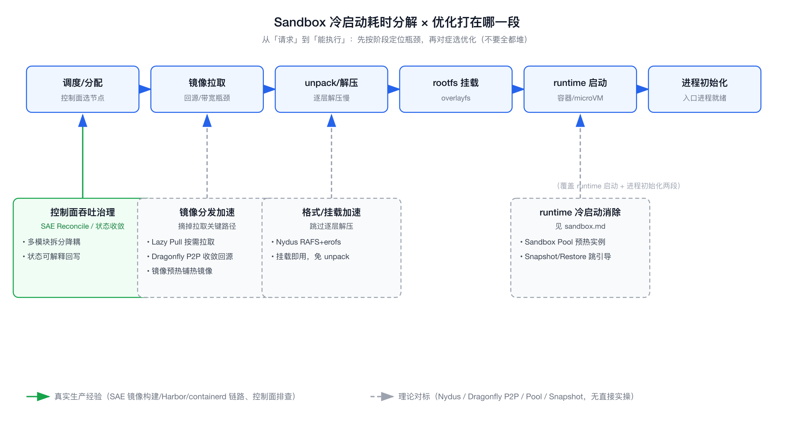
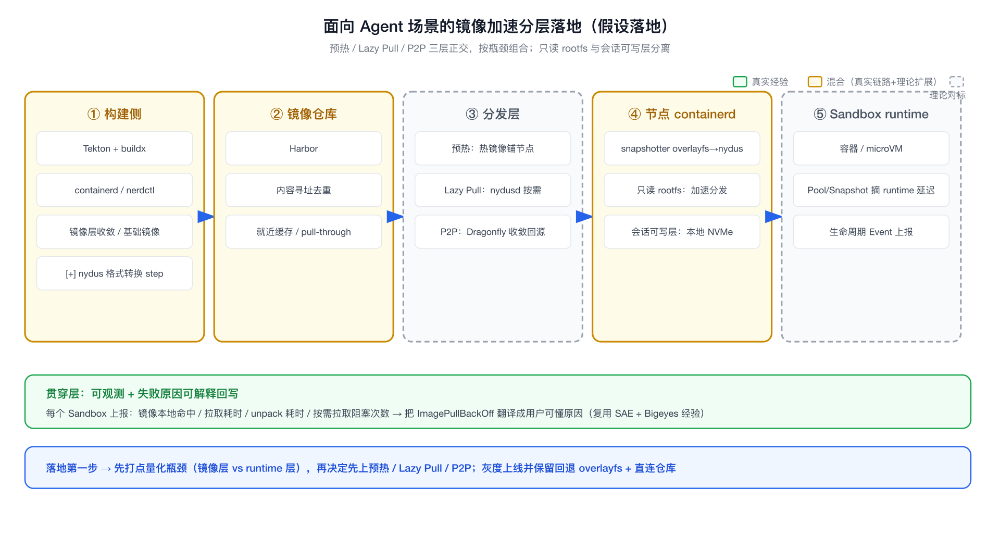

# 理论对标：Agent 场景镜像分发与秒级冷启动

```yaml
experience_level:
  oci_image_build_distribution: adjacent_production_experience   # SAE Tekton/buildx/containerd/nerdctl/Harbor 真实做过镜像构建与分发链路
  container_networking_cni: adjacent_production_experience       # K8s/SAE 真实运维过 CNI、网络命名空间、IP 分配；eBPF 仅对标
  lazy_pull_p2p_snapshot: theory_only                            # Nydus / stargz / Dragonfly / microVM Snapshot 没有生产落地，纯对标理解
  criu_checkpoint_restore: theory_only                           # CRIU / 容器休眠唤醒没有生产落地，纯对标理解
```

> 说明：本文是 [[sandbox]] 的**深度补充专题**，专门拆「通义 Agent Sandbox JD」里点名的「重构面向 Agent 场景的镜像分发体系，实现运行环境的瞬间就绪及高频数据读写的高效支撑」。sandbox.md 讲的是隔离/Pool/Snapshot 的宏观取舍，本文只钻**镜像分发与冷启动**这一条链路。
>
> 边界先说清：OCI 镜像构建、containerd/nerdctl、Harbor 分发我在 SAE 真实做过；按需拉取（Nydus/stargz）、P2P 分发（Dragonfly）、microVM Snapshot 我没有生产落地，是对标理解。技术选型与性能数字为**轻量对标**，未跑完整 benchmark，文中量级均为公开资料引用。

---

## 经验边界

- **有相邻生产经验**：在 SAE 维护过基于 Tekton 的 CI/CD 镜像构建链路，用过 buildx / containerd / nerdctl 做多语言构建，接 Harbor 做镜像仓库和分发，接 scan-code / jar 扫描做发布准入。我理解「镜像怎么构建、怎么进仓库、节点怎么拉、拉取慢卡在哪」这条真实链路。容器网络（CNI、网络命名空间、IP 分配、Pod 起不来卡在网络）也在 K8s/SAE 真实运维过。
- **没有直接生产经验**：没有为 Agent 场景做过 Lazy Pull（stargz/nydus snapshotter）、P2P 镜像分发（Dragonfly/Kraken）、镜像预热调度、microVM rootfs/Snapshot、CRIU 容器 checkpoint/restore、eBPF 网络加速这类专用冷启动优化。
- **没有做过实验**：没有本地搭过 nydusd + nydus-snapshotter，也没跑过 Dragonfly P2P 集群，没做过 CRIU dump/restore。
- **面试声明方式**：开口先说「Agent 场景的镜像加速我没有直接落地，我是从平台镜像分发链路视角对标理解的」，把自己定位成「懂镜像分发链路全貌、能做加速方案选型和接入设计的人」，不是「Nydus/Dragonfly 专家」。



> 先按阶段定位瓶颈（蓝色管线），再决定优化打在哪一段：绿色为真实经验可支撑（控制面吞吐），灰色虚线为理论对标（镜像分发加速 / 格式挂载加速 / Pool / Snapshot）。

---

## 为什么需要掌握

- **JD 直接点名**：通义这个岗位把「镜像分发体系重构」「运行环境瞬间就绪」「高频数据读写」单列成一条职责，3 面一定会深挖。
- **是秒级启动的硬瓶颈**：Sandbox 冷启动里，「拉镜像」往往是耗时大头，隔离层（microVM/gVisor）和 Pool/Snapshot 都解决不了「镜像本身没到节点」的问题——这是独立的一层优化。
- **和我经验相邻**：镜像构建、分发、节点拉取这条链路我在 SAE 真实做过，Agent 场景只是把它推到「极高频、突发、要瞬间就绪」的极端，工程问题是同一类。
- **能讲清托管产品背后的原语**：E2B / Modal / Daytona 的「秒级就绪」本质就是镜像不走「拉完再起」，理解原语才能讲清它们的取舍。

---

## 它解决什么问题

不写功能清单，按问题域拆开看 Agent 场景的镜像分发到底在解决什么：

- **镜像「拉完才能起」，但 Agent 要的是「立刻能跑」**
  - **对应能力**：Lazy Pull / 按需拉取（stargz、nydus），起容器时只挂载，访问到哪个文件块再拉哪块。
  - **面试表达**：传统 `pull → unpack → run` 是串行的，大镜像首字节时间就是分钟级；Agent 场景要把「能启动」和「拉完整镜像」解耦，让进程先跑起来，文件按需补。

- **海量节点同时拉同一个镜像，把仓库打爆**
  - **对应能力**：P2P 分发（Dragonfly / Kraken），节点之间互相做种子，回源仓库的流量收敛成一份。
  - **面试表达**：瞬时涌浪场景下，几百上千个节点同时回源 Harbor，仓库带宽和后端存储是热点；P2P 把「N 个节点拉 N 次源」变成「源出一份、节点间扩散」。

- **冷启动延迟卡在拉取，用户体验直接崩**
  - **对应能力**：镜像预热 / 预分发（提前把热镜像推到节点本地或就近缓存）、Pool 里预置常用 runtime 镜像。
  - **面试表达**：Agent 的运行环境镜像是相对收敛的（Python/Node 几套基础镜像），可以预测并提前铺到节点，把拉取从用户路径上摘掉。

- **镜像层多、解压慢，unpack 本身就是瓶颈**
  - **对应能力**：换文件系统格式（nydus 用 RAFS + erofs，跳过 overlayfs 逐层解压）、减少层数、合并基础层。
  - **面试表达**：不只是「下载慢」，`tar.gz` 逐层解压在大镜像上也很慢；nydus 这类把镜像组织成块设备 + 元数据，挂载即用，省掉 unpack。

- **Agent 执行有大量临时文件读写，可写层成瓶颈**
  - **对应能力**：可写层选型（overlayfs upperdir / erofs+overlay / 直接挂本地 NVMe / NAS），区分「只读 rootfs」和「会话可写区」。
  - **面试表达**：JD 说的「高频数据读写」指的是 Agent 跑代码会狂写临时文件和中间产物，要把只读镜像层和高频可写层分开，可写层落在快盘上。

- **同一份镜像被反复拉，节点缓存利用率低**
  - **对应能力**：节点本地内容缓存、就近缓存层（区域仓库 / pull-through cache）、内容寻址去重。
  - **面试表达**：镜像是内容寻址的（按 digest），相同层全局只需一份，加缓存和去重能大幅省掉重复拉取。

- **不止镜像要冷启动，给 Sandbox 配网络本身也有冷启动成本**
  - **对应能力**：网络命名空间/veth/IP 预创建池、CNI 加速、eBPF（绕过 iptables/conntrack、加速容器网络数据面）。
  - **面试表达**：秒级拉起里除了拉镜像，CNI 插件调用、IP 分配、网络命名空间和路由配置也是一段实打实的耗时；瞬时涌浪下还会撞上 IPAM 分配热点。可以把网络资源像 Pool 一样预创建，数据面用 eBPF 替代 iptables 降低连接建立和转发开销。

- **「冷启动」之外还有「从快照唤醒」：不冷启，直接恢复**
  - **对应能力**：容器侧 CRIU checkpoint/restore（对应 JD 的「休眠唤醒」）、microVM Snapshot/Restore，从已初始化的内存/进程状态恢复，跳过整个引导和初始化。
  - **面试表达**：消除冷启动有两条路——一条是把「拉取/启动」做快（Lazy Pull、Pool），另一条是干脆不冷启，从快照恢复一个已经热好的实例；休眠唤醒场景必须靠后者。

---

## 核心概念

### 冷启动耗时分解

- **一句话定义**：Sandbox 从「请求」到「能执行」的时间 = 调度/分配 + 镜像拉取 + unpack + rootfs 挂载 + 网络配置（CNI / IP 分配 / 命名空间）+ runtime（容器/microVM）启动 + 进程初始化。
- **解决的问题**：先定位时间花在哪，才知道该上 Lazy Pull 还是上 Pool 还是上 Snapshot 还是预创建网络。
- **和我经验的映射**：和我在 SAE 排查「发布慢、Pod 起不来」时按阶段下钻是同一套方法（Pod 起不来很多时候就卡在镜像或网络这两段）。
- **可能被追问**：哪一段最贵？答：冷镜像场景下「拉取 + unpack」通常是大头；镜像已在本地时，runtime 启动和进程初始化才是主要项，这时该靠 Pool / Snapshot 而不是镜像加速；网络配置一般不是大头，但在瞬时大规模并发下 IPAM 分配会成为热点。先打点定位，不要预设。

### Lazy Pull（按需拉取）

- **一句话定义**：不等整镜像拉完，挂载后按文件访问按需拉取数据块，代表实现是 eStargz（stargz-snapshotter）和 Nydus（nydus-snapshotter）。
- **解决的问题**：把「拉完整镜像」从启动关键路径移走，大幅缩短首字节/首次可执行时间。
- **机制要点**：镜像被重新组织成「可随机寻址 + 带元数据/TOC」的格式，containerd 通过对应 snapshotter 挂载（常走 FUSE 或内核 erofs），进程访问哪个文件就远程拉哪个 chunk，配合 prefetch 把启动必读文件提前拉。
- **和我经验的映射**：和我关注的镜像分发、启动链路优化同域；containerd snapshotter 这层我接触过（overlayfs snapshotter）。
- **可能被追问**：eStargz vs Nydus 区别？答：eStargz 兼容 OCI、改动小、回源仍是 HTTP range；Nydus 是独立镜像格式（RAFS+erofs）、压缩去重和 prefetch 更激进、按需读性能更好，但要单独转换镜像、运维 nydusd。按需拉取的代价是「运行期访问可能阻塞在网络」，要靠 prefetch 和就近缓存兜底。

### P2P 镜像分发

> 重名提醒（面试别踩坑）：这里说的 **Dragonfly 是 CNCF 的 `dragonflyoss/Dragonfly` 镜像/文件 P2P 分发系统**，最早由阿里巴巴开源，且 **Nydus 就是它伞下的镜像加速子项目**——对通义这场是加分项。它和 **DragonflyDB（Redis 兼容的内存数据库）只是撞名**，完全无关，别混。

- **一句话定义**：节点之间互相充当 peer/种子分发镜像块，回源仓库只出一份，代表是 Dragonfly（dragonflyoss）、Uber Kraken。
- **解决的问题**：海量节点瞬时同时拉同一镜像时，仓库带宽和存储的热点问题。
- **机制要点**：调度器把镜像切块，第一个节点回源后，其余节点从邻居拉块；和 Lazy Pull 正交，可叠加（Dragonfly 也支持按需）。
- **可能被追问**：什么时候必须上 P2P？答：节点规模大 + 同镜像并发拉取高（大规模扩容、突发涌浪）时，回源是瓶颈才上；小规模或镜像分散时收益有限，反而增加运维复杂度。

### 镜像预热 / 预分发

- **一句话定义**：预测热点镜像，提前推到节点本地或就近缓存，请求来时本地命中。
- **解决的问题**：把拉取从用户路径上彻底摘掉，适合「镜像集合收敛、可预测」的 Agent 运行环境。
- **和我经验的映射**：和 Sandbox Pool 预热是一对——Pool 预热「实例」，镜像预热「内容」。
- **可能被追问**：预热和 Lazy Pull 怎么配合？答：预热解决「常用镜像」，Lazy Pull 兜底「冷门/大镜像」，二者叠加；预热要控成本，别把整个仓库铺到每个节点。

### Snapshotter（containerd 快照器）

- **一句话定义**：containerd 里负责把镜像层组织成容器 rootfs 的插件，overlayfs 是默认，stargz/nydus 是支持按需拉取的替代。
- **解决的问题**：rootfs 怎么挂、可写层放哪、是否支持按需——是镜像加速接入 containerd 的关键扩展点。
- **可能被追问**：为什么改 snapshotter 就能加速？答：因为「镜像怎么落地成可运行 rootfs」就发生在这一层，换成按需 snapshotter 就能把「拉完再解压」改成「挂载即用」。

### microVM rootfs / Snapshot

- **一句话定义**：Firecracker 这类 microVM 用单独的 rootfs 镜像（不是 OCI 容器镜像那套），Snapshot 直接存内核+内存+设备状态，恢复跳过引导。
- **解决的问题**：microVM 路线下「镜像」语义和容器不同，秒级启动主要靠 Snapshot/Restore 而非 Lazy Pull。
- **可能被追问**：microVM 还需要镜像加速吗？答：rootfs 仍要分发，但「瞬间就绪」主要靠 Snapshot 恢复；容器路线靠 Lazy Pull，microVM 路线靠 Snapshot，是两条不同的冷启动消除路径。

### CRIU / 容器 Checkpoint-Restore（对应 JD 的「休眠唤醒」）

- **一句话定义**：CRIU（Checkpoint/Restore In Userspace）把一个运行中进程/容器的内存、文件描述符、网络状态等 dump 成镜像文件，之后能从这个点 restore 回来继续跑。runc/containerd 的 checkpoint、podman/docker checkpoint、K8s ForensicContainerCheckpointing 底层都是它。
- **解决的问题**：容器路线下的「休眠唤醒」和「不冷启」——把一个已经初始化好的实例 dump 下来，下次直接 restore，跳过 runtime 启动 + 进程初始化这两段。microVM 用 Snapshot，容器用 CRIU，是同一思路的两条实现。
- **机制要点**：dump 时冻结进程、遍历 `/proc` 抓取地址空间和内核态资源，写成 image；restore 时重建命名空间、映射内存、恢复 fd 和连接。难点在「外部状态」——打开的网络连接、GPU 上下文、宿主特定的句柄不一定能干净恢复。
- **和我经验的映射**：无直接生产落地；但和我排查「进程状态/启动阶段」是相邻问题域，containerd 这层我接触过。
- **可能被追问**：CRIU 的坑？答：有状态外部资源（长连接、GPU、特定设备）恢复困难；restore 耗时随内存增大上升；安全上 dump 文件含完整内存快照，是敏感数据，要加密和隔离。所以它适合「可预测、内部状态为主」的会话，不是万能。
- **和 Pool/Snapshot 的关系**：Pool 预热「空白实例」，CRIU/Snapshot 恢复「带状态的实例」；前者解决首次拉起，后者解决休眠唤醒和有状态会话恢复——细节切到 [[sandbox]] 的 Snapshot/Sleep-Resume。

### 网络冷启动 / eBPF（秒级拉起里被忽略的一段）

- **一句话定义**：给 Sandbox 配网络这件事本身有耗时——CNI 插件调用、IPAM 分配 IP、创建网络命名空间和 veth、配路由/iptables。eBPF 可以在数据面替代 iptables/conntrack，降低连接建立和转发开销。
- **解决的问题**：JD 点名「VPC、VxLAN、eBPF」。瞬时大规模并发起 Sandbox 时，IPAM 分配会成为热点、iptables 规则线性膨胀拖慢；这一段不优化，光把镜像做到秒级也到不了端到端秒级。
- **机制要点**：网络资源像 Pool 一样**预创建**（提前建好 netns/veth/预分配 IP 段），把网络配置从拉起关键路径上摘掉；数据面用 eBPF（如 Cilium）做 service 转发和策略，避免 iptables/conntrack 在高并发短连接下的开销。
- **和我经验的映射**：CNI、网络命名空间、IP 分配、「Pod 起不来卡在网络」我在 K8s/SAE 真实运维过，是相邻生产经验；eBPF 数据面（Cilium）是对标理解，没生产落地。
- **可能被追问**：网络冷启动一般占多少？答：通常不是最大头，但在突发涌浪、短生命周期 Sandbox 场景下 IPAM 和规则配置会被放大，要单独看；和镜像加速正交，按瓶颈决定要不要预创建网络。

### 只读层 vs 可写层（高频数据读写）

- **一句话定义**：rootfs 只读共享，容器/会话的写落在 upperdir（overlayfs）或独立可写卷。
- **解决的问题**：JD 说的「高频数据读写」——Agent 跑代码产生大量临时文件，可写层 IO 是瓶颈。
- **机制要点**：只读层走镜像缓存/按需拉取，可写层落本地 NVMe 或高性能 NAS；区分「会话内要持久（Snapshot 走）」和「用完即弃（tmpfs/本地盘走）」。
- **可能被追问**：可写层放 NAS 有什么坑？答：网络存储 IO 抖动会直接拖慢 Agent，元数据密集型负载（大量小文件）在 NAS 上尤其差，高频临时写更适合本地盘。

---

## 怎么定义和度量「秒级」：SLO 与量化锚点

通篇说「秒级」，面试官大概率会追一句「你怎么定义、怎么度量秒级」。不先定义指标就谈优化是空的。

定义冷启动 SLO，至少这几条：

- **启动时延分位，且必须区分 warm / cold**：P50 / P95 / P99 的端到端拉起时延（请求 → 可执行），warm（命中 Pool / 本地镜像）和 cold（要拉镜像 / 冷启）分开统计，混在一起会被平均数骗。
- **Warm-hit 率**：Pool 命中率、镜像本地命中率、Snapshot 命中率——这几个直接决定 P99 长尾。
- **拉起成功率与失败原因分布**：ImagePullBackOff / 网络分配失败 / Snapshot restore 失败 / 调度无资源各占多少。
- **关键路径耗时分解**：每个 Sandbox 上报 拉取 / unpack / 挂载 / 网络配置 / runtime 启动 / 初始化 各段耗时，按段做火焰图式归因。
- **按需拉取阻塞指标**：Lazy Pull 下的运行期阻塞次数和时长（prefetch 没覆盖的代价）。
- **单位成本**：单个 Sandbox 的资源占用 × 存活时长，warm pool 预热的常驻成本也要算进去——快和省是要权衡的。

量化锚点（**公开资料量级，仅作直觉参照，我没有自测/压测**）：

- 大镜像冷拉取（节点无缓存）：几十秒到分钟级，常是冷启动最大头。
- Firecracker microVM 启动：官方 README 称约 125ms 量级；Snapshot/Restore 恢复可到更低。
- gVisor：相比 runc 有系统调用拦截开销，启动和运行都有 overhead，换的是更强隔离。
- 普通容器启动：百毫秒到秒级，取决于镜像是否在本地、runtime 和初始化逻辑。
- 语言运行时级隔离（如 V8 isolate）：公开宣传可到个位数毫秒冷启动——这是比容器更轻的另一条隔离轴，细节属隔离层，放 [[sandbox]]。

口径提醒：这些数字只用来建立「哪一段贵、量级差几个数量级」的直觉，面试时我会明确说是公开资料量级、未自测，不当成自己压出来的结论。

## 如果让我落地，我会怎么设计



> 构建 → 仓库 → 分发 → 节点 → runtime 五层：绿色为真实做过的链路（Tekton/Harbor/containerd），黄色为真实链路 + 理论扩展，灰色虚线为理论对标。预热 / Lazy Pull / P2P 三层正交，按瓶颈组合。

以「假设落地」为前提，不是「我已经做过」。

1. **先量化，不盲目优化**：先把冷启动耗时按阶段打点（调度 / 拉取 / unpack / 挂载 / 启动 / 初始化），看瓶颈在镜像层还是 runtime 层。镜像层贵就上分发优化，runtime 层贵就上 Pool/Snapshot——不要一上来全堆。
2. **镜像加速分层组合，不是全都上**：
   - 镜像集合收敛、可预测 → 优先**预热/预分发**到节点本地。
   - 大镜像、冷门镜像 → 上 **Lazy Pull（nydus/stargz）** 摘掉拉取关键路径。
   - 大规模 + 同镜像瞬时高并发回源 → 叠加 **P2P（Dragonfly）** 收敛回源。
   - 三者正交，按场景叠加。
3. **接入方式**：容器路线在 containerd 换/加 snapshotter（nydus-snapshotter），镜像在构建流水线里转换成 nydus 格式（接到我熟悉的 Tekton 构建链路上，转换作为一个 build step）；microVM 路线则走 rootfs 分发 + Snapshot。
4. **构建侧治理**：控制层数、收敛基础镜像、把 Agent 常用 runtime 做成标准基础镜像，减少 unpack 和分发量——这块直接复用我在 SAE 做镜像构建规范的经验。
5. **可写层设计**：只读 rootfs 走加速分发，会话可写层落本地快盘；持久会话用 Snapshot，临时执行用 tmpfs/本地盘用完即弃。
6. **网络与休眠唤醒**：把网络资源（netns/veth/IP 段）像 Pool 一样预创建，把 CNI/IPAM 从拉起关键路径摘掉，高并发数据面评估 eBPF（Cilium）替代 iptables；有状态会话和「休眠唤醒」走 CRIU（容器）/ Snapshot（microVM）从快照恢复，而不是冷启。这两块和镜像加速正交，按瓶颈决定上不上。
7. **可观测与 SLO**：每个 Sandbox 上报「镜像是否命中本地 / 拉取耗时 / unpack 耗时 / 网络配置耗时 / 按需拉取阻塞次数」，按上节的 SLO（warm/cold 分位、命中率、成功率）做成指标——这块复用我在 Bigeyes 的 Runtime Event 思路。
8. **控制面回写**：把「镜像拉取超时 / 仓库不可达 / 预热未命中 / IP 分配失败 / Snapshot restore 失败」翻译成用户可理解的失败原因，而不是丢一个 ImagePullBackOff——和我在 SAE 把 Reconcile 状态做成可解释信息一致。
9. **灰度与回滚**：snapshotter / P2P / eBPF 数据面 / CRIU 这类底座变更先灰度一批节点，保留回退到 overlayfs + 直连仓库 + iptables + 冷启的能力，避免加速组件本身成为新的故障点。

---

## 如果线上出问题，我怎么排查

以「Sandbox 启动慢 / 镜像拉不动」为例，给可操作的下钻路径：

1. **先定位阶段**：是调度没分配、还是镜像没拉到、还是 runtime 没起来？先把问题框到「镜像层」还是「runtime 层」。
2. **看镜像是否命中本地**：节点上 `crictl images` / containerd 内容缓存里有没有这个 digest；没命中说明预热/缓存没生效。
3. **看拉取耗时和回源**：仓库（Harbor）侧带宽/QPS 是否打满、是否大量节点同时回源（该上 P2P 的信号）、网络到仓库是否抖动。
4. **看 unpack / 挂载**：用按需 snapshotter 时，看 nydusd/FUSE 是否正常、按需拉取是否大量阻塞在网络（prefetch 没覆盖到启动必读文件）。
5. **看可写层 IO**：高频读写场景看可写层落在哪、是不是 NAS 抖动或本地盘打满。
6. **看网络配置段**：镜像到位但还卡，看 CNI 插件是否超时、IPAM 是否分配不出 IP（瞬时涌浪下 IP 段耗尽/分配热点）、网络命名空间和路由是否建好——这段在大规模并发下容易被忽略。
7. **看 runtime 启动 / 唤醒**：镜像已在本地还慢，那是 runtime（容器/microVM）启动或进程初始化的问题，这时该看 Pool 是否空、Snapshot / CRIU restore 是否失败或恢复慢（内存大、外部状态恢复不了）——切到 [[sandbox]] 的排查路径。
8. **看加速组件自身**：snapshotter / P2P 调度器 / nydusd / eBPF 数据面 / CRIU 自己是不是挂了或过载——加速组件会变成新的单点。
9. **回到平台层**：把根因翻译成用户能懂的信息，并判断是个例还是面（单节点 vs 全局）。

---

## 和我现有经验的映射

后置说明，先讲技术本身，再说能不能安全连接到我的真实经验。

- **OCI 镜像构建 / Harbor 分发 / containerd 拉取链路**
  - **我的真实经验映射**：SAE 的 Tekton CI/CD，buildx / containerd / nerdctl 多语言构建，Harbor 仓库，scan-code 准入。
  - **能怎么说**：镜像「怎么构建、进仓库、节点怎么拉、拉取慢卡哪」这条链路我真实做过，是相邻生产经验。

- **overlayfs snapshotter / rootfs 挂载**
  - **我的真实经验映射**：生产用默认 overlayfs snapshotter，理解 rootfs 怎么落地。
  - **能怎么说**：默认 snapshotter 用过，按需 snapshotter（nydus/stargz）是对标理解，没生产落地。

- **Lazy Pull / P2P / 镜像预热 / microVM Snapshot / CRIU**
  - **我的真实经验映射**：无直接生产映射。
  - **能怎么说**：纯理论对标，不包装成项目经验；但能讲清它们各解决冷启动里的哪一段（CRIU 对应容器侧休眠唤醒）。

- **容器网络 CNI / 网络命名空间 / IP 分配**
  - **我的真实经验映射**：K8s/SAE 真实运维过，排查过「Pod 起不来卡在网络」。
  - **能怎么说**：网络冷启动这段我有相邻生产经验；eBPF 数据面（Cilium）是对标理解，没生产落地。

- **冷启动耗时分阶段排查**
  - **我的真实经验映射**：SAE 排查发布慢 / Pod 起不来的分阶段下钻方法。
  - **能怎么说**：方法论可平移，对象从「业务 Pod」换成「Sandbox」。

- **可观测与失败原因回写**
  - **我的真实经验映射**：Bigeyes Runtime Event、SAE Reconcile 状态可解释化。
  - **能怎么说**：把镜像拉取/启动的失败做成可观测、可解释的能力，是我真实做过的事。

---

## 面试话术

主回答：

面向 Agent 场景的镜像分发我没有直接落地过，这点我先说清楚——Nydus、Dragonfly、microVM Snapshot 是我对标学习的，没生产实操。但镜像构建、Harbor 分发、containerd 节点拉取这条链路我在 SAE 真实做过，用的是 Tekton + buildx + containerd + nerdctl。Agent 场景的特殊在于「极高频、瞬时涌浪、要运行环境瞬间就绪」，它把镜像分发推到了极端。我对这条链路的理解不停在「会用 docker pull」：冷启动耗时我会先按阶段拆——拉取、unpack、挂载、runtime 启动、进程初始化，再对症下药。镜像层贵就用 Lazy Pull 把拉取从关键路径摘掉、用 P2P 收敛回源、用预热铺热镜像；runtime 层贵才上 Pool 和 Snapshot。这几层是正交的，按瓶颈组合而不是全都堆。如果从 0 到 1 落地，我会先打点量化瓶颈，再在我熟悉的构建流水线里接镜像格式转换和 snapshotter，灰度上线并保留回退到 overlayfs 直连仓库的能力。

短回答：

- **「你做过 Nydus / Dragonfly 吗？」**：没有生产落地，是对标理解。我真实做过的是 SAE 的镜像构建和 Harbor 分发链路，Nydus/Dragonfly 解决的是这条链路在「瞬时高并发 + 大镜像」下的瓶颈，问题域我清楚。
- **「怎么做到运行环境瞬间就绪？」**：把「能启动」和「拉完整镜像」解耦——Lazy Pull 按需拉取、预热把热镜像提前铺到节点、P2P 收敛回源；镜像在本地后再靠 Pool/Snapshot 摘掉 runtime 启动延迟。
- **「Lazy Pull 的代价是什么？」**：运行期文件访问可能阻塞在网络，要靠 prefetch 把启动必读文件提前拉、靠就近缓存兜底；而且要运维 nydusd/snapshotter，加速组件本身会变成新的故障点，所以要可灰度可回退。
- **「高频数据读写怎么支撑？」**：分只读层和可写层——只读 rootfs 走加速分发，会话可写层落本地 NVMe；持久会话用 Snapshot，临时执行用 tmpfs/本地盘用完即弃，别把高频小文件写丢到 NAS 上。
- **「镜像拉取慢线上怎么查？」**：先定位是镜像层还是 runtime 层，再看本地是否命中、仓库是否被打爆该上 P2P、按需拉取是否阻塞在网络、加速组件自身是否过载，最后回写可解释的失败原因。

---

## 不能怎么说

| 不要这么说 | 风险 | 应该这么说 |
|---|---|---|
| 我用 Nydus 把冷启动优化到了 200ms | 没有生产证据和压测，会被追问击穿 | Nydus 是我对标学习的按需拉取方案，公开资料显示能显著缩短首字节时间，我没有自己压测过 |
| 我们生产用 Dragonfly 做 P2P 分发 | 没有真实落地 | 生产用 Harbor 直连分发，Dragonfly 是大规模回源热点场景的对标方案 |
| 我重构过 Agent 的镜像分发体系 | 把对标说成亲历项目 | 我做过 SAE 的镜像构建分发链路，Agent 场景的体系重构是我对标理解、能给出落地设计 |
| Lazy Pull 一定比直接拉快 | 绝对化，按需拉取有运行期阻塞代价 | 在大镜像/冷启动敏感场景下更合适，代价是运行期网络阻塞，要 prefetch 和缓存兜底 |
| 镜像加速就是换个 snapshotter | 过度简化 | snapshotter 是接入点，但要配套构建侧格式转换、prefetch、缓存和可观测，是一套链路 |
| 我用 CRIU 做过容器休眠唤醒 | 没生产落地会被击穿 | CRIU 是我对标理解的容器 checkpoint/restore 原语，对应 JD 的休眠唤醒，我没自己 dump/restore 过 |
| 我用 eBPF 优化了 Sandbox 网络 | 没真实落地 | CNI/网络命名空间/IP 分配我真实运维过，eBPF 数据面（Cilium）是对标方案 |
| 我把冷启动压到了 XXX ms | 没自测会被追问 | 我引用的是公开资料量级，用来判断哪段贵，没有自己压测的数字 |

---

## 高频 QA

### Agent 场景的镜像分发和普通服务发布有什么不同

普通服务发布是低频、可预期的，镜像拉一次缓存住就行；Agent Sandbox 是极高频、突发、要求秒级就绪，海量节点可能瞬时同拉同一镜像，拉取直接进了用户体验的关键路径，所以要专门做按需拉取、P2P 和预热。

### 冷启动里镜像拉取占多少

冷镜像（节点上没有）场景下，「拉取 + unpack」通常是大头，分钟级别都可能；镜像已在本地时，瓶颈就转移到 runtime 启动和进程初始化。所以优化前必须先打点定位，别假设瓶颈一定在镜像。

### Lazy Pull 是怎么做到不拉完就能起的

镜像被重新组织成可随机寻址、带元数据索引的格式（eStargz 的 TOC、Nydus 的 RAFS+erofs），containerd 用对应 snapshotter 挂载后，进程访问到哪个文件就远程拉哪个数据块，配合 prefetch 把启动必读的文件提前拉好，从而把「拉完整镜像」移出启动关键路径。

### eStargz 和 Nydus 怎么选

eStargz 兼容 OCI、改造小、回源还是标准 HTTP range，适合想低成本试水；Nydus 是独立镜像格式，压缩去重和 prefetch 更激进、按需读性能更好，但要单独转换镜像、运维 nydusd，适合规模化、对启动延迟更敏感的场景。没有完整 benchmark 我不会给绝对结论，只说约束下谁更合适。

### 什么时候该上 P2P 分发

节点规模大 + 同一镜像并发拉取高、回源仓库带宽/存储成为热点时才上（大规模扩容、突发涌浪）。小规模或镜像分散时收益有限，反而增加 Dragonfly/Kraken 的运维复杂度和新的故障点。

### Lazy Pull 和 P2P 是替代关系吗

不是，正交可叠加。Lazy Pull 解决「不拉完就能起」，P2P 解决「海量节点回源热点」。Dragonfly 这类也支持按需 + P2P 组合。再加上预热解决「常用镜像」，三层按瓶颈组合。

### microVM 路线还需要这些镜像加速吗

microVM 的 rootfs 不是 OCI 容器镜像那套，「瞬间就绪」主要靠 Snapshot/Restore 跳过引导和初始化，而不是 Lazy Pull。可以理解成：容器路线靠 Lazy Pull，microVM 路线靠 Snapshot，是两条不同的冷启动消除路径。

### JD 说的「高频数据读写」具体指什么，怎么支撑

指 Agent 跑代码会产生大量临时文件和中间产物的读写。支撑思路是只读 rootfs 和会话可写层分离：只读层走镜像缓存/按需拉取，可写层落本地 NVMe 这类快盘；持久会话用 Snapshot，临时执行用 tmpfs/本地盘用完即弃，避免高频小文件写打在 NAS 上抖动。

### 镜像加速会引入什么新风险

加速组件本身会变成新的单点和故障源——nydusd、FUSE、P2P 调度器挂了或过载会直接拖垮启动；按需拉取还有运行期网络阻塞风险。所以要可观测（拉取耗时、阻塞次数）、可灰度、可回退到 overlayfs + 直连仓库。

### 没生产落地过，为什么还懂这些

因为镜像构建、分发、节点拉取这条链路我在 SAE 真实做过，Agent 场景只是把它推到极端。冷启动分阶段排查、失败原因可解释化、灰度回滚这些方法论我都在生产用过，能平移到 Sandbox 场景；具体加速组件我是对标选型层面理解，能讲清各自解决哪一段、代价是什么。

### 如果让你从 0 设计这套体系，第一步做什么

先量化，不盲目优化。把冷启动按阶段打点，确认瓶颈在镜像层还是 runtime 层；再判断镜像集合是否收敛、节点规模和并发回源量，据此决定先上预热、还是 Lazy Pull、还是 P2P。先有数据再选方案，避免一上来堆一堆加速组件却没打中真正的瓶颈。

### 容器怎么做「休眠唤醒」，用 CRIU 吗

容器侧就是 CRIU（Checkpoint/Restore In Userspace）：把运行中容器的内存、fd、网络状态 dump 成镜像，之后 restore 回来，跳过 runtime 启动和进程初始化。runc/containerd checkpoint、docker/podman checkpoint、K8s 的 ForensicContainerCheckpointing 底层都是它。microVM 路线对应的是 Snapshot/Restore，思路一样。坑在外部状态——长连接、GPU 上下文、宿主特定句柄不一定能干净恢复；restore 耗时随内存增大上升；dump 文件是完整内存快照，属敏感数据要加密隔离。所以它适合内部状态为主、可预测的会话，不是万能。我没有生产落地，是对标理解。

### 给 Sandbox 配网络也有冷启动吗，eBPF 在这里干啥

有。秒级拉起里除了拉镜像，CNI 插件调用、IPAM 分配 IP、建网络命名空间和 veth、配路由也是一段耗时，瞬时大规模并发下 IPAM 会成为分配热点、iptables 规则线性膨胀拖慢。优化思路：网络资源像 Pool 一样预创建，把 CNI/IP 分配从拉起关键路径摘掉；数据面用 eBPF（Cilium）替代 iptables/conntrack，降低高并发短连接下的转发和连接建立开销。CNI、网络命名空间、IP 分配我在 K8s/SAE 真实运维过；eBPF 数据面是对标理解。

### 你怎么定义和度量「秒级」

不定义指标谈优化是空的。我会定：端到端拉起时延 P50/P95/P99，且 warm（命中 Pool/本地镜像/Snapshot）和 cold 分开统计，别被平均数骗；warm-hit 率和各类命中率（直接决定 P99 长尾）；拉起成功率和失败原因分布；关键路径分段耗时（拉取/unpack/挂载/网络/启动/初始化）做归因；按需拉取的运行期阻塞次数和时长；以及单位成本（资源占用×时长，含 warm pool 常驻成本）。量级上我只用公开资料建立直觉——大镜像冷拉取分钟级、Firecracker 启动 ~125ms 量级、容器启动百毫秒到秒级——会明确说这些没自测，不当成自己压出来的结论。
