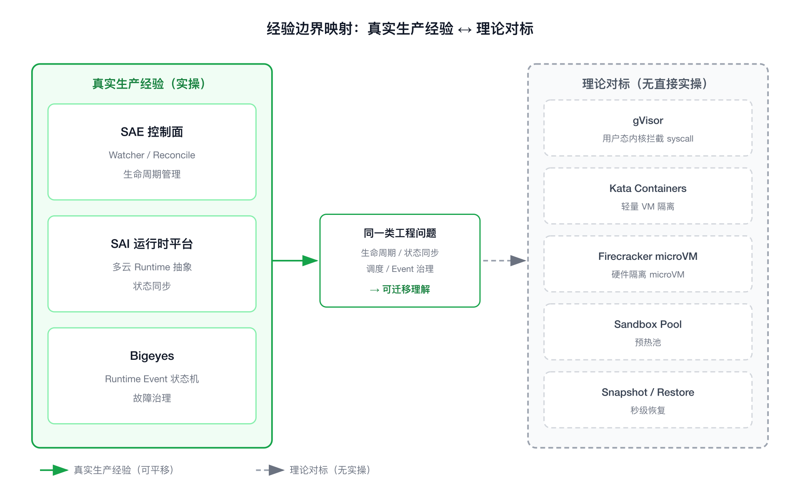
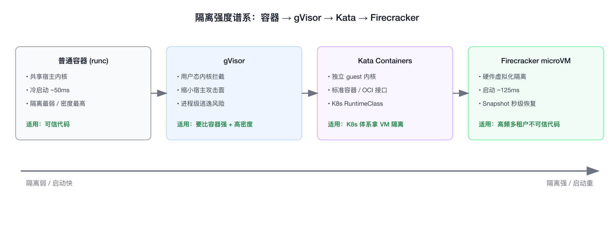
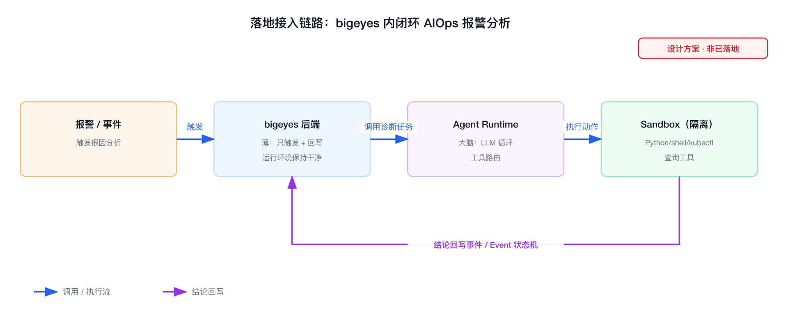

# 理论对标：Agent Sandbox 运行时

```yaml
experience_level:
  sandbox_isolation_runtime: theory_only          # gVisor / Kata / Firecracker 本身没有实操，停留在理论
  runtime_platform_domain: adjacent_production_experience  # SAE / SAI / Bigeyes 处理过同类 Runtime 平台问题
```

> 说明：本文是**理论对标型**面试准备文档。Sandbox 隔离运行时（gVisor / Kata / Firecracker）我没有直接生产落地，归类为 theory_only；但 Sandbox 本质是一种特殊 Runtime，它背后的生命周期管理、状态同步、调度、Event 治理这些工程问题，和我在 SAE / SAI / Bigeyes 的真实经验是同一类。面试时先讲清这条边界，再讲对标理解，不伪装实操。
>
> 技术选型与业界数据为**轻量对标**，未跑完整 benchmark；文中性能数字均为公开资料引用，不是我自己压测的结论。

---

## 经验边界

- **没有直接生产经验**：没有自建过 gVisor / Kata / Firecracker Sandbox 运行时，没有为 Agent 做过秒级启动、Sandbox Pool、Snapshot 这类专用优化。
- **有相邻生产经验**：长期做 Runtime Platform 控制面，处理的是 Runtime 生命周期、状态同步、Reconcile、多集群调度、Runtime Event 治理——和 Sandbox 平台要解决的是同一类工程问题，只是 Runtime 形态和约束不同。
- **没有做过实验**：目前是纯理论 + 业界方案对标，没有本地搭过 Firecracker microVM 或 gVisor Demo。
- **面试声明方式**：开口先说「Sandbox 运行时我没有直接落地过，我是从 Runtime Platform 视角对标理解它」，把自己定位成「理解问题域、能做选型和接入设计的人」，而不是「Sandbox 专家」。



> 左侧绿色实线为真实生产经验（SAE / SAI / Bigeyes，可平移），右侧灰色虚线为理论对标对象（gVisor / Kata / Firecracker / Pool / Snapshot，无直接实操）。

---

## 为什么需要掌握

- **面试高频**：AI Infra / Agent 平台岗位几乎必问「Agent 怎么安全执行任意代码」「怎么做到秒级启动」。
- **和现有经验相邻**：Sandbox 是 Runtime 的一种特例，我做过的生命周期、状态机、调度、Event 治理可以直接迁移理解。
- **能解释托管能力背后的语义**：E2B、Modal、Daytona 这些 Agent Sandbox 产品，本质是把 microVM / 用户态内核包成了「秒级、高频、强隔离」的 Runtime，理解原语才能讲清它们的取舍。
- **支撑后续演进**：如果团队要做 Agent 执行平台，我能从控制面、调度、隔离、成本几个维度给出接入和落地路径。

---

## 它解决什么问题

不是介绍功能，而是按问题域拆开看 Sandbox 到底在解决什么：

- **Agent 要执行不可信代码，但不能威胁宿主**
  - **对应能力**：进程 / 文件系统 / 网络 / 权限隔离，强隔离用 gVisor / Kata / Firecracker。
  - **面试表达**：Agent 生成的 Python / Bash / Node 是不可信输入，普通容器共享宿主内核，逃逸即宿主沦陷，所以需要更强的隔离边界。
- **请求是秒级、高频、突发的，不是长任务**
  - **对应能力**：Sandbox Pool 预热、Snapshot / Restore、Lazy Pull、镜像预热。
  - **面试表达**：训练任务是「小时~天、低频」，Agent 执行是「秒~分钟、极高频」，冷启动延迟直接决定用户体验，必须把启动从「分钟级」压到「百毫秒级」。
- **海量 Sandbox 的创建销毁压垮控制面**
  - **对应能力**：控制面吞吐、轻量调度、状态同步效率、避免每个 Sandbox 都走重型 Pod 调度链路。
  - **面试表达**：创建频率比训练任务高几个数量级，调度器和控制面吞吐成为瓶颈，这点和我在 SAE 做控制面 Reconcile 性能是同一类问题。
- **多租户共享资源，要防止互相影响和成本失控**
  - **对应能力**：Quota、Fair Share、Noisy Neighbor 抑制、Sandbox Reuse、Sleep / Resume。
  - **面试表达**：单用户跑死循环或吃满 CPU/内存不能拖垮别人；闲置 Sandbox 要能挂起释放资源，按需唤醒来控成本。
- **执行有状态、要可观测、要能复用**
  - **对应能力**：会话级文件系统 / 进程保持、Snapshot 持久化、Runtime Event 上报。
  - **面试表达**：Agent 多轮交互需要保留上一轮的文件和环境，又要能观测每个 Sandbox 的生命周期事件——这正好对应我在 Bigeyes 做的 Runtime Event 状态机。

---

## 核心概念

只讲面试要用的，每个概念给定义、解决什么、和我经验的映射、可能被追问的点。

### 隔离强度谱系（容器 → gVisor → Kata/Firecracker）

- **一句话定义**：从共享宿主内核到独占 guest 内核，隔离逐渐变强、启动逐渐变重。
- **解决的问题**：在「隔离强度」和「启动速度 / 开销」之间取平衡。
- **和我经验的映射**：类似我在多云 Runtime 抽象里权衡「兼容性 vs 控制力」。
- **可能被追问**：为什么普通容器不算 Sandbox？答：共享宿主内核，攻击面是整个 Linux 内核，逃逸即宿主沦陷。



> 从左到右隔离逐渐增强、启动开销逐渐变大；性能数字为公开资料引用，非本人压测。

### gVisor

- **一句话定义**：用户态实现的「应用内核」，拦截并代理 syscall，不让应用直接打到宿主内核。
- **解决的问题**：缩小宿主内核攻击面，同时保持接近容器的启动速度和密度。
- **代价**：syscall 经用户态转发有性能损耗，部分系统调用兼容性不全；逃逸属于「进程级逃逸」，理论上仍触碰宿主内核。
- **可能被追问**：gVisor 和真 VM 的隔离差距？答：gVisor 是用户态拦截，宿主内核仍在攻击路径上；Firecracker 是硬件虚拟化，guest 和宿主内核物理隔离。

### Kata Containers

- **一句话定义**：把容器塞进一个轻量 VM，每个 workload 独占 guest 内核，但对外仍是标准容器 / OCI 接口。
- **解决的问题**：用接近容器的使用方式拿到 VM 级隔离，天然适配 Kubernetes（作为 RuntimeClass 接入）。
- **代价**：比纯容器重，启动和内存开销更高。
- **可能被追问**：Kata 和 Firecracker 是竞争关系吗？答：不是，Kata 是「上层框架」，底层 VMM 可以是 QEMU、Firecracker、Cloud Hypervisor，Kata 负责把 microVM 接进容器生态。

### Firecracker（microVM）

- **一句话定义**：AWS 开源的极简 VMM，去掉大部分设备模拟，专为 serverless 设计，启动到用户态约 125ms。
- **解决的问题**：拿到 VM 级硬件隔离的同时，做到接近容器的启动速度和极低内存开销，支持高密度多租户。
- **关键能力**：Snapshot / Restore——预存内核 + 文件系统状态，恢复可到微秒~毫秒级，是「秒级启动」的核心手段。
- **可能被追问**：为什么 serverless 和 Agent Sandbox 偏爱 Firecracker？答：硬件隔离够强、启动够快、内存开销够小，三者同时满足，适合高频多租户不可信代码。GPU 直通（VFIO）也比 gVisor 路径更顺。

### Sandbox Pool / 预热池

- **一句话定义**：提前创建好一批空闲 Sandbox，请求来了直接领取，不走冷启动。
- **解决的问题**：把冷启动延迟从用户路径上摘掉。
- **和我经验的映射**：等价于连接池 / Worker 池思路；和我做 Runtime 生命周期管理里「预创建 vs 按需创建」的权衡同源。
- **可能被追问**：池子多大？怎么补充？答：按 QPS 和启动耗时估算水位，低于阈值异步补池，要防止池过大空耗成本。

### Snapshot / Restore

- **一句话定义**：把一个已初始化好的 Sandbox（内核、内存、文件系统）做成快照，后续从快照秒级拉起。
- **解决的问题**：跳过内核引导和 runtime 初始化，是比 Pool 更省资源的「冷启动消除」手段。
- **可能被追问**：Snapshot 的风险？答：快照里的随机数种子、网络状态、时间可能失真，安全上还要防止跨租户复用同一份带敏感数据的快照。

### Lazy Pull / 镜像加速

- **一句话定义**：不等整个镜像拉完，按需拉取访问到的文件块（如 stargz / nydus）。
- **解决的问题**：镜像拉取是冷启动主瓶颈之一，按需拉取大幅缩短首字节时间。
- **和我经验的映射**：和我关注的镜像分发、启动链路优化同域。

### Sleep / Resume（挂起恢复）

- **一句话定义**：闲置 Sandbox 挂起释放 CPU/内存，下次请求再唤醒。
- **解决的问题**：成本控制，尤其是有状态会话场景下不能直接销毁又不想常驻。
- **可能被追问**：和直接销毁重建的区别？答：Resume 保留会话状态、唤醒更快，但要占存储；销毁重建省存储但丢状态、冷启动慢。

---

## 横向对标：如果让我选隔离方案

> 轻量对标，先给维度再给结论，不下「谁最好」的绝对判断。性能数字为公开资料引用。

评价维度我会看：**隔离强度、冷启动、内存/密度、syscall 兼容性、GPU 支持、生态接入成本**。

- **普通容器（runc）**：冷启动最快（~50ms 级）、密度最高、生态最成熟，但共享宿主内核、隔离最弱。结论：**只适合可信代码或一次性沙箱叠加其他防护**，不适合直接跑不可信 Agent 代码。
- **gVisor**：用户态内核，兼容性和启动速度居中，缩小了攻击面但宿主内核仍在路径上；GPU 直通受限。结论：**在「要比容器强、又要接近容器密度和速度」时合适**，Modal 这类需要 GPU 的平台用 gVisor 容器路线。
- **Kata Containers**：VM 级隔离 + 标准容器接口，K8s 接入最顺（RuntimeClass）。结论：**已有 K8s 体系、想用标准方式拿 VM 隔离时合适**，代价是比容器重。
- **Firecracker microVM**：硬件隔离 + 百毫秒启动 + 极低内存 + Snapshot 秒级恢复。结论：**高频、多租户、不可信代码的首选**，E2B 即基于 Firecracker（公开称冷启动 ~150ms）。代价是要自己处理 VM 编排、网络、镜像。
- **WebAssembly 沙箱**：启动极快、隔离模型干净，但只能跑编译到 WASM 的代码，跑不了任意 Python/Bash 进程树。结论：**适合受限的轻量函数执行，不适合通用 Agent 任意代码**。

产品层对标（公开资料，非我实操）：

- **E2B**：Firecracker microVM，每次执行独占 microVM，冷启动 ~150ms 级，规模化跑 Agent 代码执行。
- **Modal**：gVisor 容器路线，强项是 GPU（按秒计费），适合 Sandbox 内要跑模型的场景。
- **Daytona**：容器 + 可选 Kata/Sysbox 增强隔离，公开宣称冷启动 <90ms。
- **Fly.io（Sprites/Machines）**：microVM，冷启动偏高（数秒级）。

我的选型判断链：**跑不可信任意代码 + 高频多租户 → 优先 Firecracker；需要 GPU 跑模型 → 倾向 gVisor 路线；已有重 K8s 体系且要标准接入 → Kata；纯受信轻量函数 → 容器或 WASM**。没有最新自测数据，我不会下版本级 / 规模级的性能断言。

---

## 如果让我落地，我会怎么设计

以「假设从 0 到 1 做 Agent 执行平台」为前提，不是我已经做过。

1. **技术选型**：默认 Firecracker microVM 承接不可信代码；GPU 场景评估 gVisor；已有 K8s 体系优先 Kata RuntimeClass 接入，先复用生态再谈自建。
2. **接入方式**：控制面提供 `CreateSandbox / Exec / Snapshot / Sleep / Destroy` 这组 API，把 microVM 编排、网络、镜像封装在下面，Agent 只看到「会话 + 执行」抽象。
3. **冷启动优化分层**：镜像预热 + Lazy Pull 解决拉取瓶颈 → Sandbox Pool 摘掉用户路径上的冷启动 → Snapshot/Restore 进一步省资源；按场景组合，不是全都上。
4. **资源治理**：每 Sandbox 设 CPU/内存/磁盘/网络/执行时长上限；租户级 Quota + Fair Share；死循环、OOM、超时要能被快速回收，抑制 Noisy Neighbor。
5. **状态与复用**：有状态会话用 Sleep/Resume 保留环境；无状态执行用一次性 Sandbox 销毁，避免跨租户数据残留。
6. **可观测**：上报 Sandbox 生命周期 Event（创建 / 启动 / 执行 / 挂起 / 销毁 / 异常），做成状态机——这块直接复用我在 Bigeyes 的 Runtime Event 治理思路。
7. **控制面回写**：把启动失败、配额不足、被回收的原因翻译成用户可理解的信息，而不是只丢一个 error——和我在 SAE 把 Reconcile 状态做成可解释信息一致。
8. **风险控制**：灰度接入、隔离方案可回退、默认 runtime 兼容、安全策略（网络出站白名单、禁特权、seccomp/能力裁剪）前置。

### 真实落地场景：让 AIOps 报警分析在 bigeyes 内闭环（设计方案，非已落地）

- **要解决的问题**：bigeyes 是报警/事件平台，报警产生后想自动做根因分析——调诊断工具、查指标/日志/trace、跑脚本或 kubectl。但这套分析逻辑在 bigeyes 内闭不了环：把 agent 装进后端运行环境太重（LLM SDK + 代码执行 + 工具依赖），跑不可信动作还有安全风险；走 moss 又不想要那层耦合和接入方式。
- **sandbox 怎么补这一环**：把 agent 的动作执行放进独立 sandbox runtime，bigeyes 后端只保留「报警触发 → 调一次诊断任务 → 拿结论回写事件」的薄客户端，重依赖和不可信执行都隔离在 sandbox 镜像里，后端运行环境保持干净。
- **链路**：

  ```text
  报警/事件 → bigeyes 后端(薄, 只触发+回写)
                  ↓ 调用诊断任务
            Agent Runtime(大脑: LLM 循环 + 工具路由)
                  ↓ 执行动作
            Sandbox(隔离跑 Python/shell/kubectl/查询工具)
                  ↓ 结论
            回写 bigeyes 事件 / Event 状态机
  ```

  
- **为什么 sandbox 剖面正好契合**：诊断动作=不可信/重依赖代码执行（要隔离）、事件触发=高频突发（要秒级启动）、用完即弃（要快速销毁）——正是 sandbox「秒级、高频、强隔离」的典型场景。
- **绕开 moss 的代价（诚实）**：moss-worker 本身就是 serverless 执行沙箱，ai-gateway 管模型计费/限流；自建 sandbox 某种程度是在重造 moss-worker，自接模型还要补回 ai-gateway 的能力。所以要先确认排斥的是「装进后端这个动作」还是「moss 平台本身」——前者用 moss-worker 远程执行可能就够，后者才有理由自建 sandbox。
- **边界声明**：这是落地设计方案，没有实际建成；面试时我能讲清架构链路和取舍，但不说成已落地系统。

---

## 如果线上出问题，我怎么排查

把 Sandbox 当成一种 Runtime，沿生命周期逐层下钻：

1. **看请求层**：是创建失败、启动慢、执行失败还是回收异常？先定位在哪个阶段。
2. **看控制面**：Sandbox 对象是否创建成功、状态机停在哪一步、Reconcile 有没有报错或积压。
3. **看调度 / 资源**：是不是 Pool 空了走了冷启动、配额不足、节点资源不够、被 Quota 拒绝。
4. **看启动链路**：镜像拉取耗时、Snapshot 恢复是否失败、runtime 初始化是否卡住——冷启动慢通常卡在这层。
5. **看隔离层**：microVM/gVisor 是否启动失败、syscall 兼容性导致进程跑不起来、网络命名空间没配好。
6. **看资源限制触发**：是不是 OOM、CPU 被限流、执行超时被主动 kill、磁盘写满。
7. **看安全策略**：seccomp / network policy / 能力裁剪是否误杀了正常执行。
8. **看 Event 与日志**：拉 Sandbox 生命周期 Event 时间线 + 隔离运行时日志定位根因。
9. **回到平台层**：把根因翻译成用户可读的失败原因，并沉淀成可观测指标和告警。

---

## 和我现有经验的映射（后置）

先把技术点本身讲清楚，再说和真实经验的连接——能连的写真实映射，连不上的不硬挂。

- **Sandbox 生命周期管理**
  - **真实经验映射**：SAE 控制面 Watcher / Reconcile / 生命周期管理。
  - **能怎么说**：Sandbox 的创建-启动-销毁就是一种 Runtime 生命周期，我在 SAE 做的就是这套控制面逻辑，只是对象不同。
- **状态同步 / 多形态 Runtime 抽象**
  - **真实经验映射**：SAI 的 Runtime 生命周期、状态同步、多云 Runtime 抽象。
  - **能怎么说**：我做过把不同形态 Runtime 抽象成统一接口，Sandbox 只是再加一种「秒级强隔离」的 Runtime。
- **Sandbox Event 状态机 / 故障治理**
  - **真实经验映射**：Bigeyes 的 Runtime Event、Event State Machine、故障治理。
  - **能怎么说**：Sandbox 的可观测和异常治理可以直接复用我做 Event 状态机的经验。
- **gVisor / Kata / Firecracker 隔离实现本身**
  - **真实经验映射**：无直接生产映射。
  - **能怎么说**：这是我对标学习的理论知识，不把它包装成项目经验；我能讲清取舍，但没自建过。

---

## 面试话术

### 主回答

Sandbox 运行时我没有直接自建过，这点我先说清楚——gVisor、Kata、Firecracker 我是对标学习的，没有生产实操。但我长期做的是 Runtime Platform 控制面：SAE 的生命周期管理和 Reconcile、SAI 的多云 Runtime 抽象和状态同步、Bigeyes 的 Runtime Event 状态机。Sandbox 本质上就是一种特殊 Runtime，特殊在它要秒级启动、极高频创建销毁、强隔离、对成本极敏感。所以它背后的工程问题——生命周期、调度吞吐、状态同步、可观测、故障治理——和我做过的是同一类。我的理解不停在 API：我能讲清容器到 gVisor 到 microVM 的隔离取舍、冷启动为什么要靠 Pool 和 Snapshot、如果从 0 到 1 落地我会怎么分层做接入和治理。

### 短回答

- **「你用过 Firecracker / gVisor 吗？」**：没有直接生产用过，我是从 Runtime Platform 视角对标理解它的，能讲清它解决什么问题和取舍，但不会假装自建过。
- **「为什么 Agent 不能直接用普通容器？」**：容器共享宿主内核，跑不可信代码逃逸即宿主沦陷，所以要用 gVisor 缩小攻击面、或 Firecracker/Kata 拿 VM 级隔离。
- **「怎么做到秒级启动？」**：镜像预热 + Lazy Pull 解决拉取，Sandbox Pool 摘掉用户路径冷启动，Snapshot/Restore 跳过内核引导和初始化，按场景组合。
- **「如果让你落地怎么做？」**：默认 Firecracker 跑不可信代码，控制面封装成会话+执行 API，冷启动分层优化，资源做 Quota+Fair Share，生命周期 Event 做成状态机回写控制面——后两块直接复用我在 SAE/Bigeyes 的经验。
- **「线上 Sandbox 启动慢怎么排查？」**：沿生命周期下钻——先定位阶段，再看 Pool 是否空、镜像拉取耗时、Snapshot 恢复是否失败、runtime 初始化是否卡住，冷启动慢通常卡在启动链路这层。
- **「它和你们现在的系统什么关系？」**：没有直接生产关联，是我对标学习的方向；但控制面、状态同步、Event 治理这些能力可以平移过来。

---

## 不能怎么说

| 不要这么说 | 风险 | 应该这么说 |
|---|---|---|
| 我们生产用 Firecracker 做了 Agent Sandbox 平台 | 没实操，一追问实现细节就击穿 | 我从 Runtime Platform 视角对标理解 Firecracker，没有直接落地 |
| 我优化了 gVisor 的 syscall 拦截性能 | 没源码没线上证据 | 我理解 gVisor 用户态拦截的取舍，能从工程上解释损耗来源 |
| 我们把冷启动从 1s 压到 150ms | 编造收益数据 | 业界如 E2B 公开冷启动约 150ms；如果落地，我会从 Pool 命中率和 Snapshot 恢复耗时去度量 |
| Sandbox 平台是我主导建设的 | 不实 | 我做的是相邻的 Runtime 控制面，Sandbox 是我能迁移理解和设计的方向 |
| Firecracker 一定比 gVisor 好 | 绝对化、忽略场景 | 在不可信高频多租户下 Firecracker 更合适；要 GPU 跑模型时 gVisor 路线更顺 |

---

## 高频 QA

### 普通容器为什么不算安全 Sandbox

容器共享宿主内核，靠 namespace + cgroup 隔离，但攻击面是整个 Linux 内核，存在内核漏洞就可能逃逸到宿主。跑 Agent 生成的不可信代码风险太高，所以要用 gVisor 缩小攻击面，或 Kata/Firecracker 用独立 guest 内核做 VM 级隔离。

### gVisor 和 Firecracker 的本质区别

gVisor 是用户态「应用内核」，拦截 syscall 不让应用直接打宿主内核，逃逸属进程级，宿主内核仍在攻击路径上；Firecracker 是硬件虚拟化的 microVM，guest 和宿主内核物理隔离，隔离更强但启动和开销略重。gVisor 偏兼容和密度，Firecracker 偏隔离强度。

### Kata 和 Firecracker 是竞争关系吗

不是。Kata 是上层框架，把 microVM 接进容器/K8s 生态（RuntimeClass），底层 VMM 可以是 QEMU、Firecracker、Cloud Hypervisor。Firecracker 是具体的 VMM，可以被 Kata 当后端用。

### 怎么做到秒级甚至百毫秒启动

分层：镜像预热 + Lazy Pull（按需拉文件块）解决拉取瓶颈；Sandbox Pool 提前建好空闲实例摘掉用户路径冷启动；Snapshot/Restore 把初始化好的内核+内存+文件系统做快照，跳过引导和 runtime 初始化，恢复可到毫秒级。按场景组合，不是全上。

### Sandbox Pool 和 Snapshot 怎么选

Pool 是空间换时间，常驻空闲实例占资源但领取最快；Snapshot 是「冻结态」换时间，按需从快照拉起更省常驻资源但恢复要做状态处理。高 QPS 稳定流量用 Pool，突发或长尾用 Snapshot，通常两者结合。

### 多租户怎么防止互相影响

每 Sandbox 设 CPU/内存/磁盘/网络/时长上限；租户级 Quota + Fair Share；死循环、OOM、超时要能快速回收抑制 Noisy Neighbor。安全上禁特权、裁剪能力、网络出站白名单，防止横向影响。

### 有状态会话怎么处理

用 Sleep/Resume：闲置时挂起释放 CPU/内存、保留文件和进程状态，下次请求唤醒，比销毁重建快且不丢状态，代价是占存储。无状态执行则用一次性 Sandbox，执行完销毁避免跨租户数据残留。

### 海量 Sandbox 对控制面的压力怎么解

创建频率比训练任务高几个数量级，重型 Pod 调度链路扛不住。要做轻量调度、控制面吞吐优化、状态同步去重和批处理，避免每个 Sandbox 都走完整重型流程——这和我在 SAE 做控制面 Reconcile 性能是同一类问题。

### 没有生产经验为什么还要学

因为它和我做的 Runtime Platform 是同一问题域。我能把生命周期、状态同步、调度、Event 治理的经验平移过来，理解 Sandbox 的取舍并给出落地设计。面试官问的不是「你背过参数没」，而是「换到 Sandbox 你能不能上手」，这点我答得出。

### 和云厂商托管 Sandbox 的关系

E2B、Modal、Daytona 这些托管产品，本质是把 microVM / 用户态内核包成「秒级、高频、强隔离」的 Runtime 对外提供。理解底层原语（隔离谱系、Pool、Snapshot、Sleep/Resume）才能讲清它们各自的取舍，比如 E2B 走 Firecracker、Modal 走 gVisor 是为了 GPU。

### 落地最大的风险是什么

冷启动和成本的平衡，以及安全隔离不能因为追速度而退化。Pool 开太大空耗成本、Snapshot 复用不当会有跨租户数据残留、为了快用了弱隔离会埋安全雷。所以隔离方案要可回退、安全策略前置、成本和命中率要可观测。

### 哪些地方不应该夸大

不夸大实操——没自建过就说没自建过；不编性能数字——引用业界公开值并标注；不下绝对结论——Firecracker / gVisor 哪个好取决于场景（隔离 vs GPU vs 密度）。
