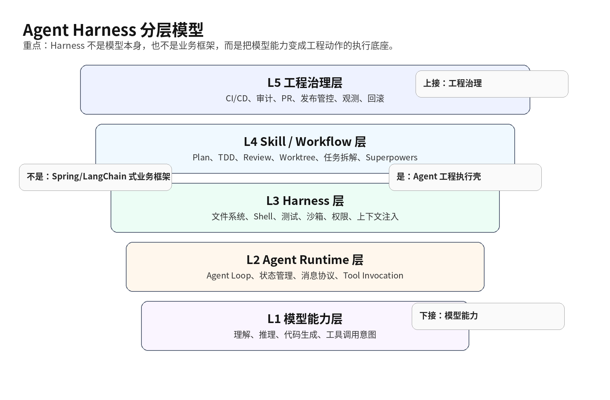
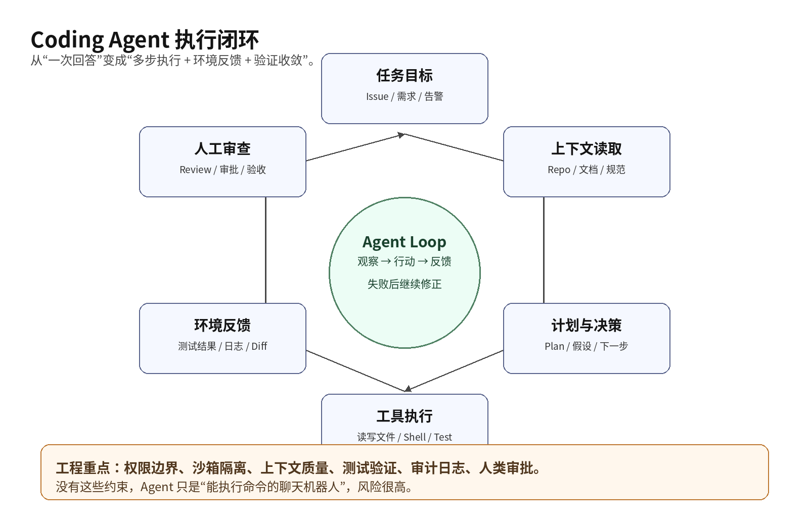
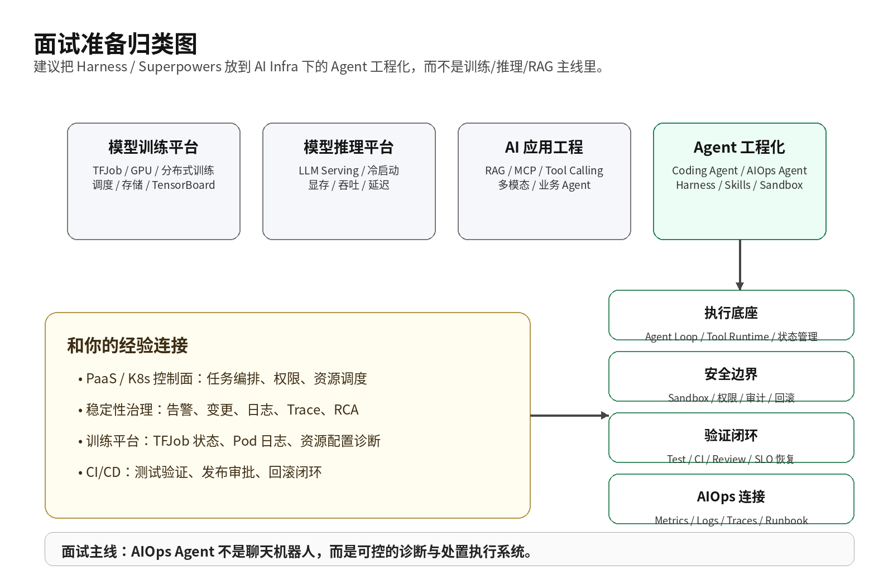

# 面试定位卡

## 这个技术点叫什么

建议命名为：**Agent 工程范式 / Agentic Software Engineering / Coding Agent Harness Engineering**。

在简历或面试准备中，不建议直接写成“熟悉 Harness Engineering”，因为这个词比较新，且不是行业统一术语。更稳妥的表达是：

> 关注 AI Agent 在软件工程和运维场景中的工程化落地，包括 Agent Runtime、工具调用、上下文组织、沙箱执行、测试验证、人类反馈闭环和任务编排。

## 归类位置

| 维度 | 建议归类 | 说明 |
|---|---|---|
| 一级技术方向 | **AI Infra / 平台工程 / DevTools** | 不是模型训练，也不是单纯推理服务，而是模型能力如何接入工程流程 |
| 二级技术方向 | **Agent 工程化 / AI Native SDLC / Agentic Software Engineering** | 关注 coding agent、AIOps agent、研发提效 agent 的运行机制 |
| 和你经历的连接 | **PaaS、CI/CD、AIOps、稳定性治理、平台控制面** | 可以从任务编排、权限边界、沙箱执行、测试验证、观测闭环切入 |
| 经验级别 | **理论对标 + 工程类比 + 可做 Demo** | 不要说生产落地过 Harness Engineering；可以说正在学习和对标 |
| 不建议归类 | LLM 训练、推理优化、RAG 应用开发 | 这些是相关但不是同一层的问题 |

## 一句话判断

**这不是单纯 Prompt Engineering，也不是 LangChain/Dify 那类应用编排框架；它更接近“面向 AI Agent 的软件工程运行时和工程方法论”。**

# 三十秒回答

可以这样答：

> 我会把 Harness Engineering / Superpowers 这类东西归到 Agent 工程范式里。它不是传统意义上的业务开发框架，也不是纯理论，而是围绕 coding agent 怎么可靠完成工程任务形成的一套方法和工具体系。底层包括 agent loop、工具调用、文件读写、命令执行、沙箱、上下文管理、测试验证和权限控制；上层是如何组织 repo、issue、文档、CI、review 和反馈回路。对我来说，它更应该放在 AI Infra 或研发平台工程方向准备，尤其适合连接 AIOps Agent、DevTools、CI/CD 和平台自动化治理。

# 为什么需要它

传统 LLM 编程助手主要是“问答 + 代码补全”。这种模式的边界很明显：

- 模型只能回答，不一定能执行；
- 能生成代码，但不一定能验证；
- 能读一段上下文，但不一定能理解整个 repo；
- 能给出方案，但不一定能完成多步任务；
- 能改代码，但缺少权限、沙箱、回滚、review、CI 等工程边界。

Coding Agent 的目标不是“生成一段代码”，而是完成一个工程任务，例如：

```text
阅读 issue → 理解代码 → 定位问题 → 修改文件 → 执行测试 → 根据失败继续修复 → 输出变更摘要 → 提交 PR
```

这个链路如果只靠聊天窗口，很难稳定。因此需要一套执行底座，也就是 **Agent Harness**。

OpenAI 对 Codex harness 的描述强调，它不是一个普通前端能力，而是支撑 CLI、Web、IDE、macOS app 等 Codex 体验的统一执行逻辑；Codex App Server 通过 JSON-RPC 承载客户端和 Codex core threads 之间的通信，并运行 tool use、streaming progress、thread 管理等能力[^openai-harness]。Codex CLI 仓库也明确说它是一个本地运行的 coding agent[^codex-github]。

# 核心概念表

| 概念 | 准确定义 | 容易误解 |
|---|---|---|
| Agent | 能基于目标自主进行多步行动的模型系统 | 不是所有聊天机器人都是 Agent |
| Coding Agent | 面向软件工程任务的 Agent | 不等于代码补全插件 |
| Agent Loop | 模型观察、决策、调用工具、读取结果、继续执行的循环 | 不只是 ReAct 文本格式 |
| Harness | 让 Agent 能安全执行工程动作的运行壳/执行底座 | 不是纯方法论，也不是 Spring 这种业务框架 |
| Harness Engineering | 围绕 Harness 组织任务、上下文、测试、CI、反馈闭环的方法 | 不是单个 GitHub 项目 |
| Superpowers | 一套给 coding agent 使用的 skills 和软件开发方法论 | 不是底层 runtime，也不是 LangChain 替代品 |
| Skill | 给 Agent 的可复用操作规范、流程和上下文入口 | 不只是提示词，通常包含工作流约束 |
| Sandbox | Agent 执行命令和改文件的隔离环境 | 不是可选装饰，企业落地里很关键 |
| Human-in-the-loop | 人类审查、验收、纠偏、授权 | 不是完全无人值守 |

# 原理模型



可以把 Agent 工程分成五层：

| 层级 | 关注点 | 代表内容 |
|---|---|---|
| L1 模型能力层 | 模型理解、推理、代码生成、工具调用意图 | GPT、Claude、Gemini 等 |
| L2 Agent Runtime 层 | agent loop、状态管理、消息协议、tool invocation | Codex core、Claude Code、Cursor Agent |
| L3 Harness 层 | 文件系统、shell、测试、沙箱、权限、上下文注入 | Codex harness、App Server、IDE/CLI 执行环境 |
| L4 Skill / Workflow 层 | 计划、TDD、review、分支、worktree、任务拆解 | Superpowers、团队自定义 SKILL.md |
| L5 工程治理层 | CI/CD、审计、观测、PR 规范、发布管控 | GitHub、CI、Code Review、AIOps 平台 |

**关键判断：Harness 处在 Runtime 和工程治理之间。** 它不是模型本身，也不是业务代码框架，而是把模型能力转成真实工程动作的中间层。

# 关键机制

## Agent Loop



### 解决的问题

让 Agent 从“一次性回答”变成“多步执行”。

### 工作方式

典型链路：

```text
接收任务
→ 读取上下文
→ 制定计划
→ 调用工具
→ 观察结果
→ 修正计划
→ 修改代码/配置
→ 执行测试
→ 输出总结
```

### 代价

- 执行时间变长；
- 每一步都可能引入错误；
- 上下文污染会放大问题；
- 如果权限边界不清，风险比聊天式 LLM 更高。

### 面试追问

**问：Agent Loop 和普通 Prompt Chain 有什么区别？**

答：Prompt Chain 更像固定流程编排，Agent Loop 更强调基于环境反馈动态决策。Coding Agent 不是简单按模板走，而是根据 shell 输出、测试失败、文件内容继续调整下一步动作。

## Tool Invocation

### 解决的问题

模型本身不会真正操作系统，需要通过工具接口执行真实动作。

### 工作方式

工具可以包括：

- read file；
- write file；
- search code；
- run shell；
- run test；
- inspect git diff；
- create PR；
- query issue；
- fetch logs；
- call internal platform API。

### 代价

工具越强，风险越大。企业落地时必须控制：

- 哪些命令能执行；
- 哪些目录能修改；
- 是否允许联网；
- 是否允许访问凭据；
- 是否允许直接提交或发布。

### 面试追问

**问：为什么说 tool execution 是 coding agent 和普通聊天机器人的分水岭？**

答：因为 coding agent 的价值不在于“告诉你怎么修”，而在于能在受控环境中实际读代码、改代码、跑测试并根据反馈继续修复。没有工具执行，它只是高级问答。

## Sandbox

### 解决的问题

Agent 一旦能执行命令，就必须限制执行边界。

### 工作方式

常见做法：

- 容器隔离；
- 只挂载当前 workspace；
- 禁止或限制网络访问；
- 限制环境变量和密钥；
- 限制危险 shell 命令；
- 使用临时分支或 worktree；
- 执行完成后输出 diff，由人 review。

OpenAI 的 Codex Web 模式中，任务运行在 container 环境里，由 worker provision checked-out workspace 并启动 App Server binary，Web UI 通过后端接收事件流[^openai-harness]。这个模式本质上就是把 Agent 执行动作收敛进可控环境。

### 代价

- 沙箱越严格，Agent 能力越受限；
- 沙箱越宽松，安全风险越高；
- 企业内部场景还要处理代码仓库权限、密钥、内网 API、数据合规。

### 面试追问

**问：为什么 coding agent 落地比普通 AI 问答风险更高？**

答：因为它能执行动作。问答错误通常是认知风险，Agent 执行错误可能直接变成代码变更、数据删除、错误发布或凭据泄露。

## Context Engineering

### 解决的问题

模型上下文窗口有限，repo 信息复杂，不能把所有内容无脑塞给模型。

### 工作方式

需要组织：

- README；
- 架构文档；
- 代码索引；
- issue 描述；
- 任务验收标准；
- 测试入口；
- 代码规范；
- 运行命令；
- 禁止事项；
- 领域背景。

这也是 Superpowers 这类 skills 框架的价值：它不是替代模型，而是通过一组可组合 skills 和初始指令，约束 coding agent 采用更稳定的软件开发流程。Superpowers README 将其描述为 “complete software development methodology for your coding agents”，并支持 Claude Code、Codex CLI、Codex App、Gemini CLI、Cursor、GitHub Copilot CLI 等工具[^superpowers]。

### 代价

- 上下文越多，不等于效果越好；
- 错误文档会误导 Agent；
- repo 缺少测试和规范时，Agent 更容易“看起来完成了，实际不可用”。

### 面试追问

**问：Context Engineering 和 Prompt Engineering 区别是什么？**

答：Prompt Engineering 更偏一次输入怎么写；Context Engineering 更偏系统性组织 Agent 执行任务所需的上下文，包括 repo 结构、规范、测试入口、任务验收和历史反馈。

## Feedback Loop

### 解决的问题

Agent 生成内容必须被验证，否则只是“看起来合理”。

### 工作方式

反馈来源包括：

- unit test；
- integration test；
- lint；
- type check；
- benchmark；
- CI；
- code review；
- runtime log；
- production metrics；
- user acceptance。

对于 coding agent，最关键的不是“能不能生成代码”，而是“失败后能不能根据验证反馈继续收敛”。

### 代价

- 没有自动化测试的项目，Agent 很难稳定；
- 测试慢会显著降低 Agent 迭代效率；
- 测试覆盖不足会让 Agent 产生错误自信。

### 面试追问

**问：为什么说测试体系是 Agent 工程化的地基？**

答：因为 Agent 需要环境反馈来判断自己是否做对。没有测试和 CI，它只能依赖语言模型自评，这在工程场景里不可靠。

# 横向对比

## 和 LangChain / Dify / Eino 的区别

| 维度 | Harness Engineering / Coding Agent | LangChain / Dify / Eino |
|---|---|---|
| 主要对象 | 软件工程任务、代码仓库、工程执行 | 构建 LLM 应用、RAG、工具流、业务 Agent |
| 核心问题 | Agent 如何安全读写代码、执行命令、跑测试、交付 PR | 应用如何调用模型、检索知识、编排工具 |
| 工程对象 | repo、issue、branch、CI、test、PR | prompt、workflow、knowledge base、API tool |
| 运行环境 | 本地 IDE/CLI、云端 sandbox、container workspace | 应用服务、工作流引擎、后端服务 |
| 验证方式 | 编译、测试、lint、review、CI | 用户反馈、业务指标、检索质量、工具调用结果 |
| 更像什么 | AI Native DevTools / Agent Runtime | LLM App Framework |

## 和 Prompt Engineering 的区别

| 维度 | Prompt Engineering | Harness Engineering |
|---|---|---|
| 关注点 | 一次输入如何让模型答得更好 | 整个工程系统如何让 Agent 稳定执行 |
| 典型产物 | prompt 模板、角色设定、Few-shot 示例 | sandbox、tool interface、skills、CI、review flow |
| 是否执行命令 | 通常不执行 | 通常需要执行 |
| 是否涉及权限 | 较少 | 非常关键 |
| 是否能闭环验证 | 弱 | 强，依赖测试和反馈 |

## 和传统 CI/CD 的区别

| 维度 | 传统 CI/CD | Coding Agent Harness |
|---|---|---|
| 输入 | 人提交的代码 | 人描述的任务 + repo 上下文 |
| 执行主体 | pipeline runner | Agent + tool runtime |
| 主要动作 | build/test/deploy | 理解/修改/测试/总结/提交 |
| 决策能力 | 规则驱动 | 模型驱动 + 规则约束 |
| 风险 | 发布失败、环境不一致 | 错误理解、错误修改、越权执行、假阳性验证 |
| 关系 | CI/CD 是验证和交付底座 | Agent Harness 需要接入 CI/CD |

# 典型业务场景



## Coding Agent 研发提效

### 为什么相关

这是 Harness Engineering 最直接的场景。

### 可能任务

- 修复单元测试；
- 重构小模块；
- 补充文档；
- 生成迁移脚本；
- 排查静态扫描问题；
- 给 PR 写 review summary。

### 关键能力

- repo 上下文组织；
- sandbox 执行；
- test feedback；
- git diff review；
- 权限隔离。

## AIOps Agent

### 为什么相关

你准备的阿里云 AIOps Agent 方向，本质上也需要 Agent 工程能力。

AIOps Agent 不是只做对话，它可能需要：

```text
接收告警
→ 拉取监控指标
→ 查询日志/trace
→ 关联变更
→ 判断根因假设
→ 给出处置建议
→ 必要时执行自动化 runbook
→ 记录事件复盘
```

这和 coding agent 的差异是工具对象不同：

| Coding Agent | AIOps Agent |
|---|---|
| 读写代码 | 查询日志、指标、trace、事件 |
| 跑测试 | 验证告警恢复、SLO 是否恢复 |
| 提交 PR | 触发 runbook、扩缩容、回滚、限流 |
| repo 上下文 | CMDB、拓扑、变更、告警规则 |
| code review | 人工审批、值班确认、变更管控 |

### 面试连接

可以这样说：

> 我理解 AIOps Agent 的难点不是简单接一个大模型，而是构建一个可控的执行闭环。它需要工具权限、上下文组织、观测数据接入、runbook 编排、审批机制和执行后的效果验证。这和 coding agent harness 的思想一致，只是工具从代码仓库变成了监控、日志、trace、发布和资源调度系统。

## 内部平台自动化

### 为什么相关

你过去做过 PaaS、K8s、训练任务、稳定性治理，这些都可以和 Agent 工程范式连接。

### 可能落点

- 让 Agent 根据 Deployment/POD/Event 辅助诊断发布失败；
- 让 Agent 根据 TFJob 状态、Pod 日志、TensorBoard 指标给出训练任务卡死分析；
- 让 Agent 根据 HPA/KEDA/ACK 事件解释弹性失败原因；
- 让 Agent 根据 PromQL/ClickHouse 查询辅助生成排障报告；
- 让 Agent 根据变更单、告警和调用链做事件聚合。

### 注意边界

不能说“Agent 直接自动修生产”。更稳的是：

> 先从只读诊断和建议生成做起，再到半自动 runbook，最后才考虑带审批的自动处置。

# Demo 怎么做

## Demo 1：Codex CLI 最小实验

目标：理解 coding agent harness 的基本体验。

```bash
# 安装方式以官方 README 为准
npm install -g @openai/codex

# 进入一个已有 repo
cd your-repo

# 启动 Codex
codex
```

给任务：

```text
阅读项目结构，找出测试失败原因，修复后运行测试，并总结改动。
```

观察重点不是“它写了什么代码”，而是：

- 它如何读取文件；
- 它如何调用 shell；
- 它如何根据失败继续尝试；
- 它如何展示 diff；
- 它如何请求权限；
- 它如何总结结果。

这就是最小 Agent Harness 体验。

## Demo 2：Superpowers Skills 流程实验

目标：理解 skills 如何约束 Agent 工作流。

Superpowers 不是底层 runtime，而是给 Claude Code、Codex CLI、Cursor 等 coding agent 增加一套开发方法论和 skills[^superpowers]。

你可以重点看这些流程：

```text
brainstorming
→ writing plans
→ using worktrees
→ TDD
→ requesting code review
→ wrapping up branches
```

观察重点：

- 它如何把“好习惯”固化成 Agent 可执行的流程；
- 它如何减少 Agent 一上来就乱改代码；
- 它如何把 plan、review、TDD、收尾变成标准动作；
- 它和 Codex/Claude Code 这种执行器是什么关系。

## Demo 3：AIOps Agent 纸面 Demo

不一定要先实现完整系统，可以先做一个纸面架构：

```text
输入：Pod Pending 告警
上下文：Deployment YAML、Pod Event、Node taint、资源 requests、HPA 状态
工具：kubectl describe、PromQL、日志查询、变更查询
输出：根因假设、证据、建议动作、风险等级
审批：只读建议，不直接执行
验证：Pod 是否调度成功，告警是否恢复
```

这个 Demo 更适合面试，因为它和你的经验最贴近。

# 排障路径

## 场景：Coding Agent 改代码不稳定

| 步骤 | 内容 |
|---|---|
| 症状 | Agent 反复修改、测试不过、引入无关改动 |
| 假设 1 | 上下文不足，不理解项目结构 |
| 验证 | 看它是否读取了 README、测试入口、相关模块 |
| 假设 2 | 任务边界太大 |
| 验证 | 看 diff 是否跨很多无关目录 |
| 假设 3 | 缺少验证闭环 |
| 验证 | 看它是否运行 test/lint/type check |
| 假设 4 | 权限太宽或工具太多 |
| 验证 | 看是否执行了无关 shell 命令或改了无关文件 |
| 优化 | 缩小任务、补充验收标准、强制先 plan、限制目录、接入测试 |

## 场景：AIOps Agent 诊断结果不可信

| 步骤 | 内容 |
|---|---|
| 症状 | Agent 给出根因，但证据不足 |
| 假设 1 | 只读了告警，没有读变更、拓扑、日志、trace |
| 验证 | 检查工具调用记录 |
| 假设 2 | 缺少标准 runbook |
| 验证 | 看是否有明确诊断步骤和判断阈值 |
| 假设 3 | 没有区分事实、假设和建议 |
| 验证 | 输出是否把“推测”包装成“结论” |
| 假设 4 | 缺少人类审批边界 |
| 验证 | 是否存在自动执行高危动作 |
| 优化 | 强制输出证据链、置信度、下一步验证命令、审批等级 |

# 风险、边界和误区

## 误区 1：把 Harness Engineering 当成一个固定框架

错误说法：

> Harness Engineering 是一个类似 Spring 的框架。

更准确：

> Harness Engineering 是 Agent 工程方法；Codex harness 这类系统是具体执行底座；Superpowers 是 skills/workflow 层方法论。

## 误区 2：把 Superpowers 当成 LangChain 替代品

Superpowers 不是主要用来开发 LLM 应用的 SDK，而是给 coding agent 加一套开发流程和 skills。它更像“Agent 工作规范包”，不是“业务 Agent 框架”。

## 误区 3：把 Agent 落地理解成接一个大模型

Agent 工程的核心不是调用模型 API，而是：

- 工具；
- 权限；
- 上下文；
- 状态；
- 沙箱；
- 验证；
- 观测；
- 人类审批；
- 回滚机制。

## 误区 4：忽略安全边界

Agent 一旦能执行命令，就不能只按“问答系统”管理。至少要考虑：

- 命令白名单；
- 文件修改范围；
- 网络访问；
- 凭据隔离；
- 审计日志；
- 高危动作审批；
- 执行结果回滚。

## 误区 5：把理论对标说成生产经验

你目前更稳的表达是：

> 这个方向我还没有完整生产落地，但我能把它和已有平台工程经验连接起来理解。比如 AIOps Agent 需要工具权限、上下文、runbook、审批和验证闭环；这些和 coding agent harness 的关键机制是同构的。

# 和项目的安全连接

## 可以连接的项目方向

| 你的经验 | 可以连接的 Agent 工程点 |
|---|---|
| SAI 训练任务平台 | Agent 辅助分析 TFJob 卡死、Pod 状态、PS/Worker 日志、资源配置 |
| ACK/K8s 平台 | Agent 辅助解释调度失败、HPA/KEDA 不生效、Pod Pending、节点污点 |
| 稳定性治理 | Agent 聚合告警、变更、日志、trace，生成 RCA 初稿 |
| OTel / Trace | 给 AIOps Agent 提供证据链上下文 |
| CI/CD / 发布平台 | 让 coding agent 接入测试、review、变更审批和回滚链路 |
| 资源治理 | Agent 辅助做容量水位判断、风险提示、扩缩容建议 |

## 面试可讲边界

可以说：

> 我把它作为 AI Infra 和 AIOps Agent 的工程范式来准备。核心不是模型训练，而是模型能力如何变成可控的工程执行系统。我的平台经验可以迁移到这个方向，比如任务编排、权限边界、观测数据、自动化 runbook、审批机制、执行结果验证。

不要说：

> 我们已经在生产大规模落地 Harness Engineering。

除非确实有真实项目，否则这个说法风险很高。

# 面试追问树

```text
Q1：Harness Engineering 是什么？
 ├─ A：Agent 工程方法，不是单一框架
 ├─ 追问：那 Harness 是不是理论？
 │   └─ 不是，方法论背后有 Codex harness / App Server / CLI 等工程实现
 ├─ 追问：和 Prompt Engineering 区别？
 │   └─ Prompt 管输入，Harness 管执行闭环
 └─ 追问：和 LangChain 区别？
     └─ LangChain 偏 LLM 应用开发，Harness 偏 coding agent 工程执行

Q2：Superpowers 属于哪类？
 ├─ A：Skills/workflow 层框架
 ├─ 追问：是不是 Agent runtime？
 │   └─ 不是，它依赖 Claude Code/Codex/Cursor 等执行器
 └─ 追问：价值是什么？
     └─ 把 plan、TDD、review、worktree 等流程固化给 Agent

Q3：企业落地最大难点？
 ├─ 权限边界
 ├─ 上下文质量
 ├─ 验证闭环
 ├─ 审计与回滚
 └─ 人类审批机制

Q4：和 AIOps Agent 怎么连接？
 ├─ Coding agent 操作代码仓库
 ├─ AIOps agent 操作监控/日志/trace/发布平台
 └─ 两者都需要 tool、context、sandbox、feedback、approval
```

# 高频 Q&A

## Q1：这算 Agent 工程范式吗？

算。更完整的名字是 **Agentic Software Engineering** 或 **Agent 工程化范式**。如果放在面试知识体系里，建议归到 **AI Infra / DevTools / AIOps Agent 工程化**。

## Q2：它是不是方法论，所以就是理论？

不是。方法论不等于纯理论。DevOps 也是方法论，但背后有 CI/CD、GitOps、监控、发布平台等工具。Harness Engineering 也是类似：上层是方法论，下层需要 Agent runtime、工具执行、沙箱、上下文、CI 和 review 系统。

## Q3：Harness 是不是某个语言写的框架？

不建议这么理解。具体实现当然会用某些语言写，但 Harness 的概念不是“给业务代码 import 的语言框架”。它更像 Agent 执行任务的运行壳。

## Q4：Codex CLI 是 demo 吗？

是最直接的 demo。Codex CLI 是 OpenAI 官方开源的本地 coding agent，可以在本地 repo 中让 Agent 读代码、改文件、跑命令、总结变更[^codex-github]。

## Q5：Superpowers 和 Codex harness 是什么关系？

Codex harness 更偏执行底座；Superpowers 更偏 skills 和工作流规范。可以粗略理解为：

```text
Codex / Claude Code / Cursor = Agent 执行器
Superpowers = 给执行器安装的软件工程技能包
Harness Engineering = 设计这些执行器、技能、上下文、验证闭环的方法
```

## Q6：它和 MCP 是什么关系？

MCP 更偏工具/资源接入协议，让模型或 Agent 能访问外部系统。Harness Engineering 更大，除了工具接入，还包括沙箱、上下文、任务状态、执行循环、测试验证、权限和人类反馈。

## Q7：它和 AIOps Agent 的关系是什么？

AIOps Agent 可以借鉴同一套范式：

```text
目标 → 工具调用 → 数据观察 → 假设 → 验证 → 建议/执行 → 反馈
```

只是工具对象从 repo/test/PR 变成了 metrics/logs/traces/change/runbook。

## Q8：面试时要不要讲得很新潮？

不要。更稳的讲法是：

> 我关注的是 Agent 工程化落地，不是堆新名词。一个可靠 Agent 系统至少要解决工具权限、上下文、沙箱、验证、人类审批和观测闭环。否则它只是一个会调用工具的聊天机器人。

## Q9：这个技术点适合写进简历吗？

如果没有真实落地，不建议作为项目经历写。可以放在：

- 技术准备；
- 个人学习方向；
- 面试扩展话题；
- AIOps Agent 方案设计；
- AI Infra 未来演进理解。

## Q10：如果面试官问“你做过吗？”怎么答？

可以这样说：

> 完整的 coding agent harness 我没有生产落地过，但我做过平台控制面、任务编排、K8s 资源治理、可观测和自动化运维，这些能力和 Agent 工程化有很强的迁移关系。如果落到 AIOps Agent，我会先从只读诊断和证据链生成开始，再接入半自动 runbook，最后才考虑带审批的自动执行。

# 三档背诵版

## 三十秒

Harness Engineering 可以理解为 Agent 工程范式。它不是纯理论，也不是传统业务框架，而是让 coding agent 能可靠执行工程任务的一套方法和执行底座。底层包括 agent loop、工具调用、文件读写、shell 执行、沙箱、上下文管理和测试验证；上层包括 repo 规范、任务拆解、CI、review 和人类反馈。Superpowers 更偏 skills/workflow 层，Codex harness 更偏 runtime/harness 层。

## 三分钟

我会把这个方向放在 AI Infra 或 DevTools 下面，而不是模型训练或推理优化下面。原因是它解决的问题不是模型怎么训练得更强，而是模型能力如何在工程系统里安全、稳定、可验证地执行。比如 coding agent 要完成一个 issue，不能只生成代码，它要读 repo、理解上下文、修改文件、执行测试、根据失败继续修复，最后输出 diff 和总结。要做到这一点，就需要 harness：工具接口、沙箱、权限、上下文注入、状态管理、测试反馈和 review 机制。Superpowers 这类项目则是在 skills 层约束 Agent 的工作流，比如先 brainstorm、再 plan、再 TDD、再 review，避免 Agent 直接乱改。

## 五分钟

我理解 Agent 工程范式可以分成几层：最底层是模型能力，往上是 Agent Runtime，负责 agent loop 和状态管理；再往上是 Harness，负责工具调用、文件系统、shell、测试、沙箱和权限；再往上是 Skills 或 Workflow，负责把团队的软件工程习惯固化成 Agent 可执行的流程；最上层是工程治理，包括 CI/CD、审计、Code Review、变更审批和观测。

这个方向和 AIOps Agent 也能连接。Coding Agent 的工具是代码仓库、测试和 PR；AIOps Agent 的工具是监控、日志、trace、变更系统、CMDB 和 runbook。两者的共同点是都需要可控执行闭环：先获取上下文，再调用工具，再基于结果形成判断，再经过验证和审批。对企业来说，真正难点不是接大模型 API，而是权限边界、上下文质量、验证闭环、审计回滚和人类审批。

我不会把这个包装成已经生产落地过的经验，而是作为 AI Infra / AIOps Agent 的理论对标型技术点来准备。结合我的平台经验，可以讲如何从只读诊断开始，逐步发展到半自动 runbook，再到带审批的自动处置。

# 准备优先级

## 你应该放到哪块技术准备

建议放在你的面试知识体系里这个位置：

```text
AI Infra
├── 模型训练平台：TFJob / GPU / 分布式训练 / 存储 / 调度
├── 模型推理平台：LLM serving / 冷启动 / 显存 / 调度 / 观测
├── AI 应用工程：RAG / Tool Calling / MCP / 多模态应用
└── Agent 工程化：Coding Agent / AIOps Agent / Harness / Skills / Sandbox / Feedback Loop
```

如果面试岗位是 **AIOps Agent 工程师**，这个技术点优先级不低，但不要喧宾夺主。它应该服务于下面这条主线：

> AIOps Agent 不是聊天机器人，而是一个可控的诊断与处置执行系统。

## 面试中怎么切入

最自然的切入点：

1. 面试官问 AIOps Agent 怎么做；
2. 你先讲数据源：metrics、logs、traces、events、changes、CMDB；
3. 再讲工具层：查询、诊断、runbook、审批；
4. 再讲 Agent Harness：tool calling、权限、上下文、状态、验证；
5. 最后讲风险：误操作、幻觉、权限越界、证据不足、回滚。

不要一上来就讲 Harness Engineering 这个名词。先讲问题，再引出范式。

# 资料来源

[^openai-harness]: OpenAI, “Unlocking the Codex harness: how we built the App Server”, 2026-02-04. 文章说明 Codex App Server 使用 JSON-RPC，承载 Codex core threads，并支撑 CLI、Web、IDE、macOS app 等 Codex 体验。https://openai.com/index/unlocking-the-codex-harness/

[^codex-github]: OpenAI Codex GitHub README. README 描述 Codex CLI 是本地运行在用户电脑上的 coding agent。https://github.com/openai/codex

[^superpowers]: obra/superpowers GitHub README. README 描述 Superpowers 是面向 coding agents 的 complete software development methodology，基于可组合 skills 和初始 instructions，并支持 Claude Code、Codex CLI、Codex App、Cursor、Gemini CLI 等。https://github.com/obra/superpowers
