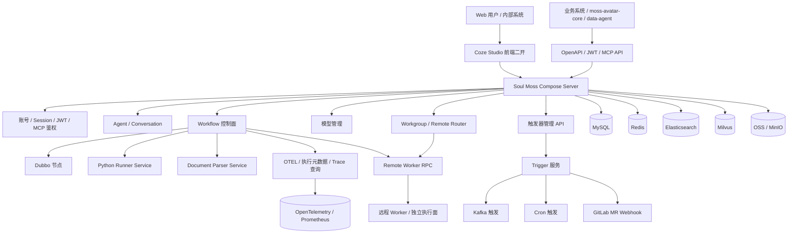

# Soul-Moss-Compose 项目总结：基于 Coze Studio 的企业私有化二开
> 基于本地源码 `/opt/coding/code.soulapp-inc.cn/arch/soul-moss-compose` 梳理。本文的“开源版本”对比口径是私有仓库内的 `origin/main-github` 基线，而不是对 Coze Studio 最新官方 `main` 的全面评测。
>

---

## 一、约 90 秒开场白
`soul-moss-compose` 是公司内部基于 **Coze Studio** fork 出来的 Agent / Workflow 平台。它不是简单换一套皮肤，而是在开源 Agent IDE、工作流编排、知识库、插件和对话能力的基础上，补齐了企业内真正落地需要的几类能力：**内部登录与权限、企业 OpenAPI、模型管理、触发器、工作组与远程 Worker、Dubbo 节点、执行链路观测、Python 执行与文档解析服务化**。

开源 Coze Studio 更像一个通用的一站式 AI Agent 开发平台；`soul-moss-compose` 的二开方向是把它变成公司内部可治理、可集成、可运维的 **Agent / Workflow 控制面**。它对外提供 Web 控制台和 `/v1`、`/v3`、`/api/openapi/workflow` 等 OpenAPI，对内适配 Soul 域名、Harbor 镜像、Nginx、OpenTelemetry、Prometheus、Dubbo/Nacos、OSS、Kafka、远程 Worker 和数据链路。

我会把这个项目概括成三句话：

1. **私有化适配**：把开源 Coze Studio 接到公司内部账号、域名、鉴权、部署、日志、指标、OpenAPI 和运维体系里。
2. **能力增强**：补了模型管理、触发器、工作组、远程执行、Dubbo 工作流节点、执行历史与 Trace 查询、MCP 工具绑定等开源基线没有的功能。
3. **平台化改造**：把单体式本地运行能力拆成主服务、Trigger 服务、Python Runner、Document Parser、RPC Worker 等多运行面，使 Agent / Workflow 能支撑更多内部业务系统调用。

---

## 二、对比基线与证据范围
本次梳理主要按下面的本地 Git 对比得出：

```bash
git diff --stat origin/main-github...main
git log --no-merges origin/main-github..main
```

当前差异规模约为：

| 对比项 | 结果 |
| --- | --- |
| 开源基线 | `origin/main-github` |
| 当前私有主干 | `main` / `origin/main` |
| 文件变化 | 588 个文件 |
| 新增代码 | 约 81,511 行 |
| 删除代码 | 约 3,636 行 |

变化最集中的目录包括：

| 目录 | 主要含义 |
| --- | --- |
| `backend/api/handler/coze`、`backend/api/router/coze` | 新增模型、触发器、工作组、OpenAPI、观测等接口 |
| `backend/domain/workflow`、`frontend/packages/workflow` | 工作流能力增强、Dubbo 节点、执行历史和 Trace UI |
| `backend/domain/modelmgr`、`frontend/packages/model-management` | 模型管理、模板管理、触发器管理页面 |
| `backend/domain/workgroup`、`backend/rpc` | 工作组、远程 Worker、跨服务 RPC 路由 |
| `trigger/` | 独立触发器系统 |
| `python-runner-service/`、`python-parser-service/` | Python 执行与文档解析服务化 |
| `backend/pkg/dubbo` | 内部 Dubbo 调用能力 |

---

## 三、项目定位
### 3.1 开源 Coze Studio 原始能力
Coze Studio 原本提供的是通用 AI Agent 开发平台能力：

+ Agent 可视化搭建
+ Workflow 编排
+ 插件系统
+ 知识库 / RAG
+ 多模型接入
+ 对话、文件上传、发布和调试

这些能力解决的是“怎么搭一个 Agent / Workflow”。

### 3.2 Soul 私有 fork 的目标
`soul-moss-compose` 解决的是另一个层次的问题：**怎么让这些 Agent / Workflow 在公司内部稳定运行、被其他系统调用、被管理员治理、被工程团队排障**。

所以它的改造重点不是“多写几个页面”，而是把开源项目变成内部平台：

+ 对接公司账号、邮箱、超管、Session、JWT/OpenAPI 鉴权。
+ 对接公司域名、Nginx、Harbor、环境变量、测试/生产部署形态。
+ 对接 Dubbo/Nacos、Kafka、OSS、Data Agent、moss-avatar-core 等内部系统。
+ 补充模型配置治理、触发器治理、工作组与远程 Worker 调度。
+ 把 Workflow 的运行过程、节点输入输出、工具调用、LLM 调用、Trace 和标签沉淀成可查询数据。

---

## 四、总体架构


---

## 五、做了哪些私有化改动 / 二开
### 5.1 企业账号、鉴权与权限体系
这部分把开源的账号体系改造成公司内部可控入口。

+ **公司邮箱注册限制**：注册入口只允许 `@soulapp.cn` 邮箱，避免开放式注册。
+ **域账号登录**：支持按用户名登录，Session 写 Cookie，便于内部 Web 控制台使用。
+ **超管白名单**：新增 `IsSuperAdmin`，内置公司账号白名单，并支持 `SUPER_ADMIN_NAMES` 环境变量扩展；模型创建、触发器创建等高危操作走超管判断。
+ **OpenAPI JWT 鉴权**：新增 `Authorization: Bearer <token>` 解析，Token 里承载 `name` / `real_user_id` / `bot_id`，用于 B 端域账号或 C 端真实用户身份。
+ **MCP 鉴权**：新增 `Mcp-User`、`Mcp-Token` 等 Header 鉴权逻辑，支撑 MCP 方式创建、更新、发布 Agent。
+ **外部依赖路径保护**：对 `moss-avatar-core` 依赖的 `/api/openapi/workflow/*` 和部分 `/api/workflow_api/*` 路径加了明显注释，说明这些接口是内部系统契约，不能随意改删。

关键代码：

+ `backend/api/handler/coze/passport_service.go`
+ `backend/infra/userutil/is_admin.go`
+ `backend/api/middleware/openapi_auth.go`
+ `backend/pkg/jwt/jwt.go`
+ `backend/api/middleware/mcp.go`

### 5.2 公司部署与运行环境适配
私有 fork 补了大量从本地开源 Demo 到公司内网服务所需的运行配置。

+ **环境分层**：通过 `SOUL_ENV`、`ENV_FILE` 加载 `.env.test`、`.env.prod`、`.env.*-work-*` 等环境文件。
+ **内部域名**：Nginx 配置中出现 `test-moss-compose.soulapp-inc.cn`、`prod-moss-compose-server.soulapp-inc.cn`、`moss-compose.soulapp-inc.cn` 等公司域名。
+ **镜像仓库**：前端构建脚本适配 `harbor.soulapp-inc.cn/sae/soul-moss-front`。
+ **请求体上限**：通过 `MAX_REQUEST_BODY_SIZE` 支持大文件、大 JSON 请求。
+ **Swagger 内部化**：主服务中动态配置 Swagger Host、BasePath、Schemes，并过滤只展示 OpenAPI 相关路径。
+ **Metrics / pprof**：启动统一 Prometheus `/metrics` 端点，并支持按环境开启 pprof。

关键代码：

+ `backend/main.go`
+ `nginx/test/*.conf`
+ `nginx/prod/*.conf`
+ `podman-build-front-image.sh`
+ `backend/.env.*`

### 5.3 内部基础设施适配
相比开源默认依赖，私有版本接入了更多公司实际业务基础设施。

+ **Dubbo / Nacos**：新增 Dubbo 调用包和 Workflow Dubbo 节点，用于在工作流里直接调用内部 RPC 服务。
+ **Kafka Topic 改写**：支持按环境或自定义后缀改写 topic，适配多环境消息隔离。
+ **OSS 公网访问**：把 OpenAPI 文件存储适配为阿里云 OSS 公网访问方式。
+ **内部模型源**：扩展 ARK、DeepSeek、Qwen、Gemini 等模型配置和管理逻辑，并把模型从静态配置推进到数据库和页面可管。
+ **Data Agent**：新增 data-agent 分支选择、心跳输出、Bot ID 配置和输出结构适配。

关键代码：

+ `backend/pkg/dubbo/`
+ `backend/domain/workflow/internal/nodes/dubbocaller/`
+ `backend/infra/impl/eventbus/kafka/`
+ `backend/infra/impl/storage/public/ali.go`
+ `backend/resources/conf/model/teamplate.sql`

### 5.4 运行面拆分：从单体能力到可独立扩展服务
私有版本把部分原本在主进程内执行的能力拆成服务，降低调试和扩展成本。

+ **Python Runner Service**：把工作流 Code 节点的 Python 执行从 `exec.Command` / pipe 模式拆成 FastAPI 服务，主服务通过 `PYRUNNER_SERVICE_URL` 调用。
+ **Document Parser Service**：把 PDF / DOCX 解析拆成 FastAPI 服务，主服务通过 `DOCUMENT_PARSER_SERVICE_URL` 调用，失败可回退到原脚本模式。
+ **Remote Worker RPC**：新增 JSON-RPC 风格的远程调用层，把 workflow、database、rdb 等能力按 workgroup 路由到远程 worker。
+ **多 DB 路由**：支持 run record、workflow execution、node execution 等数据走远程 worker 数据库。

关键代码：

+ `python-runner-service/`
+ `python-parser-service/`
+ `backend/rpc/`
+ `backend/domain/workflow/service/remote.go`
+ `backend/domain/memory/database/service/remote.go`
+ `backend/infra/impl/mysql/multi_db.go`

### 5.5 可观测、排障与运维增强
私有 fork 把 Workflow 执行过程从“只能看最终结果”扩展为“可查执行历史、节点详情和 Trace”。

+ **OpenTelemetry 接入**：主服务初始化 OTEL Provider，工作流运行、LLM 调用、RPC 调用都增加 Trace / Span。
+ **业务标签**：支持通过 `X-Execution-Tags` Header 注入业务标签，例如 `user_id`、`bot_id`、`scene`。
+ **执行元数据**：新增 `workflow_execution_metadata` 表，只存 trace_id、span_id、workflow_id、status、tags 等索引字段，完整详情放 Trace。
+ **Trace 查询接口**：新增 `list_spans`、`get_trace`、`list_execution_metadata`、`batch_list_execution_metadata` 等接口。
+ **前端观测页面**：Workflow Header 里新增观测入口、执行历史抽屉、Trace Viewer、执行详情页。
+ **Python Runner 指标**：Python Runner 暴露 Prometheus 指标，支持多 worker 聚合。

关键代码：

+ `backend/trace.MD`
+ `backend/pkg/execution/tags.go`
+ `backend/application/workflow/execution_metadata_repository.go`
+ `backend/domain/workflow/entity/execution_metadata.go`
+ `frontend/packages/workflow/playground/src/components/workflow-header/components/observability-button/`
+ `python-runner-service/app/prometheus_multiproc_metrics.py`

---

## 六、增加了哪些开源基线没有的功能
### 6.1 模型管理与模板管理
开源基线主要通过配置文件管理模型；私有版本新增了完整的模型治理面。

+ 后端新增 `modelmgr` 领域：模型、模板、YAML 解析、数据库持久化、状态管理。
+ 前端新增 `@coze-arch/model-management` 包：模型列表、模板列表、YAML 创建/编辑、模板选择器、状态切换。
+ 支持按空间 `space_id` 管理模型，公共模型和空间模型可以区分。
+ 支持模型状态：默认、使用中、待下线、已下线。

关键代码：

+ `backend/domain/modelmgr/`
+ `backend/application/modelmgr/`
+ `backend/api/handler/coze/model_service.go`
+ `frontend/packages/model-management/`

### 6.2 触发器系统
私有版本新增独立 `trigger/` 模块，用于把外部事件自动转成 Agent 执行。

+ 支持 **Cron 定时触发**。
+ 支持 **Kafka 消息触发**。
+ 支持 **GitLab Merge Request Webhook**，可把 MR diff 转成 Markdown 后触发 Agent。
+ 使用 MySQL 存储触发器配置和分布式锁，避免多实例重复执行。
+ Web 控制台新增触发器管理页面，支持列表、创建、编辑、启停、删除和立即触发。
+ 立即触发会根据 `SOUL_ENV` 选择测试或生产 Coze API 网关。

关键代码：

+ `trigger/`
+ `backend/api/handler/coze/trigger_service.go`
+ `frontend/packages/model-management/src/pages/trigger-management-page.tsx`
+ `frontend/packages/model-management/src/services/trigger-api.ts`

### 6.3 Workgroup 与远程 Worker
这是私有版本里比较关键的平台化改造：把空间、Workflow、Database 等资源绑定到工作组，再按工作组路由到不同 worker。

+ 新增 `workgroup` 表和 `workgroup_reference` 表。
+ 工作组包含 `cluster`、`namespace`、`worker_name`、`host`、`domain_host` 等字段。
+ 创建空间时可以选择 workgroup，并把空间名称按 `工作组/空间名` 组织。
+ 前端请求会根据空间关联的 workgroup 查 `domain_host`，动态改写请求目标域名。
+ 后端通过 `remote.Adapter` 判断资源是否需要走远程 RPC。
+ Workflow、Database、RDB 等能力新增远程 client/server/router。

关键代码：

+ `backend/domain/workgroup/`
+ `backend/api/handler/coze/workgroup_service.go`
+ `backend/rpc/remote/adapter.go`
+ `backend/rpc/server/`
+ `backend/rpc/client/`
+ `frontend/apps/coze-studio/src/pages/space-admin.tsx`
+ `frontend/packages/agent-ide/chat-area-provider/src/hooks/use-workgroup-base-url.ts`

### 6.4 Workflow Dubbo 节点
私有版本新增了面向内部服务调用的 Workflow 节点：`DubboCaller`。

+ 后端新增 `NodeTypeDubboCaller`，可在工作流执行时调用 Dubbo RPC。
+ 支持配置环境、接口名、方法名、版本、分组、参数、超时和重试次数。
+ 前端新增 Dubbo 节点注册表、表单、参数编辑组件和节点渲染。
+ 底层接入 `dubbo-go`，适配内部 Dubbo / Nacos 服务发现。

关键代码：

+ `DUBBO_NODE_SETUP.md`
+ `backend/domain/workflow/internal/nodes/dubbocaller/dubbo_caller.go`
+ `backend/pkg/dubbo/`
+ `frontend/packages/workflow/playground/src/node-registries/dubbo/`
+ `frontend/packages/workflow/base/src/types/node-type.ts`

### 6.5 Workflow OpenAPI、执行历史与 Trace 查询
私有版本补齐了外部系统运行 Workflow 和排查 Workflow 的接口。

+ `/v1/workflow/run`、`/v1/workflow/stream_run`、`/v1/workflow/stream_resume`
+ `/v1/workflow/get_run_history`、`/v1/workflow/get_process`、`/v1/workflow/node_debug`
+ `/api/workflow_api/list_execution_metadata`
+ `/api/workflow_api/batch_list_execution_metadata`
+ `/api/workflow_api/list_execution_metadata_by_tags`
+ `/api/workflow_api/list_spans`
+ `/api/workflow_api/get_trace`

这些接口让 Workflow 可以被业务系统当作后端能力调用，而不只是在页面里手动调试。

关键代码：

+ `backend/api/handler/coze/workflow_service.go`
+ `backend/api/router/coze/api.go`
+ `backend/application/workflow/execution_detail_helper.go`
+ `frontend/packages/workflow/playground/src/components/workflow-header/components/workflow-tabs/`

### 6.6 MCP 工具绑定与 Agent Skill 管理
私有版本围绕 MCP 做了大量 Agent 侧增强。

+ 新增 `/mcp/v1/draftbot/*` API，用于 MCP 场景创建、更新、发布 Agent。
+ Agent IDE 的 LLM 节点支持 MCP 工具选择。
+ 新增 MCP Server 工具列表、Agent MCP 绑定、MCP Token 和权限校验。
+ 前端新增 `mcp-selection` 相关 UI。

关键代码：

+ `backend/api/router/mcp/api.go`
+ `backend/api/handler/coze/mcp.go`
+ `backend/api/handler/coze/mcp_tools.go`
+ `backend/domain/mcp/`
+ `frontend/packages/workflow/playground/src/nodes-v2/llm/skills/mcp-selection.tsx`

### 6.7 Agent 管理、版本恢复与发布能力增强
私有版本增强了 Agent 的协作与版本治理。

+ DraftBot 支持指定版本恢复。
+ 新增 Agent Manager：添加、移除、列表和权限检查。
+ 新增发布 Bot 列表 OpenAPI：`/v1/bots/published`。
+ 发布接口扩展 `space_id`、loop prompt repo、agent detail 等字段。
+ 支持 Agent URL 上传和文件上传限制调整。

关键代码：

+ `backend/application/singleagent/agent_manager.go`
+ `backend/domain/agent/singleagent/entity/agent_manager.go`
+ `backend/api/handler/coze/published_bots.go`
+ `frontend/packages/agent-ide/layout-adapter/src/component/agent-manager-list/`

### 6.8 Python 执行与文档解析服务化
开源基线里很多 Python 能力更偏本地脚本调用；私有版本把它们拆成可独立部署的服务。

+ `python-runner-service`：执行 Python 代码，提供 `/run/python` 和 `/health`。
+ `python-parser-service`：解析 PDF / DOCX，提供 `/parse/pdf`、`/parse/docx` 和 `/health`。
+ 主服务通过环境变量选择 HTTP 模式，异常时可回退到原脚本模式。
+ Runner 增加 OpenTelemetry、Prometheus、多 worker 指标聚合、压测脚本。

关键代码：

+ `python-runner-service/README.md`
+ `python-parser-service/README.md`
+ `backend/infra/impl/coderunner/remote/runner.go`
+ `backend/infra/impl/document/parser/builtin/py_parser_protocol.go`

### 6.9 插件授权与访问控制
私有版本新增插件级访问关系。

+ 新增 `plugin_access` IDL 和后端 DAL。
+ API 支持 `create_plugin_access`、`delete_plugin_access`。
+ 前端插件页面新增授权弹窗。
+ 用于控制某些插件在指定 Bot / Agent / 用户范围内的可见和可用关系。

关键代码：

+ `idl/plugin/plugin_access.thrift`
+ `backend/domain/plugin/internal/dal/model/plugin_access.gen.go`
+ `backend/api/handler/coze/plugin_develop_service.go`
+ `frontend/packages/agent-ide/bot-plugin/*/plugin-authorize-modal/`

---

## 七、最值得讲的项目亮点
### 亮点 1：从开源 Agent IDE 到内部 Agent / Workflow 控制面
这个项目的核心价值不是 fork 了 Coze Studio，而是把开源平台补成了内部可用的工程系统。公司内部系统不需要直接理解 Coze 的页面操作，而是可以通过 OpenAPI、JWT、MCP、Workflow API、Trigger 和 Remote Worker 来调用 Agent / Workflow。

面试里可以这样讲：

> “我做的不是简单二开页面，而是把一个开源 Agent 平台接入公司内部账号、鉴权、部署、观测和 RPC 体系。最后它对外像一个 Agent / Workflow 控制面，对内能路由到不同执行面和内部基础设施。”

### 亮点 2：Workgroup + Remote Worker 让执行面可拆分
开源平台默认更像一个统一运行面；私有版本引入 workgroup，把资源和 worker 绑定起来，使不同空间、Workflow、数据库可以按工作组路由到不同远程服务。

这个设计解决了三类问题：

+ 不同业务线或环境可以绑定不同 Worker。
+ 主服务保留控制面职责，长耗时执行和数据访问可以下沉到远程 Worker。
+ 前端请求、后端 RPC、数据库路由形成一套完整链路。

### 亮点 3：Workflow 可观测从“日志排查”升级为“执行元数据 + Trace”
私有版本新增了 `X-Execution-Tags`、执行元数据表、Trace attributes、执行历史页面和 Trace Viewer。这样 Workflow 被外部系统调用以后，仍然能按业务标签、workflow_id、execution_id 反查执行过程。

这对平台化很关键：没有这层观测，Workflow 一旦被业务系统批量调用，排障会非常困难。

### 亮点 4：企业工具节点：Dubbo 直接进入 Workflow
公司内部大量能力以 Dubbo RPC 暴露。如果 Workflow 只能调 HTTP，就会迫使业务再包一层 HTTP 网关。Dubbo 节点把内部 RPC 能力直接暴露到工作流编排里，降低了接入成本，也让 Agent / Workflow 更贴近公司真实服务形态。

### 亮点 5：触发器把 Agent 从“被动对话”变成“事件驱动”
触发器系统让 Agent 可以被 Cron、Kafka、GitLab MR 等事件触发。这样 Agent 不只是用户打开页面后聊天，也可以参与自动化巡检、MR Review、消息消费、定时任务等工程流程。

---

## 八、STAR 回答模板
### STAR A：Coze Studio 私有化落地
**S（情境）**：开源 Coze Studio 能搭 Agent 和 Workflow，但默认不适配公司账号、域名、鉴权、部署和内部系统调用。  
**T（任务）**：把它二开成公司内部可用的 Agent / Workflow 平台。  
**A（行动）**：接入 Soul 邮箱和域账号、Session、超管、OpenAPI JWT、MCP 鉴权；增加 Nginx、Harbor、环境变量、Swagger、Prometheus、OTEL 等部署运维能力。  
**R（结果）**：平台从开源 Demo 形态变成可被内部业务系统调用和运维团队治理的服务。

### STAR B：Workgroup + Remote Worker
**S（情境）**：不同业务、空间和环境对 Workflow 执行面的隔离和扩展要求不同，全部塞在主服务里不利于扩展和排障。  
**T（任务）**：把控制面和执行面拆开，让资源可以按工作组路由到不同 Worker。  
**A（行动）**：新增 workgroup 和 reference 模型，前端按空间查 domain_host，后端通过 remote adapter 判断是否走 RPC，并实现 workflow/database/rdb 的远程 client/server。  
**R（结果）**：主服务保持统一入口，执行能力可以按业务域和环境拆分部署。

### STAR C：Workflow 可观测增强
**S（情境）**：Workflow 被外部系统调用后，只看最终成功失败不足以排查问题。  
**T（任务）**：把每次执行的输入、输出、节点、工具调用、LLM 调用和业务标签沉淀下来。  
**A（行动）**：新增执行元数据表，完整数据写入 OTEL Trace；支持 `X-Execution-Tags`，并提供 list metadata、batch query、list spans、get trace 等接口和前端观测页面。  
**R（结果）**：可以按业务标签和 execution_id 反查执行链路，排障从翻日志变成结构化查询。

### STAR D：事件触发 Agent
**S（情境）**：Agent 只靠人工对话触发，无法进入自动化工程流程。  
**T（任务）**：让 Agent 能被定时任务、消息和代码事件触发。  
**A（行动）**：新增独立 Trigger 服务，支持 Cron、Kafka、GitLab MR Webhook，配套数据库持久化、分布式锁和控制台管理页面。  
**R（结果）**：Agent 可以参与自动 Review、消息处理、定时巡检等场景，平台从交互式工具扩展为事件驱动自动化能力。

---

## 九、边界与风险
+ 本文的“开源没有”是相对本地 `origin/main-github` 基线来说；官方 Coze Studio 后续版本可能已经演进出部分相似能力。
+ 当前 fork 差异很大，后续合并官方上游会有明显维护成本，需要明确哪些改动是产品特性、哪些是临时兼容。
+ 部分内部耦合较强，例如 `moss-avatar-core` 依赖路径、Soul 域名、硬编码超管名单、Data Agent Bot ID、Dubbo/Nacos、Harbor 和公司 Nginx 配置。
+ `backend/pkg/jwt` 当前更像内部 Base64 JSON Token 方案，不应在面试或文档里表述成标准签名 JWT 安全体系。
+ Trigger、Remote Worker、Python Runner、Document Parser 已经形成多服务架构，需要配套部署、监控、灰度和回滚方案。

---

## 十、可被追问的问题
1. 为什么要 fork Coze Studio，而不是从零做一个 Agent 平台？
2. 私有化改动哪些是必须的，哪些只是临时兼容？
3. OpenAPI JWT 和 Session 鉴权如何共存？哪些路径走哪种鉴权？
4. Workgroup 如何决定一个 Workflow 走本地还是远程 Worker？
5. Remote Worker 失败时如何降级？本地和远程数据如何保持一致？
6. Dubbo 节点如何做超时、重试、参数类型转换和错误展示？
7. Trigger 多实例部署时怎么避免重复触发？
8. Workflow 执行历史为什么部分数据放 OTEL、部分放 MySQL？
9. Python Runner 服务化以后，如何处理超时、并发、取消和指标聚合？
10. 这么大的 fork 怎么控制后续与官方开源版本的合并成本？

---

## 十一、一句话总结
`soul-moss-compose` 的价值不是“把 Coze Studio 私有部署起来”，而是把开源 Agent 平台二开成公司内部的 **Agent / Workflow 平台控制面**：它把账号、鉴权、模型、触发器、企业工具、远程执行、OpenAPI 和可观测性补齐，使 Agent / Workflow 能真正被业务系统集成和规模化运行。