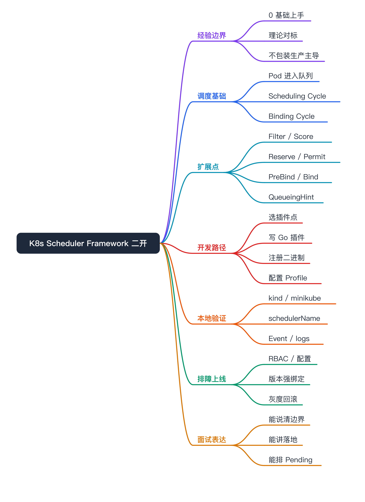
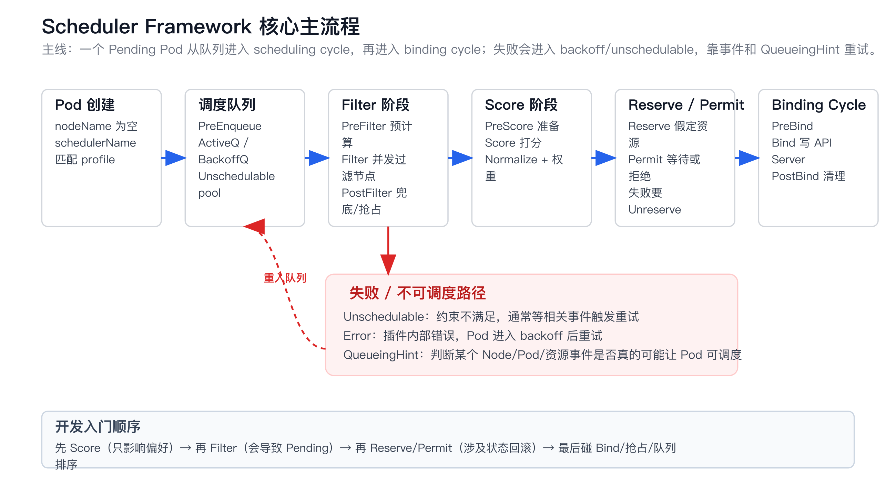
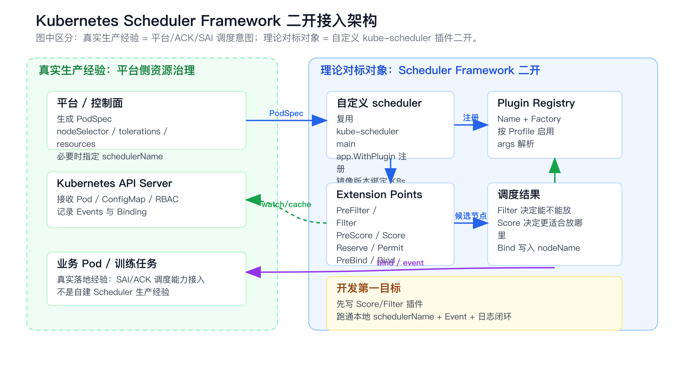
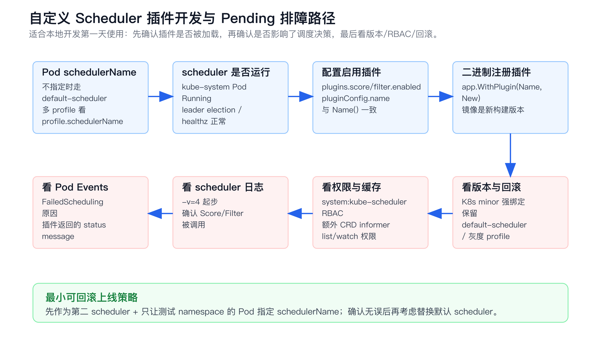

# Kubernetes Scheduler Framework 二开上手与面试准备



# 经验边界

```yaml
tech_point: Kubernetes Scheduler Framework 二开
experience_level: theory_with_lab
real_production_experience:
  - SAI / ACK 场景里更接近平台侧资源治理、PodSpec 生成、Pending 诊断、训练任务生命周期治理
not_claimed_experience:
  - 没有直接生产自建 kube-scheduler 插件
  - 没有改过 kube-scheduler 内核或生产替换默认调度器
  - 不编造调度性能收益、集群规模、线上故障案例
baseline:
  - 本文按 2026-06-16 核对的 Kubernetes 官方文档和 scheduler-plugins v0.34.x 体系整理
  - 本机 kubectl client 是 v1.34.1，因此示例优先按 v1.34.x 口径讲
```

这篇不是把 Scheduler Framework 包装成我已经做过的生产项目，而是把它作为 Kubernetes 调度器二开的入门和对标材料。面试里要先说清边界：我真实经验在平台侧资源抽象、PodSpec 翻译、训练任务调度意图接入、Pending 诊断；Scheduler Framework 是为了补齐“如果要二开调度器，我能怎么落地”的能力。

目标不是背源码，而是达到三个结果：

- 能解释 kube-scheduler 怎么从 Pending Pod 选出 Node。
- 能判断一个需求应该写 `Filter`、`Score`、`Reserve`、`Permit` 还是不该二开调度器。
- 能立刻 clone 一个 scheduler-plugins 风格的工程，写第一个插件、配置 profile、部署成第二调度器并用 Pod 验证。

# 为什么需要掌握

- **平台能力上探**：只会生成 `nodeSelector` / `tolerations` 是平台接入层；理解 Scheduler Framework 后，能说清“什么时候靠原生字段够，什么时候需要插件”。
- **AI Infra 高频追问**：GPU 型号、节点池、拓扑、成本、队列、Pending 解释都容易追到调度器。
- **Kubernetes 二开常见入口**：比 fork 整个 scheduler 风险低，插件通过 extension points 注入，但仍然编译进 scheduler 二进制。
- **排障收益大**：很多 Pending 不是 kubelet 问题，而是 scheduler profile、插件返回状态、RBAC、缓存、版本不一致导致。
- **能连接 Volcano / ACK / SAI**：Volcano 是批调度系统；Scheduler Framework 是 kube-scheduler 插件机制。两者不是一个层次，但都围绕调度语义扩展。

# 它解决什么问题

- **原生调度字段表达不了业务偏好**
  - **对应能力**：`Score` 插件。
  - **例子**：优先把低优任务放到低成本节点、优先选择带某类 GPU 标签的节点、优先选择网络负载低的节点。

- **某类节点必须被业务规则过滤**
  - **对应能力**：`Filter` 插件。
  - **例子**：Pod 声明模型类型，必须落到带对应模型缓存的节点；业务合规要求不能落到某类节点。

- **调度前后要维护外部状态**
  - **对应能力**：`Reserve` / `Unreserve`、`Permit`、`PreBind`。
  - **例子**：调度选中节点后，先在外部系统占一个许可；后续失败要回滚。

- **需要让 Pod 等待一组条件**
  - **对应能力**：`Permit`。
  - **例子**：简单 Gang / 配额准入 / 外部审批结果返回前先不绑定。

- **默认插件顺序、权重不符合场景**
  - **对应能力**：`KubeSchedulerConfiguration` 的 profiles / plugins / weights。
  - **例子**：不写新插件，只调高 `PodTopologySpread` 权重，或禁用某个默认 Score 插件。

- **想把一套调度策略只给部分 Pod 用**
  - **对应能力**：多 profile 或第二 scheduler，Pod 通过 `spec.schedulerName` 选择。
  - **例子**：只让测试 namespace 的 Pod 走 `demo-scheduler`，默认业务仍走 `default-scheduler`。

# 调度基础



## kube-scheduler 做什么

Pod 创建后，如果 `spec.nodeName` 为空，就说明还没绑定到节点。scheduler 监听这些未调度 Pod，从候选节点里选一个最合适的 Node，然后通过 API Server 写入绑定结果。

你可以把调度拆成三句：

- **Filter**：哪些节点能跑这个 Pod。
- **Score**：能跑的节点里，哪个更合适。
- **Bind**：把 Pod 和选中的 Node 绑定起来。

真实 kube-scheduler 比这复杂，但第一天开发插件时先抓住这三件事就够。

## Scheduling Cycle 和 Binding Cycle

一次调度尝试分两段：

- **Scheduling Cycle**：从队列里取一个 Pod，执行过滤、打分、预留、准入，选出一个 Node。官方设计里 scheduling cycle 串行执行，这是为了让调度缓存和假定状态可控。
- **Binding Cycle**：把选中的结果写回 API Server。binding cycle 可以并发，因为此时已经有调度决策。

这两个 cycle 合起来叫一次 scheduling context。插件要理解自己在哪个阶段被调用，因为不同阶段的副作用和回滚责任完全不同。

## 调度队列

kube-scheduler 内部不是一个简单 FIFO。至少要理解三类队列/池：

- **ActiveQ**：马上可被调度的 Pod。
- **BackoffQ**：调度失败后等待退避时间的 Pod。
- **Unschedulable Pod Pool**：当前没有必要马上重试的 Pod，等相关集群事件出现后再重新入队。

这就是为什么自定义 `Filter` 插件不能随便返回失败。你返回 `Unschedulable` 后，Pod 可能进入不可调度池；如果你没有正确声明什么事件能让它重新调度，就会让重试低效，甚至表现成“怎么一直 Pending”。

# Scheduler Framework 核心概念

## 插件是编译进 scheduler 的

Scheduler Framework 不是运行时热加载 Go 插件。你写的插件要注册到 scheduler framework registry，然后编译成新的 kube-scheduler 二进制。配置文件只能决定启用、禁用、排序、权重和插件参数；配置文件不能凭空加载一个没有编译进去的插件。

第一天必须记住这句话：**代码里 `app.WithPlugin(Name, New)` 注册，配置里 `enabled.name` 启用，两边名字必须一致。**

## Profile

Profile 是一套调度策略。一个 scheduler 进程可以有多个 profiles，每个 profile 有自己的 `schedulerName` 和插件配置。

Pod 通过 `spec.schedulerName` 选择 profile：

```yaml
apiVersion: v1
kind: Pod
metadata:
  name: score-demo
spec:
  schedulerName: demo-scheduler
  containers:
    - name: pause
      image: registry.k8s.io/pause:3.10
```

如果 Pod 不写 `schedulerName`，通常走 `default-scheduler`。

## Extension Points

- **PreEnqueue**：Pod 进入 active queue 前做轻量判断。不能做慢 IO，否则会卡住入队。
- **QueueSort**：决定队列里 Pod 的排序。一个 profile 只能启用一个 QueueSort。
- **PreFilter**：对 Pod 做预处理，或提前判断是否满足集群级条件；也可以把可评估节点缩小成子集。
- **Filter**：逐节点过滤。只要某个 Filter 插件认为节点不可行，该节点就被剔除。
- **PostFilter**：Filter 后没有可行节点时调用，典型用途是抢占或兜底。
- **PreScore**：为 Score 准备共享状态。
- **Score**：逐节点打分，结果会按插件权重合并。
- **Reserve / Unreserve**：scheduler 假定 Pod 会落到某节点后通知插件预留资源；后续失败时必须能回滚。
- **Permit**：允许、拒绝或等待绑定。适合需要等待外部条件的场景。
- **PreBind**：绑定前做准备动作。失败会阻止 Bind。
- **Bind**：真正执行绑定。通常保留默认绑定插件，不要第一天就改。
- **PostBind**：绑定成功后做清理或记录，不能改变调度结果。
- **EnqueueExtensions / QueueingHint**：告诉 scheduler 哪些集群事件可能让被你拒绝过的 Pod 重新变得可调度。官方文档把 QueueingHint 标为 Kubernetes v1.34 stable。

## CycleState

`CycleState` 是同一次调度尝试里的临时共享状态。典型用法：

- `PreFilter` 预计算 Pod 需求，写入 `CycleState`。
- `Filter` 对每个节点读取这份状态，避免重复计算。
- `PreScore` 计算候选节点集合信息，`Score` 读取后打分。

不要把 `CycleState` 当跨 Pod 的缓存。跨调度周期的缓存要由插件结构体维护，并且必须考虑并发、informer 同步、过期和回滚。

# 二开方式怎么选



## 第一优先级：先用原生能力

能用这些字段解决，就先别二开：

- `nodeSelector`
- node affinity / pod affinity / pod anti-affinity
- taints / tolerations
- topology spread constraints
- priority class
- resource requests / limits
- scheduler profile 权重调整

原因很现实：原生字段有更好的兼容性、可观测、升级路径和生态认知。

## 第二优先级：配置默认插件

如果只是偏好变化，先看能不能调权重：

```yaml
apiVersion: kubescheduler.config.k8s.io/v1
kind: KubeSchedulerConfiguration
profiles:
  - schedulerName: default-scheduler
    plugins:
      score:
        enabled:
          - name: PodTopologySpread
            weight: 3
```

这是最轻的“调度器定制”，不需要写 Go 插件。

## 第三优先级：写 out-of-tree 插件

适合这些场景：

- 业务规则无法通过原生字段表达。
- 需要读取自定义 CRD / 外部缓存 / 平台画像。
- 需要跨节点做自定义打分。
- 需要在调度选中节点后维护外部状态。

入门建议：

- 第一插件写 `Score`，因为只影响偏好，风险低。
- 第二插件写 `Filter`，因为会导致 Pending，必须会排障。
- 之后再碰 `Reserve` / `Permit`，因为涉及状态回滚。
- 最后再研究 `Bind`、`QueueSort`、抢占、复杂队列。

## 不推荐第一天做的事

- 直接 fork Kubernetes 改默认调度器核心逻辑。
- 上来就替换生产 `default-scheduler`。
- 在 `Filter` 里每个节点都调外部 HTTP。
- 没有 QueueingHint / 事件重入设计就写会拒绝 Pod 的插件。
- 为了一个简单标签规则写调度器插件，而不是用 node affinity。

# 立刻开发：第一条插件路径

最快的路线不是从空目录手写 go.mod，而是参考 `kubernetes-sigs/scheduler-plugins` 的结构。这个仓库本身就是 out-of-tree scheduler plugins 的实践样例，而且它的版本和 Kubernetes minor 版本对齐。

## 开发步骤总览

1. 确认目标 Kubernetes minor 版本。
2. 选择匹配的 scheduler-plugins tag，比如 K8s `v1.34.x` 对应 scheduler-plugins `v0.34.x`。
3. 新增一个插件包，例如 `pkg/nodelabelscore`。
4. 在 `cmd/scheduler/main.go` 用 `app.WithPlugin` 注册。
5. 写 `KubeSchedulerConfiguration`，启用插件。
6. 构建镜像，部署为第二 scheduler。
7. 创建 `spec.schedulerName: demo-scheduler` 的测试 Pod。
8. 看 Pod 最终落点、Events、scheduler 日志。

## 插件需求

先做一个最小 Score 插件：

- 如果节点有标签 `demo.scheduling/preferred=true`，给 100 分。
- 否则给 0 分。
- 不过滤任何节点。
- 不接外部系统。
- 不解析自定义参数。

这个需求足够验证插件注册、配置、调度路径和日志闭环。

## 插件骨架

下面是按 scheduler-plugins `v0.34.x` 风格写的骨架。真实落地时不要盲复制 import，优先打开目标 tag 里的已有插件文件，对齐它的 `framework` / `fwk` import 组合，因为 scheduler framework 包路径会随 Kubernetes 版本演进。

```go
package nodelabelscore

import (
	"context"

	v1 "k8s.io/api/core/v1"
	"k8s.io/apimachinery/pkg/runtime"
	"k8s.io/klog/v2"
	fwk "k8s.io/kube-scheduler/framework"
	"k8s.io/kubernetes/pkg/scheduler/framework"
)

const Name = "NodeLabelScore"

type NodeLabelScore struct {
	logger klog.Logger
	handle framework.Handle
}

var _ framework.ScorePlugin = &NodeLabelScore{}

func New(ctx context.Context, _ runtime.Object, h framework.Handle) (framework.Plugin, error) {
	return &NodeLabelScore{
		logger: klog.FromContext(ctx).WithValues("plugin", Name),
		handle: h,
	}, nil
}

func (p *NodeLabelScore) Name() string {
	return Name
}

func (p *NodeLabelScore) Score(ctx context.Context, state fwk.CycleState, pod *v1.Pod, nodeInfo fwk.NodeInfo) (int64, *fwk.Status) {
	node := nodeInfo.Node()
	if node == nil {
		return 0, fwk.NewStatus(fwk.Error, "node not found")
	}

	if node.Labels["demo.scheduling/preferred"] == "true" {
		p.logger.V(4).Info("preferred node matched", "pod", pod.Name, "node", node.Name)
		return framework.MaxNodeScore, nil
	}

	return framework.MinNodeScore, nil
}

func (p *NodeLabelScore) ScoreExtensions() framework.ScoreExtensions {
	return nil
}
```

第一版先不要写参数解析。能跑通后再加 args，否则你会同时被 scheme 注册、类型转换、配置加载三件事干扰。

## 注册插件

在自定义 scheduler 的 `cmd/scheduler/main.go` 注册：

```go
package main

import (
	"os"

	"k8s.io/component-base/cli"
	"k8s.io/kubernetes/cmd/kube-scheduler/app"

	"example.com/scheduler-demo/pkg/nodelabelscore"
)

func main() {
	command := app.NewSchedulerCommand(
		app.WithPlugin(nodelabelscore.Name, nodelabelscore.New),
	)

	code := cli.Run(command)
	os.Exit(code)
}
```

检查点：

- `nodelabelscore.Name` 必须等于配置里的 `enabled.name`。
- `New` 的签名必须匹配目标 Kubernetes 版本的 `runtime.PluginFactory`。
- 二进制必须重新构建镜像，光改 ConfigMap 不会让新插件出现。

## scheduler 配置

最小配置：

```yaml
apiVersion: kubescheduler.config.k8s.io/v1
kind: KubeSchedulerConfiguration
leaderElection:
  leaderElect: false
profiles:
  - schedulerName: demo-scheduler
    plugins:
      score:
        enabled:
          - name: NodeLabelScore
            weight: 10
```

说明：

- `schedulerName: demo-scheduler` 表示只有指定这个 schedulerName 的 Pod 才走这套策略。
- `score.enabled.name` 必须和插件 `Name()` 返回值一致。
- `weight` 是插件分数合并时的权重。
- 本地单副本第二 scheduler 可以先 `leaderElect: false`；生产多副本要重新设计 leader election。

## 测试 Pod

给某个节点打标签：

```bash
kubectl label node <node-name> demo.scheduling/preferred=true --overwrite
```

创建测试 Pod：

```yaml
apiVersion: v1
kind: Pod
metadata:
  name: score-demo
spec:
  schedulerName: demo-scheduler
  restartPolicy: Never
  containers:
    - name: pause
      image: registry.k8s.io/pause:3.10
```

验证：

```bash
kubectl get pod score-demo -o wide
kubectl describe pod score-demo
kubectl get events --sort-by=.lastTimestamp | tail -30
kubectl logs -n kube-system deploy/demo-scheduler --tail=200
```

预期：

- Pod 被 `demo-scheduler` 调度。
- 如果有多个节点，优先落到带 `demo.scheduling/preferred=true` 的节点。
- scheduler 日志里能看到插件的 `preferred node matched`。

# 本地部署路径

本机当前没有 `kind` 命令；如果要本地实验，建议先安装 kind 或 minikube。以下按 kind 写，因为它适合快速替换 scheduler 镜像。

## 创建集群

```bash
kind create cluster --name sched-dev --image kindest/node:v1.34.0
kubectl get nodes
```

如果你用 minikube，也能做，但镜像加载和 kube-system 部署方式会略不同。

## 构建镜像

```bash
docker build -t demo-scheduler:v0.1 .
kind load docker-image demo-scheduler:v0.1 --name sched-dev
```

镜像里只需要包含你编译出的 scheduler 二进制。入口命令通常类似：

```bash
/usr/local/bin/kube-scheduler --config=/etc/kubernetes/scheduler/config.yaml -v=4
```

## RBAC 和 Deployment

第二 scheduler 最容易卡在 RBAC。入门阶段可以绑定 Kubernetes 内置的 `system:kube-scheduler` ClusterRole：

```yaml
apiVersion: v1
kind: ServiceAccount
metadata:
  name: demo-scheduler
  namespace: kube-system
---
apiVersion: rbac.authorization.k8s.io/v1
kind: ClusterRoleBinding
metadata:
  name: demo-scheduler-as-kube-scheduler
roleRef:
  apiGroup: rbac.authorization.k8s.io
  kind: ClusterRole
  name: system:kube-scheduler
subjects:
  - kind: ServiceAccount
    name: demo-scheduler
    namespace: kube-system
```

配置和部署示例：

```yaml
apiVersion: v1
kind: ConfigMap
metadata:
  name: demo-scheduler-config
  namespace: kube-system
data:
  config.yaml: |
    apiVersion: kubescheduler.config.k8s.io/v1
    kind: KubeSchedulerConfiguration
    leaderElection:
      leaderElect: false
    profiles:
      - schedulerName: demo-scheduler
        plugins:
          score:
            enabled:
              - name: NodeLabelScore
                weight: 10
---
apiVersion: apps/v1
kind: Deployment
metadata:
  name: demo-scheduler
  namespace: kube-system
spec:
  replicas: 1
  selector:
    matchLabels:
      app: demo-scheduler
  template:
    metadata:
      labels:
        app: demo-scheduler
    spec:
      serviceAccountName: demo-scheduler
      containers:
        - name: kube-scheduler
          image: demo-scheduler:v0.1
          imagePullPolicy: IfNotPresent
          command:
            - /usr/local/bin/kube-scheduler
            - --config=/etc/kubernetes/scheduler/config.yaml
            - -v=4
          volumeMounts:
            - name: config
              mountPath: /etc/kubernetes/scheduler
      volumes:
        - name: config
          configMap:
            name: demo-scheduler-config
```

如果插件需要读自定义 CRD，还要额外给 ServiceAccount 加对应 CRD 的 `list/watch/get` 权限，并在代码里接入 informer/cache。不要在 `Score` / `Filter` 热路径里每次直接打 API Server。

# 写 Filter 插件时怎么不把自己坑死

Score 插件跑通后，再写 Filter。最小需求可以是：

- Pod annotation `demo.scheduling/need-preferred-node=true`。
- 节点必须有 `demo.scheduling/preferred=true`。
- 不满足就返回 `Unschedulable`，并给出清晰原因。

关键点：

```go
func (p *NodeLabelFilter) Filter(ctx context.Context, state fwk.CycleState, pod *v1.Pod, nodeInfo fwk.NodeInfo) *fwk.Status {
	if pod.Annotations["demo.scheduling/need-preferred-node"] != "true" {
		return nil
	}

	node := nodeInfo.Node()
	if node == nil {
		return fwk.NewStatus(fwk.Error, "node not found")
	}

	if node.Labels["demo.scheduling/preferred"] != "true" {
		return fwk.NewStatus(fwk.Unschedulable, "node does not have demo.scheduling/preferred=true")
	}

	return nil
}
```

返回状态的判断：

- **业务约束不满足**：返回 `Unschedulable` 或 `UnschedulableAndUnresolvable`。
- **插件内部异常**：返回 `Error`。
- **成功**：返回 `nil` 或 `Success`。

不要把“节点不符合业务规则”返回成 `Error`，否则 scheduler 会按临时错误重试，排障语义会很乱。

Filter 插件要特别注意 `EnqueueExtensions` / `QueueingHint`。如果你的 Pod 因为节点标签不满足被拒绝，那么节点标签更新可能让它重新可调度；你应该让 scheduler 知道这个事件和重试关系。第一版本地 Demo 可以先不写，但生产插件必须补齐。

# 加参数时怎么做

第一版硬编码标签键。第二版再加 args：

```yaml
profiles:
  - schedulerName: demo-scheduler
    plugins:
      score:
        enabled:
          - name: NodeLabelScore
            weight: 10
    pluginConfig:
      - name: NodeLabelScore
        args:
          preferredLabelKey: demo.scheduling/preferred
          preferredLabelValue: "true"
```

加 args 需要做三件事：

- 定义参数结构体。
- 注册到 scheduler config scheme。
- 在 `New(ctx, args, handle)` 里类型断言并校验默认值。

这部分最容易被版本和 scheme 注册卡住，所以不建议第一版就做。照 scheduler-plugins 里已有插件的 `apis/config`、`scheme`、`validation` 写，比自己摸索快。

# 单元测试怎么写

插件测试至少覆盖三类：

- 有标签节点得高分。
- 无标签节点得低分。
- nodeInfo 没有 Node 时返回 Error。

测试思路：

```go
func TestScorePreferredNode(t *testing.T) {
	p := &NodeLabelScore{}
	pod := &v1.Pod{ObjectMeta: metav1.ObjectMeta{Name: "p1", Namespace: "default"}}
	node := &v1.Node{
		ObjectMeta: metav1.ObjectMeta{
			Name: "n1",
			Labels: map[string]string{
				"demo.scheduling/preferred": "true",
			},
		},
	}

	nodeInfo := framework.NewNodeInfo()
	nodeInfo.SetNode(node)

	score, status := p.Score(context.Background(), framework.NewCycleState(), pod, nodeInfo)
	if !status.IsSuccess() {
		t.Fatalf("unexpected status: %v", status)
	}
	if score != framework.MaxNodeScore {
		t.Fatalf("unexpected score: %d", score)
	}
}
```

注意：上面是测试意图示例。实际 import 和 `CycleState` 类型以目标 Kubernetes tag 为准，最稳的方式是复制同版本 scheduler-plugins 已有测试里的 import 组合。

# 排障路径



## Pod 一直 Pending

先看 Pod：

```bash
kubectl describe pod <pod>
kubectl get pod <pod> -o yaml | yq '.spec.schedulerName'
kubectl get events --sort-by=.lastTimestamp | tail -50
```

判断：

- `schedulerName` 为空或不是你的 profile：Pod 没走你的 scheduler。
- Events 里没有你的插件原因：插件可能没启用，或没有注册进二进制。
- Events 里有你的插件原因：插件生效了，按返回 message 排查节点条件。

## 插件没生效

查配置：

```bash
kubectl -n kube-system get cm demo-scheduler-config -o yaml
kubectl -n kube-system get deploy demo-scheduler -o yaml
kubectl -n kube-system logs deploy/demo-scheduler --tail=200
```

重点看：

- `profiles[].schedulerName` 是否等于 Pod 的 `spec.schedulerName`。
- `plugins.score.enabled[].name` 是否等于插件 `Name()`。
- 镜像是否真的是新构建版本。
- 启动日志里有没有 unknown plugin / config decode error。

## scheduler 起不来

常见原因：

- 配置 API 版本写错。当前主线应使用 `kubescheduler.config.k8s.io/v1`。
- `KubeSchedulerConfiguration v1beta3` 老配置还在用，新版本已移除。
- 插件名字配置了，但二进制没注册。
- pluginConfig args 类型没有注册 scheme。
- leader election 配置不适合本地环境。

## scheduler 起了但无法 list/watch

典型日志是 `forbidden`。处理：

- 第二 scheduler 绑定 `system:kube-scheduler` ClusterRole。
- 如果插件读 CRD，补 CRD 的 RBAC。
- 如果插件读 namespace-scoped 资源，确认权限范围。

## 分数不符合预期

用这几步：

```bash
kubectl get node --show-labels
kubectl describe pod <pod>
kubectl -n kube-system logs deploy/demo-scheduler --tail=300 | grep NodeLabelScore
```

再检查：

- Score 是否对所有候选节点都返回。
- Score 是否在 0 到 100 范围内，或者是否实现了 NormalizeScore。
- 插件权重是否太低，被其他 Score 插件淹没。
- Filter 阶段是否已经把你期望的节点过滤掉了。

# 线上设计原则

## 第二 scheduler 灰度优先

生产里不要第一步替换默认 scheduler。更稳的路径：

- 先部署第二 scheduler，例如 `demo-scheduler`。
- 只让测试 namespace 或少量工作负载指定 `schedulerName`。
- 观察 Pending、调度延迟、scheduler 日志、metrics。
- 稳定后再扩大范围。
- 真要替换 default-scheduler，必须有回滚方案。

## 版本强绑定

scheduler 插件和 Kubernetes minor 版本强相关。经验规则：

- K8s `v1.34.x` 对应 scheduler-plugins `v0.34.x`。
- 不要拿 `master` 分支样例直接编译到旧集群。
- kube-scheduler 是控制面组件，升级时要同时验证 config API、插件接口、默认插件变化、feature gate。

## 热路径不要慢

`Filter` 和 `Score` 会在候选节点上频繁执行。不要做这些事：

- 每个节点都请求外部 HTTP。
- 每个 Pod 都全量 list 大对象。
- 在 Filter 里写外部状态。
- 用锁包住整个节点评分循环。

正确做法：

- 用 informer/cache 维护外部数据快照。
- 在 `PreFilter` / `PreScore` 做一次预计算。
- 在 `Filter` / `Score` 只读内存数据。
- 外部系统异常时定义降级策略，是跳过、低分还是不可调度。

## 返回原因要给人看

插件返回的 status message 会变成排障入口。不要写：

```go
return fwk.NewStatus(fwk.Unschedulable, "failed")
```

要写：

```go
return fwk.NewStatus(fwk.Unschedulable, "node does not have demo.scheduling/preferred=true")
```

平台侧才能把它翻译成用户能理解的 Pending 原因。

# 和我现有经验的映射

- **SAI / AI 训练平台**：真实经验是资源池抽象、节点池选择、PodSpec 生成、TFJob 生命周期和 Pending 诊断；Scheduler Framework 可以解释“如果这些策略下沉到调度器插件，应该挂在哪些 extension points”。
- **ACK 调度能力**：真实经验更接近使用云厂商托管调度/算法套件；Scheduler Framework 是理解托管能力背后 kube-scheduler 可扩展机制的基础。
- **Volcano**：Volcano 是批调度系统，关注 Job / PodGroup / Queue / Gang；Scheduler Framework 是 kube-scheduler 插件机制，关注单个 scheduler 如何扩展调度阶段。两者可以对比，但不能混成一个东西。
- **Kubernetes 运维**：Pod Pending 排查从 `describe pod`、Events、node labels/taints、resource requests 扩展到 profile、plugin、scheduler 日志和 RBAC。

# 面试话术

## 30 秒

我没有在生产里自建过 Scheduler Framework 插件，这点先说清楚。我的真实经验是在 SAI / ACK 场景里做平台侧资源抽象、PodSpec 生成、训练任务调度意图接入和 Pending 诊断。Scheduler Framework 我是作为调度器二开能力补齐来学习的：它把 kube-scheduler 的队列、Filter、Score、Reserve、Permit、Bind 等阶段开放成插件扩展点。真正落地时我会先判断原生 node affinity、taint、topology spread 和 profile 权重能不能解决；解决不了，再从低风险 Score 插件开始，灰度成第二 scheduler，用 `schedulerName` 控制流量，最后通过 Events、日志、metrics 和回滚策略保障上线。

## 3 分钟

kube-scheduler 的主线是：未绑定 Pod 进入调度队列，scheduler 取出 Pod 后进入 scheduling cycle，先做 PreFilter 和 Filter，筛出能运行的节点；然后 PreScore / Score 给候选节点打分；再 Reserve / Permit 做预留和准入；最后进入 binding cycle，通过 PreBind / Bind / PostBind 把结果写回 API Server。

Scheduler Framework 的价值是让这些阶段以插件方式扩展，而不是直接 fork scheduler 核心。比如只是业务偏好，就写 Score；如果节点不满足硬约束，就写 Filter；如果要占外部资源，要用 Reserve/Unreserve；如果要等待一组条件，可以用 Permit。插件必须编译进自定义 scheduler 二进制，再通过 KubeSchedulerConfiguration 的 profile 启用。Pod 通过 `spec.schedulerName` 选择对应 profile。

如果让我从 0 到 1 开发，我会先按目标集群版本选择 scheduler-plugins 对应 tag，写一个最小 Score 插件，比如优先选择带标签的节点；注册到 `cmd/scheduler/main.go`，配置 `demo-scheduler` profile，部署成第二 scheduler，只让测试 Pod 指定 `schedulerName`。验证时看 Pod 落点、Events、scheduler 日志。等这条链路跑通，再写 Filter、QueueingHint、args 解析和指标。

生产上我会非常谨慎：版本要和 Kubernetes minor 对齐；Filter/Score 热路径不能调用慢外部接口；返回原因要可解释；会拒绝 Pod 的插件要设计重入队列事件；上线先第二 scheduler 灰度，保留 default-scheduler 回滚。

## 5 分钟

我会把 Scheduler Framework 分成四层讲。

第一层是调度主链路。Pod 没有 `nodeName` 时会被 scheduler 处理，先进入队列，再进入 scheduling cycle。Filter 决定能不能放，Score 决定更适合放哪，Bind 把结果写回 API Server。失败的 Pod 不会无限忙等，而是进入 backoff 或 unschedulable pool，等相关事件再重试。

第二层是插件扩展点。`PreFilter` 做预处理，`Filter` 做硬约束，`PostFilter` 处理无可行节点后的兜底，`PreScore` 和 `Score` 做偏好打分，`Reserve` / `Unreserve` 维护假定资源，`Permit` 允许等待，`PreBind` / `Bind` / `PostBind` 处理绑定前后动作。入门开发应该从 Score 开始，因为风险最低；Filter 会制造 Pending，必须配套排障；Reserve/Permit 涉及状态回滚，复杂度更高。

第三层是工程落地。插件不是配置热加载，而是编译进 scheduler 二进制。代码里要 `app.WithPlugin` 注册，配置里要在 profile 的 plugins 里启用，Pod 要通过 `schedulerName` 命中 profile。版本上要和 Kubernetes minor 对齐，最省事的方式是基于 scheduler-plugins 对应 tag 开发。第一版不要急着做 args 和 CRD，先写一个无外部依赖的 Score 插件，跑通镜像、Deployment、RBAC、Pod 落点和日志。

第四层是线上风险。自定义调度器是控制面组件，风险比普通业务服务高。上线要先作为第二 scheduler 灰度，只让少量 Pod 指定 `schedulerName`；要有日志、metrics、Events、profile 配置审计；Filter 返回的原因要让平台能解释；插件读外部数据必须靠 cache，不能在节点循环里打外部服务；如果插件会拒绝 Pod，还要考虑 QueueingHint，避免无效重试或卡在不可调度池。

这和我的真实经验的连接是：我之前更多做平台侧资源治理和调度意图翻译，没有说自己生产维护过 scheduler 插件。但如果要把部分平台策略下沉到调度器，我知道应该怎么选 extension point、怎么灰度、怎么排 Pending、怎么控制版本和回滚风险。

# 不能怎么说

| 不要这么说 | 风险 | 应该这么说 |
|---|---|---|
| 我生产自研了 kube-scheduler 插件 | 没有事实支撑会被追问击穿 | 我生产经验在平台调度意图接入，Scheduler Framework 是二开能力补齐 |
| 配置文件能直接加载自定义插件 | 错，插件需要编译进二进制 | 代码注册插件，配置启用插件 |
| Filter 插件里实时调外部系统就行 | 热路径会拖慢调度，故障会放大 | 外部数据进 informer/cache，Filter 只读本地快照 |
| Score 决定节点能不能跑 | 概念错误 | Filter 决定能不能跑，Score 决定偏好 |
| 直接替换 default-scheduler | 风险过高 | 先第二 scheduler 灰度，用 schedulerName 控制流量 |
| 插件接口很稳定，随便升级 | 版本坑大 | scheduler 插件和 Kubernetes minor 强绑定 |
| Pending 都是资源不足 | 片面 | 还要看 schedulerName、profile、插件返回、RBAC、缓存、Events 和日志 |

# 高频 QA

### Scheduler Framework 和自定义 scheduler 是什么关系？

Scheduler Framework 是 kube-scheduler 的插件扩展机制；自定义 scheduler 是你编译出来并运行的 scheduler 二进制。你可以基于 kube-scheduler 主程序注册自己的 framework plugin，然后部署成第二 scheduler 或替换默认 scheduler。

### 它和 scheduler extender 有什么区别？

extender 是 HTTP webhook 扩展，通常在过滤、打分等有限阶段被调用，有序列化和网络调用成本。Scheduler Framework 是 Go 插件接口，编译进 scheduler，扩展点更完整，性能和状态管理更可控。新开发优先看 Framework。

### 第一个插件应该写 Filter 还是 Score？

建议先写 Score。Score 只改变节点偏好，调错了通常只是落点不理想；Filter 会直接让节点不可行，容易造成 Pod Pending。等你能看懂 Events 和 scheduler 日志后，再写 Filter。

### 为什么配置了插件但没有生效？

常见原因是插件没有编译进二进制、`app.WithPlugin` 没注册、配置里的 name 和 `Name()` 不一致、Pod 没指定对应 `schedulerName`、scheduler 还在跑旧镜像，或者配置加载失败但你没看 scheduler 日志。

### Pod 不写 schedulerName 会怎样？

通常走 `default-scheduler`。如果你部署的是第二 scheduler，例如 `demo-scheduler`，测试 Pod 必须显式写 `spec.schedulerName: demo-scheduler`，否则你的插件不会参与。

### Filter 返回 Error 和 Unschedulable 有什么区别？

`Unschedulable` 表示业务约束不满足，比如节点缺标签、资源不符合规则；`Error` 表示插件内部异常，比如缓存损坏、参数不合法、nodeInfo 异常。不要把正常业务拒绝写成 Error。

### QueueingHint 为什么重要？

如果你的插件让 Pod 不可调度，scheduler 需要知道哪些集群事件可能让它重新可调度。比如因为节点标签缺失被拒绝，节点标签更新就是相关事件。QueueingHint 能减少无效重试，也避免重试条件不清。

### 自定义插件能不能访问外部系统？

能，但不能在热路径里每次同步访问。正确方式是用 informer/cache 或后台 goroutine 把外部状态同步成本地快照，`Filter` / `Score` 只读内存。外部系统异常时要定义降级策略。

### 为什么版本要强绑定？

Scheduler Framework 接口、配置 API、默认插件、feature gate 会随 Kubernetes minor 演进。scheduler-plugins 也明确按 Kubernetes minor 对齐。K8s `v1.34.x` 就选 `v0.34.x` 体系，别拿 master 样例直接上旧集群。

### 什么时候不该写 Scheduler 插件？

能用 `nodeSelector`、affinity、taint/toleration、topology spread、priority、resource request、profile 权重解决时，不该写插件。插件带来控制面升级、RBAC、日志、调度延迟、回滚和排障成本。

### 如果线上因为插件导致大量 Pending，第一反应是什么？

先止血：让新 Pod 不再指定自定义 `schedulerName`，或回滚 scheduler Deployment/ConfigMap。然后看 Events 里的 FailedScheduling 原因、scheduler 日志、最近配置变更、节点标签/污点变化、插件缓存是否异常。

### 怎么把它和 SAI 项目安全连接？

可以说 SAI 真实做的是资源池抽象、PodSpec 生成、任务生命周期和 Pending 诊断，不是自研 scheduler。Scheduler Framework 是进一步理解“如果平台策略下沉到调度器插件，应该怎么做”的二开能力。

# 面试前检查清单

- [ ] 我能明确说清没有直接生产自建 Scheduler Framework 插件。
- [ ] 我能说清 `Filter`、`Score`、`Bind` 的基本区别。
- [ ] 我知道插件必须编译进 scheduler 二进制，不能只靠配置热加载。
- [ ] 我能写出第一个 Score 插件的核心代码。
- [ ] 我知道 `app.WithPlugin` 注册和 profile `enabled.name` 必须一致。
- [ ] 我能用 `schedulerName` 让测试 Pod 命中第二 scheduler。
- [ ] 我能排查 Pending：Pod Events、schedulerName、profile、日志、RBAC、版本。
- [ ] 我知道为什么生产要先第二 scheduler 灰度。
- [ ] 我知道 scheduler 插件和 Kubernetes minor 版本强绑定。
- [ ] 我不会把 SAI/ACK 平台接入经验夸大成自研 kube-scheduler 生产经验。

# 一天上手路线

## 第 0 小时：只看三件事

- Pod 没有 `nodeName` 才需要调度。
- `Filter` 过滤节点，`Score` 排序节点，`Bind` 写结果。
- 自定义插件要编译进 scheduler，再由 profile 启用。

## 第 1-2 小时：准备环境

- 安装 kind 或 minikube。
- clone scheduler-plugins 对应版本。
- 找一个最简单的 Score 插件，读它的 `Name()`、`New()`、`Score()`、注册位置。

## 第 3-4 小时：写 NodeLabelScore

- 新建插件包。
- 写 Score。
- 注册插件。
- 配置 profile。
- 构建镜像。

## 第 5-6 小时：跑本地闭环

- 部署第二 scheduler。
- 给节点打标签。
- 创建指定 `schedulerName` 的 Pod。
- 看 Pod 落点、Events、scheduler 日志。

## 第 7-8 小时：改成 Filter 并制造 Pending

- 写一个 annotation 驱动的 Filter。
- 故意让节点不满足条件。
- 观察 FailedScheduling。
- 改节点标签后验证 Pod 能恢复调度。

# 资料源

- [Kubernetes Scheduling Framework](https://kubernetes.io/docs/concepts/scheduling-eviction/scheduling-framework/)
- [Kubernetes Scheduler Configuration](https://kubernetes.io/docs/reference/scheduling/config/)
- [Scheduling Framework KEP 624](https://github.com/kubernetes/enhancements/blob/master/keps/sig-scheduling/624-scheduling-framework/README.md)
- [kubernetes-sigs/scheduler-plugins](https://github.com/kubernetes-sigs/scheduler-plugins)
- [scheduler-plugins installation guide](https://scheduler-plugins.sigs.k8s.io/docs/user-guide/installation/)
- [kube-scheduler app.WithPlugin Go doc](https://pkg.go.dev/k8s.io/kubernetes/cmd/kube-scheduler/app)
- [Kubernetes QueueingHint blog](https://kubernetes.io/blog/2024/12/12/scheduler-queueinghint/)
