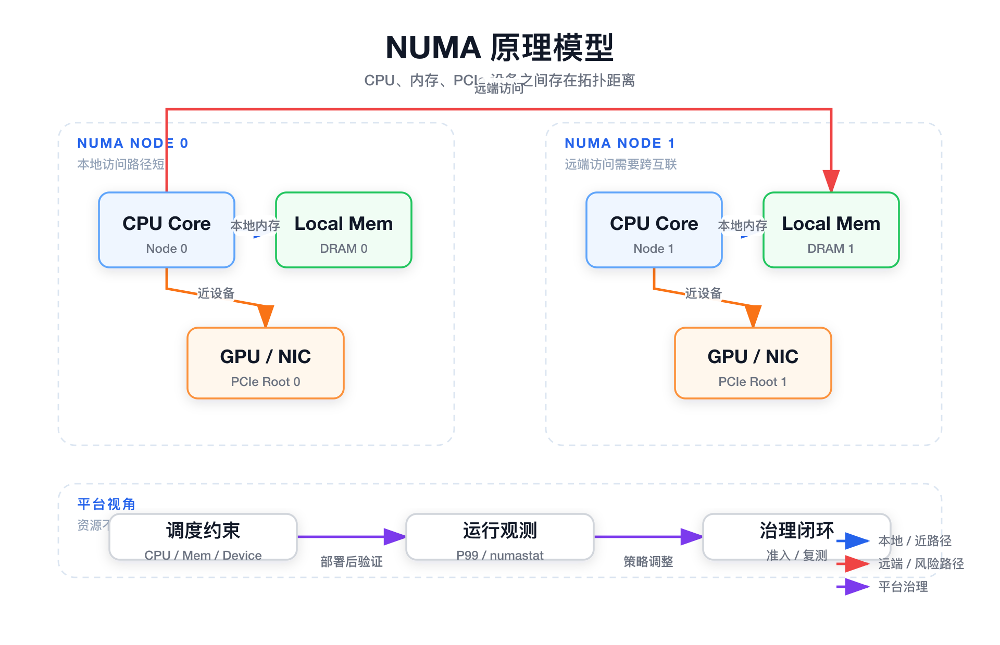
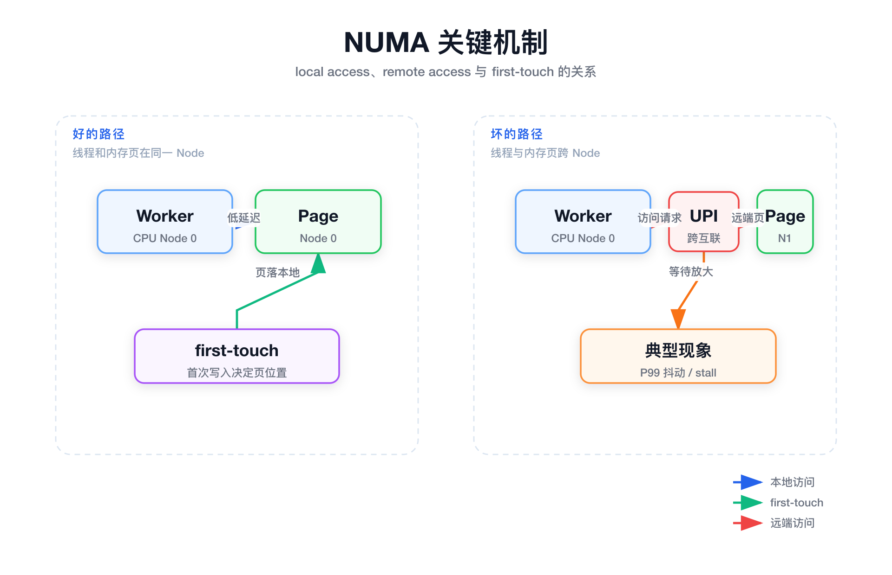
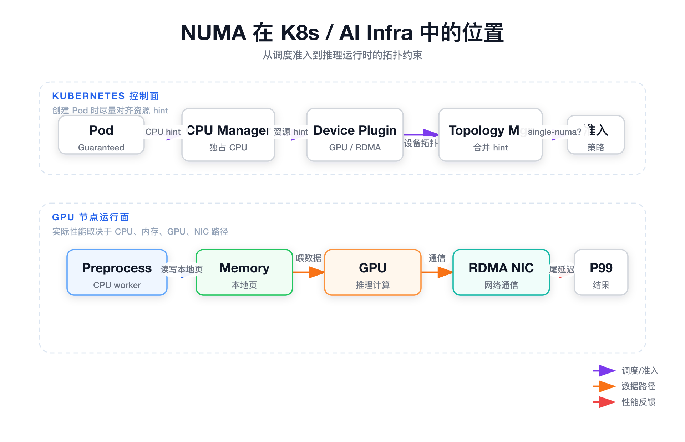
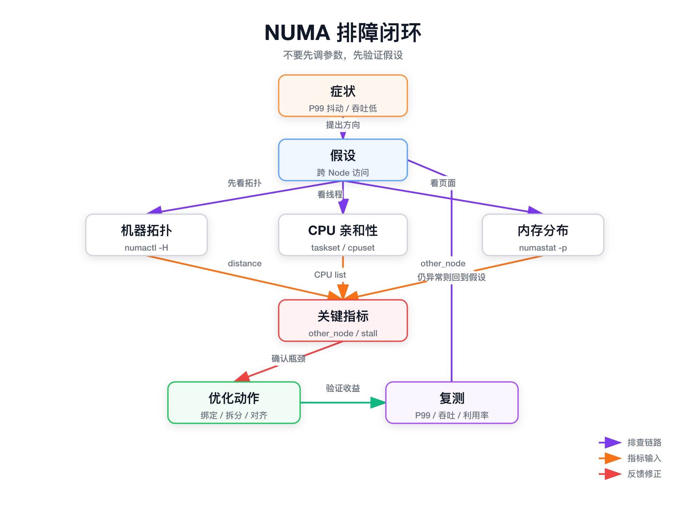
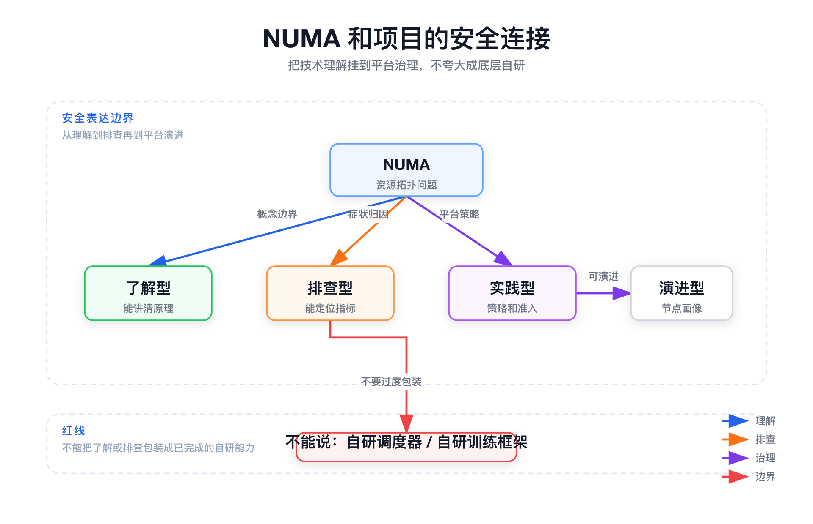

# 面试定位卡

| 项目 | 内容 |
|---|---|
| 技术点 | NUMA（Non-Uniform Memory Access，非一致内存访问） |
| 所属领域 | Linux 内核、服务器硬件拓扑、Kubernetes 资源管理、AI Infra 性能优化 |
| 面试价值 | 能证明你不是只会看 CPU / 内存 / GPU 数量，而是理解资源拓扑、尾延迟、运行时性能和调度约束 |
| 常见考法 | NUMA 是什么、为什么会影响 P99、绑核是否足够、K8s 怎么做拓扑感知、AI 推理为什么要看 CPU/GPU/NIC 距离 |
| 适合挂钩项目 | 容器平台、AI 训推平台、GPU 节点治理、低延迟网关、缓存 / 数据库排障、RDMA 训练链路 |
| 不适合夸大的地方 | 不要说自己自研了 NUMA 调度器、训练框架、推理引擎或内核能力；如果只是理解和排查，就按理解型 / 排查型说法表达 |

# 三十秒回答

> NUMA 是多 CPU、多 Socket 服务器里的非一致内存访问架构。每个 NUMA Node 通常包含一组 CPU core 和本地内存，CPU 访问本地内存更快，访问其他 Node 的远端内存更慢。它解决的是多核服务器扩展性和内存带宽问题，但代价是软件必须关注 CPU、内存、GPU、NIC 之间的拓扑距离。面试里重点不是背 `numactl`，而是说明为什么资源看起来没打满，服务仍然可能出现 P99 抖动、吞吐下降和 GPU 等数据的问题。

# 为什么需要它

| 问题 | 解释 |
|---|---|
| 没有它之前的问题 | 在传统 UMA / 小规模 SMP 架构里，所有 CPU 访问同一组内存控制器。核心数增多后，共享总线和单一内存控制器会成为瓶颈。 |
| 它的解决方式 | 把内存控制器和内存分布到不同 CPU / Socket / Node 上，让 CPU 优先访问本地内存，同时仍然允许跨 Node 访问远端内存。 |
| 它引入的新问题 | 内存访问成本不再一致。线程跑在哪、内存页分配在哪、设备挂在哪，会影响延迟、带宽和尾部抖动。 |
| 必须关注的场景 | 低延迟服务、缓存 / 数据库、网络网关、DPDK / RDMA、AI 推理、训练数据加载、多 GPU 通信、Kubernetes Guaranteed Pod。 |

# 核心概念表

| 概念 | 解释 | 面试展开点 |
|---|---|---|
| NUMA Node | 一组 CPU core、本地内存和邻近 I/O 设备形成的拓扑单元 | 不要只把它理解成“多 CPU”，重点是访问成本不同 |
| Local Memory | 当前 CPU 所在 Node 的本地内存 | 延迟低、带宽高，适合低延迟服务 |
| Remote Memory | 其他 Node 上的内存 | 需要跨互联总线，容易增加 stall 和 P99 |
| Node Distance | Linux 暴露的 NUMA 距离矩阵 | distance 越小越近，常见本地为 10，远端更高 |
| first-touch | 内存页通常在第一次被写入的 CPU 所在 Node 上分配 | 初始化线程和工作线程不一致时容易埋坑 |
| CPU affinity | 进程或线程允许运行在哪些 CPU 上 | 只能约束 CPU，不自动约束内存页和设备 |
| Memory policy | localalloc、bind、interleave、preferred 等内存策略 | 低延迟和大内存带宽场景的选择不同 |
| IRQ affinity | 网卡等设备中断由哪些 CPU 处理 | 网络服务要让 NIC、IRQ、worker 尽量靠近 |
| Topology Manager | Kubelet 中汇总 CPU、内存、设备拓扑 hint 的组件 | 解释 K8s 如何把拓扑感知纳入准入 |
| Device Plugin topology | GPU、RDMA 等设备插件暴露的拓扑信息 | AI Infra 里要关注 GPU-CPU-NIC 距离 |

# 原理模型



## 底层 / 硬件 / 基础设施层

NUMA 的底层原因是服务器为了扩展 CPU 核数和内存带宽，把内存控制器、内存和 I/O 设备分布到不同 CPU Socket 或计算单元附近。这样每个 Node 都有自己的本地资源，整体扩展性更好。

代价是访问路径不再均匀。CPU 访问本地 DRAM 路径短，访问远端 Node 的 DRAM 需要跨 UPI / Infinity Fabric / 片间互联等链路；GPU、RDMA NIC、NVMe 等 PCIe 设备也挂在不同 Root Complex 下，和 CPU 之间存在拓扑距离。

面试表达重点：

- NUMA 是为了扩展性引入的，不是单纯“机器有多块内存”。
- 本地访问和远端访问都能访问，但延迟、带宽和抖动不同。
- CPU、内存、GPU、NIC 都应该放在同一个“距离模型”里理解。

## 操作系统 / 框架层

Linux 会把硬件拓扑识别为多个 NUMA Node，并暴露 CPU 归属、内存容量和 distance 矩阵。内存策略常见有 localalloc、bind、interleave、preferred。

这里最容易被追问的是 first-touch：内存页不是简单由 `malloc` 决定位置，而通常是在第一次实际写入时，由当时运行该线程的 CPU 所在 Node 决定。因此初始化线程、预热逻辑、线程池绑定都会影响后续访问路径。

## 容器 / Kubernetes 层

容器不会消除宿主机 NUMA 拓扑。Pod 里的进程仍然运行在宿主机 CPU 上，内存页也仍然落在宿主机 Node 上。

Kubernetes 里相关组件包括：

- CPU Manager：在 static policy 下给 Guaranteed Pod 分配独占 CPU。
- Device Plugin：暴露 GPU、RDMA、FPGA 等设备及其 topology 信息。
- Memory Manager：在支持场景下做 NUMA-aware memory 管理。
- Topology Manager：汇总 CPU、内存、设备的 topology hint，按策略做准入。

## AI Infra 层

AI 推理和训练不只看 GPU。GPU 前后的 CPU preprocess、tokenizer、dataloader、postprocess、RDMA 通信、NIC 中断都会受到 NUMA 拓扑影响。

如果 CPU worker 与 GPU 跨 NUMA，或者 GPU 与 RDMA NIC 拓扑距离远，模型本身没有变化，端到端吞吐和 P99 也可能明显变差。这个点适合和 GPU 节点画像、拓扑感知调度、推理 P99 排查安全连接。

# 关键机制



## 本地访问和远端访问

解决的问题：

解释为什么同样是内存访问，性能成本不一样。

工作方式：

线程运行在某个 NUMA Node 的 CPU 上。如果访问同 Node 的内存页，就是本地访问；如果访问其他 Node 的内存页，就要跨互联链路访问远端内存。

代价：

远端访问不是错误，但会带来更高延迟、更低有效带宽、更高 CPU stall。对平均延迟影响可能不明显，但对 P99 / P999 更敏感。

面试追问：

为什么 CPU 利用率不高，服务延迟还是抖？可以回答：CPU 可能在等远端内存或 cache miss，不是所有性能瓶颈都会表现为 CPU 打满。

## first-touch 内存分配

解决的问题：

解释为什么同一个程序不同启动方式、不同初始化线程下，NUMA 表现可能不同。

工作方式：

Linux 常见行为是 first-touch：内存页通常在第一次被实际写入的 CPU 所在 Node 上分配。`malloc` 只是虚拟地址分配，真正物理页位置往往由首次触碰决定。

代价：

如果单线程初始化大块内存，然后多线程在不同 Node 上工作，可能导致很多 worker 长期访问远端内存。

面试追问：

为什么“绑核后还是抖”？因为绑核只约束线程运行 CPU，不一定修复已经分配错位的内存页。

## CPU 和内存绑定

解决的问题：

减少低延迟服务跨 Node 访问，让线程和内存页尽量在同一个 NUMA Node。

工作方式：

通过 cpuset、`numactl --cpunodebind`、`numactl --membind` 或容器 runtime 约束，让进程运行 CPU 和内存分配范围一致。

代价：

绑定过死可能降低整机资源利用率；如果单个 Node 内存不足，可能触发分配失败或 OOM；容器环境还要看 cgroup 和 kubelet 策略是否配合。

面试追问：

`membind` 和 `interleave` 怎么选？低延迟服务优先 locality，大内存 / 带宽型任务可以考虑 interleave。

## 拓扑感知准入

解决的问题：

解决 Kubernetes 中 CPU、内存、GPU/NIC 分配割裂的问题。

工作方式：

CPU Manager、Device Manager、Memory Manager 分别给出 topology hint，Topology Manager 汇总后根据 none、best-effort、restricted、single-numa-node 等策略决定是否接受 Pod。

代价：

策略越严格，性能确定性越好，但调度成功率和资源利用率可能下降。策略越宽松，可用性更好，但运行时可能出现性能不稳定。

面试追问：

K8s 会自动处理 NUMA 吗？稳妥回答是：K8s 提供机制，但默认不等于自动做好，需要 Pod QoS、资源 request/limit、设备插件、kubelet 策略和平台准入规则共同配合。

## 设备和中断亲和性

解决的问题：

解释为什么网络服务、RDMA、GPU 推理不只看 CPU 和内存，还要看设备挂载位置。

工作方式：

NIC、GPU、NVMe 等设备挂在某个 PCIe Root Complex 下。设备中断由某些 CPU 处理，网络包也会经 RSS 队列分发。如果设备在 Node 1，业务 worker 主要跑 Node 0，就可能增加跨 Node 访问和尾延迟。

代价：

优化需要结合硬件拓扑、驱动、IRQ affinity、线程池模型和业务负载，不能只靠单个命令解决。

面试追问：

AI 推理 P99 抖动为什么可能和 NUMA 有关？因为 preprocess CPU、GPU、NIC、内存页不在合理拓扑范围时，GPU 可能在等数据，尾延迟被 CPU / I/O 路径放大。

# 横向对比

| 对比项 | 区别 | 什么时候用 | 面试注意点 |
|---|---|---|---|
| UMA vs NUMA | UMA 访问内存成本基本一致；NUMA 本地和远端访问成本不同 | 解释 NUMA 为什么出现 | 不要把 NUMA 简化成“多 CPU” |
| SMP vs NUMA | SMP 强调多个 CPU 对称共享内存；NUMA 强调分布式内存控制器和非一致访问成本 | 讲服务器架构演进 | SMP 不等于没有 NUMA，现代服务器常同时具备多核和 NUMA 特征 |
| CPU pinning vs NUMA 优化 | pinning 只约束 CPU；NUMA 优化还要看内存页、设备、中断 | 排查“绑核后仍抖” | 绑核不是万能答案 |
| `membind` vs `interleave` | `membind` 强本地性；`interleave` 分散到多个 Node | 低延迟用前者，大内存 / 带宽型任务可用后者 | `membind` 可能 OOM，`interleave` 不一定低延迟 |
| CPU Manager vs Topology Manager | CPU Manager 分 CPU；Topology Manager 合并多资源 hint | K8s 拓扑感知调度 | CPU Manager static 不等于完整 NUMA 优化 |
| 调度时约束 vs 运行时观测 | 调度时只能尽量放对；运行时还要看线程模型和内存分布 | 平台治理闭环 | 不要承诺准入后性能一定好 |
| 平均延迟 vs P99 | 平均值可能不变，尾延迟明显变差 | 低延迟服务排障 | NUMA 问题常先体现在尾部 |
| GPU 利用率 vs 端到端吞吐 | GPU 忙不忙只是结果之一，CPU / NIC / 内存拓扑也影响输入输出 | AI Infra 场景 | 不能只盯 GPU utilization |

# 典型业务场景



| 场景 | 为什么相关 | 可能现象 | 排查方式 | 优化方向 |
|---|---|---|---|---|
| 低延迟 RPC / 网关 | 尾延迟对远端内存、IRQ、线程迁移敏感 | 平均延迟正常，P99 / P999 抖动 | 看 CPU affinity、numastat、perf、网卡中断 | 绑定 worker、对齐 IRQ、拆分线程池 |
| Redis / RocksDB / MySQL | 内存访问密集，cache miss 和远端页会放大开销 | QPS 下降、compaction 抖动、读延迟变大 | `numastat -p`、`/proc/<pid>/numa_maps`、perf | 本地化内存、控制 first-touch、避免跨 Node 抢任务 |
| Nginx / Envoy / DPDK | NIC、IRQ、RSS 队列和 worker 距离影响网络路径 | 网络吞吐下降，尾延迟升高 | `/proc/interrupts`、CPU affinity、队列绑定 | NIC 和 worker 同 Node，优化 RSS / IRQ affinity |
| AI 在线推理 | CPU preprocess、GPU、NIC、内存页一起影响端到端 | GPU 利用率不稳，P99 抖动 | GPU topo、CPU worker、numastat、业务 P99 | CPU/GPU/NIC 拓扑对齐，按卡组调度 |
| 分布式训练 / RDMA | GPU-NIC-CPU 拓扑影响通信和数据加载 | 多卡扩展效率差，dataloader 等待 | `nvidia-smi topo -m`、RDMA NIC 位置、CPU 亲和 | 选择更近的 GPU/NIC 组合，调整 worker |
| Kubernetes Guaranteed Pod | 独占 CPU 需要和内存、设备一起看 | Pod 调度成功但性能不稳 | kubelet Topology Manager 事件、cpuset、numastat | CPU Manager static + Topology Manager 策略 |

# 排障路径



| 步骤 | 内容 |
|---|---|
| 症状 | CPU / GPU 看起来没打满，但 P99 抖动、吞吐下降、memory stall 增多、GPU 等数据 |
| 初始假设 | 线程、内存页、GPU/NIC、中断可能跨 NUMA Node，导致远端访问或设备路径过长 |
| 验证命令 | 先看机器拓扑，再看进程 CPU 亲和性，再看内存分布，再看远端访问指标和 perf |
| 关键指标 | node distance、Cpus_allowed_list、numastat 的 other_node / numa_miss / numa_foreign、perf 的 cache miss / stall、GPU/NIC topo |
| 可能结论 | 是 NUMA 相关、不是 NUMA 相关、或者 NUMA 是放大因素但不是根因 |
| 优化动作 | CPU / 内存绑定、first-touch 调整、线程池按 Node 拆分、IRQ affinity、GPU/NIC 拓扑对齐、K8s 拓扑策略调整 |
| 复测方式 | 对比 P99 / P999、吞吐、CPU stall、GPU 利用率稳定性、numastat 指标和调度成功率 |

## 查看机器拓扑

```bash
lscpu
numactl -H
```

这条命令用于验证什么：

确认机器有几个 Socket、几个 NUMA Node、每个 Node 有哪些 CPU、每个 Node 有多少内存，以及 distance 矩阵。

重点看什么：

本地 distance 和远端 distance；CPU 是否分布在多个 Node；目标服务是否可能跨 Node 运行。

异常说明什么：

如果机器是多 Node，而业务线程跨多个 Node 运行，就需要继续确认内存页和设备是否也跨 Node。

## 查看进程 CPU 亲和性

```bash
taskset -pc <pid>
cat /proc/<pid>/status | grep Cpus_allowed_list
```

这条命令用于验证什么：

确认进程或线程允许运行在哪些 CPU 上，判断是否跨 NUMA Node。

重点看什么：

CPU 列表是否覆盖多个 Node；容器内看到的 cpuset 是否和宿主机拓扑一致。

异常说明什么：

如果业务线程在多个 Node 之间迁移，而内存页主要在某一个 Node，就可能发生远端访问。

## 查看内存页分布

```bash
numastat -p <pid>
cat /proc/<pid>/numa_maps | head
```

这条命令用于验证什么：

确认进程内存主要分布在哪些 Node，以及是否存在大量远端访问。

重点看什么：

`numastat -p` 里每个 Node 的内存占比；`numa_maps` 中不同地址区间的页落点；other_node、numa_miss、numa_foreign 是否偏高。

异常说明什么：

如果 worker 主要跑 Node 0，但大量页在 Node 1，P99 抖动就可能和 NUMA 相关。

## 查看性能事件

```bash
perf stat -p <pid>
perf top -p <pid>
```

这条命令用于验证什么：

确认是否存在 cache miss、memory stall、远端访问放大的 CPU 等待问题。

重点看什么：

cache miss、cycles、stalled cycles、热点函数是否集中在内存访问密集路径。

异常说明什么：

如果 CPU 不高但 stall 明显，说明瓶颈可能不是计算，而是内存访问路径或同步等待。

## 查看 GPU / NIC 拓扑

```bash
nvidia-smi topo -m
cat /proc/interrupts
```

这条命令用于验证什么：

确认 GPU 与 CPU、GPU 与 GPU、GPU 与 NIC 的拓扑距离，以及 NIC 中断由哪些 CPU 处理。

重点看什么：

GPU 对应的 CPU affinity、RDMA NIC 与 GPU 是否靠近、IRQ 是否落在同 Node CPU。

异常说明什么：

如果 GPU、CPU worker、NIC 分散在不同 Node，AI 推理或 RDMA 训练的端到端性能可能被拓扑路径拖慢。

# 风险、边界和误区

| 说法 / 做法 | 问题 | 更稳妥的表达 |
|---|---|---|
| NUMA 就是多 CPU | 太浅，没讲出非一致访问成本 | NUMA 是多处理器系统中本地 / 远端内存访问成本不同的体系结构 |
| CPU 绑核就能解决 NUMA | 忽略内存页、设备和中断 | 绑核只解决线程位置，还要看 memory policy、first-touch、GPU/NIC 和 IRQ |
| K8s 默认会自动处理 NUMA | 默认调度主要看资源量，不一定保证 topology locality | K8s 提供 CPU Manager、Topology Manager 等机制，但需要配置和准入策略 |
| 看到 P99 抖动就说是 NUMA | 过度归因 | NUMA 是排查方向之一，还要结合 GC、锁、网络、磁盘、线程池、模型执行 |
| `membind` 一定更好 | 单 Node 内存不足可能 OOM，利用率下降 | 低延迟优先 locality，大内存 / 带宽型任务可能更适合 interleave |
| interleave 一定更均衡 | 对单次访问延迟不一定友好 | interleave 更适合容量和带宽均衡，不一定适合极致低延迟 |
| AI 性能只看 GPU 利用率 | 忽略 CPU 数据准备、网络通信和拓扑 | 端到端性能要同时看 CPU、内存、GPU、NIC、RDMA 和 P99 |
| 我做过 NUMA 调度器 | 容易夸大项目边界 | 可以说理解拓扑治理，能参与节点画像、排障、准入策略或后续演进 |

# 和项目的安全连接



## 了解型说法

我理解 NUMA 是 AI Infra 和容器平台里一个底层资源拓扑问题。GPU 节点不能只看 GPU 数量、显存和 CPU 核数，还要看 CPU、内存、GPU、RDMA NIC 的拓扑距离。否则资源量满足了，端到端延迟和吞吐也可能不稳定。

## 排查型说法

如果在线推理或高性能服务出现 CPU / GPU 看起来没打满但 P99 抖动，我会把 NUMA 作为一个排查方向。排查顺序是先看机器拓扑，再看进程 CPU 亲和性、内存页分布、远端访问指标，最后结合 perf、GPU topo 和业务指标判断它是不是根因。

## 实践型说法

如果平台要继续演进，可以做节点拓扑画像，把 GPU、NIC、CPU Node、内存 Node 的关系采集出来；对 Guaranteed Pod、推理服务、RDMA 任务，结合 CPU Manager、Topology Manager、Device Plugin 做拓扑感知准入或调度约束。

## 不能说的话

不能说“我实现了 NUMA 调度器”“我改了 Linux 内核 NUMA 策略”“我自研了推理引擎的 NUMA 优化”，除非项目事实真的支持。更稳妥的边界是：我理解它的原理和排查路径，能把它纳入平台资源治理和 AI Runtime 性能分析。

# 面试追问树

```text
Q1：NUMA 是什么？
  └── Q2：为什么服务器要引入 NUMA，而不是继续 UMA？
        └── Q3：本地内存和远端内存的访问路径有什么区别？
              └── Q4：first-touch 为什么会影响内存页位置？
                    └── Q5：CPU pinning 为什么不等于 NUMA 优化？
                          └── Q6：Kubernetes 里 CPU Manager 和 Topology Manager 分别做什么？
                                └── Q7：AI 推理 P99 抖动和 NUMA 有什么关系？
                                      └── Q8：如果线上怀疑 NUMA 问题，你怎么排查和验证收益？
```

# 高频 Q&A

## Q：NUMA 是什么？

回答：

> NUMA 是非一致内存访问架构。多 CPU、多 Socket 服务器里，每个 NUMA Node 有自己的本地内存，访问本地内存更快，访问其他 Node 的远端内存更慢。它提升了多核和内存带宽扩展性，但要求软件关注 CPU、内存和设备的拓扑关系。

## Q：为什么会有 NUMA？

回答：

> 因为服务器核心数越来越多，如果所有 CPU 都访问同一组内存控制器，共享总线和内存带宽会成为瓶颈。NUMA 把内存控制器和内存分布到不同 CPU 节点附近，提高扩展性，但引入了访问成本不一致的问题。

## Q：为什么 CPU 利用率不高，服务延迟还是抖？

回答：

> CPU 不高不代表没有瓶颈。线程可能在 Node 0，内存页在 Node 1，CPU 大量时间花在等待远端内存、cache miss 或 memory stall 上。平均延迟可能变化不大，但 P99 / P999 会被放大。

## Q：CPU 绑核就够了吗？

回答：

> 不够。绑核只决定线程能跑在哪些 CPU 上，不保证内存页也在同一个 Node，更不保证 GPU、NIC、中断和 worker 同拓扑。完整优化要看 CPU affinity、memory policy、first-touch、设备拓扑和 IRQ affinity。

## Q：first-touch 是什么？

回答：

> first-touch 是 Linux 常见的 NUMA 内存分配行为，内存页通常在第一次被实际写入的 CPU 所在 Node 上分配。所以不是 `malloc` 本身最关键，而是谁第一次触碰内存页最关键。

## Q：`membind` 和 `interleave` 怎么选？

回答：

> 低延迟服务更倾向 `cpunodebind` 加 `membind`，让 CPU 和内存在同一个 Node。大内存或带宽型任务，如果单 Node 容量或带宽不够，可以考虑 `interleave`，但它不一定适合极致低延迟。

## Q：Kubernetes 里怎么做 NUMA 优化？

回答：

> 主要看 CPU Manager、Topology Manager、Device Plugin、Memory Manager。CPU Manager static policy 分配独占 CPU；Device Plugin 暴露 GPU/RDMA 设备和拓扑；Topology Manager 汇总 topology hint，并根据策略决定是否准入 Pod。

## Q：Topology Manager 的策略怎么理解？

回答：

> `best-effort` 是尽量对齐，失败也放行；`restricted` 和 `single-numa-node` 更强调性能确定性，不满足拓扑 hint 可能拒绝 Pod。策略越严格，性能越可控，但调度成功率和资源利用率可能下降。

## Q：AI 推理为什么要关注 NUMA？

回答：

> 推理链路不只有 GPU 计算。CPU preprocess、tokenizer、postprocess、GPU、NIC、RDMA 都影响端到端。如果 CPU worker、内存页、GPU、NIC 分散在不同 Node，GPU 可能在等数据，P99 会抖。

## Q：线上怀疑 NUMA 问题怎么排查？

回答：

> 我会按“症状、假设、验证、指标、结论、优化、复测”走。先看 `numactl -H` 和 `lscpu` 确认拓扑，再看 `taskset` 和 cpuset，接着看 `numastat -p`、`numa_maps`，必要时结合 perf、`nvidia-smi topo -m` 和业务 P99 做验证。

# 三档背诵版

## 三十秒版

NUMA 是多 CPU 服务器里的非一致内存访问架构。每个 NUMA Node 有本地 CPU 和本地内存，访问本地内存快，访问远端内存慢。它提升了多核扩展性，但要求软件关注 CPU、内存、GPU、NIC 的拓扑距离。面试里重点讲清楚它为什么会导致 P99 抖动、吞吐下降，以及 K8s 和 AI Infra 里怎么排查。

## 三分钟版

NUMA 出现的原因是服务器核心数和内存带宽扩展。传统 UMA 里所有 CPU 访问同一组内存控制器，规模大了以后共享总线和内存控制器会成为瓶颈。NUMA 把内存控制器和内存分布到不同 CPU Node 附近，让本地访问更快，同时允许远端访问。

它的核心代价是访问成本不一致。线程跑在哪、内存页分配在哪、设备挂在哪都会影响性能。Linux 里要关注 first-touch，因为内存页通常在第一次写入的 CPU 所在 Node 上分配。CPU pinning 只解决线程位置，不保证内存页、GPU、NIC 和中断都同 Node。

在 K8s 里，CPU Manager static policy 可以分配独占 CPU，Device Plugin 暴露 GPU/RDMA 等设备和拓扑信息，Topology Manager 汇总 hint 并做准入。排查时我会先看 `lscpu`、`numactl -H`，再看 `taskset`、`numastat -p`、`numa_maps`，最后结合 perf、GPU topo 和业务 P99 判断是不是 NUMA 问题。

## 五分钟版

我会把 NUMA 当作“资源拓扑治理”来讲。它不是一个单点优化参数，而是从硬件、OS、容器、Kubernetes 到 AI Runtime 的一条链路。

硬件层面，每个 NUMA Node 有 CPU、本地内存和邻近 I/O 设备，跨 Node 访问会经过互联链路。OS 层面，Linux 暴露 node distance、CPU 归属和内存策略，first-touch 会影响内存页位置。容器层面，Pod 只是进程隔离，底层仍然受宿主机 NUMA 拓扑影响。K8s 层面，CPU Manager、Device Plugin、Memory Manager 给出资源 hint，Topology Manager 负责合并这些 hint。AI Infra 层面，GPU 前后的 CPU preprocess、dataloader、RDMA NIC、网络通信都会被拓扑距离影响。

实际排查时，我不会直接说“这是 NUMA”。我会先看症状是否匹配：CPU/GPU 不高但 P99 抖动、吞吐下降、memory stall 增多。然后确认拓扑、CPU 亲和性、内存页分布、远端访问指标、设备拓扑和业务指标。优化也要有取舍：低延迟服务倾向 CPU/内存本地化，大内存任务可能用 interleave；K8s 里策略越严格性能越确定，但调度成功率可能下降。

和项目连接时要注意边界。我可以说自己理解 NUMA 在 GPU 节点治理、AI 推理 P99、RDMA 训练链路中的影响，也可以说平台后续可以通过节点画像和拓扑感知准入治理它。但不能把理解和排查夸大成自研内核调度器或自研推理框架。

# 图示清单

| 图片 | 对应章节 | 目的 | 优先级 |
|---|---|---|---|
| `01_numa_principle.png` | 原理模型 | 解释 NUMA Node、CPU、本地内存、远端内存、PCIe 设备和平台治理视角 | P0 |
| `02_numa_mechanism.png` | 关键机制 | 对比本地访问、远端访问和 first-touch 对页位置的影响 | P0 |
| `03_numa_scenario.png` | 典型业务场景 | 连接 K8s CPU Manager、Topology Manager、Device Plugin 和 AI 推理运行时 | P0 |
| `04_numa_troubleshooting.png` | 排障路径 | 固化“症状 → 假设 → 验证 → 指标 → 优化 → 复测”闭环 | P0 |
| `05_numa_project_connection.png` | 和项目的安全连接 | 区分了解型、排查型、实践型和不能说的话 | P1 |

# 面试前检查清单

- [ ] 我能用三十秒讲清楚 NUMA 是什么。
- [ ] 我能解释 NUMA 为什么是为了扩展性而出现。
- [ ] 我能说出本地访问、远端访问、first-touch、CPU pinning、Topology Manager 这些核心机制。
- [ ] 我能说出 UMA / SMP / NUMA、CPU Manager / Topology Manager、`membind` / `interleave` 的区别。
- [ ] 我能说出低延迟服务、缓存数据库、网络网关、AI 推理、RDMA 训练、K8s Guaranteed Pod 等典型场景。
- [ ] 我能按“症状 → 假设 → 验证 → 指标 → 结论 → 优化 → 复测”讲排障。
- [ ] 我知道不能把 NUMA 理解和排查夸大成自研内核、调度器或推理框架。
- [ ] 我能把 NUMA 和自己的 AI Infra / 容器平台项目安全连接。
- [ ] 文档包含原理模型图、关键机制图、业务场景图、排障流程图和项目连接图。
- [ ] 每个命令都说明了验证什么、重点看什么、异常说明什么。
