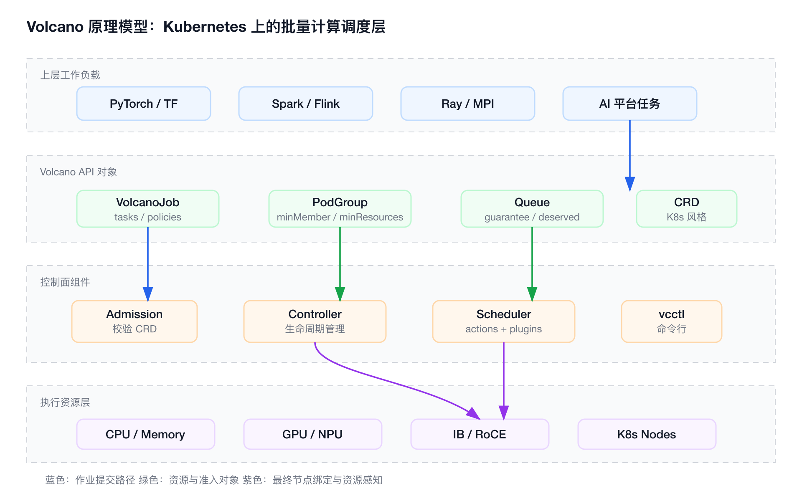
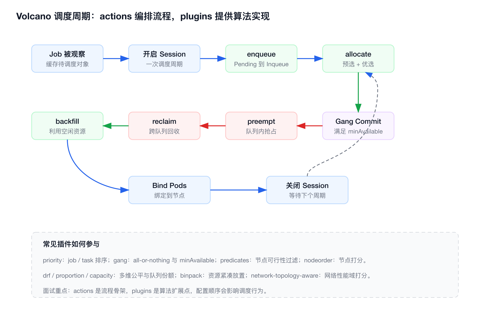
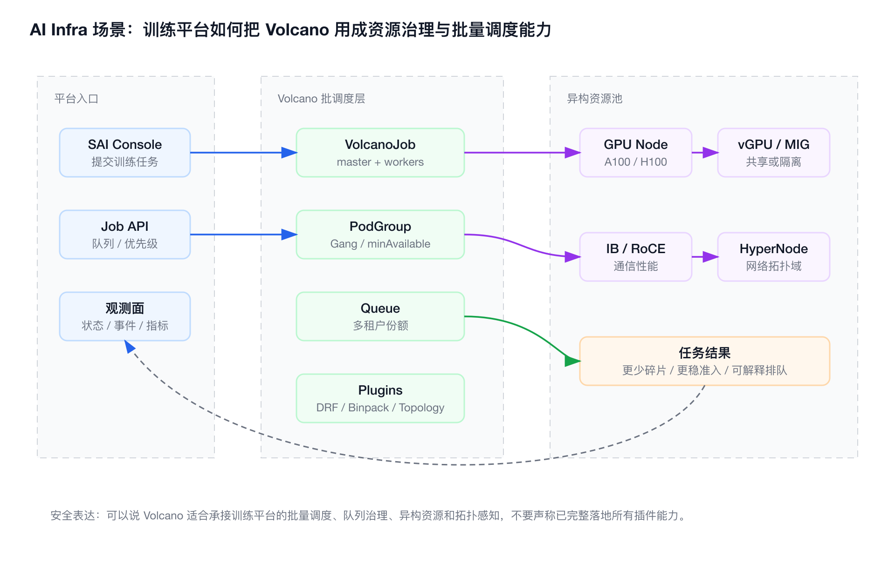
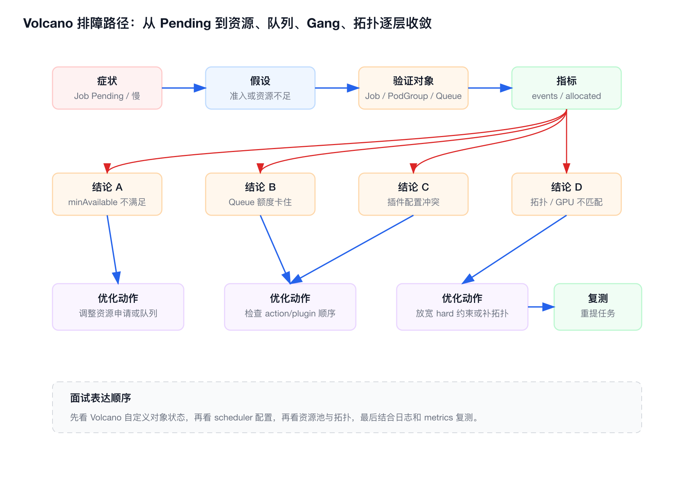
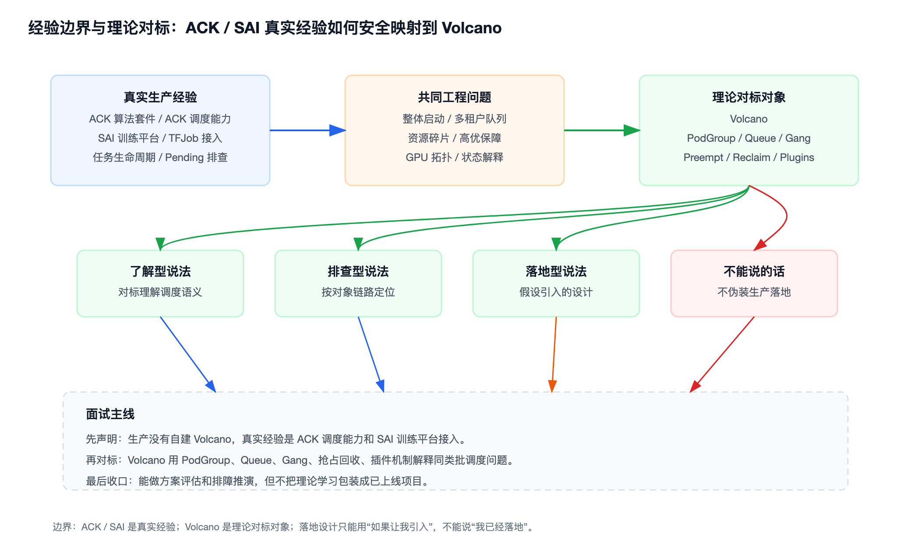

# 经验边界

```yaml
tech_point: Volcano
experience_level: adjacent_production_experience
real_production_experience: 生产中使用 ACK 算法套件 / ACK 调度能力承接训练任务调度
adjacent_experience: SAI / AI 训练平台、TFJob 平台化、训练任务生命周期、资源声明、Pending 排查、状态观测
not_claimed_experience:
  - 没有直接自建 Volcano
  - 没有生产维护 Volcano Scheduler
  - 没有改过 Volcano 源码
  - 不编造 Volcano 线上收益、规模、故障案例
```

我生产中没有直接自建 Volcano。真实生产经验是使用 ACK 算法套件 / ACK 调度能力承接训练任务，把 TFJob、CronJob 等训练任务的平台接入、资源声明、状态展示、失败诊断和生命周期做清楚。

Volcano 对我来说不是“已落地项目”，而是 Kubernetes 批调度领域的代表性开源实现。准备它的目的，是用它对标理解 Gang Scheduling、PodGroup、Queue、Preemption、Reclaim、Binpack、DRF、GPU 共享、网络拓扑感知这些通用调度语义。

面试中必须先声明边界：我没有在生产里自建过 Volcano。我们生产使用的是 ACK 算法套件 / ACK 调度能力。但 Volcano 解决的问题和我在训练平台里处理的任务调度、资源声明、Pending 排查、多租户 GPU 资源治理是一类问题，所以我用 Volcano 做理论对标和方案推演。

# 面试定位卡

- **技术点**：Volcano，Kubernetes 上面向 AI、大数据、HPC 等高性能批量计算场景的调度与作业管理系统。
- **所属领域**：Cloud Native / Kubernetes Scheduler / AI Infra / 批量计算资源治理。
- **经验定位**：相邻生产经验，不是直接 Volcano 生产经验。
- **面试价值**：
  - 能解释为什么默认 kube-scheduler 偏 Pod 级调度，不够支撑复杂训练任务。
  - 能把 ACK 托管调度能力背后的通用语义讲清楚，而不是只说“云厂商帮我们做了”。
  - 能从平台接入者视角上升到调度体系理解者视角。
- **常见考法**：
  - Volcano 和 Kubernetes default-scheduler 的区别。
  - PodGroup、Queue、VolcanoJob 分别解决什么问题。
  - Gang、DRF、Binpack、Preempt、Reclaim、Backfill 的取舍。
  - 多租户 GPU 资源、队列配额、资源碎片、网络拓扑如何治理。
  - Job Pending 时不能只看 Pod，应该怎么按对象链路排查。
  - 没有生产用过 Volcano，为什么还能讲它。
- **适合挂钩项目**：SAI / AI 训练平台、ACK 算法套件接入、TFJob 平台化、训练任务生命周期、GPU 资源治理、Pending 诊断和状态回写。
- **不适合夸大的地方**：不能说“我落地了 Volcano 全量调度体系”，只能说“我基于 ACK / 训练平台经验，对标理解 Volcano 的批调度语义，并能做方案分析和排障推演”。

# 为什么需要它

- **面试高频**：大厂面试问 Volcano，本质通常不是考 API 背诵，而是考候选人是否理解训练任务为什么需要批调度、队列、公平性和整体准入。
- **和真实经验相邻**：生产中虽然是 ACK 算法套件，但平台侧仍然要处理任务提交、资源规格、队列/优先级、Pending 展示、失败回写，这些和 Volcano 的问题域高度重合。
- **能解释托管能力背后的通用语义**：ACK 把很多调度能力产品化，Volcano 则把这些语义显式暴露成开源对象和插件，适合拿来拆解。
- **能补齐认知层级**：只会说“用了云厂商调度”偏平台接入；能讲 Gang、Queue、Preemption、DRF、拓扑感知，才像理解训练调度体系。
- **能支持技术选型讨论**：如果面试官问“为什么不用 Volcano”或“如果让你落地怎么做”，可以从自建成本、托管收益、兼容性、可观测、回滚和风险控制回答。

# 三十秒回答

Volcano 是 Kubernetes 生态里面向 AI、大数据和 HPC 批量计算的调度系统。它补足 default-scheduler 偏 Pod 级调度的不足，把调度提升到 Job、PodGroup 和 Queue 维度。

我生产中没有直接自建 Volcano，使用的是 ACK 算法套件 / ACK 调度能力。但 Volcano 的 Gang、PodGroup、Queue、Preemption、Reclaim、Binpack、DRF 等能力，和训练平台里处理分布式任务整体启动、多租户 GPU 资源治理、Pending 排查是一类问题。

它的代价是调度语义更复杂，队列配额、minAvailable、插件顺序、抢占回收和拓扑约束配置不当时，作业可能长期 Pending 或资源利用率下降。面试里我会重点讲清楚：它解决什么问题、和 ACK 经验怎么映射、如果让我落地怎么设计、线上 Pending 怎么按对象链路排查，以及哪些内容不能夸大成生产经验。

# 它解决什么问题

- **分布式训练不能只启动部分 Worker**
  - **Volcano 对应能力**：Gang Scheduling / PodGroup。
  - **面试表达**：避免部分 Pod 占住 GPU 但任务无法真正运行。
- **多团队共享 GPU 资源**
  - **Volcano 对应能力**：Queue / guarantee / deserved / capability / weight。
  - **面试表达**：资源治理不能只靠 namespace，要有队列份额、上限、借用和回收。
- **高优任务需要资源让渡**
  - **Volcano 对应能力**：Priority / Preempt / Reclaim。
  - **面试表达**：同队列看抢占，跨队列看回收，不能混成一个概念。
- **大规格任务长期 Pending**
  - **Volcano 对应能力**：Binpack / ResourceStrategyFit / 拓扑约束。
  - **面试表达**：不能只看集群总资源，要看碎片、单节点能力、GPU 型号和拓扑域。
- **大模型训练通信开销高**
  - **Volcano 对应能力**：Network Topology Aware Scheduling / HyperNode。
  - **面试表达**：节点有 GPU 不等于适合训练，跨交换机通信可能成为瓶颈。
- **小作业独占 GPU 浪费**
  - **Volcano 对应能力**：deviceshare / HAMI-core / Dynamic MIG。
  - **面试表达**：GPU 共享能提升利用率，但不能无损替代独占 GPU。
- **Pending 原因难解释**
  - **Volcano 对应能力**：Job / PodGroup / Queue / Event / Scheduler logs。
  - **面试表达**：批调度排障不能只看单个 Pod describe。
- **平台需要给用户解释排队原因**
  - **Volcano 对应能力**：调度状态回写 / 可观测。
  - **面试表达**：平台要把队列不足、Gang 条件不满足、碎片、拓扑约束转成用户可理解的信息。

# 核心概念表

- **VolcanoJob**
  - **一句话定义**：Volcano 自定义的批作业资源，用来表达多 task、生命周期策略、调度器、队列和优先级等作业级语义。
  - **解决的问题**：Kubernetes Job 更偏一次性任务完成语义，不能完整表达训练任务的多角色、整体准入和队列治理。
  - **经验映射**：对应平台侧的 TFJob / 训练任务模板，需要把用户任务翻译成底层调度系统可理解的资源语义。
  - **可能追问**：VolcanoJob 和 Kubernetes Job 差异是什么？是否一定要用 VolcanoJob 才能使用 Volcano 调度？
- **PodGroup**
  - **一句话定义**：一组强关联 Pod 的调度组，用于表达最小成员数、最小资源、队列、优先级等 Job 级调度信息。
  - **解决的问题**：让调度器知道多个 Pod 属于同一个作业，而不是孤立调度。
  - **经验映射**：TFJob 的 Worker、PS、Chief 不是完全独立的 Pod，排查时要看 Job 级整体条件。
  - **可能追问**：PodGroup 没有 Inqueue 时，为什么可能没有创建出大量 Pending Pod？
- **Queue**
  - **一句话定义**：一组 PodGroup 的集合，也是 Volcano 做资源划分、优先级、抢占和回收的核心边界。
  - **解决的问题**：多租户共享 GPU 资源时，需要队列份额、保底、上限、借用和回收。
  - **经验映射**：对应算法团队、任务类型、优先级或资源池的治理模型。
  - **可能追问**：guarantee、deserved、capability、weight 分别是什么？Queue 和 Namespace 是一回事吗？
- **Gang Scheduling**
  - **一句话定义**：满足最小运行条件后才整体调度，否则不调度。
  - **解决的问题**：避免分布式训练只启动部分 Worker，任务不能推进却占住 GPU。
  - **经验映射**：对应训练任务的整体可运行条件，不是单 Pod 可运行就算成功。
  - **可能追问**：Gang 会不会降低资源利用率？如何结合 backfill 或拆分任务缓解？
- **Actions**
  - **一句话定义**：调度周期中的动作，例如 enqueue、allocate、backfill、preempt、reclaim。
  - **解决的问题**：把批调度拆成入队、分配、回填、抢占、回收等阶段。
  - **经验映射**：Pending 诊断时要知道作业卡在哪个调度阶段。
  - **可能追问**：为什么 enqueue 会影响 Pod 创建和后续抢占回收？
- **Plugins**
  - **一句话定义**：调度算法扩展点，例如 gang、priority、DRF、predicates、nodeorder、binpack、proportion、deviceshare、network-topology-aware。
  - **解决的问题**：让调度流程可以按业务场景组合不同过滤、排序、打分、抢占和回收逻辑。
  - **经验映射**：对应平台调度策略的可配置能力，而不是一个固定算法。
  - **可能追问**：action 和 plugin 的关系是什么？
- **Preempt / Reclaim**
  - **一句话定义**：Preempt 偏同 Queue 内高优抢占低优，Reclaim 偏跨 Queue 回收被借用资源。
  - **解决的问题**：资源紧张时让高优任务或应得资源队列拿回资源。
  - **经验映射**：对应在线/离线、高优/低优、临时/周期任务之间的资源让渡。
  - **可能追问**：为什么抢占必须结合 checkpoint、优雅终止和重试策略？
- **DRF / Proportion / Capacity**
  - **一句话定义**：DRF 解决多维资源公平，proportion 按权重计算份额，capacity 通过显式 deserved 做资源容量管理。
  - **解决的问题**：GPU、CPU、内存混合资源场景下，不能只按单一资源做公平。
  - **经验映射**：对应多团队共享 GPU 池时的公平性和配额设计。
  - **可能追问**：为什么只看 GPU 数量可能不公平？
- **Binpack / ResourceStrategyFit**
  - **一句话定义**：Binpack 倾向紧凑放置减少碎片，ResourceStrategyFit 支持按资源类型独立选择 MostAllocated / LeastAllocated 等策略。
  - **解决的问题**：异构资源下，不同资源可能需要不同放置策略。
  - **经验映射**：大规格 GPU 任务 Pending 时，要同时看碎片、GPU 型号、单节点能力和调度策略。
  - **可能追问**：AI 训练是否一定应该 Binpack？
- **Network Topology Aware Scheduling**
  - **一句话定义**：通过 HyperNode 表达网络拓扑性能域，让任务尽量落在低延迟、高吞吐的节点集合内。
  - **解决的问题**：大模型训练跨节点通信频繁，节点间网络距离会影响训练吞吐。
  - **经验映射**：对应 GPU/NIC/交换机拓扑对训练性能的影响。
  - **可能追问**：hard 和 soft 模式怎么取舍？
- **GPU 虚拟化 / deviceshare**
  - **一句话定义**：通过 HAMI-core 软件 vGPU 或 Dynamic MIG 硬件切片，提高 GPU 共享利用率。
  - **解决的问题**：小模型、推理或轻量训练独占整卡会浪费。
  - **经验映射**：对应 GPU 资源规格化、共享、隔离和成本治理。
  - **可能追问**：为什么 vGPU 不能无损替代独占 GPU？

# 原理模型



## 基础设施层

- Kubernetes 提供 Node、Pod、API Server、CRD、Controller、Scheduler 扩展机制。
- GPU/NPU、IB/RoCE、NVSwitch、NUMA、MIG、交换机拓扑是真正影响 AI 训练成本和性能的底层资源。
- Volcano 不替代 Kubernetes，而是在 Kubernetes 之上增加批量计算需要的作业、队列和调度语义。

## 容器 / Kubernetes 层

- CRD 层提供 Queue、PodGroup、VolcanoJob、HyperNode 等对象。
- ControllerManager 管理 Queue、PodGroup、VolcanoJob 等 CRD 生命周期。
- Admission 做 Volcano CRD API 校验。
- Scheduler 通过 actions 和 plugins 执行调度逻辑，最终把 Pod 绑定到合适节点。
- vcctl 是 Volcano 的命令行工具，适合作为运维和调试入口。

## AI Infra 层

- 训练平台不应该把所有 Kubernetes 和 Volcano 细节暴露给算法用户，而是把资源规格、队列、优先级、重试、拓扑偏好封装成任务提交参数。
- Volcano 的价值是把“任务提交背后的调度决策”做成可解释、可排查、可治理的对象模型。
- 对 SAI 这类平台来说，Volcano 可以被理解为批调度底座候选；真实生产中如果已经用了 ACK 托管能力，就应该把 Volcano 作为对标对象，而不是伪装成当前底座。

## 应用 / 业务层

- 用户关注训练能否启动、为什么排队、为什么被抢占、失败是否重试、为什么跑得慢。
- 平台关注 GPU 利用率、队列公平性、作业等待时间、跨节点通信效率、失败恢复和成本。
- 面试表达时要把 Volcano 讲成“批调度与资源治理能力”，不要讲成训练框架、模型平台或业务生命周期系统。

# 关键机制



## Gang Scheduling 与 PodGroup 准入

**解决的问题**：

分布式训练、MPI、Spark 等作业需要多个 Pod 同时满足运行条件。如果只调度其中一部分，作业无法推进，还会占住 GPU、CPU 和网络资源。

**工作方式**：

- PodGroup 表达一组强关联 Pod。
- minMember 表示最少需要运行的 Pod 或任务数量。
- minResources 表示运行这组任务所需的最小资源。
- 只有整体条件满足后，作业才进入后续调度。

**代价**：

- minAvailable / minMember 设置过高会导致长期 Pending。
- 资源碎片较多时，Gang 会让作业看起来“总资源够但起不来”。
- 大小任务混跑时，需要结合 backfill、binpack、队列策略避免资源空洞。

**面试追问**：

如果一个 8 worker 训练任务只跑起来 3 个 worker，应该看 Pod 还是 PodGroup？为什么？

## Queue 资源治理

**解决的问题**：

多个团队共用 GPU 集群时，需要既保证隔离，又允许空闲资源被借用，否则要么互相抢资源，要么整体利用率低。

**工作方式**：

- guarantee 表示队列保底资源。
- deserved 表示队列应得资源，capacity 插件会使用它。
- capability 表示队列资源使用上限。
- weight 用于 proportion 插件计算份额。
- priority、reclaimable 影响入队、抢占和回收行为。

**代价**：

- guarantee 过高会降低共享效率。
- capability 过低会让队列无法吃到空闲资源。
- capacity 显式维护 deserved，集群弹性伸缩时要同步调整。
- proportion 灵活，但权重设计不当会引发新的不公平。

**面试追问**：

一个队列已经超过 deserved 但没有超过 capability，它还能继续使用资源吗？什么时候会被回收？

## Actions 与 Plugins

**解决的问题**：

AI/HPC 调度不是简单的“能不能放到节点上”，还包括入队、分配、回填、公平性、抢占、回收、拓扑偏好等多阶段逻辑。

**工作方式**：

- actions 定义流程，例如 enqueue、allocate、backfill、preempt、reclaim。
- plugins 提供算法，例如 gang、priority、DRF、predicates、nodeorder、binpack、proportion、network-topology-aware。
- scheduler 配置中的 actions 顺序和 tiers 插件组合会影响最终行为。

**代价**：

- 配置可扩展也意味着更容易配置错。
- enqueue 与 preempt/reclaim 的组合要特别小心，因为 PodGroup 不能入队时，Pod 创建和后续抢占回收链路可能都受影响。
- 插件越多，越需要事件、日志、metrics 解释调度结果。

**面试追问**：

为什么说 action 是流程骨架，plugin 是算法扩展点？如果作业没有进入 Inqueue，后面的 allocate 还能正常工作吗？

## Preempt 与 Reclaim

**解决的问题**：

资源紧张时，高优作业要有机会获得资源；队列借出去的资源也要在需要时可回收。

**工作方式**：

- Preempt 主要处理同 Queue 内高优 Job 或 Task 抢占低优对象。
- Reclaim 主要处理跨 Queue 资源回收，从超额使用或可回收队列中归还资源。
- priorityClassName、Queue priority、reclaimable、deserved 等会影响结果。

**代价**：

- 抢占和回收会带来作业重启、训练中断、资源震荡。
- 如果没有 checkpoint、优雅终止和重试策略，抢占可能造成更大浪费。
- 过度依赖抢占会掩盖队列配额和容量规划问题。

**面试追问**：

Preempt 和 Reclaim 最大区别是什么？在线高优队列资源不足时，更应该想到哪个机制？

## Binpack、ResourceStrategyFit 与资源碎片

**解决的问题**：

GPU 训练任务经常因为资源碎片、单节点规格不足、GPU 型号不匹配而 Pending。集群总 GPU 数量够，不代表某个大规格作业可调度。

**工作方式**：

- Binpack 倾向把资源紧凑放到部分节点，减少碎片，便于大任务或后续缩容。
- Spread 倾向分散负载，降低单节点热点和故障域风险。
- Volcano v1.13 引入 ResourceStrategyFit，可按资源类型独立设置 MostAllocated / LeastAllocated，并支持稀缺资源避让。

**代价**：

- Binpack 可能造成节点热点。
- Spread 可能增加碎片，影响大规格任务。
- 不同 GPU 型号、CPU、内存、NUMA、网络拓扑之间不能只用一个简单策略覆盖。

**面试追问**：

AI 训练是不是都应该 Binpack？什么时候反而要考虑 Spread 或按资源类型独立策略？

## 网络拓扑感知调度

**解决的问题**：

大模型训练中模型并行会产生大量节点间通信。跨交换机越多，通常延迟越高、吞吐越低，训练效率可能下降。

**工作方式**：

- Volcano 用 HyperNode CRD 表达网络拓扑性能域。
- HyperNode 可以形成树状层级，映射交换机、机架或其他性能域。
- Job 或 PodGroup 可通过 networkTopology 设置 hard 或 soft 模式。
- hard 要求任务落在允许拓扑范围内，否则 Pending；soft 尽量优化但允许放宽。
- 新版本支持 HyperNode 自动发现，包含基于 UFM、RoCE、节点标签等方式。

**代价**：

- hard 约束提升性能确定性，但牺牲可调度性。
- HyperNode 信息必须和真实拓扑一致，否则会误导调度。
- 自动发现涉及凭证、RBAC、TLS、同步间隔和控制面可靠性。

**面试追问**：

为什么“节点还有 GPU”不等于“这个训练作业适合被调度过去”？

## GPU 虚拟化与 deviceshare

**解决的问题**：

小模型、推理或轻量训练独占整张 GPU 会造成浪费，但共享 GPU 又要面对显存、算力和隔离问题。

**工作方式**：

- HAMI-core 通过软件方式做 vGPU。
- Dynamic MIG 基于 NVIDIA MIG 做硬件切片。
- deviceshare 插件让调度器理解 vGPU 资源，可结合 binpack 或 spread 策略。

**代价**：

- 软件 vGPU 隔离强度不如 MIG。
- MIG 依赖支持 MIG 的硬件。
- 显存请求可能受 MIG 实例规格影响，不总是等于用户请求值。
- 关键训练任务仍要评估独占 GPU、MIG、共享 GPU 的性能和稳定性差异。

**面试追问**：

为什么 vGPU 更适合小作业或推理，关键训练任务反而可能需要独占或硬件切片？

# 如果让我落地，我会怎么设计

这里必须以“假设落地”为前提，不能说成已经做过。

## 技术选型

- 先判断是否继续使用 ACK 算法套件 / ACK 调度能力，还是自建 Volcano。
- 如果云厂商托管能力已经覆盖 Gang、队列、优先级、资源治理和可观测，优先考虑托管能力，降低维护成本。
- 如果需要更强的开源可控性、插件定制、跨云一致性或深度调度策略，才评估自建 Volcano。
- 选型时不能只看功能，还要看团队是否能维护 scheduler、controller、CRD 兼容、升级、监控和故障处理。

## 接入方式

- 训练任务模板中支持 schedulerName。
- 明确 TFJob / PyTorchJob / VolcanoJob / PodGroup 的对象转换关系。
- 平台侧暴露队列、优先级、资源规格、GPU 型号、拓扑偏好等字段。
- 先选择低风险训练任务灰度，不直接切核心任务。

## 队列设计

- 按团队、业务线、任务类型或环境划分 Queue。
- 设计 guarantee、deserved、capability、weight、priority、reclaimable。
- 区分临时实验、周期训练、核心任务、补数据任务。
- 高优任务可以有资源保障，但低优任务必须有 checkpoint、重试和可恢复机制。

## 资源治理

- 对大规格任务考虑 Binpack、ResourceStrategyFit、GPU 型号、单节点能力和拓扑约束。
- 对小模型或推理任务评估 vGPU / MIG，避免整卡浪费。
- 对跨节点强通信任务评估 networkTopology hard/soft。
- 对在线离线混部场景明确抢占、回收和保护窗口。

## 可观测和平台集成

- 把 TFJob、Pod、PodGroup、Queue、Node、Scheduler Event、Scheduler metrics 统一回写到平台。
- 平台页面不要只显示 Pending，要显示具体原因：队列不足、Gang 条件不满足、资源碎片、GPU 型号不匹配、拓扑约束不满足、PVC/镜像/启动失败。
- 增加队列水位、等待时间、调度耗时、资源碎片、抢占次数、作业重试次数等指标。
- 为用户提供可理解的建议，例如降低 worker 数、换 GPU 型号、切换队列、放宽 soft topology。

## 风险控制

- 灰度接入低风险任务。
- 保留默认调度路径和回滚开关。
- 抢占策略先观测再放开，避免一开始过激。
- 升级 Volcano 前验证 CRD、scheduler config、plugins、controller 行为兼容性。
- 对平台侧的状态回写、失败解释和用户通知做兜底。

# 典型业务场景



- **分布式训练 Gang 调度**
  - **为什么相关**：PyTorch、TensorFlow、MPI 任务通常包含多个角色，部分启动没有业务意义。
  - **可能现象**：Pod 一部分 Running，一部分 Pending；GPU 被占用但训练不推进。
  - **排查方式**：看 VolcanoJob minAvailable、PodGroup minMember/minResources、PodGroup conditions、scheduler events。
  - **优化方向**：合理设置 minAvailable，减少过度刚性的资源请求，结合 checkpoint 和重试策略。
- **多租户 GPU 队列治理**
  - **为什么相关**：算法、推荐、图像、离线实验等团队共享 GPU 池，需要份额、优先级、借用和回收。
  - **可能现象**：低优队列占满 GPU，高优任务排队；或者 guarantee 设置过高导致空闲资源不能被利用。
  - **排查方式**：看 Queue allocated、capability、deserved、guarantee、reclaimable、priority，以及 scheduler 配置。
  - **优化方向**：区分基础保障和弹性借用，设计 proportion/capacity 策略，明确哪些队列可被回收。
- **大模型训练网络拓扑优化**
  - **为什么相关**：模型并行任务跨节点通信频繁，节点间网络拓扑会影响训练吞吐。
  - **可能现象**：GPU 利用率低、通信等待高、同样资源规格下训练速度波动大。
  - **排查方式**：看是否启用 network-topology-aware 插件、HyperNode 是否存在、Job networkTopology 是 hard 还是 soft。
  - **优化方向**：用 HyperNode 表达交换机或性能域，强通信任务优先调度到更近拓扑范围。
- **小模型或推理任务 GPU 共享**
  - **为什么相关**：小作业独占整卡会造成 GPU 成本浪费。
  - **可能现象**：GPU 利用率低，但调度层面看资源已被占满；显存碎片或实例规格不匹配。
  - **排查方式**：看节点 allocatable 是否有 vGPU 资源，检查 deviceshare 插件和 Pod 注解。
  - **优化方向**：HAMI-core 适合更通用的软件共享，MIG 适合需要硬隔离的性能敏感任务。
- **在线离线混部与资源回收**
  - **为什么相关**：在线服务 SLA 和离线训练吞吐经常争用同一集群资源。
  - **可能现象**：离线任务占用过多资源，高优任务无法获得资源。
  - **排查方式**：看队列优先级、reclaimable、preempt/reclaim 是否启用，作业是否可被安全驱逐。
  - **优化方向**：离线队列允许借用但可回收；关键任务结合 checkpoint 降低抢占损失。
- **多集群 AI 作业调度**
  - **为什么相关**：单个 Kubernetes 集群无法满足大规模训练和推理任务时，需要跨集群资源视角。
  - **可能现象**：某个集群资源紧张但其他集群空闲，用户仍然排队。
  - **排查方式**：区分单集群 Volcano 和 Volcano Global；看全局队列、作业优先级、分发对象和目标集群约束。
  - **优化方向**：多集群分发要同时处理镜像、数据、网络、配额和可观测一致性。

# 排障路径



排障口径不要只背命令，要按“症状 → 假设 → 验证 → 指标 → 结论 → 优化 → 复测”讲。

## VolcanoJob 长期 Pending

- **症状**：训练任务长期 Pending，用户只看到“资源不足”或“排队中”。
- **初始假设**：作业没有满足 PodGroup 最小资源 / 最小成员数，或者 Queue 不允许入队。
- **验证命令**：

```bash
kubectl get vcjob -A
kubectl describe vcjob -n <namespace> <job-name>
kubectl get podgroup -n <namespace>
kubectl describe podgroup -n <namespace> <podgroup-name>
```

- **这组命令验证什么**：
  - VolcanoJob 是否处于 Pending、Running、Failed。
  - PodGroup 是否有 Unschedulable、Inqueue、Scheduled 等条件。
  - minAvailable、minMember、minResources 是否过高。
- **重点看什么**：
  - PodGroup conditions 的 reason 和 message。
  - 是否出现 NotEnoughResources。
  - Job 是否已经生成 Pod，还是卡在入队前。
- **可能结论**：
  - 如果 PodGroup 还没 Inqueue，优先排查 enqueue、Queue 配额和最小资源。
  - 如果已经 Inqueue 但 Pod 仍 Pending，继续排查节点资源、predicate、nodeorder、GPU 或拓扑约束。

## 某个队列一直排队

- **症状**：一个团队任务一直排队，其他队列却还在运行。
- **初始假设**：队列份额、优先级、reclaimable 或 reclaim/preempt 配置不符合预期。
- **验证命令**：

```bash
kubectl get queue
kubectl describe queue <queue-name>
kubectl get configmap volcano-scheduler-configmap -n volcano-system -o yaml
```

- **这组命令验证什么**：
  - Queue 的 allocated、state、guarantee、deserved、capability、weight、priority、reclaimable。
  - scheduler 是否启用了 preempt、reclaim、proportion、capacity 等相关配置。
- **重点看什么**：
  - guarantee、deserved、capability 是否符合预期。
  - 队列是否 Closed 或 Closing。
  - action 顺序里是否包含需要的 preempt/reclaim。
- **可能结论**：
  - capability 太小，即使集群有空闲资源，该队列也无法继续扩张。
  - 队列超过 deserved 且 reclaimable=true，可能会被其他队列回收。
  - enqueue 阻止作业入队时，可能不会生成可触发抢占/回收的 Pending Pod。

## 集群总 GPU 够，但大任务起不来

- **症状**：看总资源似乎足够，但 8 卡或 16 卡任务一直 Pending。
- **初始假设**：资源碎片、单节点能力、GPU 型号、NUMA、拓扑、亲和性或污点约束不满足。
- **验证命令**：

```bash
kubectl describe pod -n <namespace> <pod-name>
kubectl get node -o wide
kubectl describe node <node-name>
kubectl get configmap volcano-scheduler-configmap -n volcano-system -o yaml
```

- **这组命令验证什么**：
  - 单 Pod 资源请求是否超过单节点能力。
  - GPU 型号、nodeSelector、affinity、taint/toleration 是否限制过严。
  - binpack、nodeorder、ResourceStrategyFit 等策略是否符合预期。
- **重点看什么**：
  - 不是只看集群总 GPU，要看每个节点剩余 GPU、显存、CPU、内存。
  - GPU 型号是否匹配。
  - 是否因为亲和性或拓扑约束导致可选节点过少。
- **可能结论**：
  - 总资源够但连续资源不够，是碎片问题。
  - 单节点规格不足，是资源规格或任务拆分问题。
  - GPU 型号或拓扑限制过严，需要调整约束或队列策略。

## 分布式训练能启动但性能差

- **症状**：任务 Running，但 GPU 利用率低、step time 波动大、通信等待高。
- **初始假设**：节点选择没有考虑网络拓扑、GPU/NIC 拓扑、NUMA 或同机亲和性。
- **验证命令**：

```bash
kubectl get hypernodes
kubectl describe hypernode <hypernode-name>
kubectl describe vcjob -n <namespace> <job-name>
kubectl get configmap volcano-scheduler-configmap -n volcano-system -o yaml
```

- **这组命令验证什么**：
  - 是否存在 HyperNode 资源。
  - Job 是否配置 networkTopology。
  - scheduler 是否启用 network-topology-aware 插件。
- **重点看什么**：
  - networkTopology.mode 是 hard 还是 soft。
  - highestTierAllowed 是否过严。
  - HyperNode 层级是否覆盖真实节点。
- **可能结论**：
  - hard 约束过严会提升性能确定性，但可能导致等待时间变长。
  - HyperNode 信息缺失或错误，会让调度器无法做正确拓扑决策。

## vGPU 任务无法调度或显存不符合预期

- **症状**：vGPU 任务 Pending，或实际显存切片与用户请求不一致。
- **初始假设**：设备插件、deviceshare 插件、节点 allocatable 或 Pod 注解配置不正确。
- **验证命令**：

```bash
kubectl get node <node-name> -o yaml
kubectl get pod -n <namespace> <pod-name> -o yaml
curl http://<volcano-scheduler-ip>:8080/metrics
```

- **这组命令验证什么**：
  - 节点是否暴露 vGPU 资源。
  - Pod 是否设置 vGPU 模式或相关资源请求。
  - 调度器 metrics 是否有调度失败或资源不足迹象。
- **重点看什么**：
  - HAMI-core 与 MIG 模式是否匹配硬件能力。
  - MIG 实例规格是否能满足请求。
  - binpack / spread 策略是否符合目标。
- **可能结论**：
  - 软件 vGPU 隔离强度有限，不能把它当成独占 GPU。
  - MIG 规格不连续，实际分配可能受硬件实例规格约束。
  - 没有 deviceshare 或设备插件，调度器无法理解 vGPU 资源。

## 平台侧复盘

- **优化动作**：
  - 降低过高的 minAvailable/minResources，或拆分大作业。
  - 调整 Queue guarantee/deserved/capability/weight。
  - 明确 action 顺序和 plugin 组合，不只看 YAML 是否存在。
  - 对强通信任务使用 networkTopology，资源紧张时用 soft 或放宽 tier。
  - 对可中断训练补 checkpoint，再考虑 preempt/reclaim。
  - 把失败原因回写到平台侧，形成用户可理解的诊断。
- **复测方式**：
  - 重提同规格测试 Job。
  - 对比 PodGroup 从 Pending 到 Inqueue 到 Running 的状态时间。
  - 对比 GPU 利用率、作业等待时间、训练 step time、scheduler 日志和 metrics。

# 横向对比

- **Volcano vs Kubernetes default-scheduler**
  - **区别**：default-scheduler 以 Pod 调度为核心；Volcano 面向 Job / PodGroup / Queue，强调批量计算和多任务协同。
  - **什么时候用**：普通在线服务用 default-scheduler 足够；分布式训练、HPC、大数据、资源队列治理更适合 Volcano。
  - **面试注意点**：不要说 Volcano 替代 Kubernetes，它是 Kubernetes 上的批调度扩展。
- **Volcano vs ACK 算法套件 / ACK 调度能力**
  - **区别**：Volcano 是开源实现，ACK 是云厂商托管能力。前者适合理解对象模型和插件机制，后者适合降低自维护成本。
  - **什么时候用**：生产已经在 ACK 上且能力满足时，优先托管；需要开源可控、跨云一致或深度定制时评估 Volcano。
  - **面试注意点**：我的生产经验在 ACK，不在 Volcano；Volcano 是对标学习对象。
- **VolcanoJob vs Kubernetes Job**
  - **区别**：Kubernetes Job 关注一次性任务完成；VolcanoJob 增强调度器指定、minAvailable、tasks、policies、plugins、queue 和优先级。
  - **什么时候用**：单 Pod 或简单并行 Job 可用 Kubernetes Job；多角色、多 worker、需要 Gang 和队列治理时用 VolcanoJob。
  - **面试注意点**：VolcanoJob 是调度语义更强，不是业务工作流引擎。
- **PodGroup vs Pod**
  - **区别**：Pod 是最小运行单元；PodGroup 表达一组强相关 Pod 的共同准入和状态。
  - **什么时候用**：worker 之间强依赖、必须整体可用时需要 PodGroup。
  - **面试注意点**：排查批作业 Pending 时，不要只盯单个 Pod events，要看 PodGroup conditions。
- **Preempt vs Reclaim**
  - **区别**：Preempt 侧重同 Queue 内优先级抢占；Reclaim 侧重跨 Queue 资源归还。
  - **什么时候用**：同团队内高优任务插队看 Preempt；多租户队列份额恢复看 Reclaim。
  - **面试注意点**：二者都可能驱逐任务，但触发语义不同。
- **Capacity vs Proportion**
  - **区别**：capacity 显式配置 deserved；proportion 通过 weight 自动计算 deserved。
  - **什么时候用**：份额固定、层级队列精细治理可考虑 capacity；集群资源动态变化、希望按权重分配可考虑 proportion。
  - **面试注意点**：capacity 在弹性伸缩场景下要关注 deserved 是否随集群总量变化。
- **Binpack vs Spread**
  - **区别**：binpack 倾向填满部分节点减少碎片；spread 倾向分散负载。
  - **什么时候用**：希望节省节点、便于缩容、减少碎片时考虑 binpack；希望容灾、降低热点时考虑 spread。
  - **面试注意点**：AI 训练不一定总是 binpack，通信拓扑、GPU 类型和故障域也会影响选择。
- **Network Topology hard vs soft**
  - **区别**：hard 是硬约束，不满足就 Pending；soft 是尽力优化，资源不足时允许跨拓扑域。
  - **什么时候用**：强通信瓶颈、性能确定性优先用 hard；可调度性优先或资源紧张时用 soft。
  - **面试注意点**：hard 不是越严格越好，要权衡等待时间和通信收益。
- **Volcano vs Kueue**
  - **区别**：Volcano 是完整批调度系统和 scheduler 实现；Kueue 更偏 Kubernetes 原生批任务准入、排队和配额管理，通常与 kube-scheduler 等调度器协作。
  - **什么时候用**：需要完整调度器、Gang、插件和复杂放置策略时关注 Volcano；希望更贴近 Kubernetes 原生 Job 准入和资源配额时关注 Kueue。
  - **面试注意点**：不要把二者说成完全替代关系，要从“调度器实现 vs 队列准入控制”角度比较。

# 和项目的安全连接



## 经验映射清单

- **Volcano Scheduler**
  - **我的真实经验映射**：ACK 算法套件 / ACK 调度能力。
  - **面试中能怎么说**：我没有维护 Volcano Scheduler，但生产使用过托管调度能力承接训练任务。
- **PodGroup / Gang**
  - **我的真实经验映射**：TFJob 多副本整体启动语义。
  - **面试中能怎么说**：分布式训练不能只看单个 Pod，要看整个 Job 是否满足最小可运行条件。
- **Queue**
  - **我的真实经验映射**：团队资源池、任务队列、配额、优先级。
  - **面试中能怎么说**：多团队共享 GPU 时，需要资源份额、借用、回收和优先级治理。
- **Preempt / Reclaim**
  - **我的真实经验映射**：高低优任务资源让渡。
  - **面试中能怎么说**：高优任务要有保障，但低优任务必须可恢复，不能粗暴驱逐。
- **Binpack / ResourceStrategyFit**
  - **我的真实经验映射**：GPU 资源碎片治理。
  - **面试中能怎么说**：大规格任务 Pending 时，集群总 GPU 够不代表单节点或拓扑上可调度。
- **Network Topology**
  - **我的真实经验映射**：GPU/NIC/交换机拓扑、跨节点通信。
  - **面试中能怎么说**：大模型训练里放置位置影响通信效率，拓扑约束要权衡性能和等待时间。
- **Pending 排查**
  - **我的真实经验映射**：TFJob / Pod / Event / 资源约束 / 平台状态回写。
  - **面试中能怎么说**：批调度下要看 Job 级对象、队列、配额、调度事件和节点约束。
- **平台集成**
  - **我的真实经验映射**：SAI 训练平台任务生命周期与状态展示。
  - **面试中能怎么说**：平台负责用户体验和状态解释，调度器负责底层资源决策。

## 了解型说法

我会把 Volcano 放在 AI 训练平台的批调度层来看。SAI 这类平台负责用户提交、任务生命周期、状态展示、资源规格和权限；ACK / 调度能力负责底层资源调度；Volcano 则是我用来理解开源批调度对象模型和插件机制的对标对象。

## 排查型说法

如果训练任务长时间排队，我不会只看 Pod Pending，而是按对象链路排查：业务作业对象是否正常，PodGroup 是否满足 minAvailable/minResources，Queue 是否 Open 且额度足够，scheduler actions/plugins 是否符合预期，最后再看节点 GPU、vGPU、HyperNode、亲和性和调度器日志。

## 实践型说法

如果要在 SAI 类训练平台引入 Volcano，我会先从低风险训练任务灰度，打通 schedulerName、PodGroup、Queue、Priority、状态回写和 Pending 诊断，再评估抢占回收、GPU 共享、网络拓扑和多集群能力。真正落地前必须补齐 checkpoint、回滚、metrics、日志和用户侧排队解释。

## 不能说的话

- 不能说“我们生产用了 Volcano”，除非确实有生产接入和运维事实。
- 不能说“我优化过 Volcano 调度算法”，除非确实改过源码并上线验证。
- 不能说“通过 Volcano 节省了 30% GPU”，除非有真实指标和口径。
- 不能把 Volcano 讲成 SAI 的业务生命周期系统，它只是批调度和资源治理层。

# 面试话术

## 主回答

我生产中没有直接自建过 Volcano，这点我会先说清楚。我们生产中使用的是 ACK 算法套件 / ACK 调度能力，解决的是 TFJob、CronJob 这类训练任务的资源调度、状态观测和生命周期管理问题。

但 Volcano 是 Kubernetes 批调度领域的代表性开源实现，我重点对标学习了它的 Gang Scheduling、PodGroup、Queue、Preemption、Reclaim、Binpack、DRF、GPU 共享和网络拓扑感知。这些能力和我生产中处理的 TFJob 平台化、训练任务 Pending 排查、GPU 资源声明和队列治理是一类问题。

我的理解不是停留在 API，而是关注它为什么存在、如何接入训练平台、如何做资源治理、Pending 怎么排查、如果从 0 到 1 落地应该怎么设计，以及哪些话不能夸大成生产经验。

## 短回答

**问：你们用过 Volcano 吗？**

答：生产没有直接自建 Volcano。我们用的是 ACK 算法套件 / ACK 调度能力。但 Volcano 解决的问题和我们的训练任务调度是一类问题，所以我把它作为开源批调度代表做对标学习。

**问：为什么不用 Volcano？**

答：ACK 已经把很多批调度能力产品化，云厂商维护风险更低。我们平台侧重点是任务接入、生命周期、状态观测和异常诊断。如果要自建 Volcano，需要额外承担 scheduler、controller、CRD、升级和可观测维护成本。

**问：如果让你落地 Volcano，你怎么做？**

答：先从低风险训练任务灰度接入，打通 schedulerName、PodGroup、Queue、Priority、状态回写和 Pending 诊断，再逐步评估抢占回收、GPU 共享和拓扑感知。核心任务接入前要有 checkpoint、回滚和可观测闭环。

**问：线上 Pending 怎么排查？**

答：不能只看 Pod describe。要看业务作业对象、PodGroup、Queue、Priority、资源请求、GPU 型号、nodeSelector、affinity、taint/toleration、拓扑约束、调度事件和调度器日志。

**问：它和你现在的系统有什么关系？**

答：SAI / 训练平台负责用户提交、任务生命周期、状态展示、权限和资源规格；ACK / 调度能力负责底层资源调度。Volcano 可以作为理解底层批调度语义的开源对标对象。

# 风险、边界和误区

- **说法 / 做法**：我们生产用了 Volcano。
  - **问题**：如果真实没有用，面试官一追源码、配置、故障、升级就会被击穿。
  - **更稳妥的表达**：生产用的是 ACK 算法套件 / ACK 调度能力，Volcano 是我对标学习的开源批调度实现。
- **说法 / 做法**：Volcano 是 Kubernetes 的替代品。
  - **问题**：Volcano 是基于 Kubernetes 的批量计算平台和调度扩展，不是替代 Kubernetes。
  - **更稳妥的表达**：Volcano 继承 Kubernetes API 风格，通过 CRD、controller、scheduler 扩展批调度能力。
- **说法 / 做法**：只要用了 Gang，训练任务就一定更快。
  - **问题**：Gang 解决整体准入和资源浪费，不直接提升训练性能。
  - **更稳妥的表达**：Gang 保证强关联任务整体启动，性能还要看 GPU、网络、存储、数据加载和拓扑。
- **说法 / 做法**：Queue 的 guarantee 设置越高越好。
  - **问题**：预留太多会降低资源共享效率。
  - **更稳妥的表达**：guarantee 管底线，deserved 管公平，capability 管上限。
- **说法 / 做法**：Preempt 和 Reclaim 都是抢占，没区别。
  - **问题**：Preempt 多用于同队列内，Reclaim 用于跨队列回收。
  - **更稳妥的表达**：二者都可能驱逐任务，但触发边界和资源治理语义不同。
- **说法 / 做法**：hard 网络拓扑约束总是最好。
  - **问题**：hard 会牺牲可调度性，资源不满足时作业 Pending。
  - **更稳妥的表达**：性能收益明确且可等待时用 hard；资源紧张或吞吐优先时考虑 soft。
- **说法 / 做法**：vGPU 可以无损替代独占 GPU。
  - **问题**：软件 vGPU 和 MIG 都有隔离、性能、规格、硬件依赖差异。
  - **更稳妥的表达**：vGPU 适合提高共享利用率，关键训练任务仍要评估性能隔离和稳定性。
- **说法 / 做法**：通过 Volcano 节省了 30% GPU。
  - **问题**：没有真实数据就是编造收益。
  - **更稳妥的表达**：如果落地，收益应从等待时间、资源利用率、碎片率、抢占损失等指标衡量。

# 不能怎么说

| 不要这么说 | 风险 | 应该这么说 |
|---|---|---|
| 我们生产使用 Volcano 做批调度 | 没有真实经验会被追问配置、升级、故障和源码细节 | 生产用 ACK 算法套件 / ACK 调度能力，Volcano 是理论对标对象 |
| 我负责 Volcano Scheduler 运维 | 如果没有值班、升级、故障处理事实，就是虚构 | 我理解 Volcano Scheduler 的 actions/plugins 机制，能做方案分析 |
| 我优化过 Volcano 调度算法 | 没有 PR、代码和上线证据会被击穿 | 我理解调度算法解决的问题和工程取舍 |
| 线上通过 Volcano 解决了 GPU 碎片 | 编造生产案例 | 大规格任务 Pending 时，我会从碎片、单节点能力、GPU 型号和调度策略排查 |
| Volcano 可以替代 ACK 算法套件 | 忽略托管能力的维护成本优势 | 是否自建要看能力覆盖、可控性、维护成本和团队能力 |
| vGPU 可以无损提升利用率 | 忽略隔离、性能、MIG 规格和稳定性差异 | vGPU 适合小作业或推理，关键训练任务要评估隔离和性能 |

# 面试追问树

```text
Q1：Volcano 是什么，为什么 Kubernetes 还需要它？
  └── Q2：default-scheduler 按 Pod 调度有什么不足？
        └── Q3：PodGroup 和 Gang Scheduling 如何解决分布式训练整体启动问题？
              └── Q4：Queue 如何表达多租户份额、借用、回收和优先级？
                    └── Q5：actions 和 plugins 分别是什么，enqueue/allocate/preempt/reclaim/backfill 怎么串起来？
                          └── Q6：作业 Pending 时，你会按什么路径排查？
                                └── Q7：如果是 GPU 碎片或网络拓扑问题，怎么进一步定位？
                                      └── Q8：你没有生产用过 Volcano，怎么和 ACK / SAI 经验安全连接？
                                            └── Q9：如果让你从 0 到 1 落地，你会怎么做？
                                                  └── Q10：哪些能力只能说理解或方案评估，不能说已经落地？
```

# 高频 Q&A

## Volcano 解决的核心问题是什么？

Volcano 解决的是 Kubernetes 在高性能批量计算场景下缺少 Job 级调度语义的问题。比如分布式训练需要一组 worker 一起启动，多租户 GPU 集群需要队列份额和回收，通信密集型任务需要网络拓扑感知，这些都不是单 Pod 调度能很好表达的。

## 你没用过 Volcano，为什么还能讲？

我会先承认没有生产自建过 Volcano。我的生产经验在 ACK 算法套件 / ACK 调度能力和训练平台接入上。Volcano 是这个领域的开源代表，我用它对标理解底层调度语义，所以能讲问题域、核心机制、落地设计和排查路径，但不会把它包装成生产项目。

## Volcano 和 ACK 调度能力是什么关系？

ACK 是云厂商产品化能力，生产上降低了自维护调度器的成本。Volcano 是开源批调度代表，把 Gang、PodGroup、Queue、抢占回收、拓扑感知等语义显式暴露出来。我的生产经验在 ACK，Volcano 用来解释通用调度语义。

## Volcano 和 default-scheduler 最大区别是什么？

default-scheduler 主要面向 Pod 到 Node 的调度。Volcano 在这个基础上增加了 Job、PodGroup、Queue 这些对象，把调度决策提升到作业组和队列维度。default-scheduler 适合大部分在线服务，Volcano 更适合分布式训练、大数据和 HPC。

## PodGroup 为什么重要？

PodGroup 表达一组强关联 Pod。分布式训练里，只有一部分 worker 跑起来没有意义，还会浪费 GPU。PodGroup 的 minMember 和 minResources 可以让调度器先判断整体条件是否满足，再决定是否让作业进入后续调度。

## VolcanoJob 和 Kubernetes Job 有什么区别？

Kubernetes Job 更偏普通批任务完成语义，VolcanoJob 加入了 schedulerName、minAvailable、tasks、policies、plugins、queue、priorityClassName 等调度语义。它适合表达 master/worker、ps/worker 这类多任务角色，以及作业级生命周期策略。

## Queue 里的 guarantee、deserved、capability 怎么理解？

guarantee 是保底资源，deserved 是应得份额，capability 是使用上限。一个好的解释是：guarantee 管底线，deserved 管公平，capability 管上限。weight 则常用于 proportion 插件计算队列份额。

## Preempt 和 Reclaim 怎么区分？

Preempt 更偏同一 Queue 内高优作业抢占低优作业；Reclaim 是跨 Queue 的资源回收，把一个队列超额借用的资源归还给需要资源的队列。二者都可能驱逐任务，但资源治理边界不同。

## actions 和 plugins 的关系是什么？

actions 是调度流程中的动作，比如 enqueue、allocate、preempt、reclaim、backfill。plugins 是每个动作背后的算法实现，比如 gang、priority、DRF、predicates、nodeorder、binpack。可以把 action 理解为流程骨架，把 plugin 理解为可插拔算法。

## 为什么 enqueue 和 preempt/reclaim 的组合要小心？

因为 enqueue 会决定 PodGroup 是否能从 Pending 进入 Inqueue。有些配置下如果作业不能入队，controller 可能不会创建 Pending Pod，也就影响后续抢占或回收的触发。面试里不要只说“启用了插件就能抢占”，要解释调度状态链路。

## DRF 在 Volcano 里有什么价值？

DRF 解决多维资源公平问题。AI 训练任务可能同时消耗 GPU、CPU、内存，不能只按某一个资源做公平。DRF 会关注主导资源份额，避免一个大作业把某类关键资源吃完，导致大量小作业饿死。

## Binpack 是否一定适合训练任务？

不一定。Binpack 有利于紧凑放置、减少碎片和支持缩容，但训练任务还要看 GPU 类型、同机亲和、跨节点网络和故障域。如果通信拓扑更重要，可能要让 network-topology-aware 或亲和性策略优先。

## 网络拓扑感知调度解决什么问题？

它解决大模型训练中节点间通信性能的问题。Volcano 用 HyperNode 表达网络拓扑性能域，调度器可以尽量把任务放在更近的网络范围内。hard 模式保证约束但可能 Pending，soft 模式更灵活但性能不一定最优。

## Volcano 的 vGPU 能力怎么讲更稳？

可以说 Volcano 支持通过 deviceshare 做 GPU 共享调度，主要有 HAMI-core 软件 vGPU 和 Dynamic MIG 硬件切片两类模式。HAMI-core 更通用，MIG 隔离更强但依赖硬件。不要说 vGPU 可以无损替代独占 GPU。

## 作业 Pending 时你怎么排查？

我会按对象链路排查：先看业务作业对象，再看 PodGroup conditions 和 minAvailable/minResources，再看 Queue 是否 Open、份额是否足够，然后看 scheduler config 的 actions/plugins，最后看节点 GPU、vGPU、HyperNode、亲和性和 scheduler logs/metrics。

## Volcano v1.13 有哪些值得了解的新点？

作为补充认知可以提：LeaderWorkerSet 支持大模型推理场景、Cron VolcanoJob、Ray 原生支持、HCCL 插件、ResourceStrategyFit、Label-based HyperNode 自动发现、NodeGroup 增强、混部能力增强。面试里不要把这些当主线，除非面试官追问新版本能力。

# 三档背诵版

## 三十秒版

Volcano 是 Kubernetes 上面向 AI、大数据和 HPC 批量计算的调度系统。它用 VolcanoJob、PodGroup、Queue 把调度从单 Pod 提升到作业组和队列维度，支持 Gang、优先级、抢占、回收、公平调度、GPU 和网络拓扑感知。我生产中没有直接自建 Volcano，生产用的是 ACK 算法套件 / ACK 调度能力；Volcano 是我用来对标理解训练任务批调度语义的开源代表。

## 三分钟版

Kubernetes default-scheduler 更擅长把单个 Pod 放到合适节点，但分布式训练和 HPC 作业通常是一组强关联任务，只有部分 worker 启动没有意义，还会浪费 GPU。Volcano 通过 PodGroup 表达一组 Pod 的最小运行条件，通过 VolcanoJob 表达多 task、生命周期策略、队列和插件，通过 Queue 表达多租户资源份额。

调度层面，Volcano scheduler 由 actions 和 plugins 组成。actions 包括 enqueue、allocate、backfill、preempt、reclaim，plugins 包括 gang、priority、DRF、predicates、nodeorder、binpack、proportion、deviceshare、network-topology-aware 等。action 是流程，plugin 是算法。AI 场景里还可以扩展 GPU 共享、网络拓扑感知和多资源公平。

我的边界是：生产中没有自建 Volcano，真实使用的是 ACK 算法套件 / ACK 调度能力。但这些能力背后的工程问题是一类的，包括训练任务整体启动、多团队 GPU 队列、Pending 诊断、资源碎片、状态回写和用户可解释性。因此面试里我会把 Volcano 作为理论对标对象，不把它包装成生产项目。

## 五分钟版

Volcano 的本质是 Kubernetes 上的批调度和资源治理层。它不是训练框架，也不是替代 Kubernetes，而是补齐 Kubernetes 对分布式训练、大数据、HPC 这类高性能批量计算负载的调度语义。

核心对象有三个。VolcanoJob 表示批作业，支持 minAvailable、tasks、policies、plugins、queue 和 priorityClassName。PodGroup 表示一组强关联 Pod，支撑 Gang Scheduling，避免部分 Pod 启动后占住资源但整体作业跑不起来。Queue 表示多租户资源池，用 guarantee、deserved、capability、weight、priority、reclaimable 表达保底、应得、上限、权重、优先级和是否可回收。

调度机制上，Volcano scheduler 每个周期会观察待调度作业，开启 session，然后按配置执行 enqueue、allocate、backfill、preempt、reclaim。插件提供具体算法，比如 gang 做整体准入，DRF 做多维公平，proportion/capacity 做队列份额，nodeorder/binpack 做节点打分，deviceshare 做 GPU 共享，network-topology-aware 做网络拓扑感知。

在 AI Infra 场景里，Volcano 可以和 SAI / ACK 经验安全连接：平台负责用户提交、任务生命周期、规格、权限和可观测；调度能力负责底层批调度、队列资源治理、GPU 共享和拓扑放置。真正落地要注意 schedulerName 接入、PodGroup/Queue 声明、状态回写、checkpoint、抢占损失、队列配置、用户排队解释、metrics 和日志闭环。没有实际生产落地时，面试里应表达为“理解和方案评估”，不要包装成已完成项目成果。

# 图示清单

- **`05_volcano_project_connection.png`**
  - **对应章节**：和项目的安全连接。
  - **目的**：区分 ACK/SAI 真实经验与 Volcano 理论对标对象。
  - **优先级**：P0。
- **`01_volcano_principle.png`**
  - **对应章节**：原理模型。
  - **目的**：解释 Volcano 在 Kubernetes 和 AI Infra 中的位置。
  - **优先级**：P0。
- **`02_volcano_scheduling_cycle.png`**
  - **对应章节**：关键机制。
  - **目的**：解释 actions 与 plugins 如何组成调度周期。
  - **优先级**：P0。
- **`03_volcano_ai_platform_scenario.png`**
  - **对应章节**：典型业务场景。
  - **目的**：连接训练平台、队列、GPU、网络拓扑和观测面。
  - **优先级**：P1。
- **`04_volcano_troubleshooting.png`**
  - **对应章节**：排障路径。
  - **目的**：把 Pending/性能差问题拆成诊断闭环。
  - **优先级**：P0。

# 面试前检查清单

- [ ] 我能第一句话声明：生产没有自建 Volcano，真实经验是 ACK 算法套件 / ACK 调度能力。
- [ ] 我能用三十秒讲清楚 Volcano 是什么。
- [ ] 我能解释 Kubernetes default-scheduler 为什么不够支撑分布式训练。
- [ ] 我能说出 VolcanoJob、PodGroup、Queue 的区别。
- [ ] 我能说出 Gang、Queue、actions/plugins、Preempt/Reclaim、Binpack、网络拓扑、GPU 共享至少七个核心机制。
- [ ] 我能把 Volcano 和 ACK / SAI / TFJob 经验安全映射起来。
- [ ] 我能按“症状 → 假设 → 验证 → 指标 → 结论 → 优化 → 复测”讲 Pending 排障。
- [ ] 我知道哪些话不能说：不能说生产用了 Volcano，不能编造收益，不能说改过源码。
- [ ] 我能回答“如果让你落地 Volcano，你会怎么做”。
- [ ] 我能解释为什么选择托管 ACK 而不是自建 Volcano，并把这说成工程权衡而不是能力缺失。

# 资料依据

- Volcano Introduction：https://volcano.sh/en/docs/
- Volcano Architecture：https://volcano.sh/en/docs/v1-10-0/architecture/
- Queue：https://volcano.sh/en/docs/queue/
- PodGroup：https://volcano.sh/en/docs/podgroup/
- VolcanoJob：https://volcano.sh/en/docs/vcjob/
- Actions：https://volcano.sh/en/docs/actions/
- Plugins：https://volcano.sh/en/docs/plugins/
- Queue Resource Management：https://volcano.sh/en/docs/queue_resource_management/
- Network Topology Aware Scheduling User Guide：https://volcano.sh/en/docs/user-guide/how_to_use_network_topology_aware_scheduling/
- GPU Virtualization：https://volcano.sh/en/docs/gpu_virtualization/
- Volcano v1.13 Release：https://volcano.sh/en/blog/volcano-1.13.0-release/
