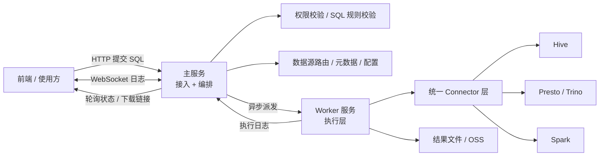

# Soda Coca 面试版：架构、原理与高频问答

## 1. 这篇文档怎么用

这是一份面试表达稿，不是项目说明书。建议使用方式：

1. 先背熟 `30 秒版本` 和 `1 分钟版本`
2. 再挑 2 到 3 个最想主讲的技术亮点
3. 面试时先讲整体架构，再顺着面试官的问题展开
4. 不要一上来陷入代码细节，优先讲设计思路、为什么这么做、解决了什么问题

如果一句话总结这个项目，建议始终围绕下面这句话展开：

> Soda Coca 是一个统一查询平台后端，核心是把多种查询引擎封装成统一能力，并通过异步执行、Worker 化、连接治理和日志回传，把它做成一个可运营、可扩展的查询平台。

## 2. 一句话介绍

Soda Coca 是一个面向数据分析 / 报表场景的查询平台后端，核心目标是把 `Presto/Trino`、`Hive`、`Spark` 等多种查询引擎封装成统一查询入口，并在此基础上补齐权限校验、SQL 规则治理、异步执行、实时日志回传、结果落盘下载以及多集群资源治理能力。

从面试表达来看，它不是“一个写 SQL 的系统”，而是一个 **带执行治理能力的查询平台**。

## 3. 开场版本

### 3.1 30 秒版本

> 这是一个统一查询平台后端。它对上提供统一查询接口，对下适配 Presto、Hive、Spark 等多种执行引擎。整体上是主服务负责接入和编排，Worker 负责异步执行和结果处理。系统在执行前会做权限和 SQL 规则校验，执行中通过 WebSocket 回传日志，执行后把结果落到文件或 OSS。最近一年的几个重点演进是 Worker 化、Spark 独立接入、多集群和队列治理，以及连接池和日志链路稳定性增强。

### 3.2 1 分钟版本

> 这个项目本质上是一个带执行治理能力的查询平台。用户提交 SQL 之后，主服务不会直接同步执行，而是先完成权限校验、SQL 规则校验、数据源路由和任务编排，然后把任务派发给 Worker 异步执行。Worker 通过统一的 Connector 层适配不同引擎，比如 Presto、Hive、Spark。执行过程中，日志通过 WebSocket 实时回传给前端，结果则落到文件和 OSS，后续通过状态查询和下载链接返回。这个项目最有价值的地方在于，它不是简单做了一个查询接口，而是逐步把 Worker 化、Spark 独立引擎、多集群 / 队列资源治理、连接池和 Kerberos 稳定性、以及可观测性体系都补齐了，所以更像一个平台，而不是一个工具。

## 4. 面试版架构图

面试里讲图时，不要逐个框念，直接按链路说：

1. 用户先通过 HTTP 提交 SQL
2. 主服务先做权限校验、SQL 规则校验和任务编排
3. 真正执行在 Worker
4. Worker 通过统一 Connector 对接 Hive、Presto/Trino、Spark 等不同引擎
5. 日志通过 WebSocket 实时回传
6. 结果通过文件 / OSS 提供轮询、查询和下载

## 5. 架构设计怎么讲

### 5.1 主服务与 Worker 分离

这个项目现在最值得讲的架构点，就是 **主服务负责控制面，Worker 负责执行面**。

主服务主要承担：

+ 接入请求
+ 统一鉴权和规则校验
+ 查询状态管理
+ 日志 / 结果回传
+ 任务编排

Worker 主要承担：

+ 真正执行 SQL
+ 处理长任务
+ 写日志和结果文件
+ 对接底层引擎资源

这背后的设计思想是：

+ 把“用户交互链路”和“重资源计算链路”解耦
+ 避免主服务被长查询和大结果拖垮
+ 便于后续单独扩容执行节点
+ 让控制面和执行面各自承担更清晰的职责

面试中可以概括成一句话：

> 这是典型的控制面和执行面分离，目的是提升稳定性、隔离重任务、增强扩展性。

### 5.2 多引擎统一抽象

对上层业务来说，希望只有一种“查询”能力；但对底层来说，实际上要接多种引擎。

所以项目采用了统一 Connector 抽象：

+ 上层只关心统一的请求模型、状态模型、结果模型
+ 下层通过不同 Connector 适配 Hive、Presto/Trino、Spark 等 JDBC 执行差异
+ 新增引擎时，尽量只扩展连接器实现，不改主流程

这个点本质上体现的是：

+ 策略模式
+ 工厂模式
+ 开闭原则

换句话说，它不是把不同引擎的 if-else 写满主链路，而是把引擎差异收敛到连接器层。

### 5.3 查询链路是异步的

查询平台不能把长 SQL 当作普通同步 HTTP 请求来处理，因为：

+ SQL 执行时长不可控
+ 底层引擎可能排队
+ 结果集可能很大
+ 用户需要看到中间执行过程

所以这个项目采用的是典型异步链路：

1. HTTP 提交任务
2. 返回 `queryId`
3. 后端异步执行
4. WebSocket 推日志
5. 轮询查询状态和结果

这里体现的原理是：

+ 请求响应模型和长任务执行模型要分离
+ 同步链路用于“提交”
+ 异步链路用于“执行”
+ 流式链路用于“过程回传”

### 5.4 日志和结果分离处理

这个项目里，日志和结果不是同一种交互数据。

日志的特点是：

+ 连续产生
+ 强时效性
+ 更适合流式传输

结果的特点是：

+ 体积可能很大
+ 不一定一次性返回
+ 可能需要下载或多次读取

所以系统做了分离：

+ 日志通过 WebSocket 实时推送
+ 结果通过文件 / OSS 落盘后再查询 / 下载

这其实是一个很典型的系统设计原则：

> 根据数据的交互特征选择协议和存储方式，而不是所有东西都用同一种接口返回。

## 6. 技术亮点

### 6.1 Worker 化改造

这是最近一年最值得讲的架构升级。

为什么要做：

+ 避免主服务被长查询拖垮
+ 避免结果文件生成占用主服务资源
+ 让接入层和执行层可以独立扩容
+ 方便后续做执行资源隔离

它的价值不只是“多了一个服务”，而是把系统从单体执行模型升级成了分层执行模型。

面试里可以强调：

+ 这是架构层面的变化
+ 带来的核心收益是稳定性和可扩展性
+ 后续 Spark、多集群、资源治理都建立在这一步之上

### 6.2 Spark 独立引擎化

Spark 是最近一年最明显的功能和架构增量。

关键不在于“支持了 Spark”，而在于它已经不是早期附属模式，而是独立引擎：

+ 有独立接入方式
+ 有独立队列控制
+ 有独立连接池治理
+ 有预热和探活
+ 有针对 Spark 特性的运行参数和作业标识

这个点在面试里很加分，因为它体现了从“接功能”到“做工程化治理”的过程。

可以这样总结：

> Spark 的接入不是简单多一个枚举值，而是围绕连接、队列、执行稳定性、规则校验做了一整套系统化支持。

### 6.3 多集群 / 多队列治理

当平台只面对单一集群时，查询系统更像一个工具；当它开始支持多集群和多队列时，它才更像一个平台。

这个项目近一年的一个明显方向，就是把资源治理纳入主流程：

+ 用户最近使用的集群和队列会被记录
+ 查询执行前会根据 cluster / queue 路由数据源
+ Hive 和 Spark 会注入不同的队列策略
+ 连接池也会细化到 cluster / queue 维度

这背后的本质是：

+ 查询平台不仅要“能执行”
+ 还要解决“在哪执行、如何分流、如何隔离”

面试里这部分非常适合上升到平台视角来讲。

### 6.4 WebSocket 日志回传链路

这个点很容易被忽略，但其实非常能体现工程能力。

为什么不用纯轮询：

+ 日志天然是流式数据
+ 轮询延迟高
+ 频繁轮询会增加服务压力
+ 用户拿不到实时反馈

所以这里采用 WebSocket 做实时日志回传。

它带来的能力包括：

+ 查询排队、执行、失败过程可见
+ 主服务可以转发 Worker 执行日志
+ 可以配合 EOF、重试、超时、连接清理等机制做完整会话控制

最近一年项目对这条链路做了很多稳定性修复，比如：

+ 重试
+ 超时控制
+ 日志补发
+ 连接清理
+ EOF 关闭控制
+ 内存泄漏治理

这类点非常适合体现“线上系统稳定性治理”的经验。

### 6.5 连接池与 Kerberos 场景治理

这是项目中比较底层、但也最能体现深度的点之一。

在大数据查询场景里，JDBC 连接通常不是轻量连接，尤其当引入：

+ Kerberos 认证
+ 多集群
+ Spark Thrift
+ Hive 长连接

之后，连接问题会直接变成系统问题。

所以项目引入了：

+ 分 cluster / queue 的连接池
+ 建连超时控制
+ 连接预热
+ 定时探活
+ 失效连接剔除
+ 多集群 Kerberos 会话治理

这个点在面试里非常适合讲原理：

> 连接池的意义不只是性能优化，更是可用性治理抓手。

因为只有有了连接池，系统才能对“慢连接、坏连接、冷启动、认证上下文冲突”做持续管理。

### 6.6 权限校验前置化

成熟的查询平台不会让非法 SQL 先跑到底层引擎，再告诉用户失败。

所以这个项目把校验前移到了提交前，包括：

+ 表权限
+ 表存在性
+ 部分 delta 规则
+ SQL 规范约束

这样做的收益是：

+ Fail Fast
+ 避免浪费底层资源
+ 用户更早拿到明确反馈
+ 平台治理边界更清晰

这个设计非常适合映射到工程原则：

> 把错误从执行期前移到提交期。

### 6.7 可观测性增强

项目最近一年开始明显从“靠日志定位问题”往“链路可观测”演进。

典型思路是：

+ 核心接口埋点
+ 权限校验链路埋点
+ 外部依赖耗时可追踪
+ 关键阶段统一输出日志

这个点的价值在于：

+ 能定位慢点在哪里
+ 能分辨是权限服务慢、元数据服务慢、还是执行引擎慢
+ 提高线上问题定位效率

如果面试官问“为什么要做 OTel / Tracing”，这部分就很好展开。

## 7. 高频问题与回答模板

### Q1：这个项目是做什么的？

你可以这样答：

> 它是一个统一查询平台后端，主要服务数据分析和报表场景。平台对上提供统一查询入口，对下封装多个执行引擎，比如 Presto、Hive、Spark。它解决的不只是“执行 SQL”问题，还包括权限校验、SQL 规则治理、异步任务执行、执行日志回传、结果下载，以及多集群资源治理。

回答关键词：

+ 统一查询平台
+ 多引擎适配
+ 不只是执行 SQL
+ 带治理能力

如果面试官继续问“和普通查询接口有什么区别”，可以补一句：

> 普通查询接口更像一个代理，而这个项目更像一个平台，因为它要解决权限、执行稳定性、长任务管理、结果存储和资源治理这些系统性问题。

### Q2：这个项目的整体架构是什么？

你可以这样答：

> 我一般把它拆成四层。第一层是接入和编排层，也就是主服务，负责接请求、鉴权、规则校验和任务编排；第二层是执行层，也就是 Worker，负责真正执行长查询和处理结果；第三层是 Connector 层，用统一抽象去适配不同引擎；第四层是回传层，日志通过 WebSocket 实时返回，结果通过文件和 OSS 提供查询和下载。

这道题想体现的不是“背目录”，而是分层能力。你要让面试官感觉到：

+ 你理解系统边界
+ 你知道每一层的职责
+ 你不是只会描述接口列表

### Q3：为什么要拆成主服务 + Worker？

你可以这样答：

> 核心原因是重任务隔离。查询平台里的 SQL 执行时间、结果大小和底层资源占用都不可控，如果把接入层和执行层放在一个进程里，主服务很容易被长查询拖垮。拆成主服务和 Worker 之后，主服务只负责控制面，比如接入、校验、编排和状态管理；Worker 负责执行面，比如真正跑 SQL、生成结果文件和输出执行日志。这样可以做到职责解耦、资源隔离，也方便后续分别扩容。

如果面试官追问“为什么不直接在线程池里执行”，可以这样补：

> 线程池只能解决异步问题，不能解决进程级资源竞争问题。长查询、文件生成、连接占用这些负载仍然会和 API 接入层争抢 CPU、内存和连接资源，而且线程池模式也不利于后续把执行层独立扩容。

这道题的底层原理其实是：

+ **控制面 / 执行面分离**
+ **长任务与短请求隔离**
+ **高负载模块独立伸缩**

### Q4：为什么查询链路设计成 HTTP 提交 + WebSocket 日志 + 轮询结果？

你可以这样答：

> 这是根据数据交互特征做的协议拆分。提交任务是一个明确的命令动作，适合 HTTP；执行日志是流式、实时的数据，适合 WebSocket；查询结果可能很大，还可能需要下载或多次读取，所以更适合先落文件 / OSS，再通过轮询状态和下载链接获取。

如果面试官继续问“为什么不全部用 HTTP”，可以答：

> 全部用 HTTP 会让执行日志只能靠轮询获取，延迟高，而且轮询频率高时会增加服务压力；而结果如果直接通过一次 HTTP 返回，又会把长任务、结果传输和请求响应绑在一起，不适合大查询场景。

这道题背后的本质是：

> 不同类型的数据，要用最适合它的交互方式。

### Q5：多引擎怎么统一的？

你可以这样答：

> 项目里有统一的 Connector 抽象。对上层来说，请求、状态、结果这些模型是统一的；对下层来说，不同引擎各自处理连接、参数设置、执行和日志差异。这样主流程不用写大量 if-else 去区分 Hive、Presto、Spark，而是通过工厂和策略方式把引擎差异收敛到连接器层。

如果面试官追问“这样设计的好处是什么”，可以答：

+ 上层主流程稳定
+ 新增引擎成本更低
+ 引擎差异不污染业务编排层
+ 更符合开闭原则

可以顺手点出这是典型的：

+ 工厂模式
+ 策略模式
+ 分层解耦

### Q6：Spark 接入里最难的点是什么？

这道题很适合讲深度。你可以这样答：

> 我觉得最难的点不是把 Spark 连上，而是把 Spark 作为平台能力稳定地跑起来。因为 Spark 不是简单的 JDBC 查询，它还涉及队列路由、连接预热、长连接保活、资源不足时的失败处理、以及和平台原有 Hive / Presto 体系的统一治理。所以真正的难点是工程化接入，而不是功能接入。

可以展开的点：

+ Spark 需要独立引擎化，而不是挂在 Hive 下面
+ 队列配置会直接影响资源分配
+ 连接建立成本高，不能粗暴每次现连
+ 需要预热和探活，减少冷启动和失效连接问题
+ 资源不足时要能及时抛错，而不是一直卡住

一句亮点总结：

> Spark 的接入不是“支持一下”，而是围绕连接、队列、资源和稳定性做了一整套治理。

### Q7：为什么多集群 / 多队列治理是难点？

你可以这样答：

> 当系统只面对单一集群时，它更像一个工具；开始支持多集群和多队列之后，它才真正变成平台。因为平台不仅要决定 SQL 能不能跑，还要决定在哪个集群跑、进哪个队列跑、怎么隔离资源、怎么记录用户偏好，以及如何避免不同集群之间的连接和认证互相影响。

这部分可以讲的几个关键词：

+ 数据源路由
+ 用户最近使用的集群 / 队列记忆
+ 队列隔离
+ 资源分流
+ 平台治理而不是单次执行

如果面试官问“为什么要记录用户上次选择的队列”，可以答：

> 因为查询平台是高频操作，用户通常会反复在同一类资源池里执行。记录用户上次选择，本质上是在做使用体验优化和资源使用习惯沉淀。

### Q8：为什么连接池在这个项目里特别重要？

你可以这样答：

> 这里的 JDBC 连接不是普通业务库连接，而是大数据查询连接。它建连更慢、认证更重、上下文更复杂，尤其在 Spark、Hive、Kerberos、多集群场景下，连接问题会直接影响查询稳定性。所以连接池的意义不只是性能优化，更重要的是做可用性治理，比如连接预热、超时控制、失效剔除、定时探活，以及在不同 cluster / queue 维度做连接隔离。

如果面试官问“为什么不是简单池化就够了”，可以补：

> 因为这里除了连接复用，还有认证上下文、长连接失效、冷启动慢、资源不足等问题。简单池化只能解决一小部分问题，而平台需要的是完整的连接生命周期治理。

### Q9：Kerberos 场景为什么复杂？

你可以这样答：

> Kerberos 的复杂点在于，它不是纯粹的业务参数，而会影响整个 JVM 的认证上下文。尤其在多集群场景下，不同集群的认证配置如果处理不好，会产生上下文冲突，所以平台不仅要管连接池，还要管认证会话切换和隔离。也就是说，Kerberos 复杂的不是“登录一次”，而是“在统一平台里并行管理多个认证环境”。

这题的核心是体现你理解：

+ 认证问题会升级成系统问题
+ 多集群认证不是普通参数切换
+ 连接和认证是耦合的

### Q10：为什么权限校验要前置？

你可以这样答：

> 成熟的查询平台不会让非法 SQL 先进入底层引擎，再告诉用户没权限。因为那样既浪费算力，也让错误反馈变晚。所以这个项目把权限、表存在性、部分 delta 规则、SQL 规范等校验尽量前移到提交阶段，做到 Fail Fast。这样既能保护底层资源，也能让用户尽早得到明确反馈。

如果面试官继续问“前置校验最大的价值是什么”，可以答：

+ 减少无效执行
+ 减少底层资源浪费
+ 提高用户反馈速度
+ 让平台治理边界更清晰

### Q11：WebSocket 日志链路为什么值得讲？

你可以这样答：

> 因为查询平台的用户很关心执行过程，而不是只关心最终成败。如果用户提交一个大查询后，几分钟都没有反馈，体验会很差。所以 WebSocket 日志链路其实是平台体验的关键部分。它不仅解决实时性问题，还要求系统处理好重试、超时、连接关闭、日志补发、EOF 结束信号、以及连接泄漏等稳定性问题。

这题可以体现稳定性视角。

### Q12：你觉得这个项目最体现工程能力的地方是什么？

推荐回答：

> 我觉得最体现工程能力的地方，不是某个接口写得多复杂，而是把多个系统性问题串起来解决了，比如主服务和 Worker 解耦、多引擎统一抽象、Spark 工程化接入、多集群和队列治理、连接池和 Kerberos 稳定性处理、以及 WebSocket 日志链路的完整闭环。这些问题单看都不新，但把它们组合成稳定的平台，是很考验工程能力的。

可以顺手列出：

+ 主服务和 Worker 解耦
+ 多引擎统一抽象
+ Spark 工程化接入
+ 多集群和队列治理
+ 连接池和 Kerberos 稳定性处理
+ WebSocket 日志链路的完整闭环

### Q13：如果面试官问“你在这个项目里最值得讲的一点是什么”，怎么回答？

最好不要泛泛地说“做了很多优化”，建议选一条主线讲深。

#### 方案 A：架构型主讲线

> 我最想讲的是主服务和 Worker 的拆分。因为这个变化不是简单地多加一个服务，而是把接入编排和重查询执行彻底解耦了。这样主服务能保持稳定，Worker 能独立扩容，也为后续 Spark、队列治理和结果文件处理提供了更好的承载方式。

#### 方案 B：平台型主讲线

> 我最想讲的是 Spark 和多集群队列治理。因为这个项目原来更多是统一查询入口，后来逐步演进成查询平台。平台和工具最大的区别，就是工具只管能不能跑，平台要管在哪跑、怎么分流、怎么隔离资源、以及如何稳定运行。

#### 方案 C：稳定性型主讲线

> 我最想讲的是连接池和日志链路稳定性。查询平台里很多问题不是业务逻辑错，而是连接慢、认证冲突、日志缺失、长连接失效、查询状态不同步。这些问题处理好了，系统才真正能在线上稳定使用。

## 8. 面试官追问时可以补的基础原理

### 8.1 控制面和执行面分离

适合在下面场景补充：

+ 为什么拆 Worker
+ 为什么主服务不直接执行
+ 为什么这样更稳定

一句话说法：

> 控制面负责决策和编排，执行面负责真正消耗资源，这样系统在高负载场景下更容易做到稳定和扩展。

### 8.2 异步任务模型

适合在下面场景补充：

+ 为什么不能同步执行 SQL
+ 为什么要返回 queryId
+ 为什么要轮询状态

一句话说法：

> 长查询天然适合异步任务模型，提交和执行应该解耦，否则请求链路会被不可控时延拖垮。

### 8.3 协议选型

适合在下面场景补充：

+ 为什么日志走 WebSocket
+ 为什么结果不直接 HTTP 返回

一句话说法：

> 协议不是越统一越好，而是要和数据交互特征匹配。

### 8.4 统一抽象与开闭原则

适合在下面场景补充：

+ 为什么做 Connector 抽象
+ 为什么新增引擎不想改主流程

一句话说法：

> 上层流程追求稳定，下层差异通过策略扩展，这样系统更可维护。

### 8.5 Fail Fast

适合在下面场景补充：

+ 为什么权限前置
+ 为什么规则前置

一句话说法：

> 能在入口阶段拦截的问题，就不要拖到执行阶段再失败。

## 9. 最近一年最适合在面试里讲的 4 个变化

如果时间有限，建议只讲这 4 个：

1. 查询执行架构从单体模式演进到主服务 + Worker 模式
2. Spark 从附属能力演进成独立引擎，并补齐连接池、队列、预热、探活等治理能力
3. 多集群 / 多队列 / 连接池 / Kerberos 这套平台级资源治理能力逐渐成型
4. WebSocket 日志链路和可观测性增强，系统从“能跑”升级到“稳定可定位”

这 4 个点最容易体现：

+ 架构设计能力
+ 工程深度
+ 稳定性治理能力
+ 平台思维

## 10. STAR 面试表达

### STAR 1：主服务 + Worker 的平台化改造

+ **Situation（情境）**：数据分析 / 报表场景下，SQL 执行时长与资源占用不可控；若在主服务同步跑查询，容易出现线程被占满、接口尾延迟抖动、以及大结果集拖垮内存等问题。
+ **Task（任务）**：把查询平台从“能跑”演进成“可隔离、可扩容、可运维”的平台形态，并在面试里讲清控制面与执行面边界。
+ **Action（行动）**：推动 / 参与 **主服务负责接入、鉴权、规则校验、状态与编排**；**Worker 负责真正执行 SQL、写日志与结果文件、对接引擎资源**；提交链路走 **HTTP 异步化**（返回 `queryId`），日志走 **WebSocket**，结果 **落盘 / OSS** 再轮询下载，从协议上匹配不同数据形态。
+ **Result（结果）**：稳定性与扩展性显著提升：接入层与执行层可独立扩容，重任务不再直接冲击 API；后续 Spark 独立接入、多集群 / 队列治理、连接池与可观测性增强都建立在同一套边界之上。

### STAR 2：多引擎、连接治理与线上稳定性

+ **Situation（情境）**：平台需要同时对接 Hive、Presto / Trino、Spark 等引擎；在 Kerberos、多集群、Spark Thrift 等条件下，JDBC 连接与队列策略问题会直接放大成可用性问题。
+ **Task（任务）**：在不牺牲“统一查询入口”的前提下，把引擎差异与资源治理收敛到可维护的扩展点，并降低线上连接类故障。
+ **Action（行动）**：引入 **统一 Connector** 把差异下沉；建设 **分 cluster / queue 的连接池**（预热、探活、超时、失效剔除、Kerberos 会话治理）；把 **权限与规则校验前置** 到提交期；持续加固 WebSocket 日志链路（重试、超时、EOF、连接清理、内存泄漏治理）并补齐关键路径埋点 / 追踪。
+ **Result（结果）**：对外仍是一套统一查询体验，对内具备更清晰的平台治理抓手：Fail Fast、资源可路由可隔离、线上问题更可定位；面试中能用“协议选型 + 连接池作为可用性抓手”讲出工程深度。

## 11. 自由发挥模板

如果面试官让你自由发挥，可以这样收束：

> 我这个项目最核心的价值，不是支持了多少种查询语法，而是把一个多引擎查询工具逐步做成了平台。整体上是主服务负责接入和编排，Worker 负责异步执行和结果处理，通过统一 Connector 适配 Presto、Hive、Spark 等引擎。为了让它在线上稳定运行，平台还补齐了权限前置、SQL 规则治理、WebSocket 日志回传、多集群队列治理、连接池和 Kerberos 稳定性控制，以及可观测性能力。最近一年我觉得最有技术含量的演进，就是 Worker 化、Spark 独立接入和平台级资源治理，这几个点能比较集中地体现架构和工程能力。

## 12. 最终总结

如果只留 1 分钟，可以这样总结：

> 这个项目本质上是一个多引擎查询平台后端。它通过主服务负责接入和编排，Worker 负责执行和结果处理，利用统一 Connector 抽象适配 Presto、Hive、Spark 等不同引擎；同时通过 WebSocket 做实时日志回传，通过文件 / OSS 做结果落盘和下载。最近一年最有价值的演进是 Worker 化、Spark 独立接入、多集群与队列治理，以及连接池和日志链路稳定性增强。这些改造让我对异步任务架构、协议选型、连接治理和平台化设计都有比较完整的实践。

真正需要记住的关键词：

+ **统一查询平台**
+ **主服务 / Worker 解耦**
+ **多引擎 Connector 抽象**
+ **异步任务执行**
+ **WebSocket 实时日志**
+ **结果落文件 / OSS**
+ **Spark 独立引擎化**
+ **多集群 / 队列治理**
+ **连接池 + Kerberos 稳定性**
+ **Fail Fast**
+ **可观测性增强**
