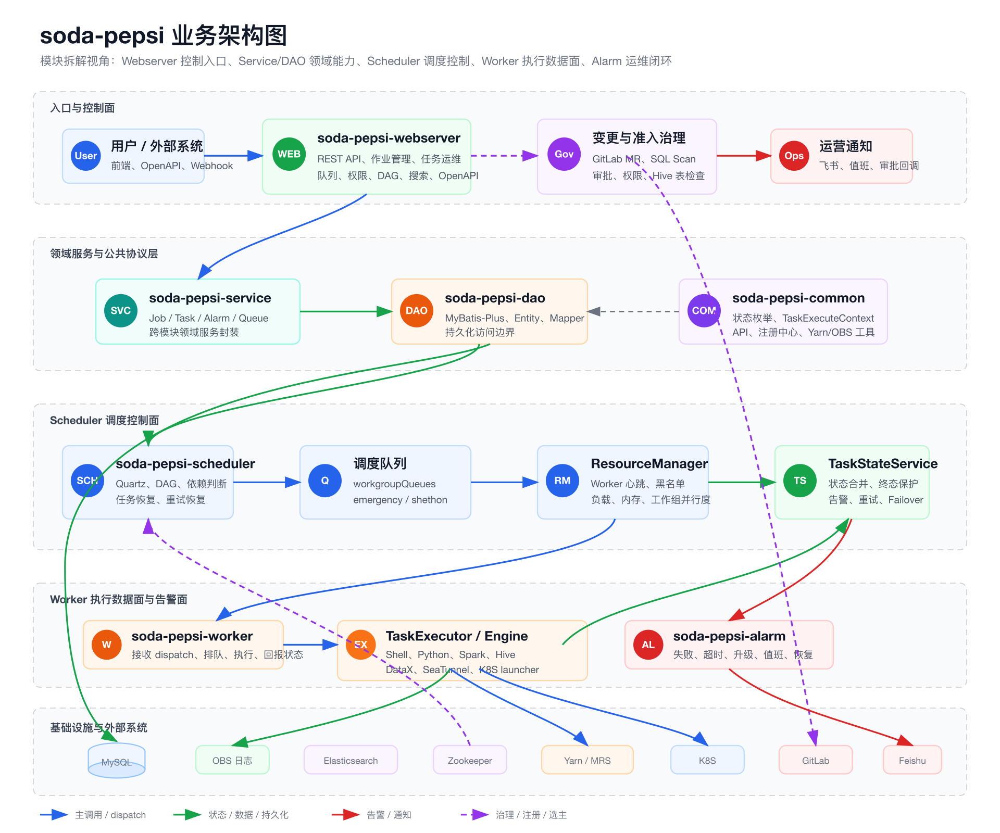

## 约 90 秒开场白
soda-pepsi 是数据中台里的定时任务动态调度子平台，可以把它理解成公司内部面向数据开发、数据集成和批处理任务的轻量级调度系统。

它解决的核心问题不是单纯“定时跑脚本”，而是把作业配置、依赖判断、周期触发、资源选择、Worker 执行、日志归档、Yarn 应用跟踪、失败重试、告警通知和运维操作串成一个闭环。

我的面试口径可以讲成：

我负责或深度参与了调度链路的梳理与维护，重点关注三块能力。

第一是 Scheduler 侧，基于 Quartz 做 cron 触发，**通过 Zookeeper 做 Master 选主，只有 Leader 承担 Quartz、依赖检查和任务分发，避免多实例重复调度。**

第二是任务状态机和资源调度，任务从 TRIGGERED、WAITING_DEPENDENCY、WAITING_DISPATCH 到 DISPATCHED、RECEIVED、RUNNING，再进入 SUCCESS、FAIL、KILLED、FAILOVER 等终态，中间结合工作组队列、紧急队列、并行度和 Worker 心跳选择可用执行节点。

第三是 Worker 执行与容灾，**Worker 不直连数据库，只接收 Scheduler 的 HTTP dispatch**，落本地执行文件、启动 Shell/Python/Spark SQL/Hive SQL/DataX/SeaTunnel 等引擎，采集日志和 Yarn applicationId，再通过状态上报回写调度侧；如果 Worker 下线，Leader 会探活、Kill Yarn App、把运行中任务标记 FAILOVER 并重新提交。面试时我会围绕“Quartz+ZK 高可用调度”、“状态机驱动的分发闭环”和“Worker 执行、日志、Yarn 与告警容灾”三个技术锚点展开。

## 架构图

读图顺序：从上到下看。第一层是用户和外部系统入口；第二层是 Webserver 的准入与变更治理；第三层是持久化和外部索引；第四层是 Scheduler 的触发、依赖、调度、资源选择和状态机；第五层是 Worker 执行；最后是 OBS 日志、告警和 Zookeeper 高可用支撑。这个版本刻意压缩横向宽度，面试时按纵向链路讲即可。

模块拆解视角补充图：

## STAR
> 口径说明：下面按“主责/深度参与调度链路治理”的面试口径编排。如果实际经历更偏接入或维护，可以把“我主导”改成“我参与”，但技术叙述仍然成立。
>

### STAR 1：调度链路从“定时触发”升级为状态机闭环
**Situation：** 数据中台需要统一调度多类离线任务，包括 Spark SQL、Hive SQL、Python、Shell、DataX、SeaTunnel 等。单纯使用 cron 只能解决定时触发，不能解决依赖等待、资源受限、运行中 Kill、失败重试、日志查看和上下游运维这些生产问题。

**Task：** 目标是把作业从配置、上线、周期触发、依赖判断、资源分发、Worker 执行到最终状态回写串成闭环，并且要支持多 Scheduler 实例部署，避免重复触发。

**Action：** 我围绕图里的 Scheduler Leader 和 Worker 执行链路做了拆解和治理。作业上线时，Webserver 写入 job 配置，Scheduler 对根任务创建 Quartz CronTrigger；Quartz 触发后生成 PepsiTaskBo，进入 ScheduleTaskService。任务先经过 DependencyManager 判断父依赖、自依赖和分区进度，依赖满足后进入 ScheduleDispatchService。调度队列按工作组拆分为 PriorityBlockingQueue，同时保留 emergencyQueue 和 shethonQueue；ResourceManager 根据 Worker 心跳、黑名单、CPU/内存、并行度和工作组选择目标 Worker；分发前先把状态推进到 DISPATCHED，Worker 接收后上报 RECEIVED/RUNNING，最终由 TaskExecutor 上报 SUCCESS/FAIL/KILLED 等终态。TaskStateService 统一做状态合并、乱序事件过滤、终态保护和失败告警触发。

**Result：** 这套设计把“任务跑没跑”变成可观测、可补偿的状态机问题。面试时可以强调三个结果：第一，Quartz 只负责触发，不承载复杂业务判断，依赖、资源和执行解耦；第二，Worker 不直连 DB，状态变更都回到 Scheduler 侧收敛，职责边界清晰；第三，运维动作如 Kill、重跑、置成功、紧急执行、日志下载和 Yarn 队列变更都能围绕同一套 taskId 和状态机闭环实现。

### STAR 2：Worker 容灾、Yarn App 跟踪和告警恢复
**Situation：** 离线任务执行时间长，Worker 可能因为发布、机器故障、资源异常或网络问题下线。对于 Spark/Hive/SeaTunnel 这类提交到 Yarn 的任务，如果只杀本地进程或只标记失败，容易造成远端 Yarn App 残留，既浪费资源也会导致任务状态和真实执行状态不一致。

**Task：** 需要让 Scheduler 能识别 Worker 失联，并对该 Worker 上 RECEIVED、RUNNING、TO_KILL 的任务做一致性处理；同时 Worker 执行时要尽早识别 Yarn applicationId，支持日志追踪、远端 Kill 和失败恢复。

**Action：** 我会指图里的 Zookeeper、WorkerFailoverManager、TaskExecutor 和 AlarmPipelineManager 来讲。Worker 通过注册中心和心跳暴露自身状态，Leader 监听 workers 节点变化；当 Worker 节点 REMOVE 时，Leader 先判断自己是否是 Leader，再短暂等待并主动探活，避免瞬时抖动造成误判。如果 Worker 确认不可用，系统查询该 host/port 上的 RECEIVED、RUNNING、TO_KILL 任务，对 TO_KILL 推进为 KILLED，对运行任务先尝试通过 YarnApplicationApiKiller 清理 appId，再把原任务置为 FAILOVER，并复制关键上下文创建新任务重新入队。Worker 侧 TaskExecutor 在 stdout 中解析 Yarn applicationId，保存到任务状态事件和监控里；如果执行引擎本身不是 YarnTaskEngine 但日志里出现 appId，还会动态升级为默认 Yarn 引擎，保证后续 Kill 能覆盖远端应用。AlarmPipelineManager 启动时会恢复 PREPARE/SEND 状态告警和运行中任务的超时告警，避免服务重启后告警丢失。

**Result：** 这个方案降低了长任务和 Yarn 任务的资源泄漏风险，也让 Worker 故障具备可恢复路径。面试时可以落到工程细节：ZK 事件只由 Leader 处理，先探活再 failover 降低误杀；Yarn appId 从日志流实时提取，兼容多执行引擎；状态机终态保护避免旧事件覆盖新状态；告警恢复保证服务重启后仍能继续超时与升级通知。

## 接手时间线与重大功能
> 口径说明：以下结论基于当前 fork 分支 `feature-huaweicloud` 的 Git 历史。全量历史里，`zhuangzhewei` 最早在 **2025-05-28** 以作者身份提交“增加k8s任务类型”；该能力在 **2025-06-23** 通过 `feature-huawei/k8s-task-type` 合入 `feature-huaweicloud`，并在 **2025-06-30** 补齐 Webserver 的 `jobTypeQuery` 展示。因此面试时可以说：**我从 2025 年 5 月底开始参与 soda-pepsi 的华为云迁移分支，先接手 K8S 任务类型适配，9 月开始系统性推进审批、CI、SQL Scan 和华为云分支治理，11 月以后重点补齐 WorkerGroup/YarnCluster 资源治理。**
>

### 2025-05 到 2025-06：K8S 任务类型接入
代表提交：`c8c009bad` / `6eebb24cc` / `4d13df8bb` “增加k8s任务类型”，`efbb753c7` “fix jobTypeQuery: add k8s task engine type”。

改造内容：

+ 在 `JobType` 中新增 K8S 执行类型：`K8S_SHELL`、`K8S_PYTHON_3_9`、`K8S_PYTHON_3_12`、`K8S_SPARK_SQL`。
+ 在 `IEngineFactory` 里把 K8S 类型复用到现有 Shell/Python/SparkSql Engine，做到前端任务类型扩展但执行引擎逻辑复用。
+ 补齐 Webserver 的作业类型枚举查询，避免前端无法创建或展示新任务类型。

面试讲法：这一步是迁移分支的第一类兼容改造，目标不是重写调度器，而是让任务抽象能承载“调度控制面仍在 pepsi，具体执行环境逐步迁到 K8S/华为云运行时”的形态。

### 2025-09：GitLab CI、SQL Scan 与作业变更审批
代表提交：`e2b45d286`、`9a9ef8c4a`、`b8e4b18f9`、`e82193949`。

上线能力：

+ 新增 `CiConfig` 和 `CiService`，按队列白名单、用户白名单、全局开关判断在线任务变更是否必须走 CI 审批。
+ Webserver 的 `updateJob` 对在线任务不直接改库，而是创建 GitLab Merge Request；MR 合并后通过回调触发 `refreshJob` 写回配置。
+ SQL Scan / AI Review 接入，任务代码变更时把 SQL 上下文送审，审核结果通过 MR 评论或通知反馈。
+ 新增 `PepsiJobApproval`、审批列表、审批状态流转、MR approve/reject/revoke 与飞书通知模板。
+ 兼容 GitLab 手动合并、MR close 后源分支清理、主干分支 `main` 修复等边界。

面试讲法：这个功能解决的是“迁移期间不能让线上任务配置被随意改”的变更治理问题。原来 Webserver 是直接更新 DB 和 Quartz；改造后在线任务变更进入 GitLab/MR/SQL Scan/审批链路，审批通过才回写 pepsi，避免迁移期间配置漂移和高风险 SQL 直接上线。

### 2025-10：华为测试环境配置切换与作业详情增强
代表提交：`dc998fff1` “测试环境数据库替换到华为 - spring profile变量修复”，`5fc052c63` “fix: 华为测试环境zookeeper”，`02033b645` / `70ba59faf` “job详情页返回审批状态、发布状态”。

上线能力：

+ QA/Dev 侧 Scheduler/Webserver 的数据源切换到华为云 RDS。
+ 注册中心地址切换到华为环境 Zookeeper。
+ Worker/Scheduler/Webserver 启动脚本修复 profile 变量，避免环境启动时加载错配置。
+ 作业详情页补充审批状态和发布状态，迁移期排查作业状态时可以直接看线上是否发布、审批是否卡住。

面试讲法：这阶段是“环境可运行”的基础。难点不在业务代码，而在配置一致性：Webserver、Scheduler、Worker 三个进程必须使用同一套 profile、同一套 DB/ZK/OBS/MRS 资源，否则会出现 Web 写到一套库、Scheduler 从另一套库调度、Worker 向错误环境回报状态的问题。

### 2025-11：WorkerGroup 并行度、任务归档与 SeaTunnel 2.3.12
代表提交：`532ad03f1` “支持按 worker group 配置任务并行度”，`029805e82` “调整pepsi_task归档周期”，`3ea6a3095` “hw seatunnel 2.3.12”。

上线能力：

+ 新增 `WORKER_TASK_PARALLEL_BY_GROUP`，支持按 WorkerGroup 设置不同最大并行度。
+ `ResourceManager`、`ScheduleDispatchService`、`MonitorServiceImpl` 都改成按 task 的 workerGroup 读取并行度，而不是全局一个值。
+ Worker 统计接口展示不同 workerGroup 的 maxTask，方便看每组容量。
+ 支持 SeaTunnel 2.3.12 独立 Engine：参数通过 JobArgs 动态配置，appId 解析兼容 Hive/Spark 两类日志格式。
+ 调整任务归档周期，避免迁移期间任务表膨胀影响查询和状态恢复。

面试讲法：迁移到华为云后，任务不再只跑在一套同质资源里。不同 WorkerGroup 背后可能是不同 MRS/Yarn/K8S 资源池，必须按资源池控制并发，否则一个全局并发值会导致小集群被打爆、大集群吃不满。

### 2025-12：Hive 权限、YarnCluster、队列审批和 default 队列治理
代表提交：`b4dc22004`、`d9f2669c3`、`b12cfcf89`、`584635dfb`、`7706541be`、`d87cd8bf5`。

上线能力：

+ Hive 权限检查与 soda-coca 对齐，新增缓存化表权限检查、用户权限 DTO、Hive 权限 DTO 和 Metadata 权限接口配置。
+ 新增 `PepsiYarnCluster` 表，`PepsiQueue` 增加 `yarn_cluster_id`，队列从“名字”升级为“集群 + 队列”的资源模型。
+ `/common/queueQuery`、工作组列表、Yarn 队列统计接口支持按 YarnCluster 过滤和展示。
+ 新增 `PepsiQueueApproval` 和队列权限申请/审批流，审批通知携带动态链接，审批人来自 YarnCluster owner。
+ 队列权限检查增强 resource owner 判断，增加 default 队列管控白名单，避免所有任务默认挤到大数据 default 队列。

面试讲法：这是迁移后期的资源治理补齐。华为云上多 Yarn 集群、多队列、多 owner 并存，如果平台仍只按 queueName 管理权限，很容易出现同名队列、跨集群误用、default 队列滥用。通过 YarnCluster + Queue + Approval，把“能不能提交到某集群某队列”变成平台可审计、可审批的资源权限。

## 阿里云到华为云迁移：平台改造与难点
### 面试版一句话
这次迁移不是简单改几项连接串，而是把 soda-pepsi 从原来偏阿里云/原集群假设的调度运行时，改造成能在华为云 RDS、OBS、MRS/Yarn、K8S Worker 运行时下稳定工作的调度平台。平台侧主要做了五类改造：环境配置切换、对象存储抽象、MRS/Yarn/Kerberos 适配、K8S 执行类型接入、资源权限与审批治理。

### 1. 环境与中间件配置切换
改造内容：

+ Webserver/Scheduler 的数据源从原有 RDS 切到华为云 RDS。
+ 注册中心切到华为测试环境 Zookeeper，保证 Scheduler Leader 选举、Worker 注册和心跳在同一环境闭环。
+ Worker/Scheduler/Webserver 启动脚本统一 profile 变量，避免服务启动时 profile 不一致。
+ 应用名加 `-huawei` 标识，告警链接、任务详情链接和关闭告警链接切到华为环境域名。
+ Maven 增加华为云仓库，依赖版本里出现 MRS/Huawei 定制包，例如 Zookeeper/Hive 相关 h0.cbu.mrs 版本。

难点：配置不是单服务问题，而是三进程闭环问题。Webserver 写 job，Scheduler 读 job 并分发，Worker 上报状态，如果任意一个组件指向旧 DB、旧 ZK 或旧 profile，表现出来就是“页面有任务但调度不触发”“Worker 接到任务但状态不回写”“告警链接跳错环境”。所以迁移时要按链路做环境矩阵校验，而不是只看单个服务启动成功。

### 2. 对象存储从 OSS 语义切到 OBS
改造内容：

+ 引入华为云 OBS SDK，`ObsService` 负责上传、下载、复制、日志分页读取和临时签名 URL。
+ 任务脚本、上下文文件、执行日志统一走 `obs://bucket/prefix/path` 协议路径。
+ Worker 执行结束后上传日志到 OBS，Webserver/Scheduler 查询日志时通过 OBS 临时 URL 或分页读取返回。
+ Worker 启动脚本通过 `hadoop fs -get obs://.../cloud-task-launcher` 下载 K8S runtime 入口。

难点：对象存储不只是 SDK 替换。脚本里会用 `hadoop fs` 访问 `obs://`，Java 服务里会用 OBS SDK 生成签名 URL，任务日志里又会保存 cloud path。三处路径格式必须一致：平台保存的 uploadLogPath、Worker 本地上传路径、页面查看日志路径都要能互相转换。

### 3. MRS/Yarn 与 Kerberos 适配
改造内容：

+ Worker 启动时先 `source /opt/app/hadoop_client/cron_kinit.sh`，依赖华为 MRS Hadoop 客户端和 Kerberos 票据。
+ `YarnClientUtil` 从 `HADOOP_CONF_DIR` 加载 `hdfs-site.xml`、`mapred-site.xml`、`core-site.xml`、`yarn-site.xml`，用 keytab 登录并定时 `checkTGTAndReloginFromKeytab`。
+ Yarn App Kill 不只使用 YarnClient，还补充了基于 ResourceManager REST API + Kerberos/SPNEGO 的 `YarnApplicationApiKiller`。
+ Spark/SeaTunnel/Hive 类任务都要从执行日志中解析 applicationId，作为后续查看、Kill、Failover 的依据。

难点：华为 MRS 的 Yarn 访问和原环境差异较大，主要体现在 Kerberos、安全 ResourceManager、HA RM 和日志格式。任务可能已经提交到 Yarn，但本地进程失败或 Worker 下线，如果拿不到 appId 就无法 Kill 远端应用；如果 Kerberos 票据过期，YarnClient 查询/kill 会卡住或失败；如果 RM 是 HA，还要找到 active RM。面试时可以讲“迁移难点不是提交命令，而是 applicationId、票据、远端 Kill、状态一致性这几个点形成闭环”。

### 4. K8S Worker 运行时与 cloud-task-launcher
改造内容：

+ 新增 K8S Shell/Python/Spark SQL 任务类型，但复用现有 EngineFactory 的 Shell/Python/SparkSql 构建逻辑，降低改造面。
+ Worker 启动时从 OBS 下载 `cloud-task-launcher` 到本地，并赋执行权限。
+ K8S 类型本质上把“任务由 pepsi 调度”与“具体执行环境由 K8S runtime 承载”解耦。

难点：K8S 类型不能破坏既有任务模型。JobType、资源组、队列、参数校验、日志路径、状态回报都要沿用原有 TaskExecuteContext，否则会造成 K8S 和非 K8S 两套调度语义。采用“新增 JobType + 复用 Engine”的方式，能让前端、Webserver、Scheduler、Worker 只在必要位置感知 K8S。

### 5. 多 Yarn 集群、队列权限与并行度治理
改造内容：

+ `PepsiYarnCluster` 引入 Yarn 集群元数据和 owner。
+ `PepsiQueue` 绑定 `yarn_cluster_id`，队列展示、查询、统计都支持集群维度。
+ 新增队列申请和审批流程，申请人无权限时可以发起审批，审批人来自资源 owner。
+ ResourceManager 支持按 WorkerGroup 配置并行度，调度时把不同资源池的容量隔离开。
+ default 队列增加白名单治理，防止迁移后所有任务默认提交到同一个公共队列。

难点：迁移后资源维度从“队列名”升级为“集群 + 队列 + WorkerGroup + owner”。如果只按 queueName 鉴权，同名队列会产生歧义；如果只用全局并发，小集群容易被打爆；如果 default 队列不管控，用户会绕过资源申请直接提交。平台改造的重点是把资源模型显式化，并把权限、审批、统计和调度选择都对齐到这个模型。

### 6. 权限与变更治理
改造内容：

+ 在线任务更新接入 GitLab MR，不再直接改库。
+ SQL Scan/AI Review 对任务 SQL 变更做审核。
+ 作业审批状态落库，页面可展示审批状态和发布状态。
+ Hive 表权限检查对齐 soda-coca，支持缓存化查询用户缺失权限。
+ 队列权限审批与飞书通知补齐。

难点：迁移期间最怕“配置被手工改乱”。调度平台的任务配置本质上是生产变更，所以要把在线任务修改从同步写库改成可审计的 MR + 审批流程。这里的挑战是兼容原有立即更新路径、GitLab 回调路径、手动合并路径和撤销/拒绝路径，同时不能阻断离线任务正常调度。

### 华为迁移 STAR 补充
**Situation：** soda-pepsi 需要从阿里云相关环境迁到华为云，涉及 Webserver、Scheduler、Worker、DB、ZK、对象存储、MRS/Yarn、告警链接和权限平台。原系统很多假设是单集群、单队列、原对象存储和原 Hadoop 环境，直接改配置无法覆盖长任务、Yarn App、日志、权限和审批。

**Task：** 我的目标是让迁移分支在华为云环境下能端到端跑通：作业能创建和审批，Scheduler 能触发和分发，Worker 能执行并上传日志，Yarn App 能追踪和 Kill，队列和集群权限能被平台治理。

**Action：** 我先从 K8S 任务类型接入，扩展 JobType 和 EngineFactory，确保新运行时可以复用原状态机；随后接入 GitLab CI、SQL Scan 和作业审批，把在线任务变更从直接写库改成 MR + 回调刷新；在环境侧切换华为 RDS/ZK/Profile/告警链接，并补齐 Worker 启动脚本对 Hadoop 客户端、Kerberos 和 cloud-task-launcher 的依赖；在资源治理侧引入 WorkerGroup 并行度、YarnCluster 表、Queue 绑定集群、队列权限审批和 default 队列白名单。

**Result：** 迁移后平台不是“能启动”而是形成了新的生产闭环：华为云环境的 DB/ZK/OBS/MRS/K8S 链路打通，任务仍沿用原有状态机和日志体系；线上配置变更可审计；多集群多队列有明确 owner 和审批路径；不同 WorkerGroup 可以独立控并发，降低迁移后资源打满和队列误用风险。

## Worker 容器化改造：架构选型与优劣
### 背景与目标
原 Worker 是长驻执行节点：Scheduler 把任务 HTTP dispatch 到某台 Worker，Worker 在本机落脚本、启动进程、采集日志、解析 Yarn appId、上报状态。这个模型对传统 Yarn/Shell 任务很直接，但迁到华为云和 K8S 后暴露出几个问题：

+ Worker 机器沉淀了大量运行时依赖，例如 Hadoop 客户端、Kerberos、Python、DataX/Addax、SeaTunnel、Spark 相关 jar，机器环境很重。
+ 不同任务共享同一台 Worker 的本地 CPU、内存、磁盘和工具链，隔离性弱，某个重任务或脏环境可能影响同机其他任务。
+ MRS/Yarn、K8S、OBS、Kerberos 多套环境并存后，继续靠机器级 Worker 扩容和维护，发布成本高，也不利于按任务精确申请资源。
+ 调度平台已有状态机、日志、告警、Kill、Failover 逻辑，不能为了上 K8S 把整条调度链路重写。

所以这次“Worker 容器化”的目标不是单纯把 Java Worker 打成镜像，而是把**任务执行运行时**从固定机器迁到 K8S 容器里，同时保留 soda-pepsi 原来的 Scheduler/Worker/TaskStateService 控制闭环。

### 架构选型
我当时会把方案拆成三种：

1. **长驻 Worker 容器化：** 把 `soda-pepsi-worker` Java 进程做成 K8S Deployment，任务仍在 Worker 容器内本地执行。优点是发布、扩缩容、环境交付更标准；问题是它只是把机器换成容器，任务之间仍共享一个 Worker 容器，DataX/SeaTunnel/Spark 依赖仍要塞进长驻镜像，单任务资源隔离和失败清理没有根本改善。
2. **Scheduler 直连 K8S：** Scheduler/Webserver 直接生成 K8S Job、SparkApplication，并 watch 状态。优点是控制面更云原生，理论上可以去掉部分 Worker 职责；问题是改动面太大，Scheduler 要接管 K8S 凭证、资源模板、日志 watch、Kill、清理、状态映射，既有任务状态机、Worker failover、告警链路都要重做，迁移风险高。
3. **当前方案，Worker 作为适配层，任务运行时容器化：** 保留 Scheduler 到 Worker 的 HTTP dispatch；Worker 本地进程变成 `cloud-task-launcher` / submitter，负责创建 K8S Job 或 SparkApplication、监听日志和终态；真正用户任务在 worker-runtime 镜像中运行。优点是对原调度闭环侵入小，任务级资源隔离，支持灰度迁移，也能复用原日志、状态、Kill、告警和重试体系；问题是多了一层 launcher 和 K8S 资源生命周期映射，runtime 镜像、launcher 版本、K8S RBAC、日志 watch 都需要额外治理。

最终选第三种，因为它把风险控制在“执行适配层”：Scheduler 仍然按 Worker 心跳、工作组、并行度选节点，TaskExecutor 仍然只关心一个本地进程的 stdout、exit code 和 kill；只是这个本地进程不再直接跑用户脚本，而是把任务转成 K8S 资源并等待远端完成。

### 当前落地链路
主仓库里先扩展任务类型：`JobType` 增加 `K8S_SHELL`、`K8S_PYTHON_3_9`、`K8S_PYTHON_3_12`、`K8S_SPARK_SQL`。`IEngineFactory` 没有为 K8S 另起一套执行模型，而是让 K8S Shell/Python/Spark SQL 复用原来的 `ShellEngine`、`PythonEngine`、`SparkSqlEngine`，这样 Worker 仍然按原方式拼接 `app_name`、`partition`、`worker_group`、日期变量、自定义参数和 `context_file`。

Worker 启动脚本在 Java 进程启动前做两件关键事：先 `source /opt/app/hadoop_client/cron_kinit.sh` 准备 Kerberos，再从 OBS 下载 `cloud-task-launcher` 到 `/usr/local/sbin` 并赋执行权限。也就是说 Worker 自己仍是控制面执行节点，但具备了把任务进一步提交到 K8S 的能力。

真正的容器化执行由 `soda-pepsi-kubernetes-submitter` / `soda-pepsi-kubernetes-runtime` 承担：

+ Spark SQL 类任务可以被转换为 Spark Operator 的 `SparkApplication`，submitter/`advanced-spark-submit` 解析原 `spark-submit` 参数，映射 driver/executor CPU、内存、jar、hivevar、SparkConf，再 watch `COMPLETED/FAILED/SUBMISSION_FAILED` 这些终态。
+ Shell/Python、DataX/Addax、SeaTunnel 这类任务通过 K8S `Job` 承载，脚本或配置进入 ConfigMap，Pod 工作目录固定为 `/root/execution`。
+ `WorkerRuntimePodTemplate` / `DataxJobTemplate` 根据 `worker_group` 选择 `soda-pepsi-worker-runtime` 镜像，也支持用 `runtime_image` 环境变量覆盖；Pod 启动后先配置 Kerberos 自动续期，再执行用户命令。
+ K8S 资源打上 `soda-pepsi.io/job-id`、`soda-pepsi.io/task-id`、`soda-pepsi.io/job-type`、`soda-pepsi.io/worker-group` 标签，便于日志定位、状态 watch 和收到 SIGTERM/SIGINT 后按标签删除 Job。
+ launcher 监听远端 Job/SparkApplication 状态并持续输出 Pod 日志；对 TaskExecutor 来说，它看到的仍然是一个本地进程，进程 exit code 继续映射成 SUCCESS/FAIL/KILLED，原日志上传和状态上报链路不用重写。

### 选择当前方案的优势
+ **改造边界小：** Webserver、Scheduler、TaskStateService、AlarmPipeline 基本沿用原链路，K8S 改造集中在 JobType、启动脚本和执行适配器，降低迁移期回归风险。
+ **任务级隔离更强：** 用户任务跑在独立 K8S Job 或 SparkApplication 里，CPU、内存、镜像、Kerberos、ConfigMap 都可以随任务设置，不再完全共享长驻 Worker 机器环境。
+ **灰度能力好：** 可以按 JobType、WorkerGroup、jobId 或启动脚本逐步切换，比如 DataX 对 SHETHON 直接走 cloud launcher，对 EMR_b4fee9 保留灰度名单，不需要一次性迁完所有任务。
+ **兼容原运维语义：** Pepsi 的 taskId、日志、状态、Kill、重试、Failover、告警仍然可用；launcher 通过 stdout 和 exit code 把远端 K8S 结果投影回原 TaskExecutor。
+ **多运行时可演进：** SparkApplication、serverless worker Job、DataX Job、SeaTunnel Job、TFJob 可以在 runtime 项目里继续扩展，主调度系统不需要为每种 K8S 资源引入一套领域模型。

### 当前方案的代价与风险
+ **生命周期变成两层：** Pepsi 任务进程和 K8S Job/SparkApplication 之间要做状态映射。launcher 成功提交但 watch 失败、Worker 被 kill 但远端 Job 未及时删除、K8S 资源终态和本地进程 exit code 不一致，都需要额外兜底。
+ **版本治理复杂：** Worker 启动时从 OBS 拉 `cloud-task-launcher`，任务 Pod 又依赖 `soda-pepsi-worker-runtime` 镜像。launcher 版本、runtime 镜像、Kerberos 脚本、Seatunnel/Addax 版本必须配套发布，否则会出现 Worker 能启动但任务 Pod 跑不起来。
+ **运行时镜像仍偏重：** 当前 runtime 镜像是把工作组机器上的 `/opt`、`/work` 运行环境沉淀进基础镜像，再叠加 Addax、SeaTunnel、Kerberos 续期脚本。这种方式迁移速度快，但镜像大、环境耦合重，后续应拆成更小的基础镜像和按任务类型分层镜像。
+ **K8S 权限和资源模板需要治理：** submitter 需要 service account、ClusterRole/ClusterRoleBinding、kubeconfig；模板里还要维护 nodeSelector、toleration、namespace、runtime image、资源默认值。如果缺少平台化配置，后期会变成脚本和模板里的硬编码。
+ **Worker 线程仍会被远端任务占用：** 当前 TaskExecutor 通过 launcher 阻塞等待远端任务结束，这能最大化复用原模型，但 Worker 并行度要按“远端任务占用一个本地执行槽”来计算，否则会低估或高估实际容量。

面试讲法：我不会把这件事讲成“把 Worker Docker 化”，而会讲成“保留 soda-pepsi 的调度控制面，把执行数据面容器化”。核心取舍是：先用 launcher/submitter 作为兼容层，复用现有状态机和运维闭环，换取低风险迁移和任务级隔离；代价是多了一层 K8S 资源生命周期和 runtime 版本治理，后续再逐步把镜像分层、模板配置化和状态映射做得更平台化。

## 项目定位
soda-pepsi 是数据中台的任务调度与执行子平台，README 中直接定义为“定时任务动态调度系统”。它不是一个纯 Web 管理后台，而是由 Webserver、Scheduler、Worker、Alarm、Service、DAO、Common 多模块组成的调度运行时。

核心职责可以拆成四层：

+ **控制入口：** Webserver 负责作业、资源组、队列、数据源、权限、DAG、补数、重跑、Kill、日志、OpenAPI、Addax/Seatunnel 配置转换等前端和外部系统入口。
+ **调度控制面：** Scheduler 负责 Quartz 定时触发、DAG/单任务判断、依赖检查、任务恢复、重试恢复、资源选择、分发、状态机和 Worker failover。
+ **执行数据面：** Worker 负责接收任务、排队执行、生成脚本和上下文文件、启动本地进程或 Yarn 任务、采集日志、上传日志、回报状态。
+ **告警与运维面：** Alarm 模块负责普通告警、超时告警、延迟升级、值班提醒、管理员通知和多通道发送。

## 模块拆解
| 模块 | 主要职责 | 是否访问 DB | 面试讲法 |
| --- | --- | --- | --- |
| `soda-pepsi-webserver` | REST API、作业管理、任务运维、资源/队列/权限/告警配置、搜索、OpenAPI | 是 | 用户控制面，负责把配置和运维动作转成领域操作 |
| `soda-pepsi-scheduler` | Quartz、ZK 选主、依赖判断、调度队列、资源选择、状态机、Failover | 是 | 调度大脑，只有 Leader 真正运行调度服务 |
| `soda-pepsi-worker` | 接收分发、执行任务、日志采集、Yarn App 跟踪、状态上报 | 否 | 执行节点，不直连 DB，通过 HTTP 与 Scheduler 通信 |
| `soda-pepsi-alarm` | 告警事件流水线、合并发送、超时/延迟/值班提醒 | 是 | 运维保障层，异步处理告警事件 |
| `soda-pepsi-service` | 跨模块复用的业务服务封装 | 是 | 领域服务层，封装 Job/Task/Alarm/Queue 等操作 |
| `soda-pepsi-dao` | MyBatis-Plus DAO、实体、Mapper | 是 | 数据访问层，代码生成辅助维护 CRUD |
| `soda-pepsi-common` | 枚举、模型、工具、注册中心、Yarn 工具、异常、常量 | 部分依赖 DAO | 公共协议层，定义状态机、任务上下文和工具能力 |

## 核心链路一：作业上线与自动触发
1. 用户在 Webserver 创建或更新 job，配置作业类型、资源、队列、cron、依赖、参数和告警规则。
2. 作业上线时，`ScheduleJobServiceImpl.online` 把 release state 置为 ONLINE。
3. 如果是根任务且有 cron，`QuartzExecutorsServer.addJob` 创建 Quartz JobDetail 和 CronTrigger。
4. Quartz 触发 `DefaultQuartzJob`，用 scheduledFireTime 生成 etlTime 和 dataTime。
5. `ScheduleTaskServiceImpl.startAutoTriggeredTask` 判断该 job 是否有在线子任务：有子任务则启动 DAG batch，没有则直接创建单任务并入队。
6. 任务初始状态为 `TRIGGERED`，写入 `pepsi_task` 后进入 ScheduleManager/Dependency/Dispatch 流程。

面试重点：Quartz 只负责时间触发，不直接执行任务；真正执行由 Scheduler 的任务队列和 Worker 完成。

## 核心链路二：依赖判断
`DependencyManager` 处理三类依赖：

+ **自依赖：** 当前 job 的上一周期任务是否完成。
+ **父任务依赖：** 根据 `PepsiJobDependency` 和 DependencyParser 计算父任务 dataTime 区间，并查询历史任务是否满足策略。
+ **分区进度依赖：** 通过 `DependencyPartitionManager` 判断依赖分区进度是否完成。

它使用 Guava Cache 缓存 job 依赖和历史任务记录，同时用 `HashBasedTable<taskId,parentJobId,...>` 缓存单个任务的依赖判断结果。依赖满足后清理缓存，避免后续状态继续引用旧判断。

面试可以讲的设计点：依赖检查是可重复执行的，因为任务可能在 WAITING_DEPENDENCY 停留多轮；缓存能降低 DB 查询压力，但任务完成后需要按 jobId 和 dataTime 精准失效。

## 核心链路三：调度队列与资源选择
`ScheduleDispatchService` 是任务从“等待调度”到“发给 Worker”的关键组件。

队列设计：

+ **workgroupQueues：** 按工作组拆分，每个工作组一个 `PriorityBlockingQueue`。
+ **emergencyQueue：** 紧急任务独立队列，用于“立即执行/优先执行”。
+ **shethonQueue：** Shell/Python 类任务独立队列，避免与重型 Yarn 任务完全混排。

分发逻辑：

1. 先移除被 Kill 的排队任务，避免已经终止的任务继续被分发。
2. 如果全局调度暂停配置打开，调度线程 sleep 并跳过分发。
3. 依次处理 shethonQueue、emergencyQueue 和各工作组队列。
4. ResourceManager 按工作组、任务类型和资源状态选择 Worker。
5. 分发前把任务状态推进到 `DISPATCHED`，并写入 host/port/triggerType。
6. 通过 HTTP POST 调 Worker 的 `/dispatch/task`。
7. 分发失败时做状态补偿，把任务重置到 `WAITING_DISPATCH` 并放回原队列。

ResourceManager 的 Worker 过滤条件包括：Worker 黑名单、普通任务并行度、紧急任务并行度、心跳是否过期、CPU load、内存使用率和工作组映射。并行度支持全局配置，也支持按 workGroup 局部配置。

## 核心链路四：Worker 执行模型
Worker 的入口是 `DispatchController`：

+ `/dispatch/task` 接收 `TaskExecuteContext`。
+ `/dispatch/command` 接收 Kill 等命令。

`DispatchHandleService` 会先用 `DispatcherParallelCount` 判断当前 Worker 是否超过并行度，再交给 `TaskManagerService`。

`TaskManagerService` 的执行模型：

+ 用 `PriorityBlockingQueue` 存等待执行的任务。
+ 用线程池执行 `TaskExecuteThread`。
+ 用 `runningTaskThread` 维护 taskId 到 Future/线程对象的映射。
+ Kill 时先从等待队列移除；如果已经运行，则 `cancel(true)` 并让 TaskExecutor 自己 kill 子进程和 Yarn App。

`TaskExecutor` 的关键动作：

1. 创建任务专属 logger，把日志写到任务目录。
2. 下载或准备执行文件，生成上下文文件。
3. 根据 JobType 选择执行引擎。
4. 通过 zt-exec 启动本地进程，stdout/stderr 统一写任务日志。
5. 从日志中解析 Yarn applicationId，上报 appLink 并加入监控。
6. 进程结束后根据 exit code 和 DQC 强弱规则决定 SUCCESS/FAIL/KILLED。
7. 上传日志到对象存储，清理本地工作目录。
8. 通过 `TaskStateReportService` 异步上报状态事件。

## 执行引擎与任务类型
JobType 支持：Shell、SQL、Spark SQL、Python、Flink、DataX、Sqoop、Hive SQL、Python 3.x、SeaTunnel、Hive Kafka/Redis/CK、K8S Shell、K8S Python、K8S Spark SQL、SeaTunnel 2.3.12。

Worker 使用 `IEngineFactory` 映射执行引擎：

+ Shell/K8S Shell -> `ShellEngine`
+ Python/Python3/K8S Python -> `PythonEngine`
+ Spark SQL/K8S Spark SQL -> `SparkSqlEngine`
+ Hive SQL -> `HiveSqlEngine`
+ DataX -> `DataXEngine`
+ SeaTunnel/Hive Kafka/Redis/CK -> `SeatunnelEngine`
+ SeaTunnel 2.3.12 -> `Seatunnel2Engine`

Yarn 类引擎继承 `YarnTaskEngine`，统一处理 proxy_user、application name、队列转换、appId 收集和远端 kill。

## 状态机设计
任务状态枚举是面试高频点：

| 状态 | 含义 | 阶段 |
| --- | --- | --- |
| TRIGGERED | 已触发 | 等待 |
| WAITING_DEPENDENCY | 等待依赖 | 等待 |
| WAITING_DISPATCH | 等待分发 | 等待 |
| WAITING_PARALLELISM_LIMIT | 并发受限 | 等待 |
| WAITING_RESOURCE_LIMIT | 等待资源 | 等待 |
| RETRY_WAITING | 重试等待 | 等待 |
| DISPATCHED | 已分发 | 等待 Worker 确认 |
| RECEIVED | Worker 已接收 | 等待执行 |
| RUNNING | 执行中 | 运行 |
| TO_KILL | 待终止 | Kill 流程 |
| SUCCESS | 成功 | 终态 |
| FAIL | 失败 | 终态 |
| KILLED | 已终止 | 终态 |
| KILL_FAILED | 终止失败 | 终态 |
| FAILOVER | 失败转移 | 终态 |

`TaskStateService` 的价值不是简单 update DB，而是统一处理状态事件：

+ 对已终态任务忽略后续事件，避免旧事件覆盖最终结果。
+ 对状态倒退做保护，例如 RUNNING 后收到 WAITING 类事件要忽略。
+ 合并 host、port、pid、appLink、executePath、uploadLogPath、errMsg 等状态附加字段。
+ 进入 RUNNING 时触发运行中告警；进入终态时移除运行中/超时告警，失败时触发失败告警和重试逻辑。

## 高可用与容灾
### Scheduler 高可用
Scheduler 多实例部署，但只有 Leader 承担调度服务。实现方式：

+ Scheduler 启动后在 Zookeeper 注册 master 节点。
+ Curator `LeaderSelector` 竞争 `/lock/master`。
+ 抢到领导权后在 `/leader/master` 写临时节点。
+ `MasterLeaderListener` 监听 leader 节点变化。
+ 当前节点成为 Leader 后启动 Quartz 和 ServiceManager。
+ Leader 节点移除时停止 Quartz/ServiceManager，并重新发起选举。

注意：README 里提到 Quartz 使用 cluster 模式和 JDBC 持久化；代码里又额外做了 ZK Leader 控制。面试可以讲成“双保险”：Quartz 持久化保证 trigger/job 状态，ZK Leader 保证调度业务服务只有一个主节点 active。

### Worker Failover
Worker 下线流程：

1. `WorkerFailoverManager` 监听 `/workers` 子节点 REMOVE。
2. 只有 Scheduler Leader 处理 failover，Candidate 忽略。
3. 延迟短暂时间后重新检查注册中心，防止瞬时断连误判。
4. 调 Worker health 接口探活；如果健康则不 failover。
5. 查询该 host/port 上 RECEIVED、RUNNING、TO_KILL 任务。
6. 对运行任务尝试 kill Yarn App。
7. TO_KILL 任务推进到 KILLED；其他任务置 FAILOVER 并复制上下文重新提交。
8. 发布 Worker 变更告警。

## 告警体系
Alarm 模块不是简单同步发消息，而是事件流水线：

+ `AlarmPipelineManager` 初始化普通告警、延迟等待、超时任务、管理员通知和值班提醒多个 handler。
+ 启动时恢复 PREPARE/SEND 状态的告警事件，避免服务重启导致待发消息丢失。
+ 启动时扫描 DISPATCHED/RUNNING/RECEIVED 任务，恢复超时告警事件。
+ 支持告警合并发送、延迟升级、值班提醒、多通道发送。
+ 任务成功或终止后，TaskStateService 会移除运行中和超时告警；任务失败时触发失败告警。

面试可以强调：告警是调度状态机的副作用，不应该散落在各个执行分支里，而是通过状态事件集中触发和清理。

## Webserver 能力边界
Webserver 暴露的主要能力：

+ 作业管理：保存、更新、上线、下线、删除、运行、补数、依赖图、上下游、操作日志。
+ 任务运维：日志查看/下载、Kill、重跑、批量重跑、置成功、置失败、紧急执行、Yarn App 详情、队列转移。
+ DAG/Batch：DAG 调度任务列表、启动、停止、报告、子阶段进度。
+ 资源和队列：资源组管理、默认引擎参数、队列 CRUD、队列权限审批。
+ 数据源和集成：数据源连接测试、库表字段预览、Kafka topic、Addax 配置转换、Seatunnel JSON/HOCON 转换。
+ 权限和工作区：工作区角色绑定、队列权限申请与审批、部门/用户信息。
+ 搜索和 OpenAPI：作业索引刷新、搜索、外部系统创建/更新/上线/下线作业。

## 面试高频追问与回答
### 为什么 Worker 不直接访问 DB？
Worker 的职责是执行，不应该同时承担状态一致性和业务持久化。它通过 HTTP 接收调度指令，通过状态事件回报执行进度，所有状态合并和 DB 更新都收敛在 Scheduler 的 TaskStateService。好处是职责清晰、Worker 可水平扩展、状态机逻辑集中，也方便做终态保护和补偿。

### Quartz 集群和 ZK Leader 是否重复？
不完全重复。Quartz 解决 cron trigger/job 的持久化和调度框架问题，ZK Leader 解决业务服务谁来 active 的问题。项目里 Quartz 的 start/stop 受 Leader 控制，只有 Leader 启动 Quartz 和 ServiceManager，避免多 Scheduler 同时做依赖检查和任务分发。

### 如何避免任务重复分发？
从几个层面控制：Quartz 只在 Leader active；任务入库后围绕 taskId 流转；分发前把状态推进到 DISPATCHED 并写入 host/port；Worker 接收后上报 RECEIVED；TaskStateService 对终态和状态倒退做保护；分发失败会补偿回 WAITING_DISPATCH 并重新入队。严格来说，这更接近“状态机补偿 + 幂等保护”，不是完全依赖单点锁。

### Worker 选取策略怎么做？
ResourceManager 从 Worker 心跳缓存中取候选节点，先经过黑名单、并行度、紧急任务并行度等 Filter，再按 WorkerSelector 策略选择。选中后还要检查 loadAverage 和 memoryUsage，避免把任务打到高负载节点。工作组映射由配置控制，支持将不同队列或业务任务分配到不同 Worker 组。

### 任务 Kill 如何处理？
如果任务还在 Scheduler 分发队列，ScheduleDispatchService 会从队列移除并推进状态；如果已经分发到 Worker，Scheduler 发送 command 到 Worker。Worker 先从等待队列移除；如果已经运行，就标记 `toKill` 并 cancel Future，TaskExecutor 捕获中断后 kill 本地进程和子进程；如果是 YarnTaskEngine，还会 kill 远端 Yarn Application。

### Worker 下线如何恢复任务？
Leader 监听 Worker 注册节点移除，先二次确认注册中心和 health 接口，确认不可用后查该 Worker 上未终态任务。TO_KILL 转 KILLED，其他运行任务标 FAILOVER，然后基于原任务复制上下文创建新任务重新入队。Yarn App 会先尝试清理，避免资源泄漏。

### DQC 强弱阻塞怎么讲？
当前 TaskExecutor 在进程 exitCode 为 0 后会触发 DQC 检查。无规则或 DQC 服务不可用时不阻塞主流程；弱规则只记录并异步执行；强规则会等待强阻塞任务回调，若回调失败则把任务置 FAIL，全部通过则 SUCCESS，超时则按当前逻辑放行。这个设计把“任务执行成功”和“数据质量是否放行”串到同一条状态链路里。

### 告警为什么需要恢复？
告警事件是异步队列处理，如果服务重启时内存队列丢失，会导致运行中超时告警或延迟升级告警断档。AlarmPipelineManager 启动时从 DB 恢复 PREPARE/SEND 事件，并扫描运行中任务恢复超时事件，这样告警链路具备基本的重启恢复能力。

## 可讲的技术亮点
+ **Leader 化调度控制面：** Quartz 触发和业务调度服务只在 Leader 启动，降低多实例重复调度风险。
+ **状态机驱动：** 所有任务运维和告警副作用围绕 TaskStateService 收敛，终态保护和状态倒退过滤清晰。
+ **资源感知分发：** Worker 心跳携带负载、内存、并行度和工作组，Scheduler 按资源和队列策略选择 Worker。
+ **Worker 无 DB 执行模型：** Worker 通过 HTTP 接任务、执行、上报，减少执行节点对数据库和领域逻辑的耦合。
+ **Yarn App 生命周期管理：** 从日志流提取 appId，支持日志追踪、远端 Kill、Failover 清理。
+ **队列分层：** 普通工作组队列、紧急队列、Shell/Python 队列分离，便于控制不同任务类型的调度优先级。
+ **告警恢复与升级：** 告警事件落库，服务启动恢复待处理事件，支持超时、延迟升级和值班提醒。
+ **多任务类型扩展：** 通过 JobType + IEngineFactory 扩展执行引擎，新类型主要新增 Engine 构建命令和 appId 解析逻辑。
+ **Worker 运行时容器化：** 保留 Scheduler/Worker 控制面，用 launcher/submitter 把任务转成 K8S Job 或 SparkApplication，实现低侵入迁移和任务级资源隔离。

## 风险点与改进方向
+ **状态一致性：** HTTP 分发成功但 Worker 上报失败时，需要依赖补偿和状态恢复；可以进一步引入更明确的 ack/retry/idempotency 设计。
+ **内存队列恢复：** Scheduler 重启后会恢复 TRIGGERED/WAITING/DISPATCHED 和 RETRY_WAITING 任务，但内存队列里的顺序和优先级可能与重启前不同，需要通过 DB 状态和优先级重建。
+ **Failover 误判：** 当前已有延迟确认和 health probe，但网络分区场景仍需要关注“Worker 实际还在跑但注册中心断开”的处理策略。
+ **DQC 等待策略：** 强阻塞超时按放行处理更偏可用性优先，面试时可说明这是业务策略选择，若金融/强一致场景应改成超时失败或人工介入。
+ **Quartz 与 Leader 切换窗口：** Leader 切换期间可能存在短暂调度停顿，需要依赖 Quartz misfire 策略和任务恢复逻辑兜底。
+ **执行命令安全：** 多引擎拼接命令和自定义参数需要持续做参数转义、权限隔离和审计，避免脚本注入或越权访问。
+ **K8S 运行时治理：** launcher、runtime 镜像、K8S 模板、RBAC 和 WorkerGroup 映射需要版本化管理，避免迁移后配置散落在脚本和镜像里。

## 源码索引
+ `Readme.md`：项目定位、模块说明和部署规格。
+ `soda-pepsi-common/src/main/java/.../enums/TaskState.java`：任务状态机定义。
+ `soda-pepsi-common/src/main/java/.../enums/JobType.java`：任务类型定义。
+ `soda-pepsi-scheduler/src/main/java/.../quartz/DefaultQuartzJob.java`：Quartz 触发后生成任务。
+ `soda-pepsi-scheduler/src/main/java/.../quartz/QuartzExecutorsServer.java`：Quartz job/trigger 管理。
+ `soda-pepsi-scheduler/src/main/java/.../service/impl/ScheduleTaskServiceImpl.java`：任务创建、恢复和入队。
+ `soda-pepsi-scheduler/src/main/java/.../manager/DependencyManager.java`：依赖检查和缓存。
+ `soda-pepsi-scheduler/src/main/java/.../manager/ScheduleDispatchService.java`：调度队列和分发循环。
+ `soda-pepsi-scheduler/src/main/java/.../manager/ResourceManager.java`：Worker 心跳、资源过滤和选择。
+ `soda-pepsi-scheduler/src/main/java/.../service/TaskStateService.java`：状态事件合并、告警和重试触发。
+ `soda-pepsi-scheduler/src/main/java/.../registry/LeaderSelectorContext.java`：ZK Leader 选举。
+ `soda-pepsi-scheduler/src/main/java/.../registry/WorkerFailoverManager.java`：Worker 下线恢复。
+ `soda-pepsi-worker/src/main/java/.../controller/DispatchController.java`：Worker 接收任务和命令。
+ `soda-pepsi-worker/src/main/java/.../manager/TaskManagerService.java`：Worker 本地执行队列和线程池。
+ `soda-pepsi-worker/src/main/java/.../task/TaskExecutor.java`：执行、日志、Yarn appId、DQC 和清理。
+ `soda-pepsi-worker/src/main/java/.../task/IEngineFactory.java`：任务类型到执行引擎映射。
+ `soda-pepsi-worker/src/main/resources/prod/start.sh`：Worker 启动时准备 Kerberos 并下载 `cloud-task-launcher`。
+ `soda-pepsi-kubernetes-submitter/cmd/start_remote_spark_sql.py`：Spark SQL 任务转 K8S SparkApplication 的 Python submitter。
+ `soda-pepsi-kubernetes-submitter/soda-pepsi-kubernetes-runtime/src/bin/cloud_task_launcher.rs`：DataX/SeaTunnel 云任务 launcher、信号处理和 Job 清理。
+ `soda-pepsi-kubernetes-submitter/soda-pepsi-kubernetes-runtime/src/k8s/object_template/worker_runtime_pod_template.rs`：worker-runtime Pod 模板、运行时镜像、Kerberos 初始化和资源配置。
+ `soda-pepsi-alarm/src/main/java/.../manager/AlarmPipelineManager.java`：告警流水线和恢复。
