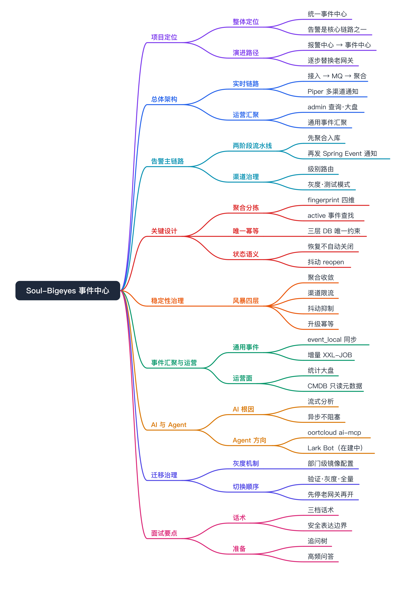

# Soul-Bigeyes 事件中心 面试准备



# 项目定位

- 项目名称：Soul-Bigeyes 统一事件中心
- 代码位置：`/opt/coding/code.soulapp-inc.cn/infrastucture/soul-bigeyes`
- 所属领域：稳定性平台、可观测性平台、事件治理、研发效能
- 项目类型：公司级事件中心与告警治理平台
- 核心目标：把分散在各系统和老告警网关里的告警与运维事件，收口成统一的事件中心；在告警治理之外，还承接通用事件汇聚、运营统计大盘、AI 根因分析和 Agent 接入。
- 服务对象：业务研发、SRE、平台运维、规则维护者、值班人员
- 关键词：事件中心、RocketMQ、fingerprint 聚合、DB 幂等、通知限流、飞书卡片、AI 根因分析、Agent/MCP、灰度迁移
- 面试价值：能体现平台后端控制面、异步事件流水线、状态机、幂等治理、AI/Agent 接入、迁移治理和稳定性收口能力。

一句话讲法：Soul-Bigeyes 现在是公司内部的统一事件中心，告警治理只是其中一条核心链路。我参与的是平台后端与事件治理链路建设，把原来分散在各系统和老告警网关里的通知、聚合、屏蔽、响应、限流、升级、查询，再加上通用事件汇聚、运营大盘、AI 根因分析和 Agent 能力，收口到一个统一的事件中心里。

需要先讲清的定位演进：早期它叫「新一代报警中心」，职能偏告警通知治理；现在代码里已经长出 `event_local` 通用事件汇聚、`event-center` 查询接口、统计大盘、AI 流式分析和 oortcloud ai-mcp Agent SDK，所以对外定位是「事件中心」，报警是它最成熟的一个场景，不是它的全部。

核心技术锚点：

- 两阶段事件流水线：RocketMQ 消费后先聚合入库，再发布 Spring Event 触发通知，避免消费、存储、发送强耦合。
- 唯一性分拣与 fingerprint 聚合：以来源、规则、类型、分类四维生成稳定指纹，把同一问题归到同一聚合事件。
- 通用事件汇聚：admin 侧从外部 `event_center` 库同步 `event_event` + `event_eventtype`，补部门信息后落 `event_local`，让告警之外的运维/业务事件也能统一查询。
- AI 与 Agent：飞书群告警发送成功后异步触发 AI 根因分析，以流式卡片回贴；admin 引入 oortcloud ai-mcp SDK 和 Lark Bot，做 Agent 方向的事件交互。
- 迁移灰度控制：老网关 `migrated-departments` 与 Bigeyes `enabled-departments` 镜像配置，控制部门级接管。
- 交互闭环：飞书卡片 WebSocket 回调落到事件状态机，所有操作写入 `alarm_agg_event_log`。
- 稳定性治理：通知限流、抖动抑制、DB 唯一约束幂等、升级幂等策略。

# 项目背景

- 告警入口分散：OWL、Prometheus、LogMonitor、XxlJob、Sentinel、业务自定义事件等来源各自接飞书、短信、电话或老网关，模板、频控、接收人逻辑分散。要解决的方向是统一接入模型和消息链路，让告警先进平台再做治理。
- 老网关偏通知转发：老网关更多承担「把告警发出去」的职责，缺少统一事件中心、聚合状态、操作日志和运营查询。要解决的方向是建立 `alarm_agg_event`、`alarm_record`、`alarm_notify_record` 等事件数据面。
- 事件视角缺失：除了告警，公司还有大量运维/变更类事件散落在各系统，没有统一查询入口。要解决的方向是把外部 `event_center` 的事件同步进来，和告警事件一起形成统一事件视图。
- 告警风暴和抖动难治理：同一故障可能短时间重复通知，恢复/触发来回抖动时容易生成大量事件或重复打扰。要解决的方向是通过 fingerprint 聚合、通知限流、抖动 reopen、升级幂等治理风暴。
- 交互处理不闭环：飞书里响应、屏蔽、误报、拉群等操作如果不能回写平台，事后很难追踪处理过程。要解决的方向是把飞书卡片动作统一回调到 Bigeyes，状态变更与操作日志落库。
- 排障与运营靠人脑：收到/没收到告警、谁处理过、是否升级，缺少数据化大盘和 AI 辅助。要解决的方向是建统计大盘和 AI 根因分析。
- 迁移风险高：一次性替换老报警网关，容易出现重复通知、漏通知或回滚困难。要解决的方向是部门级灰度和新旧配置镜像，分阶段接管真实通知。

这个项目不只是「换一个报警发送服务」，而是把事件治理拆成几个可演进的层次：接入层统一消息、聚合层收敛事件、通知层多渠道触达、交互层闭环处理、汇聚层纳入通用事件、运营层查询统计、智能层 AI/Agent、迁移层灰度接管。

# 项目目标

- 统一接入：告警源通过老网关或 SDK 投递到 RocketMQ，平台按统一模型消费处理。
- 事件聚合：用 fingerprint 把同一问题聚合到同一个 active 事件，避免事件中心刷屏。
- 通用事件汇聚：把外部事件中心的事件同步进本地 `event_local`，与告警事件统一展示和检索。
- 通知治理：按级别路由飞书、短信、电话等当前默认渠道；Piper 层还具备钉钉、邮件扩展能力，并提供灰度、测试模式、限流和发送记录。
- 交互闭环：飞书卡片上的响应、屏蔽、误报、确认、拉群等动作回写事件状态和日志。
- 运营查询：Admin 提供事件、规则、资源、发送记录、升级记录、AI 分析结果查询，以及统计大盘。
- 智能辅助：对支持的告警类型异步触发 AI 根因分析，并探索 Agent/MCP 方向的事件交互。
- 灰度迁移：通过部门级配置逐步替换老告警网关的真实通知职责，降低切换风险。
- 稳定性治理：通过 DB 幂等、异步事件、抖动抑制、限流、升级幂等和观测表来兜住失败场景。

# 我的职责

- 平台后端链路：参与告警消费、聚合、通知和 Admin 查询链路建设。可展开点是如何把 MQ 消费、聚合入库、通知发送拆成可恢复、可审计的链路。
- 工作负载生命周期治理经验迁移：把平台控制面、状态同步、操作日志、幂等补偿等经验用于告警事件治理。可展开点是告警事件为什么也需要状态机、幂等、审计和失败补偿。
- 事件聚合与分拣：参与 fingerprint 聚合、active 事件查找、重复消息幂等、恢复消息处理等逻辑梳理和优化。可展开点是当前指纹只含 `source + ruleId + alarmType + alarmCategory` 四维，要能说明好处、边界和误聚合风险。
- 通知与稳定性治理：参与灰度拦截、测试模式、通知限流、抖动抑制、升级幂等等能力建设。可展开点是如何避免重复通知、漏通知、刷屏和多实例重复升级。
- 事件汇聚与运营面：参与 `event_local` 通用事件同步、事件中心查询、统计大盘和 CMDB 元数据同步能力建设。可展开点是为什么实时告警链路不依赖 CMDB，查询和运营面才使用 CMDB。
- 运维收口：参与事件中心、发送记录、操作日志、排障入口建设。可展开点是「收到/没收到告警如何查」「飞书操作是否生效如何查」。

安全表达边界：可以说「我主要参与 Bigeyes 后端侧事件治理链路和稳定性能力建设」，不要直接说「我独立主导了整个公司事件平台从零到一」，除非面试中能拿出完整组织、排期和跨团队 Owner 证据。AI/Agent 这块当前更像在建中能力，介绍时讲清现状边界，不要说成已经成体系上线。

# 总体架构

## 业务架构图


读图顺序：左侧是告警来源和迁移入口，中间是 schedule 的消费、聚合、通知主链路，右侧是飞书交互和 AI 分析，底部 MySQL 与 admin 形成查询、汇聚和运营面。

## 架构分层

- 接入层：老告警网关、`soul-bigeyes-client`、OWL、Prometheus、LogMonitor、XxlJob、Sentinel、业务自定义告警，统一把多源告警转成 Bigeyes 可处理的消息模型。
- 消息缓冲层：RocketMQ，解耦告警生产和消费，承接突发流量与重投。
- 聚合调度层：`soul-bigeyes-schedule`、`AlertConsumer`、`AlarmRepositoryImpl`，消费 MQ，计算 fingerprint，聚合事件，写明细和状态。
- 通知发送层：`AlertNotifySender`、`soul-alert-piper`、`NotifyRateLimiter`，负责灰度、测试模式、渠道路由、限流、多渠道推送和发送记录；Piper 支持飞书、钉钉、短信、电话、邮件。
- 交互闭环层：飞书卡片、`LarkWsCardActionClient`、各类 `CardActionHandler`，承接 ack、mute、误报、确认、一键拉群等动作，回写事件状态和日志。
- 事件汇聚层：`EventCenterSyncService`、`event_local` 表，把外部 `event_center` 的通用事件同步进本地，和告警事件统一检索。
- 智能层：`AlarmAiStreamService`（schedule 侧 AI 根因分析）、oortcloud ai-mcp SDK 与 `LarkBotController`（admin 侧 Agent/Bot 方向能力）。
- 管理查询层：`soul-bigeyes-admin`、事件中心、统计大盘、规则/资源同步接口。
- 数据存储层：MySQL、CMDB 只读库、event_center 只读库，存储聚合事件、明细、通知记录、操作日志、资源元数据、部门信息和通用事件。

## 模块边界

- `soul-alert-common`：公共领域模型、枚举、Piper 消息体、渠道配置，关键类 `AlertEventMqMessage`、`AlertEvent`、`AlertChannel`、`PiperMessage`。
- `soul-alert-piper`：多渠道推送引擎，关键类 `PiperUtil`、`FeishuChatGroupPiper`、`FeishuIMPiper`、`SmsPiper`、`PhonePiper`、`DingTalkPiper`、`EmailPiper`、`FeishuApiClient`。
- `soul-bigeyes-client`：告警客户端 SDK，关键类 `AlarmClient`。
- `soul-bigeyes-schedule`：核心消费调度、聚合、通知、飞书回调、升级、限流、AI 触发，关键类 `AlertConsumer`、`AlarmRepositoryImpl`、`AlertNotifySender`、`LarkWsCardActionClient`、`AlarmAiStreamService`。
- `soul-bigeyes-admin`：war 长跑服务；管理后台 API、规则/资源/事件同步、事件查询和操作、统计大盘、事件中心查询、Lark Bot，关键类 `AlarmEventController`、`EventCenterController`、`EventCenterSyncService`、`RuleSyncManager`、`CategorySyncService`、`LarkBotController`。
- `soul-bigeyes-analyzer`：jar 占位模块；当前仅有启动入口，是否上线仍需 Owner 确认，关键类 `Starter`。

# 核心能力

- 统一告警接入：告警源通过老网关或 SDK 进入 MQ，再由 Bigeyes 消费。展开点是为什么先经 MQ，而不是业务系统直接调用通知接口。
- 告警事件聚合：用 fingerprint 把同一问题归并到同一条聚合事件。展开点是 fingerprint 维度、active 状态、静默处理和恢复消息语义。
- 通用事件汇聚：admin 同步外部事件中心的事件到 `event_local`，提供 `/api/event-center/events` 统一查询。展开点是告警事件和通用事件如何在同一个事件中心里共存、区分类型。
- 多渠道通知：当前默认路由支持飞书群、飞书 IM、短信、电话；Piper 层还实现了钉钉、邮件。展开点是按级别路由，P0/P1 覆盖强触达，P2/P3 偏飞书；钉钉/邮件属于可用通道能力，不要说成默认必发。
- 告警风暴治理：聚合收敛、通知限流、抖动抑制、升级幂等。展开点是如何避免刷屏、重复升级和 resolved/firing 抖动。
- 飞书交互闭环：卡片动作回调到平台，改变事件状态或写操作日志。展开点是 ACK、屏蔽、误报、确认、一键拉群如何形成审计闭环。
- AI 根因分析：对支持的告警类型异步调用 AI 后端，结果以飞书流式卡片回贴到原告警消息。展开点是为什么 AI 分析放在异步、失败如何不影响主通知链路。
- 运营统计大盘：Admin 提供 summary、trend、category、response、active 等多维统计接口。展开点是从「产生告警」到「告警被处理」的数据化运营视角。
- 灰度迁移：新旧报警网关通过部门级配置镜像逐步切换。展开点是如何避免双发、漏发和回滚困难。
- CMDB 元数据同步：Admin 只读同步 CMDB 资源和部门信息。展开点是为什么实时告警链路不依赖 CMDB，查询和运营面才使用 CMDB。

# 核心流程

## 告警处理主链路


## 流程说明

- 告警投递：告警源通过老网关或 `AlarmClient` 投递 MQ。失败处理依赖 MQ 重投，由 `alert_id` 唯一约束和 `insertIgnore` 兜底。
- 消费解析：schedule 的 `AlertConsumer` 消费消息并解析统一模型，发布阶段一 Spring Event。失败处理依赖 MQ 重试，入库幂等避免重复明细。
- 指纹计算：`AlertFingerprintCal` 根据来源、规则、类型、分类四维计算 fingerprint。边界是当前未纳入 `resourceName`，需要把「误聚合风险」讲清楚。
- 事件聚合：`AlarmRepositoryImpl.aggregateEvent()` 查 active 聚合事件，命中则更新，未命中则创建。失败处理由 DB 唯一键、事件编号重试、静默分支共同兜底。
- 通知触发：聚合成功后发布阶段二 Spring Event 触发通知。聚合和发送解耦，发送失败有 `alarm_notify_record` 可追踪。
- 渠道路由：`LevelBasedRoutingStrategy`、`FeishuChatIdResolver` 按级别、接收人、部门、测试模式、灰度策略选择渠道。灰度跳过和限流都会写发送记录，不静默丢失。
- AI 触发：飞书群消息发送成功后，`AlarmAiStreamService` 异步对支持的类型做 AI 分析并流式回贴。失败只记日志，不影响主通知。
- 交互回写：`LarkWsCardActionClient`、`CardActionHandler` 承接卡片动作，更新事件状态和日志。操作写 `alarm_agg_event_log`，可审计。
- 查询运营：`soul-bigeyes-admin` 查询事件、规则、资源、发送记录、升级记录、统计大盘，定位消费、聚合、通知、交互哪一环出问题。

# 关键设计

## 两阶段事件流水线

解决的问题：告警消费、聚合入库、通知发送如果放在一个同步调用里，任一环失败都会放大对主消费链路的影响，也不利于定位到底是入库失败、发送失败还是交互失败。

方案设计：RocketMQ 消费后，先由聚合逻辑写入 `alarm_record` 和 `alarm_agg_event`，再发布 Spring Event 触发通知发送。通知发送本身记录 `alarm_notify_record`，飞书操作写 `alarm_agg_event_log`。对应 `AlertEventConsumedListener`（阶段一→聚合落库→发布阶段二）和 `AlertNotifyListener`（阶段二→静默检查→委托 notify 包发送）。

为什么这样做：这相当于把「事实记录」和「副作用通知」拆开。只要事件和明细先落库，后续通知失败也能查到原因，并支持补偿或人工排查。

取舍：链路会多一层事件分发，排查时要看更多表和日志；但换来的是消费链路更稳定、失败定位更清晰。

面试追问：如果通知发送失败，怎么证明告警不是被消费丢了？回答重点是先查 `alarm_record` 和 `alarm_agg_event`，再查 `alarm_notify_record` 的渠道级失败原因。

## fingerprint 唯一性分拣

分拣目标有两个。一是同一个故障不要重复生成事件：同一规则或同一资源持续触发时，应该进入同一条 `alarm_agg_event`，只增加 `alert_count`。二是不同资源不能误聚合：当前四维指纹没有纳入 `resourceName`，如果某些来源的 `ruleId` 不稳定或为空，就存在多个资源被聚到同一事件的风险。

fingerprint 计算实现位置：`soul-bigeyes-schedule/src/main/java/com/soul/bigeyes/schedule/strategy/AlertFingerprintCal.java`。基础维度：

```
source | ruleId | alarmType | alarmCategory
```

当前没有额外补充维度：

```
resourceName 当前不参与 fingerprint 计算
```

最终把拼接后的 raw string 做 MD5，得到 32 位小写 hex fingerprint。这里以本地代码 `AlertFingerprintCal.build(source, ruleId, alarmType, alarmCategory)` 为准；如果后续要解决 `ruleId` 为空或日志类告警跨资源误聚合问题，需要先改函数签名和调用点，再同步迁移历史聚合口径。


事件分拣流程实现位置：`AlarmRepositoryImpl.aggregateEvent()`、`AlarmAggEventMapper.selectActiveByFingerprint()`。

1. 消费 MQ 后进入 `AlertEventConsumedListener`。
2. 普通告警调用 `aggregateEvent(...)`，恢复消息调用 `recoverByFingerprint(...)`。
3. `aggregateEvent` 用 fingerprint 查 active 事件，active 状态限定为 `firing`、`acked`。
4. 命中且未静默：更新同一事件的 `alert_count`、`last_alert_time`、`duration_seconds`、`content`、`level`。
5. 命中且静默：只更新 `suppressed_count`，返回 `suppressed=true`，后续不发布通知事件。
6. 未命中：创建新的 `alarm_agg_event`，生成业务可读 `event_no`。
7. 明细写入 `alarm_record`，每条 MQ 消息保留原始内容和聚合事件关联。

三层唯一性保护：

- 业务唯一：fingerprint，对应 `AlertFingerprintCal`、`alarm_agg_event.fingerprint`，判断哪些告警属于同一聚合事件。
- 消息幂等：`alert_id` 唯一，对应 `alarm_record.uk_alert_id`、`AlarmRecordMapper.insertIgnore`，RocketMQ 重复投递时不重复写明细。
- 事件编号唯一：`event_no` 唯一 + 重试，对应 `alarm_agg_event.uk_event_no`、`AlarmRepositoryImpl.insertWithRetry`，多实例生成事件编号冲突时自动重试。

`94617b4` 对分布式场景做过强化：`event_no` 格式改为 `EVT-yyyyMMdd-TTTSSSSS`，其中 `TTT` 来自 IP 末两字节 hash，`SSSSS` 是实例内 `AtomicLong` 序列；如果 DB 唯一键冲突，最多重试 3 次。

## 事件状态与恢复语义


需要注意：历史说明里曾出现「恢复消息自动 resolve」的口径，但当前代码实现是 `recoverByFingerprint()` 只递增 `recover_count`，写 `auto_recover` 操作日志，状态保持不变，日志文案也是「已标记，状态未变更，需手动关闭」。后续如果要恢复「自动解决」，需要同步调整代码、DDL 说明和前端口径。

面试时这里可以主动讲一个边界：我们没有简单把恢复消息等同于事件关闭，因为恢复消息可能只代表某个监控维度恢复，不一定代表值班人员已经确认问题闭环。当前实现更偏审慎，会记录恢复次数和日志，但状态关闭仍需要明确动作。

## 通知发送与灰度拦截

`AlertNotifySender.send()` 是通知链路的主入口，发送前后做五类治理：

- 灰度拦截：非测试模式下，如果 `grayEnabled=true` 且部门不在 `enabledDepartments`，跳过通知并写 `gray_skip` 发送记录。
- 测试模式改写：`testMode=true` 时清空真实接收人，替换成测试飞书用户、手机号、邮箱和测试群，避免误发。
- 渠道路由：`LevelBasedRoutingStrategy` 按告警级别选择渠道，P0/P1 会覆盖更强触达方式，P2/P3 偏飞书。
- 风暴防御：飞书群按 `chatId` 限流，IM/SMS/TEL 按 receiver 限流。
- 发送记录：成功、失败、灰度跳过、风暴限流都写 `alarm_notify_record`。

飞书群 `chatId` 解析由 `FeishuChatIdResolver` 完成，按优先级降级：

1. 测试模式优先使用 `test-chat-id`。
2. 告警消息中携带 `chatId` 时直接使用。
3. 按部门配置 `department-chat-ids` 降级。
4. 最后使用全局 `fallback-chat-id`。

# 技术难点

- 告警唯一性分拣：告警来源多，不同来源的规则 ID、资源名、类型字段稳定性不同。解决思路是用四维 fingerprint 聚合，依靠稳定 `ruleId` 区分规则；`resourceName` 未纳入是边界。展开点是如何避免「同一问题重复建事件」，以及如何识别「不同资源误聚合」的改造点。
- MQ 重投与多实例并发：RocketMQ 可能重复投递，schedule 多实例也可能同时处理相似告警。解决思路是 `alert_id` 唯一、`event_no` 唯一、`INSERT IGNORE`、重试生成事件编号。展开点是幂等不是靠代码 if 判断，而是要落到 DB 唯一约束。
- 告警风暴：故障爆发时，同一群、同一人、短信电话通道都可能被打爆。解决思路是聚合收敛 + 渠道维度限流 + 抖动抑制 + 升级幂等。展开点是分层治理风暴，不只是在发送前做一次 rate limit。
- 飞书交互一致性：用户在飞书卡片上操作，平台状态、操作日志和后续通知要保持一致。解决思路是每个按钮有 handler，动作落状态机和 `alarm_agg_event_log`。展开点是 ACK、屏蔽、误报、一键拉群如何保证可追踪。
- 通用事件与告警事件统一：通用事件来自外部 event_center，结构和告警不同。解决思路是 admin 侧增量同步进 `event_local`，统一查询模型，但不混进实时告警通知链路。展开点是为什么汇聚走 admin 同步，而不是塞进 schedule 实时链路。
- 新旧系统迁移：老网关和 Bigeyes 可能同时通知或都不通知。解决思路是部门级灰度配置镜像，按验证期、灰度期、全量期分阶段切换。展开点是如何设计迁移 runbook 和回滚顺序。
- 查询与实时链路隔离：CMDB、event_center 等外部数据如果实时依赖，可能影响告警主链路稳定性。解决思路是 Admin 同步只读元数据，本地缓存供前端查询；实时通知依赖 MQ 消息内携带字段。展开点是为什么运维查询面和实时告警面要解耦。

# 稳定性与治理

## 告警风暴抑制

风暴抑制来自 `f9db53e`，当前分为「聚合收敛、通知限流、抖动抑制、升级幂等」四层。

聚合收敛：同 fingerprint 的 active 告警不会反复创建事件，只会更新同一条 `alarm_agg_event`，`alert_count + 1` 代表触发次数，`last_alert_time` 与 `duration_seconds` 更新代表持续时间，最近一次 `content` 和 `level` 更新保证展示内容跟随最新消息。这层解决「事件中心被刷屏」的问题。

通知限流实现位置：`NotifyRateLimiter`、`AlertNotifySender`、`ScheduleApolloApplicationConfig`。`NotifyRateLimiter` 用 `ConcurrentHashMap<String, ConcurrentLinkedDeque<Long>>` 做内存滑动窗口，每个 key 维护一组时间戳：每次发送前清理窗口外时间戳；窗口内计数达到阈值就拒绝发送；每 10 分钟清理超过 30 分钟的空桶，避免内存无限增长。当前限流维度：

| 渠道 | key | 默认窗口 | 默认阈值 | 目的 |
| --- | --- | --- | --- | --- |
| 飞书群 | `chat:{chatId}` | 1 分钟 | 15 条 | 防止一个群被密集卡片刷屏 |
| 飞书 IM | `im:{receiver}` | 1 分钟 | 15 条 | 防止一个人被 IM 轰炸 |
| 短信 | `sms:{receiver}` | 1 分钟 | 3 条 | 控制短信成本和打扰 |
| 电话 | `tel:{receiver}` | 10 分钟 | 2 次 | 控制强打扰通道 |

抖动抑制窗口以当前 `ScheduleApolloApplicationConfig.flapSuppressMinutes=60` 为代码默认值；CodeWiki 中 `storm-defense.md` 和部分配置注释仍保留过 10 或 15 分钟的历史口径，面试稿以当前代码为准。被限流的发送不会静默丢失，会写入 `alarm_notify_record`，`success=false`，`error_msg` 记录 `Storm: ... rate limited`，便于事后解释为什么没收到某条通知。

抖动抑制实现位置：`AlarmRepositoryImpl.aggregateEvent()`、`AlarmAggEventMapper.selectRecentlyResolvedByFingerprint()`、`reopenEvent()`。场景是同一故障反复 `firing -> recovered/resolved -> firing`，如果每次都创建新事件，会造成事件碎片和重复通知。当前逻辑：


注意这里故意只 reopen `recover_count > 0` 的事件，人工 resolved/closed 不会被抖动逻辑自动重开，避免覆盖人的处理结论。

升级幂等：P0/P1 如果长期无人响应，`AlarmEscalationStrategy` 会升级给直属 leader。但多实例部署时所有实例都会跑定时任务，因此通过 `alarm_escalation_record.uk_agg_event_id` 做 DB 幂等：第一个实例 `INSERT IGNORE` 成功，继续追加 receiver 并通知 leader；其他实例插入返回 0，直接跳过。这层不直接抑制通知数量，但避免多实例重复升级造成额外风暴。

## 稳定性机制汇总

- 两阶段 Spring Event：`AlertEventConsumedListener`、`AlertNotifyListener`，解耦聚合与通知，消费线程不直接承载所有副作用。
- DB 幂等：`insertIgnore`、唯一索引，抵御 MQ 重投、多实例并发升级。
- 静默双检：聚合阶段 + 通知阶段，防止聚合到通知之间发生屏蔽导致误发。
- 风暴限流：`NotifyRateLimiter`、`AlertNotifySender`，限制同群、同接收人的短时间轰炸。
- 抖动抑制：`selectRecentlyResolvedByFingerprint`、`reopenEvent`，减少 resolved/firing 来回抖动产生的新事件。
- 升级策略：`AlarmEscalationStrategy`，P0/P1 超时未响应时升级直属 leader。
- AI 异步分析：`AlarmAiStreamService`，飞书群消息成功后异步分析，失败不阻塞主通知链路。

# 飞书交互闭环


当前已有的交互 handler：

- `AckActionHandler`：响应事件。
- `MuteActionHandler`：屏蔽或取消屏蔽。
- `FalsePositiveActionHandler`：标记误报类型。
- `PositiveActionHandler`：确认准确。
- `CreateChatActionHandler`：创建飞书应急群，发送告警摘要，并尝试转移群主。

扩展新按钮的方式比较清晰：`LarkCallback` 增加枚举值，再新增 `@Component` 实现 `CardActionHandler`。

面试展开时重点不是「飞书卡片怎么写」，而是：卡片只是交互入口，真正的闭环是状态变更、操作日志、发送记录和后续查询；所有操作都要能回答「谁在什么时候对哪个事件做了什么操作，结果是什么」；一键拉群这种动作属于强副作用，必须有失败记录和可追踪日志。

# 事件汇聚与运营面

这是「事件中心」相比「报警中心」最关键的扩展：除了实时告警事件，平台还把外部事件中心的通用事件和运营统计统一进来。

## 通用事件汇聚

实现位置：`EventCenterSyncService`、`EventCenterController`、`EventSyncController`、`event_local` 表。

- 数据来源：admin 侧从外部 `event_center` 库关联查询 `event_event` + `event_eventtype`，对应 `EventCenterSyncMapper`。
- 落地形态：补充部门信息后写入本地 `event_local`，字段含 `source_event_id`、`name`、`source`、`object_key/object_value`、`type_name`、`grade`、`status`、`user`、`department`、`event_abstract`、`source_create_time` 等。
- 同步策略：全量同步回溯最近 3 天（`syncAll`，手动触发 `POST /api/sync/event/all`）；增量同步回溯最近 10 分钟（`syncIncremental`，由 XXL-JOB 定时调度），增量按 `source_event_id` 判断 insert / update，update 用 `syncHash` 判断是否变更。
- 查询入口：`GET /api/event-center/events` 支持按 user、department、source、type、status、keyword、时间范围分页查询；`GET /api/event-center/event-types` 返回事件类型映射。
- 设计取舍：通用事件走 admin 异步同步成本地只读表，不进 schedule 实时告警链路。这样事件中心的检索能力增强，但实时通知链路保持短而可控。

## 统计与运营大盘

实现位置：`AlarmEventController` 的 `stats/*` 系列接口。

- `stats/summary`：按 receiver/时间维度的汇总。
- `stats/trend`：告警趋势。
- `stats/category`：按分类统计。
- `stats/response`：响应情况统计。
- `stats/active`、`stats/active/trend`、`stats/active/department-detail`、`stats/active/department-trend`、`stats/active/receiver-trend`：活跃事件及其按部门、接收人维度的明细与趋势。

这套接口把「告警发生—响应—解决」的过程数据化，支撑值班复盘和运营视角，而不是只看单条告警。

## Admin 查询能力

`soul-bigeyes-admin` 是统一查询和运营面：

- 个人告警事件：`/api/alarm/events` 支持列表、详情、响应、解决、批量响应、批量解决、日志、发送记录、升级记录、AI 分析结果、一键拉群。
- 规则管理只读视图：`/api/alarm/rules` 从统一规则表查询，支持来源、分类、资源、接收人、部门等过滤。
- 资源元数据查询：`/api/alarm/category/{type}` 查询同步到本地的 CMDB 资源信息。
- 事件中心查询：`/api/event-center/events` 与 `/api/event-center/event-types`。
- 同步任务手动触发：`/api/sync/rule/*`、`/api/sync/category/*`、`/api/sync/event/all`。
- 用户上下文与开放接口：`/api/user/current`、`/api/user/departments`；`/open-api/` 下有免权限认证接口，例如检查用户是否命中 Bigeyes 接管部门。
- Lark Bot：`/api/lark/bot/chats` 按关键词搜索机器人所在群，供 Agent/事件交互方向使用。

规则、资源、事件中心同步的共同设计是：从外部系统拉取只读数据，写入 Bigeyes 本地表，补充部门、负责人、hash 和同步时间，供前端低成本查询。

# AI 与 Agent 能力

这块当前更偏在建中能力，介绍时讲清现状边界。

## AI 根因分析

实现位置：`AlarmAiStreamService`（schedule 侧），参考 alarm-gateway 的 `utils/ai.py` Handle 类。

- 触发时机：飞书群告警消息发送成功后异步调用，`@Async("aiAnalysisExecutor")`。
- 启用判断：`isAiEnabled(alarmType)` 同时看全局开关 `ScheduleApolloApplicationConfig.aiEnabled` 和支持类型集合 `aiEnabledTypes`，当前支持类型例如 RDS 慢日志报警、Redis 慢日志报警、磁盘使用率。
- 处理流程：从告警内容里正则提取实例 ID、时间等字段，调 AI 后端获取分析结果，再创建飞书流式卡片回贴到原告警消息，最多重试 3 次。
- 结果留痕：admin 侧 `AlarmAiAnalysis` 实体与 `/api/alarm/events/{id}/ai-analysis`、`/ai-analysis/{analysisId}/result` 提供提交与查询入口。
- 设计要点：AI 分析放异步、失败只记日志，不阻塞也不影响主通知链路；这是把 AI 当增强而非链路强依赖。

## Agent / MCP 接入

- admin 的 `oortcloud-sdk` 升级到 `1.1.5.3-ai-mcp-SNAPSHOT`（commit `19efb77` / feat-agent 分支），引入 AI MCP 方向能力。
- `LarkBotController` + `LarkChatService` 提供机器人群搜索等基础能力，为 Agent 与事件交互打底。
- 面试表达边界：这块目前是平台往 Agent/MCP 方向演进的基础设施，不要说成已经有成熟的智能体在自动处置事件。

# 数据模型

核心表关系：


- `alarm_record`：核心字段 `alert_id`、原始告警内容、聚合事件 ID，保存每条 MQ 告警明细，`alert_id` 唯一处理 MQ 重投。
- `alarm_agg_event`：核心字段 `event_no`、`fingerprint`、`status`、`alert_count`、`recover_count`，表达一个聚合后的告警事件，active 状态内按 fingerprint 聚合，事件编号有唯一约束。
- `alarm_notify_record`：核心字段渠道、接收人、success、error_msg，记录每次通知发送结果，成功、失败、灰度跳过、风暴限流都可解释。
- `alarm_agg_event_log`：核心字段操作类型、操作者、事件 ID、操作内容，记录响应、屏蔽、误报、拉群、升级、自愈标记，支持审计和事后复盘。
- `alarm_escalation_record`：核心字段聚合事件 ID、升级接收人、状态，记录升级策略执行，`uk_agg_event_id` 保证多实例只升级一次。
- `alarm_ai_analysis`：核心字段事件 ID、分析状态、结果、失败原因，保存 AI 分析任务结果，分析异步触发不阻塞主通知链路。
- `event_local`：核心字段 `source_event_id`、`name`、`source`、`type_name`、`grade`、`status`、`event_abstract`、`source_create_time`，汇聚外部事件中心的通用事件，`syncHash` 辅助增量更新。

幂等点：

- `alarm_record.uk_alert_id`：RocketMQ 重复投递时 `INSERT IGNORE` 防止明细重复。
- `alarm_agg_event.uk_event_no`：事件编号唯一，冲突时重试生成。
- `alarm_escalation_record.uk_agg_event_id`：多实例定时扫描时保证同一聚合事件只升级一次。

# 替换老报警网关

替换老报警网关不是一次性「大爆炸」切换，而是通过 `c0ffc71` 引入的灰度能力分阶段接管。核心原则是：先保证 Bigeyes 能正确消费、聚合、落库和发测试通知，再逐部门接管真实通知，最后让老网关只保留 MQ 投递。

## 切换时间线


## 配置镜像关系

```
老网关 alert.gateway.migrated-departments = Bigeyes notify.gray.enabled-departments
```

为什么要镜像：同一个部门在同一时刻只能有一边负责真实通知。如果老网关没停、Bigeyes 已开，会重复通知；如果两边都停，会漏发。实际切换时用短窗口换取「不重复」：上线顺序是先停老网关该部门通知，再开 Bigeyes 该部门通知；回滚顺序是先恢复老网关该部门通知，再关 Bigeyes 该部门通知。

## 分阶段步骤

- 验证期：老网关保持原有落库和通知、额外发 MQ；Bigeyes `test-mode=true`，通知进测试群/测试号码。目的是验证聚合、通知、卡片和前端展示。
- 灰度期：老网关对已迁移部门跳过旧通知；Bigeyes `gray-enabled=true`，只接管 enabled 部门。目的是部门级逐步切流。
- 全量期：老网关 `notify-disabled=true`，只发 MQ；Bigeyes `gray-enabled=false`，全量接管。目的是 Bigeyes 成为统一事件与通知中心。

单部门迁移 runbook：先让老网关加入 `migrated-departments` 并部署；再让 Bigeyes 加入 `enabled-departments` 并部署；观察 `alarm_notify_record` 和飞书/短信/电话实际触达；通知部门确认内容、链接、卡片动作可用。

验收标准：

- MQ 消费：`alarm_record` 有对应 `alert_id`，重复消息不会重复插入。
- 聚合：同一 fingerprint 的告警进入同一 `alarm_agg_event`，`alert_count` 增长。
- 通知：`alarm_notify_record` 能解释每个渠道的 success/fail/gray_skip/storm 限流。
- 交互：飞书卡片 ack/mute/误报/拉群能更新 `alarm_agg_event` 和 `alarm_agg_event_log`。
- 灰度：`/open-api/users/enabled-department/check` 可检查用户是否命中 Bigeyes 接管部门。

# Admin 与 CMDB 交互

CMDB 是 admin 的只读元数据源；Bigeyes 会把它缓存成本地资源表用于前端查询、资源筛选、部门维度运营。告警发送实时路径不依赖 CMDB，依赖上游 MQ 消息已经带好的 owner/department/receiver 信息。

Bigeyes 不是通过 CMDB HTTP API 交互，而是 `soul-bigeyes-admin` 直连 CMDB MySQL 只读库；`soul-bigeyes-schedule` 实时告警链路不查 CMDB。交互主要有两块：

1. 资源元数据同步：admin 配了一个 `cmdbDataSource`，挂到动态数据源里，`@DS(DataSourceType.CMDB)` 的 Mapper 会切到 CMDB 库查询。关键位置包括 `DynamicDataSourceConfig.java` 和 `DataSourceType.java`。
2. 用户/部门信息补齐：`AdminUserCacheUtil` 用 Auth Dubbo 拉员工和组织，但对 leader 走 CMDB：从 `account_user` 找 `is_leader=1`，再通过 `account_user.open_id -> user_department_lark.leader_user_id` 找 leader 管理的部门。关键位置包括 `AdminUserCacheUtil.java` 和 `CmdbUserMapper.java`。


# CodeWiki 对照结论

- 项目定位：CodeWiki 口径是统一告警接入、聚合、通知分发与交互平台；本地代码已扩展出事件汇聚、统计大盘、AI/Agent，本文据此把定位升级为「事件中心」，告警是其中一条核心链路。
- 告警来源：OWL、Prometheus、LogMonitor、XxlJob、Sentinel、业务自定义，README 与 CodeWiki 均有此口径，已补进背景与架构层。
- 多渠道：Piper 支持飞书、钉钉、短信、电话、邮件，`AlertChannel` 和 `PiperUtil` 确认支持 `DINGTALK`、`EMAIL`，已区分「Piper 支持」与「当前默认路由」。
- 默认路由：`LevelBasedRoutingStrategy` 当前默认 P0=电话+短信+飞书群+飞书 IM，P1=短信+飞书群+飞书 IM，P2/P3=飞书群+飞书 IM，面试稿不把钉钉/邮件说成当前默认必发。
- fingerprint：以 `source + ruleId + alarmType + alarmCategory` 四维为准，`AlertFingerprintCal.build()` 只有四个参数，`resourceName` 未参与，已删除「`source=sol` 追加 `resourceName`」旧口径。
- 自愈恢复：CodeWiki `auto-recovery.md` 仍写自动 resolved，但 `recoverByFingerprint()` 只 `recover_count + 1` 并写日志，状态不变，本文保留「当前不自动关闭事件」的边界。
- EventNo：CodeWiki `distributed-eventno.md` 仍保留 `EVT-{yyyyMM}-{TT}{SSSSS}`，当前代码是 `EVT-yyyyMMdd-TTTSSSSS`，`TTT` 来自 IP 末两字节 hash，本文以当前代码为准。
- analyzer：CodeWiki 标记占位模块，本地模块也只有启动入口，无核心分析代码，保留「占位 / 不要夸大」边界。

# 项目演进与代码证据

以下梳理基于 git commit 与当前代码实现，没有依赖 README。

- `c0ffc71`（2026-03-18）`piper sdk优化一版+schedule增加灰度上线验证逻辑`：抽出 `AlertNotifySender`、`NotifyGrayProperties`、多渠道 Piper SDK，形成「测试模式 / 部门灰度 / 全量接管」的迁移基础。
- `f9db53e`（2026-03-23）`schedule增加风暴告警防御+告警升级`：引入 `NotifyRateLimiter`、飞书群/接收人维度限流、抖动抑制、P0/P1 升级策略。
- `94617b4`（2026-03-30）`分布式改造... EventNo生成逻辑... DB锁幂等... 兼容自愈告警逻辑`：强化多实例唯一性，EventNo 加实例标识和重试，升级记录用唯一键做 DB 幂等，恢复消息进入独立分支。
- `19efb77` / feat-agent（2026-03-31）`Change oortcloud-sdk to version 1.1.5.3-ai-mcp-SNAPSHOT`：admin 引入 AI MCP 方向 SDK，配合 `LarkBotController` 探索 Agent 能力。
- `3c653ce`（2026-04-07）`fix sol告警指纹计算逻辑`：是历史 commit 主题；但当前本地代码 `AlertFingerprintCal.build()` 仍只有四维参数，没有 `resourceName` 入参，面试稿以当前代码为准。
- `3865ad4`（2026-04-21）`修复个人跟飞书群 恢复消息不一致；增加规则同步接口`：修正恢复消息在个人和群通知中的一致性，补齐规则/资源同步操作入口。
- `2540d14` Reactor sync rule：重构规则同步链路，并带出 `AlarmAiAnalysis`、`event_local`、Lark Bot 等事件中心相关能力的成型。

# 指标与收益

- 接入治理：从分散直推逐步收口到统一事件平台，业务系统不再各自维护飞书应用、Webhook、鉴权、重试和频控逻辑。
- 事件收敛：同 fingerprint active 告警聚合到同一事件，降低重复建事件和刷屏概率，便于值班人员按事件处理。
- 事件视图统一：告警事件和通用事件汇聚到同一查询面，运维事件不再只散落在各系统。
- 通知可解释：每次发送成功、失败、灰度跳过、风暴限流都有记录，能回答「为什么没收到告警」或「为什么没有继续通知」。
- 交互闭环：飞书卡片操作回写状态和日志，告警响应、屏蔽、误报、一键拉群可审计。
- 运营可视：统计大盘把发生、响应、解决过程数据化，支撑复盘。
- 迁移风险：部门级灰度替换老网关通知职责，避免全量切换导致双发、漏发和回滚困难。

不要在没有真实数据时说「告警量下降 50%」或「MTTR 降低多少」。更稳妥的表达是：统一入口、减少重复通知、提升事件处理可见性和排障可解释性。

# 和岗位的匹配点

- SRE / 稳定性平台：告警治理、通知收敛、升级、风暴防御，可展开如何把稳定性能力产品化而不是只靠人工值班。
- 平台后端：MQ、异步事件、DB 幂等、状态机、Admin 查询，可展开控制面如何拆分同步路径、异步副作用和查询运营面。
- 可观测性平台：事件中心、规则/资源同步、发送记录、操作日志、统计大盘，可展开从「产生事件」到「事件被处理」的闭环数据模型。
- AI Infra / Agent 平台：AI 根因分析、oortcloud ai-mcp、Lark Bot，可展开如何把 AI 当增强能力而非链路强依赖地接入平台。
- 研发效能：SDK 降低接入成本，统一模板和触达策略，可展开如何减少各系统重复建设通知、重试、鉴权和频控逻辑。

# 面试讲法

## 三十秒版

Soul-Bigeyes 现在是公司内部的统一事件中心，告警治理是它最成熟的一条链路。它把告警接入、事件聚合、多渠道通知、飞书交互、通用事件汇聚、运营大盘、AI 根因分析和灰度迁移收口到一个平台，并逐步替换老告警网关的通知职责。我主要参与后端侧事件治理链路建设，包括 MQ 消费后的事件聚合、fingerprint 分拣、DB 幂等、通知限流、灰度拦截、飞书卡片闭环和排障数据收口。这个项目比较能体现我在平台控制面、状态治理和稳定性建设上的经验。

## 三分钟版

背景是公司事件入口比较分散，很多系统各自直连飞书或依赖老告警网关，通知能发出去，但事件聚合、状态闭环、发送审计、限流、灰度迁移和统一查询能力都不够。Bigeyes 的思路是先让告警通过老网关或 SDK 进入 RocketMQ，然后由 schedule 消费，计算 fingerprint，把同一问题聚合成一条 `alarm_agg_event`，明细写入 `alarm_record`，再通过 Spring Event 触发通知发送。

通知链路里会做灰度拦截、测试模式改写、级别路由和风暴限流，所有结果都会写入 `alarm_notify_record`。飞书卡片上的响应、屏蔽、误报、一键拉群等动作会回调到平台，更新事件状态并写 `alarm_agg_event_log`。在告警之外，admin 还把外部事件中心的通用事件同步进 `event_local` 做统一查询，并提供统计大盘；飞书群告警成功后会异步触发 AI 根因分析回贴卡片。

我在面试里会重点展开三个点：第一是 fingerprint 如何避免重复事件和误聚合；第二是告警风暴如何用聚合、限流、抖动抑制、升级幂等分层治理；第三是新旧报警网关如何用部门级配置镜像灰度切换，避免重复通知和漏通知。

## 五分钟版

更深入讲，这个项目本质上是把告警从「通知转发」升级成「事件治理」，再进一步收成「事件中心」。老方案里，很多系统只关心把消息推到飞书或短信，但收到告警之后是否被响应、是否重复、是否被屏蔽、是否升级、是否有人处理，很难形成统一数据面；告警之外的运维事件更是散落各处。

Bigeyes 的核心架构分为接入层、消息层、聚合调度层、通知层、交互层、事件汇聚层、智能层、Admin 查询层和存储层。接入层通过老网关或 SDK 投递 RocketMQ；schedule 消费后先聚合入库，再发布 Spring Event 做通知；通知发送通过 Piper 层适配飞书群、飞书 IM、短信、电话等当前默认触达渠道，钉钉和邮件是 Piper 已实现的可扩展通道；飞书卡片回调再落回事件状态机和操作日志。admin 侧把外部事件中心的通用事件增量同步进 `event_local`，和告警事件一起检索，并提供 summary/trend/category/response/active 等统计大盘。

难点主要有几个。第一是唯一性分拣，当前代码只用 `source + ruleId + alarmType + alarmCategory` 四维生成 fingerprint，简单稳定，但边界是某些来源 `ruleId` 为空或粒度过粗时可能跨资源误聚合，后续要改就必须同步调整函数签名、调用点和历史聚合口径。第二是幂等，MQ 重投靠 `alarm_record.uk_alert_id`，事件编号靠 `alarm_agg_event.uk_event_no` 和重试，多实例升级靠 `alarm_escalation_record.uk_agg_event_id`。第三是风暴治理，不是简单做发送前限流，而是先用聚合收敛减少事件，再用渠道维度限流控制打扰，再用抖动抑制处理恢复/触发反复切换，最后用 DB 幂等避免重复升级。

智能化方向上，飞书群告警成功后会对支持的类型异步触发 AI 根因分析，以流式卡片回贴，失败只记日志不影响主链路；admin 还引入了 oortcloud ai-mcp SDK 和 Lark Bot，往 Agent 方向打基础，这块我会如实说是在建中能力。迁移上也比较谨慎，通过老网关 `migrated-departments` 和 Bigeyes `enabled-departments` 做镜像配置，先测试模式验证，再按部门灰度，最后全量接管，出问题时可以按部门回滚，避免双发或漏发。

# 面试追问树

```
Q1：这个项目是做什么的？为什么从报警中心变成事件中心？
  └── Q2：为什么需要替换老报警网关？
        └── Q3：你负责哪部分？
              └── Q4：整体链路从告警产生到飞书响应是怎么走的？
                    └── Q5：fingerprint 怎么设计，如何避免误聚合？
                          └── Q6：MQ 重复投递、多实例并发怎么保证幂等？
                                └── Q7：告警风暴怎么治理？
                                      └── Q8：通用事件怎么汇聚进来，和告警事件如何统一？
                                            └── Q9：AI 根因分析怎么做，为什么放异步？
                                                  └── Q10：飞书卡片操作如何和平台状态保持一致？
                                                        └── Q11：新旧网关迁移怎么避免双发和漏发？
                                                              └── Q12：如果继续演进，你会先补什么？
```

# 高频 Q&A

这个项目和普通告警发送服务有什么区别？普通告警发送服务更多是把消息发出去，Bigeyes 更强调事件治理和事件中心。它会把告警明细、聚合事件、通知记录、操作日志、升级记录、AI 分析结果、通用事件统一建模，所以能回答告警有没有消费、有没有聚合、有没有通知、为什么没通知、谁处理过、后续如何升级，以及告警之外的事件视图。

为什么叫事件中心而不是报警中心？因为代码已经从纯告警通知，长出了通用事件汇聚（`event_local`）、统计大盘、AI 根因分析和 Agent/MCP 基础。报警是其中最成熟的链路，但平台的目标是统一的事件视图和治理。

为什么要引入 RocketMQ？告警生产和告警处理不应该强耦合。MQ 可以削峰、重试、隔离上游系统和平台处理能力。Bigeyes 通过 `alert_id` 唯一约束处理 MQ 重投，保证重复消息不会重复写明细。

fingerprint 为什么不直接用 ruleId？因为不同告警源字段稳定性不一样，单独用 ruleId 不足以表达来源、告警类型和分类。当前代码使用 `source + ruleId + alarmType + alarmCategory` 四维生成 MD5，优点是简单、可复现、成本低；边界是 `resourceName` 没有参与计算，如果某个来源的 ruleId 粒度过粗或为空，确实可能误聚合，这也是后续可优化点。

active 事件为什么只限定 `firing` 和 `acked`？因为这两个状态代表事件还在处理中或仍然有效，可以继续聚合。同一个 fingerprint 如果已经 resolved/closed，一般不应该无脑继续写进去，而是要结合抖动逻辑判断是否 reopen，避免覆盖人的处理结论。

恢复消息为什么不直接把事件改成 resolved？当前实现比较保守，`recoverByFingerprint()` 只递增 `recover_count` 并写 `auto_recover` 日志，状态不自动关闭。原因是恢复消息可能只是某个监控维度恢复，不一定代表事件已经处理闭环。是否自动 resolve 需要和产品口径、前端展示、值班流程一起对齐。

告警风暴怎么防？分四层。第一层 fingerprint 聚合减少事件数量；第二层按飞书群、IM、短信、电话维度限流；第三层对 resolved/firing 反复抖动的事件做 reopen，避免事件碎片；第四层对升级记录做 DB 幂等，避免多实例重复升级。

限流会不会导致告警丢失？通知可能被限流跳过，但不会静默丢失。事件和明细已经落库，被限流的发送也会写 `alarm_notify_record`，`success=false`，`error_msg` 记录风暴限流原因，事后可以解释为什么没有继续触达。

通用事件是怎么进来的？admin 侧 `EventCenterSyncService` 从外部 `event_center` 库关联查 `event_event` + `event_eventtype`，补部门信息后写 `event_local`，全量回溯 3 天、增量回溯 10 分钟由 XXL-JOB 调度，再通过 `/api/event-center/events` 统一查询。它不进 schedule 实时告警链路，避免外部库波动影响通知。

AI 根因分析怎么做的？飞书群告警发送成功后异步触发，先看全局开关和支持类型，再从告警内容正则提取实例 ID、时间，调 AI 后端拿结果，用飞书流式卡片回贴原消息，最多重试 3 次，失败只记日志。它是增强能力，不是链路强依赖。

飞书卡片操作如何扩展？当前是 `LarkCallback` 枚举加 `CardActionHandler` 实现的模式。新增按钮时先定义动作类型，再新增对应 handler。重点是动作不能只在飞书侧完成，必须回写事件状态和操作日志。

为什么 CMDB 不放到实时告警链路里查？实时告警链路要尽量短且可控。CMDB 这类外部元数据适合由 Admin 侧只读同步成本地资源表，用于查询、筛选和运营分析；实时通知依赖 MQ 消息里已经携带的 owner、department、receiver 等字段，避免外部系统波动影响告警发送。

新旧报警网关怎么灰度？用部门级配置镜像。老网关的 `migrated-departments` 和 Bigeyes 的 `enabled-departments` 对齐，同一部门同一时间只让一边负责真实通知。上线时先停老网关该部门通知，再开 Bigeyes；回滚时反过来，先恢复老网关，再关 Bigeyes。

这个项目最能体现你的能力点是什么？不是某个单点功能，而是平台型后端能力：异步链路拆分、事件状态建模、DB 幂等、通知副作用治理、事件汇聚、迁移灰度和排障数据收口。这些能力和研发交付平台、AI 训推平台里的工作负载生命周期治理是相通的。

如果继续演进，你会先做什么？优先补三块：第一是恢复语义和状态机口径，明确是否自动 resolve；第二是把灰度、限流、通知失败、同步成功率等观测指标标准化，形成大盘和 SLO；第三是把 AI 分析和 analyzer 模块、Agent/MCP 方向的边界理清，避免智能能力散落在 schedule 里。

# 风险与边界

- 「我主导了公司事件平台」有风险，可能被追问组织推动、排期、跨团队决策和最终 Owner；更稳妥说「我主要参与 Bigeyes 后端侧事件治理链路和稳定性能力建设」。
- 「Bigeyes 完全替代老网关」有风险，当前是逐步替换老网关的通知职责，迁移有阶段；更稳妥说「Bigeyes 逐步接管老网关的真实通知职责，老网关在迁移阶段仍承担投递或兼容角色」。
- 「恢复消息会自动关闭事件」当前代码不是这样；更稳妥说「当前恢复消息只记录 `recover_count` 和日志，状态不自动变更」。
- 「AI 分析/Agent 已成体系上线」有风险；更稳妥说「AI 根因分析在 schedule 侧对部分类型异步触发，oortcloud ai-mcp 和 Lark Bot 是 Agent 方向在建中的基础能力」。
- 「告警限流不会影响通知」有风险，限流本身会跳过部分触达；更稳妥说「限流会减少触达，但不会让事件和失败原因不可见」。
- 「CMDB / event_center 是实时告警链路依赖」有风险；更稳妥说「它们是 Admin 查询和汇聚面的只读元数据源，实时告警链路不查」。
- 「钉钉/邮件也是默认通知渠道」有风险，当前默认路由没有把钉钉/邮件加入 P0-P3 必发链路；更稳妥说「Piper 支持钉钉和邮件，但当前默认级别路由以飞书、短信、电话为主」。
- 「fingerprint 已按资源名区分」有风险，当前 `AlertFingerprintCal.build()` 没有 `resourceName` 参数；更稳妥说「当前是四维 fingerprint；资源名参与聚合属于后续可优化点」。

# 当前代码与文档需要对齐的点

- 恢复消息语义：代码只做 `recover_count + 1` 与日志记录，不自动改 `status=resolved`；历史文档中的「自动将对应聚合事件 resolve」口径需要更新，或反向补代码。
- `soul-bigeyes-push` 模块：历史模块表提到 push，但根 `pom.xml` 当前未包含该 module，仓库内也未看到对应目录。
- analyzer 模块：当前只看到启动入口，实际分析能力主要在 schedule 的 `AlarmAiStreamService`，需要确认 analyzer 后续定位。
- EventNo 格式：历史描述里曾出现 `EVT-{yyyyMM}-{TT}{SSSSS}`，当前代码是 `EVT-yyyyMMdd-TTTSSSSS`，且实例标识是 3 位。
- fingerprint 维度：旧稿曾写 `source=sol` 或 `ruleId` 为空时追加 `resourceName`，但当前代码没有这个逻辑；如果需要资源级聚合隔离，需要修改代码和历史聚合口径。
- AI/Agent 定位：oortcloud ai-mcp、Lark Bot 属于在建中能力，对外口径要和实际上线范围对齐，避免夸大。

# 排障入口

常用排查表：

- `alarm_agg_event`：看聚合事件是否创建、状态是否正确、是否静默、是否被压制。
- `alarm_record`：看 MQ 消息是否入库，`alert_id` 是否重复，`recovered` 是否符合预期。
- `alarm_notify_record`：看每个渠道是否发送、失败原因、是否被灰度/限流跳过。
- `alarm_agg_event_log`：看响应、屏蔽、误报、拉群、升级、自愈标记等操作轨迹。
- `alarm_escalation_record`：看升级是否触发、是否被唯一约束跳过。
- `alarm_ai_analysis`：看 AI 分析任务状态和失败原因。
- `event_local`：看通用事件是否同步进来、`sync_hash` 是否更新、是否漏同步。

常用本地命令：

```bash
mvn clean install
mvn -pl soul-bigeyes-schedule -am package
mvn -pl soul-bigeyes-admin -am package
mvn -pl soul-bigeyes-schedule test
```

# 后续演进

- 恢复语义：短期明确恢复消息是否自动 resolve，并同步代码、DDL、前端文案和面试口径；长期建立更完整的事件状态机和自动恢复策略。
- 观测指标：短期标准化 MQ 消费、聚合成功率、通知成功率、限流次数、灰度跳过、飞书回调失败、事件同步成功率等指标；长期形成事件平台自身的大盘和 SLO。
- 通知策略：短期对部门、级别、时间段、渠道做更可配置的策略管理，明确钉钉/邮件是否进入默认路由；长期策略中心化，支持更细粒度的值班和升级规则。
- 指纹维度：短期评估 `ruleId` 为空或粒度过粗的来源是否需要把 `resourceName` 纳入 fingerprint；长期建立按来源可配置的 fingerprint 策略，同时处理历史事件兼容。
- 事件汇聚：短期完善 `event_local` 同步的覆盖度和一致性校验；长期把告警事件和通用事件做更统一的检索、关联和时间线视图。
- AI 与 Agent：短期明确 analyzer 模块和 schedule 内 AI 分析的边界、扩大支持的告警类型；长期把告警根因分析、相似事件关联、自动摘要和 Agent 处置沉淀为平台能力。
- 迁移治理：短期固化部门迁移 runbook、验收 checklist 和回滚脚本；长期支持更自动化的迁移状态追踪和风险预警。

# 图示清单

- 全文总览思维导图（本文档最前）：展示事件中心九大模块骨架，优先级 P0。
- 业务架构图（总体架构）：展示告警来源、schedule 主链路、飞书交互、AI 分析、MySQL 和 Admin 的关系，优先级 P0。
- 核心告警时序图（核心流程）：讲清楚告警从 MQ 消费到聚合、通知、交互的完整链路，优先级 P0。
- fingerprint 分拣图（关键设计）：解释告警唯一性分拣和聚合逻辑，优先级 P1。
- 事件状态图（关键设计）：解释 firing、acked、resolved、closed 等状态与恢复语义，优先级 P1。
- 风暴抖动图（稳定性与治理）：展示 resolved/firing 抖动时如何 reopen 而不是重复创建事件，优先级 P1。
- 飞书交互图（飞书交互闭环）：展示卡片动作如何回写平台状态和日志，优先级 P1。
- 数据模型 ER 图（数据模型）：说明聚合事件、明细、通知记录、操作日志、升级记录、通用事件关系，优先级 P1。
- 迁移时间线（替换老报警网关）：说明验证期、灰度期、全量期的迁移策略，优先级 P1。
- CMDB 交互图（Admin 与 CMDB 交互）：说明 Admin 查询面和 CMDB 元数据同步关系，优先级 P2。

# 面试前检查清单

- [ ] 我能用三十秒讲清楚 Soul-Bigeyes 是事件中心，告警是其中一条核心链路。
- [ ] 我能说明为什么从报警中心演进成事件中心，新增了哪些职能。
- [ ] 我能说明为什么老告警网关只做通知转发不够。
- [ ] 我能明确说出自己负责后端事件治理链路和稳定性能力建设。
- [ ] 我能画出告警从 MQ 到聚合、通知、飞书交互、Admin 查询的主链路。
- [ ] 我能讲清楚当前 fingerprint 的四个维度，以及 `resourceName` 未参与计算的边界。
- [ ] 我能解释 `alert_id`、`event_no`、`agg_event_id` 三类 DB 幂等点。
- [ ] 我能说出告警风暴治理的四层：聚合、限流、抖动、升级幂等。
- [ ] 我能解释恢复消息为什么当前不自动关闭事件。
- [ ] 我能讲清楚通用事件如何同步进 `event_local` 并统一查询。
- [ ] 我能如实讲 AI 根因分析和 Agent/MCP 的现状与边界。
- [ ] 我能讲清楚新旧报警网关部门级灰度和回滚顺序。
- [ ] 我知道哪些地方不能夸大，比如 analyzer、自动 resolve、完全替代老网关、Agent 已成体系。
- [ ] 我准备了三十秒、三分钟、五分钟版本。
