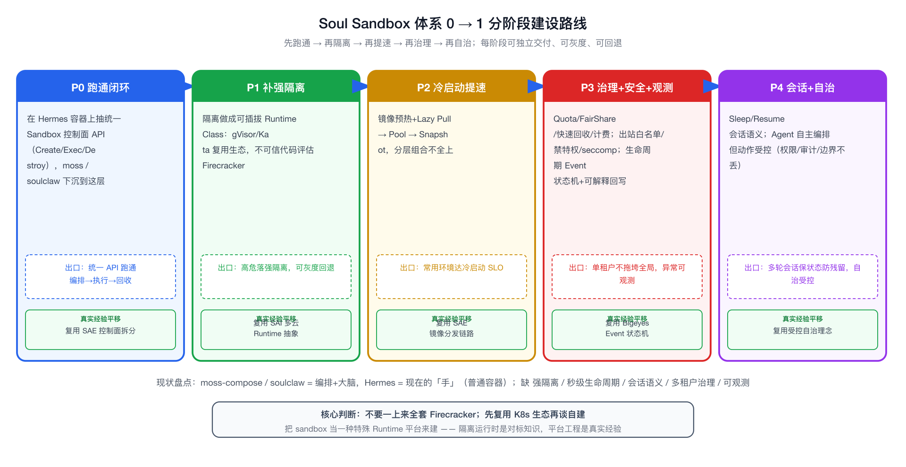

# 从 0 到 1 建设 Soul Sandbox 体系（落地设计 + 面试问答）

这篇是 [[sandbox]] 的实战配套：sandbox.md 讲清楚了「sandbox 是什么、隔离怎么选、冷启动怎么消除」，本文回答一个具体场景题——**「Soul 现在有 moss-compose 和 soulclaw 云上 Hermes 容器，怎么从 0 建一套 Sandbox 体系？」**。它同时是我准备的：① 反问面试官的问题清单；② 如果面试官把这题抛给我，我怎么答。

边界先讲清：Agent Sandbox 强隔离运行时（gVisor / Kata / Firecracker）我没有生产落地，是理论对标；但「从 0 搭一套平台体系」这件事——控制面、生命周期、镜像分发、状态同步、资源治理、可观测、灰度——我在 SAE / SAI / Bigeyes 真做过。所以这篇是「真实平台建设经验 + sandbox 问题域对标」的组合，不是「我搭过 sandbox」。

# 先盘清楚：Soul 现在有什么，差什么才算 Sandbox

## 现状（三块现成资产）

+ moss-compose：基于 Coze 的 Agent / Workflow 编排平台，解决「Agent 怎么编排、调哪些工具、跑什么流程」。
+ soulclaw（龙虾）：Soul 版 OpenClaw，内部 Agent / Coding Agent 平台，是「Agent 大脑 + 入口」。
+ Hermes 云上容器：soulclaw 跑东西的容器执行环境，是目前最接近「执行底座」的一块。

一句话定位：moss-compose / soulclaw 是「大脑和编排」，Hermes 是「现在的手」。但这只手还是普通容器，不是 sandbox。

## Gap：普通容器 ≠ Sandbox

把 sandbox.md 里 sandbox 要解决的问题域，对照 Soul 现状，缺口很清楚：

+ 隔离不够强：Hermes 若是普通容器，共享宿主内核，跑 Agent 生成的不可信代码（任意 Python/shell）逃逸即宿主沦陷。sandbox 要的是 gVisor / Kata / microVM 级别的强隔离。
+ 没有「秒级、高频、用完即弃」的生命周期：普通容器/Pod 调度是分钟级、为长任务设计；Agent 执行是秒级、极高频、突发，需要 Pool 预热 / Snapshot / 轻量调度。
+ 没有会话级状态语义：Agent 多轮交互要保留上一轮文件和进程（Sleep/Resume），又要能一次性销毁防数据残留——普通容器没这套抽象。
+ 多租户治理薄：缺租户级 Quota、Fair Share、Noisy Neighbor 抑制、死循环/OOM 快速回收、按用量计费。
+ 安全边界没体系化：出站网络白名单、禁特权、seccomp/能力裁剪、密钥注入隔离、跨租户复用防护。
+ 可观测/可解释不足：缺 sandbox 生命周期 Event（创建/启动/执行/挂起/销毁/异常）的状态机和失败原因回写。

结论：Soul 不缺「Agent 大脑」和「能跑容器」，缺的是把执行底座升级成「强隔离 + 秒级 + 受控多租户 + 会话语义 + 可观测」的 Sandbox 控制面。这恰好是平台工程问题，不是模型问题。

# 目标：什么样才算「一套 Sandbox 体系」

不堆功能，按能力域定义「做完了」的样子：

+ 一层统一抽象：Agent 只看到 `CreateSandbox / Exec / Snapshot / Sleep / Resume / Destroy` 这组会话+执行语义，看不到底层 microVM/容器/网络/镜像细节。
+ 可插拔的隔离后端：同一套控制面下，能按负载切 容器（受信轻量）/ gVisor（要密度+GPU）/ Kata 或 Firecracker（不可信代码强隔离），而不是绑死一种。
+ 秒级就绪：冷启动分层优化（镜像预热 + Lazy Pull → Pool → Snapshot），把启动从用户路径上摘掉。
+ 受控多租户：Quota / Fair Share / 资源上限 / 快速回收 / 计费。
+ 会话状态语义：有状态会话 Sleep/Resume，无状态执行用完即弃。
+ 安全默认收紧：出站白名单、禁特权、syscall 裁剪、密钥隔离、防跨租户复用。
+ 可观测可解释：全生命周期 Event 状态机 + 失败原因回写。

# 0 → 1 分阶段建设路线（重点）

不要一上来追求 Firecracker 全家桶。按「先跑通 → 再隔离 → 再提速 → 再治理 → 再自治」推进，每阶段都能独立交付价值、可灰度可回退。

## P0：复用现状先跑通闭环（不引入新隔离）

+ 做什么：在 Hermes 容器之上，先抽出统一的 Sandbox 控制面 API（Create/Exec/Destroy），让 moss-compose / soulclaw 通过这一层调用，而不是各自直连容器。
+ 价值：先把「编排 → 执行 → 回收」的链路和接口契约定下来，隔离后端先用现有普通容器顶着。
+ 复用我的经验：SAE 控制面拆分（入口/元数据/事件同步/巡检补偿）和把底层动作收敛成语义化 API 的做法，直接平移。
+ 出口标准：Agent 能通过统一 API 创建执行环境、跑代码、拿结果、销毁，链路可观测。

## P1：补强隔离（解决「不可信代码」这条命门）

+ 做什么：把隔离后端做成可插拔的 RuntimeClass。先在 K8s 体系下接 gVisor / Kata（复用生态、改动小）；对「跑 Agent 生成的任意代码」这类高危场景，评估 Firecracker microVM 路线。
+ 选型判断（沿用 sandbox.md）：不可信任意代码 + 高频多租户 → 倾向 Firecracker；要 GPU 跑模型 → gVisor；已有重 K8s 体系要标准接入 → Kata；纯受信轻量 → 容器/WASM。
+ 复用我的经验：SAI 的多云 Runtime 抽象、按资源模式（独占/共享/抢占）切后端的思路，可平移到「按负载切隔离后端」。
+ 出口标准：高危执行落在强隔离后端，隔离方案可灰度、可回退到普通容器。

## P2：冷启动提速（让「秒级就绪」成立）

+ 做什么：分层上优化——镜像预热 + Lazy Pull（nydus/stargz）解决拉取，Sandbox Pool 摘掉用户路径冷启动，Snapshot/Restore 跳过引导（microVM 路线）。按场景组合，不全上。
+ 复用我的经验：SAE 的镜像构建分发链路（Tekton/buildx/containerd/Harbor）真做过，加速方案接入设计见 [[image-distribution-fast-start]]。
+ 出口标准：常用运行环境冷启动达到目标 SLO（先定百毫秒还是秒级，见反问清单）。

## P3：多租户治理 + 安全 + 可观测（让它「敢上生产」）

+ 做什么：租户 Quota / Fair Share / 单 sandbox 资源与时长上限 / 死循环 OOM 超时快速回收 / 按用量计费；安全默认收紧（出站白名单、禁特权、seccomp、密钥隔离）；全生命周期 Event 状态机 + 失败原因回写。
+ 复用我的经验：Bigeyes 的 Runtime Event 状态机直接对应 sandbox 生命周期治理；SAE 把 Reconcile 状态做成可解释回写，对应「启动失败/配额不足/被回收」翻译成用户可懂信息。
+ 出口标准：单租户跑死循环/吃满资源不拖垮别人，闲置能挂起省成本，异常可观测可解释。

## P4：会话语义 + 自治演进（往前留口子）

+ 做什么：有状态会话 Sleep/Resume，无状态用完即弃；再往后让 Agent 能自主编排「创建→执行→快照→唤醒→销毁」，但动作受控（呼应 [[cicd-ai-native]] 的受控自治：权限/审计/边界不丢）。
+ 出口标准：多轮 Agent 会话能保留环境又防跨租户残留；自治执行在受控边界内。

# 复用 Soul 现有资产的映射

+ moss-compose / soulclaw：保留作「编排 + 大脑 + 入口」，下沉到统一 Sandbox API，不再各自直连容器。
+ Hermes 容器：作为 P0 的执行底座先顶着，P1 起降级成「隔离后端之一（受信/轻量场景）」，高危场景切强隔离后端。
+ SAE 镜像链路（Tekton/Harbor/containerd）：复用为 sandbox 镜像的构建分发底座，P2 在此接 Lazy Pull/预热。
+ K8s 多集群底座：作 sandbox 调度与资源池底座，强隔离后端以 RuntimeClass 接入。
+ Bigeyes Event 体系：复用为 sandbox 生命周期 Event 状态机。

# 我能直接平移的真实经验（面试锚点）

+ 控制面建设：SAE 把分散的云原生能力收敛成统一语义化 API + 模块拆分（入口/元数据/事件同步/巡检补偿）。
+ 多云/多形态 Runtime 抽象：SAI 屏蔽底层差异、按资源模式切后端、状态同步与补偿。
+ 镜像构建分发：SAE 的 Tekton/buildx/containerd/Harbor 真实链路。
+ 生命周期 Event 状态机 + 可解释回写：Bigeyes + SAE。
+ 受控开放：把能力做成带权限/审计/边界的受控接口（cicd-ai-native 的 MCP Skills）。

一句话：sandbox 控制面要解决的工程问题——抽象、调度、生命周期、镜像、状态、治理、可观测、灰度——我在别的 Runtime 平台上逐一做过，只是对象从「业务 Pod / 训练任务 / 告警事件」换成「sandbox」。隔离运行时本身是我要补的对标知识。

# 反问面试官的问题（这是我准备的核心）

这些问题既能问出关键信息，也在暗示「我知道建 sandbox 该先想清楚哪些约束」。如果面试官反过来问「你觉得这些怎么定」，我也有判断（见括号里我的倾向）。

+ 负载画像：你们 sandbox 主要承接什么——coding agent 跑代码为主，还是通用工具/数据处理执行？（这决定隔离强度和冷启动目标，是一切选型的前提。）
+ 隔离路线：现在走 Firecracker / gVisor / Kata 哪条？GPU 场景占比多大？（GPU 直通会把我从 microVM 拉向 gVisor 路线。）
+ 冷启动 SLO：目标是百毫秒级还是秒级？现在瓶颈卡在镜像拉取还是 runtime 启动？（决定先上 Lazy Pull/预热还是 Pool/Snapshot。）
+ 状态语义：sandbox 是有状态会话复用为主，还是一次性用完即弃？（决定 Snapshot/Pool 的投入方向。）
+ 控制面吞吐：峰值每秒要创建多少 sandbox？现在调度走 K8s Pod 还是自研轻量调度？（高频涌浪下 Pod 调度链路会成瓶颈，这点和我做控制面 Reconcile 性能同类。）
+ 多租户与成本：怎么防 noisy neighbor、计费粒度多细、闲置回收策略？
+ 安全边界：出站网络策略、密钥注入、逃逸防护、跨租户复用防护现在怎么做？
+ 团队当前最大的痛点：是隔离安全、冷启动延迟、还是控制面吞吐/成本？（直接问「最痛的是哪个」，能听出团队真实阶段。）

# 如果面试官把这题抛给我

## 三十秒版

我会先盘资产和 gap：Soul 已经有 moss-compose、soulclaw 做编排和大脑，Hermes 提供容器执行，但那还是普通容器，不是 sandbox——缺强隔离、秒级生命周期、会话语义、多租户治理和可观测。所以我不会从隔离技术入手，而是先抽一层统一的 Sandbox 控制面 API 把现状跑通，再分阶段补隔离、提冷启动、上治理。每阶段可灰度可回退，先复用 K8s 生态（gVisor/Kata），高危不可信代码再上 Firecracker。

## 三分钟版

在三十秒版基础上展开五个阶段：P0 复用 Hermes 容器先把控制面 API 和编排链路跑通；P1 把隔离做成可插拔 RuntimeClass，按负载切容器/gVisor/Kata/Firecracker；P2 冷启动分层优化，镜像预热+Lazy Pull→Pool→Snapshot；P3 上多租户 Quota、安全默认收紧、生命周期 Event 状态机和可解释回写；P4 会话 Sleep/Resume 和受控自治。我会强调两点判断：一是不要一上来全套 Firecracker，先复用生态再谈自建；二是隔离运行时我是对标理解的，但控制面、镜像分发、状态机、治理、灰度这些平台工程问题我在 SAE/SAI/Bigeyes 真做过，能直接平移——我的价值是把 sandbox 当成一种特殊 Runtime 平台来建，而不是声称我是隔离内核专家。

# 风险与不能说

+ 不要说「我在 Soul 已经建好了 sandbox」——目前是设计判断 + 资产盘点，没落地。
+ 不要把 Hermes 说成已经是强隔离 sandbox——它现在更可能是普通容器，gap 要如实讲。
+ 不要吹 Firecracker/gVisor 的版本级、性能级数字——我没自测，只讲选型场景和取舍。
+ 不要把隔离内核细节讲成实操——逃逸防护、seccomp 策略我讲设计意图和边界，不假装调过内核。
+ 自治执行（P4）要讲成演进方向，不是已实现的闭环。
